# Experiment Report: model07_thr_u60_l80

## Overview
- Config path: `/workspace/config/experiments/foundation_alpha/BEST/ethusd/trial0041_validation_suite_v2/04_threshold_surface/model07/model07_thr_u60_l80.yaml`
- Model kind: `lightgbm_regressor`
- Symbols: `ETHUSD`
- Data source: `dukascopy_csv` at interval `30m`
- Data window: `None` to `2026-06-09 23:30:00`
- Rows / columns: `109005` rows, `130` columns
- Target: `future_return_regression` horizon `24`
- Feature count: `49`
- Runtime seed: `7`

## Pipeline Trace

### 1. Entry Point
- `runner.run_experiment` -> `src.experiments.runner.run_experiment(config_path: 'str | Path') -> 'ExperimentResult | Any'`
- `runner._load_asset_frames` -> `src.experiments.runner._load_asset_frames(data_cfg: 'dict[str, object]')`
- `pipeline.run_experiment_pipeline` -> `src.experiments.orchestration.pipeline.run_experiment_pipeline(config_path: 'str | Path', *, load_asset_frames_fn: 'LoadAssetFramesFn', save_processed_snapshot_fn: 'SaveProcessedFn') -> 'ExperimentResult'`

```yaml
config_path: /workspace/config/experiments/foundation_alpha/BEST/ethusd/trial0041_validation_suite_v2/04_threshold_surface/model07/model07_thr_u60_l80.yaml
runtime:
  seed: 7
  repro_mode: strict
  deterministic: true
  threads: 1
  seed_torch: false
```

### 2. Data Load And PIT
- `data_stage.load_asset_frames` -> `src.experiments.orchestration.data_stage.load_asset_frames(data_cfg: 'dict[str, Any]', *, load_ohlcv_fn: 'SingleAssetLoader', load_ohlcv_panel_fn: 'PanelLoader', apply_pit_hardening_fn: 'PitFn', validate_ohlcv_fn: 'ValidateFrameFn', validate_data_contract_fn: 'ValidateFrameFn') -> 'tuple[dict[str, pd.DataFrame], dict[str, Any]]'`
- `src_data.loaders.load_ohlcv` -> `src.src_data.loaders.load_ohlcv(symbol: 'str', start: 'str | None' = None, end: 'str | None' = None, interval: 'str' = '1d', source: "Literal['yahoo', 'alpha', 'twelve_data', 'twelve', 'dukascopy_csv']" = 'yahoo', api_key: 'Optional[str]' = None) -> 'pd.DataFrame'`
- `src_data.loaders.load_ohlcv_panel` -> `src.src_data.loaders.load_ohlcv_panel(symbols: 'Sequence[str]', start: 'str | None' = None, end: 'str | None' = None, interval: 'str' = '1d', source: "Literal['yahoo', 'alpha', 'twelve_data', 'twelve', 'dukascopy_csv']" = 'yahoo', api_key: 'Optional[str]' = None) -> 'dict[str, pd.DataFrame]'`
- `src_data.pit.apply_pit_hardening` -> `src.src_data.pit.apply_pit_hardening(df: 'pd.DataFrame', *, pit_cfg: 'Mapping[str, Any] | None' = None, symbol: 'str | None' = None) -> 'tuple[pd.DataFrame, dict[str, Any]]'`
- `src_data.validation.validate_ohlcv` -> `src.src_data.validation.validate_ohlcv(df: 'pd.DataFrame', required_columns: 'Iterable[str]' = ('open', 'high', 'low', 'close', 'volume'), allow_missing_volume: 'bool' = True) -> 'None'`
- `experiments.contracts.validate_data_contract` -> `src.evaluation.contracts.validate_data_contract(df: 'pd.DataFrame', contract: 'DataContract | None' = None) -> 'dict[str, int]'`
- `schemas.StorageContext` -> `src.experiments.schemas.StorageContext(symbols: 'list[str]', source: 'str | None', interval: 'str | None', start: 'str | None', end: 'str | None', pit: 'dict[str, Any]' = <factory>, pit_hash_sha256: 'str | None' = None) -> None`  
  Context object persisted into snapshot metadata.
- `data_stage.save_processed_snapshot_if_enabled` -> `src.experiments.orchestration.data_stage.save_processed_snapshot_if_enabled(asset_frames: 'dict[str, pd.DataFrame]', *, data_cfg: 'dict[str, Any]', config_hash_sha256: 'str', feature_steps: 'list[dict[str, Any]]', logging_cfg: 'dict[str, Any] | None' = None) -> 'dict[str, Any] | None'`

```yaml
data:
  source: dukascopy_csv
  interval: 30m
  start: null
  end: null
  alignment: inner
  symbol: ETHUSD
  symbols: null
  api_key: null
  api_key_env: null
  pit:
    timestamp_alignment:
      source_timezone: UTC
      output_timezone: UTC
      normalize_daily: false
      duplicate_policy: last
    corporate_actions:
      policy: none
      adj_close_col: adj_close
    universe_snapshot:
      inactive_policy: raise
  storage:
    mode: cached_only
    dataset_id: ethusd_30m_lightgbm_h24_structured_tail_alpha_v3_7_ehlers_trend_hybrid
    save_raw: false
    save_processed: true
    load_path: /workspace/data/raw/dukascopy_30m_clean/ethusd_30m.csv
    raw_dir: /workspace/data/raw
    processed_dir: /workspace/data/processed
    load_paths: null
```

### 3. Feature Engineering
- `feature_stage.apply_steps_to_assets` -> `src.experiments.orchestration.feature_stage.apply_steps_to_assets(asset_frames: 'dict[str, pd.DataFrame]', *, feature_steps: 'list[dict[str, Any]]') -> 'dict[str, pd.DataFrame]'`
- `feature_stage.apply_feature_steps` -> `src.experiments.orchestration.feature_stage.apply_feature_steps(df: 'pd.DataFrame', steps: 'list[dict[str, Any]]', *, asset: 'str | None' = None) -> 'pd.DataFrame'`
- `feature[returns]` -> `src.features.helpers.normalizations.returns.add_close_returns(df: 'pd.DataFrame', log: 'bool' = False, col_name: 'str | None' = None) -> 'pd.DataFrame'`  
  params={'log': False, 'col_name': 'close_ret'}
- `feature[volatility]` -> `src.features.volatility.add_volatility_features(df: 'pd.DataFrame', returns_col: 'str' = 'close_logret', rolling_windows: 'Sequence[int]' = (10, 20, 60), ewma_spans: 'Sequence[int]' = (10, 20), annualization_factor: 'Optional[float]' = 252.0, inplace: 'bool' = False) -> 'pd.DataFrame'`  
  params={'returns_col': 'close_ret', 'rolling_windows': [24, 48, 96, 192], 'ewma_spans': [], 'annualization_factor': None}
- `feature[trend]` -> `src.features.technical.trend.add_trend_features(df: 'pd.DataFrame', price_col: 'str' = 'close', sma_windows: 'Sequence[int]' = (20, 50, 200), ema_spans: 'Sequence[int]' = (20, 50), sma_col_template: 'str | None' = None, ema_col_template: 'str | None' = None, add_ratios: 'bool' = False, inplace: 'bool' = False) -> 'pd.DataFrame'`  
  params={'price_col': 'close', 'sma_windows': [], 'ema_spans': [24, 48, 96, 192], 'ema_col_template': 'ema_{span}', 'add_ratios': False}
- `feature[atr]` -> `src.features.technical.atr.add_atr_features(df: 'pd.DataFrame', high_col: 'str' = 'high', low_col: 'str' = 'low', close_col: 'str' = 'close', window: 'int' = 14, windows: 'Sequence[int] | None' = None, method: 'str' = 'wilder', add_over_price: 'bool' = False, atr_col: 'str | None' = None, over_price_col: 'str | None' = None, inplace: 'bool' = False) -> 'pd.DataFrame'`  
  params={'high_col': 'high', 'low_col': 'low', 'close_col': 'close', 'window': 48, 'windows': [48], 'method': 'wilder', 'add_over_price': False, 'atr_col': 'atr_48'}
- `feature[hilbert_transform]` -> `src.features.hilbert_transform.add_hilbert_transform(df: 'pd.DataFrame', price_col: 'str' = 'close', window: 'int' = 64, amplitude_col: 'str | None' = None, phase_col: 'str | None' = None, instantaneous_frequency_col: 'str | None' = None, dominant_cycle_col: 'str | None' = None, cycle_ok_col: 'str | None' = None, amplitude_rising_col: 'str | None' = None, min_cycle: 'int' = 10, max_cycle: 'int' = 48, amplitude_slope_bars: 'int' = 3, add_derived: 'bool' = False) -> 'pd.DataFrame'`  
  params={'price_col': 'close', 'window': 64, 'amplitude_col': 'hilbert_amplitude', 'phase_col': 'hilbert_phase', 'instantaneous_frequency_col': 'hilbert_instantaneous_frequency', 'add_derived': False}
- `feature[dominant_cycle_period]` -> `src.features.dominant_cycle_period.add_dominant_cycle_period(df: 'pd.DataFrame', price_col: 'str' = 'close', output_col: 'str | None' = None) -> 'pd.DataFrame'`  
  params={'price_col': 'close', 'output_col': 'dominant_cycle_period'}
- `feature[dominant_cycle_phase]` -> `src.features.dominant_cycle_phase.add_dominant_cycle_phase(df: 'pd.DataFrame', price_col: 'str' = 'close', output_col: 'str | None' = None, unit: 'str' = 'degrees') -> 'pd.DataFrame'`  
  params={'price_col': 'close', 'output_col': 'dominant_cycle_phase', 'unit': 'degrees'}
- `feature[mama]` -> `src.features.mama.add_mama(df: 'pd.DataFrame', price_col: 'str' = 'close', fast_limit: 'float' = 0.5, slow_limit: 'float' = 0.05, output_col: 'str | None' = None) -> 'pd.DataFrame'`  
  params={'price_col': 'close', 'fast_limit': 0.5, 'slow_limit': 0.05, 'output_col': 'mama'}
- `feature[fama]` -> `src.features.fama.add_fama(df: 'pd.DataFrame', price_col: 'str' = 'close', fast_limit: 'float' = 0.5, slow_limit: 'float' = 0.05, output_col: 'str | None' = None) -> 'pd.DataFrame'`  
  params={'price_col': 'close', 'fast_limit': 0.5, 'slow_limit': 0.05, 'output_col': 'fama'}
- `feature[decycler]` -> `src.features.decycler.add_decycler(df: 'pd.DataFrame', price_col: 'str' = 'close', period: 'int' = 60, output_col: 'str | None' = None) -> 'pd.DataFrame'`  
  params={'price_col': 'close', 'period': 60, 'output_col': 'decycler'}
- `feature[decycler_oscillator]` -> `src.features.decycler_oscillator.add_decycler_oscillator(df: 'pd.DataFrame', price_col: 'str' = 'close', fast_period: 'int' = 30, slow_period: 'int' = 60, output_col: 'str | None' = None) -> 'pd.DataFrame'`  
  params={'price_col': 'close', 'fast_period': 30, 'slow_period': 60, 'output_col': 'decycler_oscillator_30_60'}
- `feature[instantaneous_trendline]` -> `src.features.instantaneous_trendline.add_instantaneous_trendline(df: 'pd.DataFrame', price_col: 'str' = 'close', alpha: 'float' = 0.07, output_col: 'str | None' = None, trigger_col: 'str | None' = None, add_trigger: 'bool' = True) -> 'pd.DataFrame'`  
  params={'price_col': 'close', 'alpha': 0.07, 'output_col': 'instantaneous_trendline', 'add_trigger': False}
- `feature[frama]` -> `src.features.frama.add_frama(df: 'pd.DataFrame', price_col: 'str' = 'close', high_col: 'str' = 'high', low_col: 'str' = 'low', window: 'int' = 16, fast_period: 'int' = 4, slow_period: 'int' = 300, output_col: 'str | None' = None, alpha_col: 'str | None' = None, fractal_dimension_col: 'str | None' = None, add_diagnostics: 'bool' = False) -> 'pd.DataFrame'`  
  params={'price_col': 'close', 'high_col': 'high', 'low_col': 'low', 'window': 16, 'fast_period': 4, 'slow_period': 300, 'output_col': 'frama', 'add_diagnostics': False}
- `feature[supersmoother]` -> `src.features.supersmoother.add_supersmoother(df: 'pd.DataFrame', price_col: 'str' = 'close', period: 'int' = 10, output_col: 'str | None' = None) -> 'pd.DataFrame'`  
  params={'price_col': 'close', 'period': 10, 'output_col': 'supersmoother'}
- `feature[roofing_filter]` -> `src.features.roofing_filter.add_roofing_filter(df: 'pd.DataFrame', price_col: 'str' = 'close', high_pass_period: 'int' = 48, low_pass_period: 'int' = 10, output_col: 'str | None' = None) -> 'pd.DataFrame'`  
  params={'price_col': 'close', 'high_pass_period': 48, 'low_pass_period': 10, 'output_col': 'roofing_filter'}
- `feature[ehlers_ml_long_candidate]` -> `src.features.ehlers_ml_long_candidate.ehlers_ml_long_candidate_feature(df: 'pd.DataFrame', *, amplitude_col: 'str' = 'hilbert_amplitude', cycle_period_col: 'str' = 'dominant_cycle_period', roofing_col: 'str' = 'roofing_filter', mama_col: 'str' = 'mama', fama_col: 'str' = 'fama', close_col: 'str' = 'close', decycler_col: 'str' = 'decycler', instantaneous_trendline_col: 'str' = 'instantaneous_trendline', frama_col: 'str' = 'frama', supersmoother_col: 'str' = 'supersmoother', dominant_cycle_phase_col: 'str' = 'dominant_cycle_phase', dominant_cycle_phase_unit: 'str' = 'degrees', atr_col: 'str | None' = None, amplitude_lookback: 'int' = 128, amplitude_min_quantile: 'float' = 0.5, min_cycle_period: 'float' = 8.0, max_cycle_period: 'float' = 60.0, slope_bars: 'int' = 1, candidate_col: 'str' = 'ehlers_ml_candidate', side_col: 'str' = 'signal_side') -> 'pd.DataFrame'`  
  params={'amplitude_col': 'hilbert_amplitude', 'cycle_period_col': 'dominant_cycle_period', 'roofing_col': 'roofing_filter', 'mama_col': 'mama', 'fama_col': 'fama', 'close_col': 'close', 'decycler_col': 'decycler', 'instantaneous_trendline_col': 'instantaneous_trendline', 'frama_col': 'frama', 'supersmoother_col': 'supersmoother', 'dominant_cycle_phase_col': 'dominant_cycle_phase', 'dominant_cycle_phase_unit': 'degrees', 'atr_col': 'atr_48', 'amplitude_lookback': 128, 'amplitude_min_quantile': 0.5, 'min_cycle_period': 8.0, 'max_cycle_period': 60.0, 'slope_bars': 1, 'candidate_col': 'ehlers_ml_candidate', 'side_col': 'ehlers_ml_side'}
- `feature[macd]` -> `src.features.technical.macd.add_macd_features(df: 'pd.DataFrame', price_col: 'str' = 'close', fast: 'int' = 12, slow: 'int' = 26, signal: 'int' = 9, inplace: 'bool' = False) -> 'pd.DataFrame'`  
  params={'price_col': 'close', 'fast': 12, 'slow': 26, 'signal': 9}
- `feature[rsi]` -> `src.features.technical.rsi.add_rsi_features(df: 'pd.DataFrame', price_col: 'str' = 'close', windows: 'Sequence[int]' = (14,), method: 'str' = 'wilder', inplace: 'bool' = False) -> 'pd.DataFrame'`  
  params={'price_col': 'close', 'windows': [14], 'method': 'wilder'}
- `feature[stochastic_rsi]` -> `src.features.technical.stochastic_rsi.add_stochastic_rsi_features(df: 'pd.DataFrame', price_col: 'str' = 'close', rsi_period: 'int' = 14, stoch_period: 'int' = 14, k_period: 'int' = 3, d_period: 'int' = 3, oversold: 'float' = 0.2, overbought: 'float' = 0.8, prefix: 'str' = 'stoch_rsi', method: 'str' = 'wilder', inplace: 'bool' = False) -> 'pd.DataFrame'`  
  params={'price_col': 'close', 'rsi_period': 14, 'stoch_period': 14, 'k_period': 3, 'd_period': 3, 'oversold': 0.2, 'overbought': 0.8, 'prefix': 'stoch_rsi'}
- `feature[bollinger]` -> `src.features.technical.bollinger.add_bollinger_features(df: 'pd.DataFrame', price_col: 'str' = 'close', window: 'int' = 20, n_std: 'float' = 2.0, inplace: 'bool' = False) -> 'pd.DataFrame'`  
  params={'price_col': 'close', 'window': 192, 'n_std': 2.0}
- `feature[indicator_pullback]` -> `src.features.technical.indicator_pullback.add_indicator_pullback_features(df: 'pd.DataFrame', *, asset: 'str | None' = None, asset_vocab: 'Sequence[str] | None' = None, asset_aliases: 'Mapping[str, str] | None' = None, open_col: 'str' = 'open', high_col: 'str' = 'high', low_col: 'str' = 'low', close_col: 'str' = 'close', ema_fast_period: 'int' = 20, ema_mid_period: 'int' = 50, ema_slow_period: 'int' = 100, ema_fast_col: 'str | None' = None, ema_mid_col: 'str | None' = None, ema_slow_col: 'str | None' = None, atr_period: 'int' = 14, atr_col: 'str | None' = None, atr_pct_col: 'str' = 'atr_pct', atr_pct_rank_window: 'int' = 100, macd_hist_col: 'str' = 'macd_hist', rsi_period: 'int' = 14, rsi_col: 'str | None' = None, stoch_k_col: 'str' = 'stoch_rsi_k', stoch_d_col: 'str' = 'stoch_rsi_d', bollinger_bandwidth_col: 'str' = 'bollinger_bandwidth', bollinger_percent_b_col: 'str' = 'bollinger_percent_b', realized_vol_windows: 'Sequence[int] | None' = (10, 20), return_windows: 'Sequence[int] | None' = (1, 2, 3, 6), rolling_return_windows: 'Sequence[int] | None' = (4, 8), bb_bandwidth_rank_window: 'int | None' = 100, include_asset_id: 'bool' = True, inplace: 'bool' = False) -> 'pd.DataFrame'`  
  params={'asset_vocab': ['ETHUSD'], 'open_col': 'open', 'high_col': 'high', 'low_col': 'low', 'close_col': 'close', 'ema_fast_period': 24, 'ema_mid_period': 96, 'ema_slow_period': 192, 'atr_period': 48, 'atr_pct_rank_window': 192, 'macd_hist_col': 'macd_hist', 'rsi_period': 14, 'stoch_k_col': 'stoch_rsi_k', 'stoch_d_col': 'stoch_rsi_d', 'bollinger_bandwidth_col': 'bollinger_bandwidth', 'bollinger_percent_b_col': 'bollinger_percent_b', 'bb_bandwidth_rank_window': 192, 'realized_vol_windows': [24, 48, 96, 192], 'return_windows': [1, 4, 8, 16, 24, 48], 'rolling_return_windows': [24, 48]}
- `feature[vwap]` -> `src.features.technical.vwap.add_vwap_features(df: 'pd.DataFrame', high_col: 'str' = 'high', low_col: 'str' = 'low', close_col: 'str' = 'close', volume_col: 'str' = 'volume', window: 'int' = 20, windows: 'Sequence[int] | None' = None, add_distance: 'bool' = False, vwap_col: 'str | None' = None, distance_col: 'str | None' = None, inplace: 'bool' = False) -> 'pd.DataFrame'`  
  params={'high_col': 'high', 'low_col': 'low', 'close_col': 'close', 'volume_col': 'volume', 'windows': [48]}

```yaml
features:
- step: returns
  params:
    log: false
    col_name: close_ret
  outputs: {}
  enabled: true
  transforms:
    lag:
      enabled: true
      items:
      - source_col: close_ret
        lag: 1
        output_col: lag_close_ret_1
      - source_col: close_ret
        lag: 2
        output_col: lag_close_ret_2
      - source_col: close_ret
        lag: 4
        output_col: lag_close_ret_4
      - source_col: close_ret
        lag: 8
        output_col: lag_close_ret_8
      - source_col: close_ret
        lag: 16
        output_col: lag_close_ret_16
      - source_col: close_ret
        lag: 24
        output_col: lag_close_ret_24
      - source_col: close_ret
        lag: 48
        output_col: lag_close_ret_48
- step: volatility
  params:
    returns_col: close_ret
    rolling_windows:
    - 24
    - 48
    - 96
    - 192
    ewma_spans: []
    annualization_factor: null
  outputs: {}
  enabled: true
  normalizations:
    volatility_scaled_return:
      params:
        return_col: close_ret
        volatility_col: vol_rolling_48
        output_col: close_ret_over_vol_48
    robust_zscore:
      params:
        source_col: close_ret
        window: 192
        output_col: close_ret_robust_z_192
        shift_stats: true
- step: trend
  params:
    price_col: close
    sma_windows: []
    ema_spans:
    - 24
    - 48
    - 96
    - 192
    ema_col_template: ema_{span}
    add_ratios: false
  outputs: {}
  enabled: true
  transforms:
    ratio:
      enabled: true
      items:
      - numerator_col: ema_24
        denominator_col: ema_96
        output_col: ema_trend_24_96
        subtract: 1.0
      - numerator_col: ema_48
        denominator_col: ema_192
        output_col: ema_trend_48_192
        subtract: 1.0
      - numerator_col: close
        denominator_col: ema_96
        output_col: close_over_ema_96
        subtract: 1.0
      - numerator_col: close
        denominator_col: ema_192
        output_col: close_over_ema_192
        subtract: 1.0
- step: atr
  params:
    high_col: high
    low_col: low
    close_col: close
    window: 48
    windows:
    - 48
    method: wilder
    add_over_price: false
    atr_col: atr_48
  outputs: {}
  enabled: true
  transforms:
    ratio:
      enabled: true
      items:
      - numerator_col: atr_48
        denominator_col: close
        output_col: atr_over_price_48
- step: hilbert_transform
  params:
    price_col: close
    window: 64
    amplitude_col: hilbert_amplitude
    phase_col: hilbert_phase
    instantaneous_frequency_col: hilbert_instantaneous_frequency
    add_derived: false
  outputs: {}
  enabled: true
- step: dominant_cycle_period
  params:
    price_col: close
    output_col: dominant_cycle_period
  outputs: {}
  enabled: true
- step: dominant_cycle_phase
  params:
    price_col: close
    output_col: dominant_cycle_phase
    unit: degrees
  outputs: {}
  enabled: true
- step: mama
  params:
    price_col: close
    fast_limit: 0.5
    slow_limit: 0.05
    output_col: mama
  outputs: {}
  enabled: true
- step: fama
  params:
    price_col: close
    fast_limit: 0.5
    slow_limit: 0.05
    output_col: fama
  outputs: {}
  enabled: true
- step: decycler
  params:
    price_col: close
    period: 60
    output_col: decycler
  outputs: {}
  enabled: true
- step: decycler_oscillator
  params:
    price_col: close
    fast_period: 30
    slow_period: 60
    output_col: decycler_oscillator_30_60
  outputs: {}
  enabled: true
- step: instantaneous_trendline
  params:
    price_col: close
    alpha: 0.07
    output_col: instantaneous_trendline
    add_trigger: false
  outputs: {}
  enabled: true
- step: frama
  params:
    price_col: close
    high_col: high
    low_col: low
    window: 16
    fast_period: 4
    slow_period: 300
    output_col: frama
    add_diagnostics: false
  outputs: {}
  enabled: true
- step: supersmoother
  params:
    price_col: close
    period: 10
    output_col: supersmoother
  outputs: {}
  enabled: true
- step: roofing_filter
  params:
    price_col: close
    high_pass_period: 48
    low_pass_period: 10
    output_col: roofing_filter
  outputs: {}
  enabled: true
- step: ehlers_ml_long_candidate
  params:
    amplitude_col: hilbert_amplitude
    cycle_period_col: dominant_cycle_period
    roofing_col: roofing_filter
    mama_col: mama
    fama_col: fama
    close_col: close
    decycler_col: decycler
    instantaneous_trendline_col: instantaneous_trendline
    frama_col: frama
    supersmoother_col: supersmoother
    dominant_cycle_phase_col: dominant_cycle_phase
    dominant_cycle_phase_unit: degrees
    atr_col: atr_48
    amplitude_lookback: 128
    amplitude_min_quantile: 0.5
    min_cycle_period: 8.0
    max_cycle_period: 60.0
    slope_bars: 1
    candidate_col: ehlers_ml_candidate
    side_col: ehlers_ml_side
  outputs: {}
  enabled: true
- step: macd
  params:
    price_col: close
    fast: 12
    slow: 26
    signal: 9
  outputs:
    macd_12_26: macd
    macd_signal_9: macd_signal
    macd_hist_12_26_9: macd_hist
  enabled: true
- step: rsi
  params:
    price_col: close
    windows:
    - 14
    method: wilder
  outputs:
    close_rsi_14: rsi_14
  enabled: true
- step: stochastic_rsi
  params:
    price_col: close
    rsi_period: 14
    stoch_period: 14
    k_period: 3
    d_period: 3
    oversold: 0.2
    overbought: 0.8
    prefix: stoch_rsi
  outputs:
    stoch_rsi_k: stoch_rsi_k
    stoch_rsi_d: stoch_rsi_d
  enabled: true
- step: bollinger
  params:
    price_col: close
    window: 192
    n_std: 2.0
  outputs:
    bb_ma_192: bollinger_mid_192
    bb_upper_192_2.0: bollinger_upper_192
    bb_lower_192_2.0: bollinger_lower_192
    bb_width_192_2.0: bollinger_bandwidth
    bb_percent_b_192_2.0: bollinger_percent_b
  enabled: true
  transforms:
    ratio:
      enabled: true
      items:
      - numerator_col: close
        denominator_col: bb_upper_192_2.0
        output_col: close_over_bb_upper_192
        subtract: 1.0
      - numerator_col: close
        denominator_col: bb_ma_192
        output_col: close_over_bb_mid_192
        subtract: 1.0
- step: indicator_pullback
  params:
    asset_vocab:
    - ETHUSD
    open_col: open
    high_col: high
    low_col: low
    close_col: close
    ema_fast_period: 24
    ema_mid_period: 96
    ema_slow_period: 192
    atr_period: 48
    atr_pct_rank_window: 192
    macd_hist_col: macd_hist
    rsi_period: 14
    stoch_k_col: stoch_rsi_k
    stoch_d_col: stoch_rsi_d
    bollinger_bandwidth_col: bollinger_bandwidth
    bollinger_percent_b_col: bollinger_percent_b
    bb_bandwidth_rank_window: 192
    realized_vol_windows:
    - 24
    - 48
    - 96
    - 192
    return_windows:
    - 1
    - 4
    - 8
    - 16
    - 24
    - 48
    rolling_return_windows:
    - 24
    - 48
  outputs: {}
  enabled: true
- step: vwap
  params:
    high_col: high
    low_col: low
    close_col: close
    volume_col: volume
    windows:
    - 48
  outputs: {}
  enabled: true
  transforms:
    ratio:
      enabled: true
      items:
      - numerator_col: close
        denominator_col: vwap_48
        output_col: close_over_vwap_48
        subtract: 1.0
resolved_feature_columns:
- close_ret
- lag_close_ret_1
- lag_close_ret_2
- lag_close_ret_4
- lag_close_ret_8
- lag_close_ret_16
- lag_close_ret_24
- lag_close_ret_48
- ret_1
- ret_4
- ret_8
- ret_16
- ret_24
- ret_48
- rolling_return_24
- rolling_return_48
- vol_rolling_24
- vol_rolling_48
- vol_rolling_96
- vol_rolling_192
- atr_48
- atr_over_price_48
- atr_pct
- atr_pct_rank_192
- ema_trend_48_192
- close_over_bb_upper_192
- close_over_bb_mid_192
- bollinger_percent_b
- bollinger_bandwidth
- bollinger_bandwidth_rank_192
- ema_alignment_score
- distance_from_ema24_atr
- distance_from_ema96_atr
- mama_minus_fama_over_atr
- close_minus_decycler_over_atr
- instantaneous_trendline_slope_over_atr
- decycler_slope_over_atr
- frama_slope_over_atr
- supersmoother_slope_over_atr
- roofing_filter_over_atr
- dominant_cycle_phase_normalized
- body_ratio
- upper_wick_ratio
- lower_wick_ratio
- close_location
- range_to_atr
- close_over_vwap_48
- close_ret_over_vol_48
- close_ret_robust_z_192
```

### 4. Model And Training
- `model_stage.apply_model_pipeline_to_assets` -> `src.experiments.orchestration.model_stage.apply_model_pipeline_to_assets(asset_frames: 'dict[str, pd.DataFrame]', *, model_cfg: 'dict[str, Any] | None', model_stages: 'list[dict[str, Any]] | None', returns_col: 'str | None') -> 'tuple[dict[str, pd.DataFrame], object | dict[str, object] | None, dict[str, Any]]'`
- `model_stage.apply_model_to_assets` -> `src.experiments.orchestration.model_stage.apply_model_to_assets(asset_frames: 'dict[str, pd.DataFrame]', *, model_cfg: 'dict[str, Any]', returns_col: 'str | None') -> 'tuple[dict[str, pd.DataFrame], object | dict[str, object] | None, dict[str, Any]]'`
- `feature_stage.apply_model_step` -> `src.experiments.orchestration.model_stage.apply_model_step(df: 'pd.DataFrame', model_cfg: 'dict[str, Any]', returns_col: 'str | None') -> 'tuple[pd.DataFrame, object | None, dict[str, Any]]'`
- `model[lightgbm_regressor]` -> `src.models.forecasting.base.train_lightgbm_regressor(*args: 'object', **kwargs: 'object') -> 'object'`
- `modeling.runtime.resolve_runtime_for_model` -> `src.models.common.runtime.resolve_runtime_for_model(model_cfg: 'dict[str, Any]', model_params: 'dict[str, Any]', *, estimator_family: 'str') -> 'dict[str, Any]'`

```yaml
model:
  kind: lightgbm_regressor
  params:
    n_estimators: 800
    learning_rate: 0.0549537895493607
    max_depth: 6
    num_leaves: 15
    min_child_samples: 200
    subsample: 0.9
    colsample_bytree: 0.75
    reg_alpha: 0.019934229992965794
    reg_lambda: 1.8786413727433209
    random_state: 7
    n_jobs: 1
    verbosity: -1
  outputs:
    pred_ret_col: pred_ret
    pred_prob_col: pred_prob
    pred_is_oos_col: pred_is_oos
  preprocessing:
    scaler: none
  calibration: {}
  feature_cols:
  - close_ret
  - lag_close_ret_1
  - lag_close_ret_2
  - lag_close_ret_4
  - lag_close_ret_8
  - lag_close_ret_16
  - lag_close_ret_24
  - lag_close_ret_48
  - ret_1
  - ret_4
  - ret_8
  - ret_16
  - ret_24
  - ret_48
  - rolling_return_24
  - rolling_return_48
  - vol_rolling_24
  - vol_rolling_48
  - vol_rolling_96
  - vol_rolling_192
  - atr_48
  - atr_over_price_48
  - atr_pct
  - atr_pct_rank_192
  - ema_trend_48_192
  - close_over_bb_upper_192
  - close_over_bb_mid_192
  - bollinger_percent_b
  - bollinger_bandwidth
  - bollinger_bandwidth_rank_192
  - ema_alignment_score
  - distance_from_ema24_atr
  - distance_from_ema96_atr
  - mama_minus_fama_over_atr
  - close_minus_decycler_over_atr
  - instantaneous_trendline_slope_over_atr
  - decycler_slope_over_atr
  - frama_slope_over_atr
  - supersmoother_slope_over_atr
  - roofing_filter_over_atr
  - dominant_cycle_phase_normalized
  - body_ratio
  - upper_wick_ratio
  - lower_wick_ratio
  - close_location
  - range_to_atr
  - close_over_vwap_48
  - close_ret_over_vol_48
  - close_ret_robust_z_192
  target:
    kind: future_return_regression
    price_col: close
    returns_col: close_ret
    returns_type: simple
    horizon_bars: 24
    normalize_by_volatility: true
    volatility_col: atr_48
    clip:
    - -4.0
    - 4.0
    fwd_col: target_future_return_h24_atr
    label_col: target_future_return_h24_atr
  split:
    method: purged
    train_size: 35040
    test_size: 4380
    step_size: 4380
    expanding: true
    max_folds: 10
    purge_bars: 24
    embargo_bars: 24
  runtime: {}
  env: {}
  use_features: true
  pred_prob_col: pred_prob
  pred_raw_prob_col: null
  pred_ret_col: pred_ret
  pred_is_oos_col: pred_is_oos
  returns_input_col: null
  signal_col: null
  action_col: null
  final_refit: true
model_stages: []
resolved_reward_config:
  cost_per_turnover: 0.0001
  slippage_per_turnover: 0.0
  inventory_penalty: 0.0
  drawdown_penalty: 0.0
  switching_penalty: 0.0
resolved_execution_config:
  backtest_min_holding_bars: 24
  min_holding_bars: 0
  action_hysteresis: 0.0
  dd_guard_enabled: false
  max_drawdown: 0.2
  cooloff_bars: 20
  rearm_drawdown: 0.2
```

### 5. Signal Stage
- `feature_stage.apply_signals_to_assets` -> `src.experiments.orchestration.feature_stage.apply_signals_to_assets(asset_frames: 'dict[str, pd.DataFrame]', *, signals_cfg: 'dict[str, Any]') -> 'dict[str, pd.DataFrame]'`
- `feature_stage.apply_signal_step` -> `src.experiments.orchestration.feature_stage.apply_signal_step(df: 'pd.DataFrame', signals_cfg: 'dict[str, Any]', *, asset: 'str | None' = None) -> 'pd.DataFrame'`
- `signal[forecast_threshold]` -> `src.signals.forecast_threshold_signal.forecast_threshold_signal(df: 'pd.DataFrame', forecast_col: 'str' = 'pred_ret', signal_col: 'str | None' = None, upper: 'float' = 0.0, lower: 'float | None' = None, mode: 'str' = 'long_short_hold', activation_filters: 'list[dict[str, object]] | None' = None) -> 'pd.Series'`  
  params={'forecast_col': 'pred_ret', 'signal_col': 'signal_structured_tail', 'upper': 0.6, 'lower': -0.8, 'mode': 'long_short', 'activation_filters': [{'col': 'atr_pct_rank_192', 'op': 'ge', 'value': 0.25}, {'col': 'atr_pct_rank_192', 'op': 'le', 'value': 0.85}, {'col': 'range_to_atr', 'op': 'ge', 'value': 0.8999999999999999}, {'col': 'bollinger_bandwidth_rank_192', 'op': 'ge', 'value': 0.4}]}

```yaml
signals:
  kind: forecast_threshold
  params:
    forecast_col: pred_ret
    signal_col: signal_structured_tail
    upper: 0.6
    lower: -0.8
    mode: long_short
    activation_filters:
    - col: atr_pct_rank_192
      op: ge
      value: 0.25
    - col: atr_pct_rank_192
      op: le
      value: 0.85
    - col: range_to_atr
      op: ge
      value: 0.8999999999999999
    - col: bollinger_bandwidth_rank_192
      op: ge
      value: 0.4
  outputs: {}
```

### 6. Backtest
- `backtest_stage.run_single_asset_backtest` -> `src.experiments.orchestration.backtest_stage.run_single_asset_backtest(asset: 'str', df: 'pd.DataFrame', *, cfg: 'dict[str, Any]', model_meta: 'dict[str, Any]') -> 'BacktestResult'`
- `backtesting.engine.run_backtest` -> `src.backtesting.engine.run_backtest(df: 'pd.DataFrame', signal_col: 'str', returns_col: 'str', returns_type: "Literal['simple', 'log']" = 'simple', missing_return_policy: 'str' = 'raise_if_exposed', cost_per_unit_turnover: 'float' = 0.0, slippage_per_unit_turnover: 'float' = 0.0, target_vol: 'Optional[float]' = None, vol_col: 'Optional[str]' = None, max_leverage: 'float' = 3.0, dd_guard: 'bool' = True, max_drawdown: 'float' = 0.2, cooloff_bars: 'int' = 20, rearm_drawdown: 'Optional[float]' = None, periods_per_year: 'int' = 252, min_holding_bars: 'int' = 0, liquidate_at_end: 'bool' = False, allow_short: 'bool' = False, holding_cost_per_exposed_bar: 'float' = 0.0) -> 'BacktestResult'`
- `backtesting.engine.BacktestResult` -> `src.backtesting.engine.BacktestResult(equity_curve: 'pd.Series', returns: 'pd.Series', gross_returns: 'pd.Series', costs: 'pd.Series', positions: 'pd.Series', turnover: 'pd.Series', summary: 'dict', trades: 'pd.DataFrame | None' = None, mark_to_market_returns: 'pd.Series | None' = None, mark_to_market_equity_curve: 'pd.Series | None' = None, mark_to_market_summary: 'dict | None' = None, realized_returns: 'pd.Series | None' = None, realized_gross_returns: 'pd.Series | None' = None, realized_equity_curve: 'pd.Series | None' = None, realized_summary: 'dict | None' = None) -> None`

```yaml
backtest:
  engine: vectorized
  returns_col: close_ret
  signal_col: signal_structured_tail
  periods_per_year: 17520
  returns_type: simple
  missing_return_policy: raise_if_exposed
  min_holding_bars: 24
  subset: test
  stop_mode: fixed_return
  vol_col: null
  open_col: open
  high_col: high
  low_col: low
  close_col: close
  take_profit_r: null
  stop_loss_r: null
  volatility_col: null
  entry_price_mode: null
  profit_barrier_r: null
  stop_barrier_r: null
  vertical_barrier_bars: null
  tie_break: null
  event_time_remap_policy: null
  annualization_mode: null
  max_cost_r: null
  risk_per_trade: null
  max_holding_bars: null
  asset_params: {}
  dynamic_exit: {}
  strategy_path: {}
  dynamic_exits: {}
  partial_exits: {}
  allow_short: true
  oos_mode: strict
  execution_price: close_lagged
  execution_delay_bars: 0
  estimated_spread_cost_per_unit_turnover: 0.0
  commission_per_unit_turnover: 0.0
  slippage_per_unit_turnover: 0.0
  holding_cost_per_exposed_bar: 0.0
  allow_cost_layering: false
risk:
  cost_per_turnover: 0.0001
  slippage_per_turnover: 0.0
  target_vol: null
  max_leverage: 1.0
  dd_guard:
    enabled: false
    max_drawdown: 0.2
    cooloff_bars: 20
    rearm_drawdown: 0.2
  portfolio_guard: {}
  sizing: {}
  drawdown_sizing: {}
  vol_col: null
portfolio:
  enabled: false
  construction: signal_weights
  gross_target: 1.0
  long_short: true
  expected_return_col: null
  covariance_window: 60
  covariance_rebalance_step: 1
  risk_aversion: 5.0
  trade_aversion: 0.0
  selection:
    enabled: false
    top_k: 1
    min_expected_net_return: 0.0
    rank_by_abs: true
    weighting: score
    rebalance_every_n_bars: 1
  constraints:
    enforce_target_net_exposure: true
  asset_groups: {}
```

### 7. Monitoring And Execution
- `reporting.compute_monitoring_report` -> `src.experiments.orchestration.reporting.compute_monitoring_report(asset_frames: 'dict[str, pd.DataFrame]', *, model_meta: 'dict[str, Any]', monitoring_cfg: 'dict[str, Any]') -> 'dict[str, Any]'`
- `execution_stage.build_execution_output` -> `src.experiments.orchestration.execution_stage.build_execution_output(*, asset_frames: 'dict[str, pd.DataFrame]', execution_cfg: 'dict[str, object]', portfolio_weights: 'pd.DataFrame | None', performance: 'BacktestResult | PortfolioPerformance', alignment: 'str') -> 'tuple[dict[str, object], pd.DataFrame | None]'`
- `schemas.MonitoringPayload` -> `src.experiments.schemas.MonitoringPayload(asset_count: 'int', drifted_feature_count: 'int', feature_count: 'int', per_asset: 'dict[str, Any]' = <factory>) -> None`
- `schemas.ExecutionPayload` -> `src.experiments.schemas.ExecutionPayload(mode: 'str', capital: 'float', as_of: 'str | None', order_count: 'int', gross_target: 'float', extra: 'dict[str, Any]' = <factory>) -> None`
- `reporting.build_single_asset_evaluation` -> `src.experiments.orchestration.reporting.build_single_asset_evaluation(asset: 'str', df: 'pd.DataFrame', *, performance: 'BacktestResult', model_meta: 'dict[str, Any]', periods_per_year: 'int', backtest_cfg: 'dict[str, Any] | None' = None) -> 'dict[str, Any]'`
- `schemas.EvaluationPayload` -> `src.experiments.schemas.EvaluationPayload(scope: 'str', primary_summary: 'dict[str, Any]', timeline_summary: 'dict[str, Any]', oos_only_summary: 'dict[str, Any] | None' = None, extra: 'dict[str, Any]' = <factory>) -> None`

```yaml
monitoring:
  enabled: true
  psi_threshold: 0.2
  n_bins: 10
execution:
  enabled: false
  mode: paper
  capital: 1000000.0
  price_col: close
  min_trade_notional: 0.0
  hysteresis:
    enabled: false
    entry_threshold: 0.0
    exit_threshold: 0.0
    min_holding_bars: 0
  current_weights: {}
  current_prices: {}
```

### 8. Artifact And Report
- `artifacts.save_artifacts` -> `src.experiments.orchestration.artifacts.save_artifacts(*, run_dir: 'Path', cfg: 'dict[str, Any]', data: 'pd.DataFrame | dict[str, pd.DataFrame]', model: 'object | None' = None, performance: 'BacktestResult | PortfolioPerformance', model_meta: 'dict[str, Any]', evaluation: 'dict[str, Any]', monitoring: 'dict[str, Any]', execution: 'dict[str, Any]', execution_orders: 'pd.DataFrame | None', portfolio_weights: 'pd.DataFrame | None', portfolio_diagnostics: 'pd.DataFrame | None', portfolio_meta: 'dict[str, Any]', storage_meta: 'dict[str, Any]', run_metadata: 'dict[str, Any]', config_hash_sha256: 'str', data_fingerprint: 'dict[str, Any]', stage_tails: 'dict[str, Any] | None' = None, lifecycle_context: 'dict[str, Any] | None' = None) -> 'dict[str, str]'`
- `artifacts.write_experiment_report_from_run_dir` -> `src.experiments.orchestration.artifacts.write_experiment_report_from_run_dir(run_dir: 'Path') -> 'dict[str, str]'`
- `reporting.build_experiment_report_markdown` -> `src.experiments.orchestration.reporting.build_experiment_report_markdown(*, cfg: 'dict[str, Any]', summary_payload: 'dict[str, Any]', run_metadata: 'dict[str, Any]', chart_paths: 'dict[str, str]', artifact_paths: 'dict[str, str]') -> 'str'`

## Primary Summary
| Metric | Value |
| --- | --- |
| cumulative_return | 4.924074 |
| annualized_return | 1.037268 |
| annualized_vol | 0.299079 |
| sharpe | 3.468204 |
| sortino | 4.005539 |
| calmar | 7.066809 |
| max_drawdown | -0.146780 |
| profit_factor | 1.160831 |
| hit_rate | 0.497393 |
| annualization_mode | fixed_periods |
| metric_scope | bar_returns |
| avg_turnover | 0.014703 |
| total_turnover | 644.000000 |
| gross_pnl | 5.318179 |
| net_pnl | 4.924074 |
| total_cost | 0.064400 |
| cost_drag | 0.394106 |
| cost_to_gross_pnl | 0.074105 |
| gross_return_sum | 1.954580 |
| net_return_sum | 1.890180 |
| cost_return_sum | 0.064400 |
| conventional_sharpe | 2.527998 |
| return_over_vol_sharpe | 3.468204 |
| sharpe_legacy_alias | return_over_vol_sharpe |
| bar_return_profit_factor | 1.160831 |
| profit_factor_scope | bar_returns |
| evaluation_scope | strict_oos_only |
| evaluation_start | 2022-03-14T15:00:00 |
| evaluation_end | 2024-09-17T10:30:00 |
| evaluation_rows | 43800 |
| trade_count | 322 |
| average_r | 0.743119 |
| median_r | 0.524473 |
| mtm_cumulative_return | 4.924074 |
| mtm_annualized_return | 1.037268 |
| mtm_annualized_vol | 0.299079 |
| mtm_sharpe | 3.468204 |
| mtm_conventional_sharpe | 2.527998 |
| mtm_return_over_vol_sharpe | 3.468204 |
| mtm_max_drawdown | -0.146780 |
| mtm_profit_factor | 1.160831 |
| mtm_bar_return_profit_factor | 1.160831 |
| flat_rate | 0.953059 |
| long_rate | 0.027260 |
| short_rate | 0.019680 |
| avg_max_favorable_r | 3.484059 |
| avg_max_adverse_r | -2.764979 |
| loser_was_positive_rate | 0.985816 |
| avg_giveback_r | 2.740940 |
| avg_capture_ratio | -5.736072 |
| robustness_walk_forward_total_calendar_periods | 7.000000 |
| robustness_walk_forward_active_oos_periods | 3.000000 |
| robustness_walk_forward_positive_active_periods | 3.000000 |
| robustness_walk_forward_positive_active_period_ratio | 1.000000 |
| robustness_walk_forward_min_active_period_cumulative_return | 0.241626 |
| robustness_walk_forward_worst_active_period_max_drawdown | -0.146780 |
| robustness_walk_forward_mean_active_period_sharpe | 4.050983 |
| robustness_walk_forward_std_active_period_sharpe | 2.100505 |
| robustness_cost_x1_cumulative_return | 4.924074 |
| robustness_cost_x1_sharpe | 3.468204 |
| robustness_cost_x1_max_drawdown | -0.146780 |
| robustness_cost_x1_profit_factor | 1.160831 |
| robustness_cost_x2_cumulative_return | 4.554514 |
| robustness_cost_x2_sharpe | 3.294714 |
| robustness_cost_x2_max_drawdown | -0.154260 |
| robustness_cost_x2_profit_factor | 1.154712 |
| robustness_cost_x3_cumulative_return | 4.207975 |
| robustness_cost_x3_sharpe | 3.125547 |
| robustness_cost_x3_max_drawdown | -0.161674 |
| robustness_cost_x3_profit_factor | 1.148639 |
| robustness_cost_x5_cumulative_return | 3.578318 |
| robustness_cost_x5_sharpe | 2.799796 |
| robustness_cost_x5_max_drawdown | -0.184858 |
| robustness_cost_x5_profit_factor | 1.136629 |
| robustness_delay_1_bars_cumulative_return | 4.354396 |
| robustness_delay_1_bars_sharpe | 3.240830 |
| robustness_delay_1_bars_max_drawdown | -0.159203 |
| robustness_delay_1_bars_profit_factor | 1.153351 |
| robustness_delay_2_bars_cumulative_return | 4.370911 |
| robustness_delay_2_bars_sharpe | 3.260301 |
| robustness_delay_2_bars_max_drawdown | -0.161432 |
| robustness_delay_2_bars_profit_factor | 1.154685 |
| completed_trade_count | 322 |
| win_rate | 0.562112 |
| trade_return_profit_factor | 2.031448 |
| trade_r_profit_factor | 1.678667 |
| trade_profit_factor | 2.031448 |
| entry_trade_cost | 0.032200 |
| exit_trade_cost | 0.032590 |
| holding_trade_cost | 0.0 |
| total_trade_cost | 0.064790 |
| position_transition_count | 639 |
| turnover_event_count | 639 |
| exposed_bar_count | 7768 |
| bar_return_profit_factor_scope | bar_returns |
| trade_return_profit_factor_scope | completed_trade_net_returns |
| trade_r_profit_factor_scope | completed_trade_net_r_multiples |
| trade_profit_factor_scope | completed_trade_net_returns |

## OOS Policy Summary
| Metric | Value |
| --- | --- |
| evaluation_rows | 43800 |
| signal_rows | 43800 |
| mean_abs_signal | 0.046941 |
| signal_turnover | 0.056027 |
| long_rate | 0.027260 |
| short_rate | 0.019680 |
| flat_rate | 0.953059 |
| executed_trade_count | 7768 |
| trade_rate | 0.177352 |
| avg_signal_executed | 0.035659 |
| avg_pred_prob_executed | 0.505213 |
| avg_realized_r_executed |  |


## Model OOS Diagnostics
| Metric | Value |
| --- | --- |
| classification.evaluation_rows | 43800 |
| classification.positive_rate | 0.497032 |
| classification.accuracy | 0.525936 |
| classification.brier | 0.254026 |
| classification.roc_auc | 0.529820 |
| classification.log_loss | 0.701935 |
| regression.evaluation_rows | 43800 |
| regression.mae | 2.169130 |
| regression.rmse | 2.633129 |
| regression.mse | 6.933367 |
| regression.r2 | -0.110409 |
| regression.correlation | 0.052232 |
| regression.directional_accuracy | 0.525822 |
| regression.mean_prediction | -0.014077 |
| regression.mean_target | 0.003813 |
| volatility.status | ok |
| volatility.metric_scope | configured_volatility_rank_feature |
| volatility.configured_volatility_col | atr_pct_rank_100 |
| volatility.resolved_volatility_col | atr_pct_rank_192 |
| volatility.evaluation_value_rows | 43800 |
| volatility.missing_value_rows | 0 |
| volatility.mean | 0.467559 |
| volatility.std | 0.343002 |
| volatility.min | 0.005208 |
| volatility.max | 1.000000 |
| volatility.evaluation_scope | strict_oos_only |
| volatility.evaluation_start | 2022-03-14T15:00:00 |
| volatility.evaluation_end | 2024-09-17T10:30:00 |
| volatility.evaluation_rows | 43800 |


## Prediction Diagnostics
| Metric | Value |
| --- | --- |
| oos_rows | 43800 |
| predicted_rows | 43800 |
| non_oos_prediction_rows | 0 |
| missing_oos_prediction_rows | 0 |
| oos_prediction_coverage | 1.000000 |
| alignment_ok | true |
| first_prediction_index | 2022-03-14T15:00:00 |
| last_prediction_index | 2024-09-17T10:30:00 |
| prediction_distribution.rows | 43800 |
| prediction_distribution.mean | -0.014077 |
| prediction_distribution.std | 0.970830 |
| prediction_distribution.min | -4.196201 |
| prediction_distribution.max | 4.069042 |
| prediction_distribution.median | 0.005295 |
| prediction_distribution.q01 | -2.499584 |
| prediction_distribution.q05 | -1.662085 |
| prediction_distribution.q25 | -0.609985 |
| prediction_distribution.q75 | 0.610238 |
| prediction_distribution.q95 | 1.554220 |
| prediction_distribution.q99 | 2.271280 |
| prediction_distribution.skew | -0.147631 |
| prediction_distribution.kurtosis | 0.413286 |
| prediction_distribution.positive_rate | 0.502420 |
| prediction_distribution.negative_rate | 0.497580 |
| prediction_distribution.zero_rate | 0.0 |
| target_distribution.rows | 43800 |
| target_distribution.mean | 0.003813 |
| target_distribution.std | 2.498824 |
| target_distribution.min | -4.000000 |
| target_distribution.max | 4.000000 |
| target_distribution.median | -0.015923 |
| target_distribution.q01 | -4.000000 |
| target_distribution.q05 | -4.000000 |
| target_distribution.q25 | -1.825757 |
| target_distribution.q75 | 1.873421 |
| target_distribution.q95 | 4.000000 |
| target_distribution.q99 | 4.000000 |
| target_distribution.skew | 0.008876 |
| target_distribution.kurtosis | -0.990125 |
| target_distribution.positive_rate | 0.497032 |
| target_distribution.negative_rate | 0.502671 |
| target_distribution.zero_rate | 0.000297 |
| probability_distribution.rows | 43800 |
| probability_distribution.mean | 0.498756 |
| probability_distribution.std | 0.091448 |
| probability_distribution.min | 0.163300 |
| probability_distribution.max | 0.829670 |
| probability_distribution.median | 0.500518 |
| probability_distribution.q01 | 0.272867 |
| probability_distribution.q05 | 0.342620 |
| probability_distribution.q25 | 0.440480 |
| probability_distribution.q75 | 0.559491 |
| probability_distribution.q95 | 0.647504 |
| probability_distribution.q99 | 0.708470 |
| probability_distribution.skew | -0.120134 |
| probability_distribution.kurtosis | 0.077714 |
| probability_distribution.positive_rate | 1.000000 |
| probability_distribution.negative_rate | 0.0 |
| probability_distribution.zero_rate | 0.0 |


## Dense Forecast Diagnostics
| Artifact | Link |
| --- | --- |
| fold_backtest_diagnostics | [open](artifacts/diagnostics/fold_backtest_diagnostics.csv) |
| forecast_alpha_summary | [open](artifacts/diagnostics/forecast_alpha_diagnostics_summary.json) |
| forecast_baselines | [open](artifacts/diagnostics/forecast_baselines.csv) |
| lightgbm_importance | [open](artifacts/diagnostics/lightgbm_importance.csv) |
| prediction_distribution | [open](artifacts/diagnostics/prediction_distribution.csv) |
| prediction_metrics | [open](artifacts/diagnostics/prediction_metrics.csv) |
| regime_diagnostics | [open](artifacts/diagnostics/regime_diagnostics.csv) |
| regime_performance | [open](artifacts/diagnostics/regime_performance.csv) |
| summary | [open](artifacts/diagnostics/summary.json) |
| turnover_cost_timeseries | [open](artifacts/diagnostics/turnover_cost_timeseries.csv) |


## Forecast Baselines
| Name | Cum Return | Ann Return | Ann Vol | Sharpe | Sortino | Calmar | Max DD | Profit Factor | Hit Rate | Turnover | Cost/Gross |
| --- | --- | --- | --- | --- | --- | --- | --- | --- | --- | --- | --- |
| model_strategy | 1.920618 | 0.535288 | 0.243201 | 2.201008 | 2.984750 | 2.546383 | -0.210215 | 1.150314 | 0.497857 | 410.000000 | 0.059844 |
| buy_and_hold | -0.102619 | -0.042385 | 0.665486 | -0.063691 | 0.375698 | -0.056670 | -0.747935 | 1.006790 | 0.507216 | 1.000000 | 0.000875 |
| random_sign_same_rate | -0.575721 | -0.290323 | 0.347741 | -0.834883 | -1.094871 | -0.440842 | -0.658565 | 0.963676 | 0.479913 | 1.074e+03 | 0.091177 |
| volatility_regime_only | -0.166762 | -0.070375 | 0.404959 | -0.173784 | 0.031471 | -0.120210 | -0.585437 | 1.000890 | 0.494392 | 862.000000 | 0.818224 |
| simple_trend | -0.532426 | -0.262198 | 0.436182 | -0.601119 | -0.674248 | -0.419772 | -0.624619 | 0.983873 | 0.490531 | 772.000000 | 0.075969 |


## Fold Robustness
| Metric | Value |
| --- | --- |
| fold_count | 10.000000 |
| median_fold_return | 0.076542 |
| mean_fold_return | 0.126313 |
| fold_return_std | 0.188236 |
| worst_fold_return | -0.065596 |
| best_fold_return | 0.480031 |
| worst_3_fold_average_return | -0.048097 |
| profitable_fold_count | 7.000000 |
| profitable_fold_rate | 0.700000 |
| median_fold_sharpe | 2.033992 |
| feature_importance_rank_stability.available | true |
| feature_importance_rank_stability.folds_with_importance | 10 |
| feature_importance_rank_stability.top_features | [{'feature': 'atr_48', 'family': 'unclassified', 'fold_count': 10, 'fold_coverage': 1.0, 'mean_rank': 1.4, 'best_rank': 1, 'mean_importance': 1105.6, 'mean_importance_normalized': 0.10203704341312955, 'folds': [{'fold': 0, 'rank': 1, 'importance': 1134.0, 'importance_normalized': 0.10898606439211918}, {'fold': 1, 'rank': 1, 'importance': 1088.0, 'importance_normalized': 0.10075006945087508}, {'fold': 2, 'rank': 1, 'importance': 1171.0, 'importance_normalized': 0.10760889542363536}, {'fold': 3, 'rank': 1, 'importance': 1153.0, 'importance_normalized': 0.10546053233330284}, {'fold': 4, 'rank': 2, 'importance': 1042.0, 'importance_normalized': 0.09605457227138643}, {'fold': 5, 'rank': 1, 'importance': 1069.0, 'importance_normalized': 0.09913753129926736}, {'fold': 6, 'rank': 1, 'importance': 1139.0, 'importance_normalized': 0.1044954128440367}, {'fold': 7, 'rank': 2, 'importance': 1094.0, 'importance_normalized': 0.09991780071239383}, {'fold': 8, 'rank': 2, 'importance': 1075.0, 'importance_normalized': 0.09847929644558447}, {'fold': 9, 'rank': 2, 'importance': 1091.0, 'importance_normalized': 0.09948025895869426}], 'stability_rank': 1}, {'feature': 'vol_rolling_192', 'family': 'volatility', 'fold_count': 10, 'fold_coverage': 1.0, 'mean_rank': 1.6, 'best_rank': 1, 'mean_importance': 1064.4, 'mean_importance_normalized': 0.09817337085966794, 'folds': [{'fold': 0, 'rank': 2, 'importance': 973.0, 'importance_normalized': 0.09351273426237386}, {'fold': 1, 'rank': 2, 'importance': 1000.0, 'importance_normalized': 0.09260116677470136}, {'fold': 2, 'rank': 2, 'importance': 1059.0, 'importance_normalized': 0.09731666972982908}, {'fold': 3, 'rank': 2, 'importance': 1053.0, 'importance_normalized': 0.09631391200951249}, {'fold': 4, 'rank': 1, 'importance': 1053.0, 'importance_normalized': 0.09706858407079647}, {'fold': 5, 'rank': 2, 'importance': 1041.0, 'importance_normalized': 0.09654085134007234}, {'fold': 6, 'rank': 2, 'importance': 1062.0, 'importance_normalized': 0.09743119266055046}, {'fold': 7, 'rank': 1, 'importance': 1098.0, 'importance_normalized': 0.10028313087953238}, {'fold': 8, 'rank': 1, 'importance': 1149.0, 'importance_normalized': 0.10525833638695493}, {'fold': 9, 'rank': 1, 'importance': 1156.0, 'importance_normalized': 0.10540713048235616}], 'stability_rank': 2}, {'feature': 'bollinger_bandwidth', 'family': 'unclassified', 'fold_count': 10, 'fold_coverage': 1.0, 'mean_rank': 3.0, 'best_rank': 3, 'mean_importance': 894.3, 'mean_importance_normalized': 0.08247883730107616, 'folds': [{'fold': 0, 'rank': 3, 'importance': 799.0, 'importance_normalized': 0.07679000480538203}, {'fold': 1, 'rank': 3, 'importance': 863.0, 'importance_normalized': 0.07991480692656727}, {'fold': 2, 'rank': 3, 'importance': 875.0, 'importance_normalized': 0.0804080132328616}, {'fold': 3, 'rank': 3, 'importance': 894.0, 'importance_normalized': 0.08177078569468581}, {'fold': 4, 'rank': 3, 'importance': 870.0, 'importance_normalized': 0.08019911504424779}, {'fold': 5, 'rank': 3, 'importance': 877.0, 'importance_normalized': 0.08133172586478717}, {'fold': 6, 'rank': 3, 'importance': 943.0, 'importance_normalized': 0.0865137614678899}, {'fold': 7, 'rank': 3, 'importance': 901.0, 'importance_normalized': 0.08229062014795872}, {'fold': 8, 'rank': 3, 'importance': 957.0, 'importance_normalized': 0.08766947599853427}, {'fold': 9, 'rank': 3, 'importance': 964.0, 'importance_normalized': 0.08790006382784718}], 'stability_rank': 3}, {'feature': 'vol_rolling_96', 'family': 'volatility', 'fold_count': 10, 'fold_coverage': 1.0, 'mean_rank': 4.2, 'best_rank': 4, 'mean_importance': 774.8, 'mean_importance_normalized': 0.07146066671277203, 'folds': [{'fold': 0, 'rank': 5, 'importance': 697.0, 'importance_normalized': 0.06698702546852475}, {'fold': 1, 'rank': 5, 'importance': 677.0, 'importance_normalized': 0.06269098990647282}, {'fold': 2, 'rank': 4, 'importance': 771.0, 'importance_normalized': 0.07085094651718434}, {'fold': 3, 'rank': 4, 'importance': 821.0, 'importance_normalized': 0.07509375285831885}, {'fold': 4, 'rank': 4, 'importance': 808.0, 'importance_normalized': 0.07448377581120944}, {'fold': 5, 'rank': 4, 'importance': 804.0, 'importance_normalized': 0.07456181025688584}, {'fold': 6, 'rank': 4, 'importance': 784.0, 'importance_normalized': 0.07192660550458715}, {'fold': 7, 'rank': 4, 'importance': 788.0, 'importance_normalized': 0.07197004292629464}, {'fold': 8, 'rank': 4, 'importance': 779.0, 'importance_normalized': 0.0713631366801026}, {'fold': 9, 'rank': 4, 'importance': 819.0, 'importance_normalized': 0.07467858119813987}], 'stability_rank': 4}, {'feature': 'ema_trend_48_192', 'family': 'unclassified', 'fold_count': 10, 'fold_coverage': 1.0, 'mean_rank': 4.8, 'best_rank': 4, 'mean_importance': 728.4, 'mean_importance_normalized': 0.06722855248650096, 'folds': [{'fold': 0, 'rank': 4, 'importance': 729.0, 'importance_normalized': 0.07006246996636233}, {'fold': 1, 'rank': 4, 'importance': 744.0, 'importance_normalized': 0.06889526808037781}, {'fold': 2, 'rank': 5, 'importance': 728.0, 'importance_normalized': 0.06689946700974085}, {'fold': 3, 'rank': 5, 'importance': 690.0, 'importance_normalized': 0.06311168023415348}, {'fold': 4, 'rank': 5, 'importance': 778.0, 'importance_normalized': 0.07171828908554573}, {'fold': 5, 'rank': 5, 'importance': 741.0, 'importance_normalized': 0.06871928034869702}, {'fold': 6, 'rank': 5, 'importance': 718.0, 'importance_normalized': 0.06587155963302753}, {'fold': 7, 'rank': 5, 'importance': 715.0, 'importance_normalized': 0.06530276737601608}, {'fold': 8, 'rank': 5, 'importance': 729.0, 'importance_normalized': 0.06678270428728472}, {'fold': 9, 'rank': 5, 'importance': 712.0, 'importance_normalized': 0.06492203884380414}], 'stability_rank': 5}, {'feature': 'bollinger_bandwidth_rank_192', 'family': 'unclassified', 'fold_count': 10, 'fold_coverage': 1.0, 'mean_rank': 6.3, 'best_rank': 6, 'mean_importance': 617.8, 'mean_importance_normalized': 0.05700855711706983, 'folds': [{'fold': 0, 'rank': 6, 'importance': 609.0, 'importance_normalized': 0.05852955309947141}, {'fold': 1, 'rank': 6, 'importance': 643.0, 'importance_normalized': 0.059542550236132974}, {'fold': 2, 'rank': 7, 'importance': 604.0, 'importance_normalized': 0.05550450284874104}, {'fold': 3, 'rank': 7, 'importance': 594.0, 'importance_normalized': 0.05433092472331474}, {'fold': 4, 'rank': 7, 'importance': 597.0, 'importance_normalized': 0.05503318584070797}, {'fold': 5, 'rank': 6, 'importance': 604.0, 'importance_normalized': 0.05601409626263563}, {'fold': 6, 'rank': 6, 'importance': 614.0, 'importance_normalized': 0.056330275229357796}, {'fold': 7, 'rank': 6, 'importance': 668.0, 'importance_normalized': 0.06101013791213809}, {'fold': 8, 'rank': 6, 'importance': 629.0, 'importance_normalized': 0.05762183950164895}, {'fold': 9, 'rank': 6, 'importance': 616.0, 'importance_normalized': 0.05616850551654965}], 'stability_rank': 6}, {'feature': 'atr_over_price_48', 'family': 'atr_adx_range', 'fold_count': 10, 'fold_coverage': 1.0, 'mean_rank': 7.2, 'best_rank': 6, 'mean_importance': 574.2, 'mean_importance_normalized': 0.05298831245696091, 'folds': [{'fold': 0, 'rank': 7, 'importance': 571.0, 'importance_normalized': 0.05487746275828929}, {'fold': 1, 'rank': 7, 'importance': 575.0, 'importance_normalized': 0.05324567089545328}, {'fold': 2, 'rank': 6, 'importance': 609.0, 'importance_normalized': 0.05596397721007168}, {'fold': 3, 'rank': 8, 'importance': 577.0, 'importance_normalized': 0.052775999268270375}, {'fold': 4, 'rank': 6, 'importance': 611.0, 'importance_normalized': 0.056323746312684365}, {'fold': 5, 'rank': 7, 'importance': 542.0, 'importance_normalized': 0.050264304924418066}, {'fold': 6, 'rank': 8, 'importance': 551.0, 'importance_normalized': 0.05055045871559633}, {'fold': 7, 'rank': 7, 'importance': 541.0, 'importance_normalized': 0.04941090510548909}, {'fold': 8, 'rank': 8, 'importance': 570.0, 'importance_normalized': 0.05221692927812385}, {'fold': 9, 'rank': 8, 'importance': 595.0, 'importance_normalized': 0.05425367010121273}], 'stability_rank': 7}, {'feature': 'vol_rolling_48', 'family': 'volatility', 'fold_count': 10, 'fold_coverage': 1.0, 'mean_rank': 7.5, 'best_rank': 6, 'mean_importance': 554.5, 'mean_importance_normalized': 0.051158588187753616, 'folds': [{'fold': 0, 'rank': 8, 'importance': 547.0, 'importance_normalized': 0.0525708793849111}, {'fold': 1, 'rank': 8, 'importance': 505.0, 'importance_normalized': 0.046763589221224186}, {'fold': 2, 'rank': 8, 'importance': 569.0, 'importance_normalized': 0.05228818231942658}, {'fold': 3, 'rank': 6, 'importance': 610.0, 'importance_normalized': 0.055794383975121195}, {'fold': 4, 'rank': 8, 'importance': 542.0, 'importance_normalized': 0.049963126843657814}, {'fold': 5, 'rank': 8, 'importance': 521.0, 'importance_normalized': 0.048316794955021794}, {'fold': 6, 'rank': 7, 'importance': 560.0, 'importance_normalized': 0.05137614678899083}, {'fold': 7, 'rank': 8, 'importance': 506.0, 'importance_normalized': 0.04621426614302676}, {'fold': 8, 'rank': 7, 'importance': 580.0, 'importance_normalized': 0.053133015756687434}, {'fold': 9, 'rank': 7, 'importance': 605.0, 'importance_normalized': 0.055165496489468405}], 'stability_rank': 8}, {'feature': 'atr_pct_rank_192', 'family': 'unclassified', 'fold_count': 10, 'fold_coverage': 1.0, 'mean_rank': 9.0, 'best_rank': 9, 'mean_importance': 460.2, 'mean_importance_normalized': 0.042463475219262706, 'folds': [{'fold': 0, 'rank': 9, 'importance': 437.0, 'importance_normalized': 0.041999038923594426}, {'fold': 1, 'rank': 9, 'importance': 494.0, 'importance_normalized': 0.045744976386702475}, {'fold': 2, 'rank': 9, 'importance': 454.0, 'importance_normalized': 0.04172027200882191}, {'fold': 3, 'rank': 9, 'importance': 457.0, 'importance_normalized': 0.041800054879721944}, {'fold': 4, 'rank': 9, 'importance': 476.0, 'importance_normalized': 0.04387905604719764}, {'fold': 5, 'rank': 9, 'importance': 462.0, 'importance_normalized': 0.04284521932671798}, {'fold': 6, 'rank': 9, 'importance': 444.0, 'importance_normalized': 0.04073394495412844}, {'fold': 7, 'rank': 9, 'importance': 461.0, 'importance_normalized': 0.04210430176271806}, {'fold': 8, 'rank': 9, 'importance': 454.0, 'importance_normalized': 0.04159032612678637}, {'fold': 9, 'rank': 9, 'importance': 463.0, 'importance_normalized': 0.042217561776237804}], 'stability_rank': 9}, {'feature': 'vol_rolling_24', 'family': 'volatility', 'fold_count': 10, 'fold_coverage': 1.0, 'mean_rank': 10.3, 'best_rank': 10, 'mean_importance': 418.6, 'mean_importance_normalized': 0.038640205285178676, 'folds': [{'fold': 0, 'rank': 10, 'importance': 435.0, 'importance_normalized': 0.041806823642479576}, {'fold': 1, 'rank': 10, 'importance': 437.0, 'importance_normalized': 0.040466709880544495}, {'fold': 2, 'rank': 10, 'importance': 441.0, 'importance_normalized': 0.04052563866936225}, {'fold': 3, 'rank': 11, 'importance': 399.0, 'importance_normalized': 0.03649501509192354}, {'fold': 4, 'rank': 10, 'importance': 446.0, 'importance_normalized': 0.04111356932153392}, {'fold': 5, 'rank': 11, 'importance': 387.0, 'importance_normalized': 0.03588982657887416}, {'fold': 6, 'rank': 10, 'importance': 423.0, 'importance_normalized': 0.03880733944954128}, {'fold': 7, 'rank': 10, 'importance': 408.0, 'importance_normalized': 0.03726367704813225}, {'fold': 8, 'rank': 10, 'importance': 412.0, 'importance_normalized': 0.03774276291681935}, {'fold': 9, 'rank': 11, 'importance': 398.0, 'importance_normalized': 0.03629069025257591}], 'stability_rank': 10}] |


## Regime Performance
| Feature | Bucket | Rows | Cum Return | Sharpe | Max DD | Profit Factor | Cost/Gross |
| --- | --- | --- | --- | --- | --- | --- | --- |
| atr_pct_rank_192 | low | 1.358e+04 | 0.0 | 0.0 | 0.0 | 0.0 | 0.0 |
| atr_pct_rank_192 | medium | 2.167e+04 | 0.798145 | 2.016743 | -0.156919 | 1.099307 | 0.075477 |
| atr_pct_rank_192 | high | 8.547e+03 | 0.0 | 0.0 | 0.0 | 0.0 | 0.0 |
| bollinger_bandwidth_rank_192 | low | 2.251e+04 | 0.412671 | 1.815030 | -0.146015 | 1.195522 | 0.034558 |
| bollinger_bandwidth_rank_192 | high | 2.129e+04 | 0.437723 | 1.134740 | -0.233478 | 1.066051 | 0.100947 |
| ema_trend_48_192 | negative | 2.183e+04 | 0.961882 | 2.608077 | -0.164284 | 1.167549 | 0.043793 |
| ema_trend_48_192 | positive | 2.197e+04 | 0.545096 | 1.848236 | -0.134087 | 1.120786 | 0.058280 |
| range_to_atr | calm | 2.190e+04 | 0.0 | 0.0 | 0.0 | 0.0 | 0.0 |
| range_to_atr | shock | 2.190e+04 | 1.726580 | 3.048006 | -0.234072 | 1.125993 | 0.047947 |


## Missing-Value Diagnostics
| Metric | Value |
| --- | --- |
| test_rows_without_prediction | 0 |
| folds_with_zero_predictions | 0 |


## Trade Diagnostics
| Metric | Value |
| --- | --- |
| trade_count | 322 |
| average_r | 0.743119 |
| median_r | 0.524473 |
| exit_reason_counts.position_exit | 317 |
| exit_reason_counts.reversal | 5 |
| avg_max_favorable_r | 3.484059 |
| median_max_favorable_r | 2.579831 |
| avg_max_adverse_r | -2.764979 |
| median_max_adverse_r | -1.929286 |
| partial_exit_count_total | 0 |
| partial_exit_trade_count | 0 |
| avg_partial_exit_fraction_total |  |
| avg_partial_exit_realized_r |  |
| loser_was_positive_rate | 0.985816 |
| avg_giveback_r | 2.740940 |
| avg_capture_ratio | -5.736072 |
| completed_trade_count | 322 |
| win_rate | 0.562112 |
| trade_return_profit_factor | 2.031448 |
| trade_r_profit_factor | 1.678667 |
| trade_profit_factor | 2.031448 |
| entry_trade_cost | 0.032200 |
| exit_trade_cost | 0.032590 |
| holding_trade_cost | 0.0 |
| total_trade_cost | 0.064790 |
| position_transition_count | 639 |
| turnover_event_count | 639 |
| exposed_bar_count | 7768 |


## Trade Path Diagnostics
### Losing Trades Could-Have-Been-Profitable
| Metric | Value |
| --- | --- |
| loser_was_positive_rate | 0.985816 |
| avg_mfe_r_of_losers | 1.357207 |
| median_mfe_r_of_losers | 1.061887 |
| avg_mfe_r_before_loss | 1.357207 |
| median_mfe_r_before_loss | 1.061887 |
| loser_reached_0_5r_rate | 0.751773 |
| loser_reached_1r_rate | 0.531915 |
| loser_reached_1_5r_rate | 0.304965 |
| loser_reached_2r_rate | 0.205674 |

### Capture / Giveback
| Metric | Value |
| --- | --- |
| avg_capture_ratio | -5.736072 |
| median_capture_ratio | 0.201515 |
| avg_giveback_r | 2.740940 |
| median_giveback_r | 1.971738 |
| avg_giveback_r_winners | 1.870921 |
| avg_giveback_r_losers | 3.857773 |
| median_giveback_r_winners | 1.535804 |
| median_giveback_r_losers | 2.957717 |

### MAE Before Win
| Metric | Value |
| --- | --- |
| winner_had_negative_mae_rate | 0.994475 |
| winner_had_mae_below_minus_0_25r_rate | 0.834254 |
| winner_had_mae_below_minus_0_5r_rate | 0.690608 |
| winner_had_mae_below_minus_1r_rate | 0.508287 |
| avg_mae_r_of_winners | -1.402906 |
| median_mae_r_of_winners | -1.014748 |
| p90_abs_mae_r_of_winners | 3.116145 |
| avg_mae_r | -2.764979 |
| median_mae_r | -1.929286 |
| q10_mae_r | -6.278975 |
| q25_mae_r | -3.478660 |
| q75_mae_r | -0.871516 |
| q90_mae_r | -0.270401 |

### Conditional Probabilities
| Metric | Value |
| --- | --- |
| prob_final_win | 0.562112 |
| prob_final_loss | 0.437888 |
| prob_final_win_given_mae_gt_minus_0_5r | 1.000000 |
| prob_final_win_given_mae_gt_minus_1r | 0.988889 |
| prob_mfe_ge_0_5r | 0.891304 |
| prob_final_loss_given_mfe_ge_0_5r | 0.369338 |
| prob_mfe_ge_1r | 0.791925 |
| prob_final_loss_given_mfe_ge_1r | 0.294118 |
| prob_mfe_ge_1_5r | 0.670807 |
| prob_final_loss_given_mfe_ge_1_5r | 0.199074 |
| prob_mfe_ge_2r | 0.583851 |
| prob_final_loss_given_mfe_ge_2r | 0.154255 |
| prob_stop_loss_given_mfe_ge_0_5r | 0.0 |
| prob_stop_loss_given_mfe_ge_1r | 0.0 |

### Timing Diagnostics
| Metric | Value |
| --- | --- |
| avg_time_to_mfe | 12.273292 |
| median_time_to_mfe | 12.000000 |
| avg_time_to_mae | 9.527950 |
| median_time_to_mae | 8.000000 |
| prob_mfe_ge_0_5r_within_1_bar | 0.052795 |
| prob_mfe_ge_0_5r_within_2_bars | 0.099379 |
| prob_mfe_ge_1r_within_4_bars | 0.111801 |
| avg_r_by_bars_held_bucket.1 |  |
| avg_r_by_bars_held_bucket.2 |  |
| avg_r_by_bars_held_bucket.3-4 |  |
| avg_r_by_bars_held_bucket.5-8 |  |
| avg_r_by_bars_held_bucket.9-16 |  |
| avg_r_by_bars_held_bucket.17+ | 0.743119 |
| win_rate_by_bars_held_bucket.1 |  |
| win_rate_by_bars_held_bucket.2 |  |
| win_rate_by_bars_held_bucket.3-4 |  |
| win_rate_by_bars_held_bucket.5-8 |  |
| win_rate_by_bars_held_bucket.9-16 |  |
| win_rate_by_bars_held_bucket.17+ | 0.562112 |

### Counterfactual Exits
| Metric | Value |
| --- | --- |
| counterfactual.baseline.trade_count | 322 |
| counterfactual.baseline.avg_r | 0.743119 |
| counterfactual.baseline.median_r | 0.524473 |
| counterfactual.baseline.win_rate | 0.562112 |
| counterfactual.baseline.profit_factor | 1.678667 |
| counterfactual.breakeven_after_0_5r.trade_count | 322 |
| counterfactual.breakeven_after_0_5r.avg_r | -0.073126 |
| counterfactual.breakeven_after_0_5r.median_r | 0.0 |
| counterfactual.breakeven_after_0_5r.win_rate | 0.006211 |
| counterfactual.breakeven_after_0_5r.profit_factor | 0.154379 |
| counterfactual.breakeven_after_1_0r.trade_count | 322 |
| counterfactual.breakeven_after_1_0r.avg_r | 0.185867 |
| counterfactual.breakeven_after_1_0r.median_r | 0.0 |
| counterfactual.breakeven_after_1_0r.win_rate | 0.118012 |
| counterfactual.breakeven_after_1_0r.profit_factor | 1.608204 |
| counterfactual.exit_at_first_0_5r.trade_count | 322 |
| counterfactual.exit_at_first_0_5r.avg_r | 0.394890 |
| counterfactual.exit_at_first_0_5r.median_r | 0.500000 |
| counterfactual.exit_at_first_0_5r.win_rate | 0.962733 |
| counterfactual.exit_at_first_0_5r.profit_factor | 5.566454 |
| counterfactual.exit_at_first_1_0r.trade_count | 322 |
| counterfactual.exit_at_first_1_0r.avg_r | 0.562707 |
| counterfactual.exit_at_first_1_0r.median_r | 1.000000 |
| counterfactual.exit_at_first_1_0r.win_rate | 0.869565 |
| counterfactual.exit_at_first_1_0r.profit_factor | 2.841324 |
| counterfactual.partial_50pct_at_1r.trade_count | 322 |
| counterfactual.partial_50pct_at_1r.avg_r | 0.652913 |
| counterfactual.partial_50pct_at_1r.median_r | 0.757702 |
| counterfactual.partial_50pct_at_1r.win_rate | 0.673913 |
| counterfactual.partial_50pct_at_1r.profit_factor | 2.134516 |
| counterfactual.time_exit_after_4_bars_if_mfe_lt_0_3r.trade_count | 322 |
| counterfactual.time_exit_after_4_bars_if_mfe_lt_0_3r.avg_r | 0.704625 |
| counterfactual.time_exit_after_4_bars_if_mfe_lt_0_3r.median_r | 0.389100 |
| counterfactual.time_exit_after_4_bars_if_mfe_lt_0_3r.win_rate | 0.546584 |
| counterfactual.time_exit_after_4_bars_if_mfe_lt_0_3r.profit_factor | 1.637952 |
| counterfactual.trail_0_5r_after_1_0r.trade_count | 322 |
| counterfactual.trail_0_5r_after_1_0r.avg_r | 0.761126 |
| counterfactual.trail_0_5r_after_1_0r.median_r | 0.822763 |
| counterfactual.trail_0_5r_after_1_0r.win_rate | 0.869565 |
| counterfactual.trail_0_5r_after_1_0r.profit_factor | 3.490602 |
| counterfactual.best_policy_by_avg_r | trail_0_5r_after_1_0r |
| counterfactual.best_policy_by_profit_factor | exit_at_first_0_5r |

### Exit Reason Quality
| Exit Reason | Trades | Avg R | Median R | Win Rate | Avg MFE | Avg MAE | Avg Giveback | Avg Bars | Profit Factor | Stop After + | Stop After 0.5R | Stop After 1R |
| --- | --- | --- | --- | --- | --- | --- | --- | --- | --- | --- | --- | --- |
| position_exit | 317 | 0.746331 | 0.506872 | 0.558360 | 3.492592 | -2.765549 | 2.746261 | 24.126183 | 1.681534 | 0.993691 | 0.892744 | 0.791798 |
| reversal | 5 | 0.539460 | 1.554270 | 0.800000 | 2.943044 | -2.728835 | 2.403585 | 24.000000 | 1.495722 | 1.000000 | 0.800000 | 0.800000 |


## Baseline VWAP/RMS Diagnostics
### Primary
| Metric | Value |
| --- | --- |
| trade_count | 322 |
| gross_pnl | 5.318179 |
| net_pnl | 4.924074 |
| total_cost | 0.064400 |
| cost_to_gross_pnl | 0.074105 |

### Trade Count By Asset
| Asset | Trades |
| --- | --- |
| ETHUSD | 322 |

### Performance Breakdowns
| Group | Bucket | Trades | Gross PnL | Entry Cost | Exit Cost | Holding Cost | Total Cost | Net PnL | Profit Factor | Hit Rate |
| --- | --- | --- | --- | --- | --- | --- | --- | --- | --- | --- |
| asset | ETHUSD | 322 | 1.950314 | 0.032200 | 0.032590 | 0.0 | 0.064790 | 1.885524 | 2.031448 | 0.562112 |
| side | long | 180 | 1.147947 | 0.018000 | 0.018226 | 0.0 | 0.036226 | 1.111721 | 2.156866 | 0.544444 |
| side | short | 142 | 0.802367 | 0.014200 | 0.014364 | 0.0 | 0.028564 | 0.773803 | 1.892445 | 0.584507 |
| volatility_regime | missing | 322 | 1.950314 | 0.032200 | 0.032590 | 0.0 | 0.064790 | 1.885524 | 2.031448 | 0.562112 |
| year | 2022 | 112 | 0.947504 | 0.011200 | 0.011389 | 0.0 | 0.022589 | 0.924914 | 2.176619 | 0.589286 |
| year | 2023 | 135 | 0.265985 | 0.013500 | 0.013552 | 0.0 | 0.027052 | 0.238932 | 1.323650 | 0.496296 |
| year | 2024 | 75 | 0.736826 | 0.007500 | 0.007648 | 0.0 | 0.015148 | 0.721677 | 3.376151 | 0.640000 |


## STC Roofing Hilbert Diagnostics
### Signal Counts
| Metric | Value |
| --- | --- |
| total_rows | 109005 |
| final_signal_rows | 2056 |
| actual_trade_count | 322 |

### Performance
| Metric | Value |
| --- | --- |
| cumulative_return | 4.924074 |
| sharpe | 3.468204 |
| sortino | 4.005539 |
| calmar | 7.066809 |
| max_drawdown | -0.146780 |
| profit_factor | 1.160831 |
| hit_rate | 0.497393 |
| trade_count | 322 |
| gross_pnl | 5.318179 |
| net_pnl | 4.924074 |
| total_cost | 0.064400 |
| cost_to_gross_pnl | 0.074105 |
| average_r | 0.743119 |
| median_r | 0.524473 |

### Side Diagnostics
| Group | Bucket | Trades | Gross PnL | Entry Cost | Exit Cost | Holding Cost | Total Cost | Net PnL | Profit Factor | Hit Rate |
| --- | --- | --- | --- | --- | --- | --- | --- | --- | --- | --- |
| side | long | 180 | 1.147947 |  |  |  | 0.0 | 1.111721 | 2.156866 | 0.544444 |
| side | short | 142 | 0.802367 |  |  |  | 0.0 | 0.773803 | 1.892445 | 0.584507 |

### Year Diagnostics
| Group | Bucket | Trades | Gross PnL | Entry Cost | Exit Cost | Holding Cost | Total Cost | Net PnL | Profit Factor | Hit Rate |
| --- | --- | --- | --- | --- | --- | --- | --- | --- | --- | --- |
| year | 2022 | 112 | 0.947504 |  |  |  | 0.0 | 0.924914 | 2.176619 | 0.589286 |
| year | 2023 | 135 | 0.265985 |  |  |  | 0.0 | 0.238932 | 1.323650 | 0.496296 |
| year | 2024 | 75 | 0.736826 |  |  |  | 0.0 | 0.721677 | 3.376151 | 0.640000 |


## Robustness Diagnostics
### Cost Stress
| Metric | Value |
| --- | --- |
| cost_x1.cumulative_return | 4.924074 |
| cost_x1.annualized_return | 1.037268 |
| cost_x1.annualized_vol | 0.299079 |
| cost_x1.sharpe | 3.468204 |
| cost_x1.sortino | 4.005539 |
| cost_x1.calmar | 7.066809 |
| cost_x1.max_drawdown | -0.146780 |
| cost_x1.profit_factor | 1.160831 |
| cost_x1.hit_rate | 0.497393 |
| cost_x1.bar_return_profit_factor | 1.160831 |
| cost_x1.conventional_sharpe | 2.527998 |
| cost_x1.return_over_vol_sharpe | 3.468204 |
| cost_x1.profit_factor_scope | bar_returns |
| cost_x1.metric_scope | bar_returns |
| cost_x1.annualization_mode | fixed_periods |
| cost_x1.sharpe_legacy_alias | return_over_vol_sharpe |
| cost_x1.gross_pnl | 5.318179 |
| cost_x1.net_pnl | 4.924074 |
| cost_x1.total_cost | 0.064400 |
| cost_x1.cost_drag | 0.394106 |
| cost_x1.cost_to_gross_pnl | 0.074105 |
| cost_x1.gross_return_sum | 1.954580 |
| cost_x1.net_return_sum | 1.890180 |
| cost_x1.cost_return_sum | 0.064400 |
| cost_x1.avg_turnover | 0.014703 |
| cost_x1.total_turnover | 644.000000 |
| cost_x1.evaluation_scope | strict_oos_only |
| cost_x1.evaluation_start | 2022-03-14T15:00:00 |
| cost_x1.evaluation_end | 2024-09-17T10:30:00 |
| cost_x1.evaluation_rows | 43800 |
| cost_x2.cumulative_return | 4.554514 |
| cost_x2.annualized_return | 0.985448 |
| cost_x2.annualized_vol | 0.299100 |
| cost_x2.sharpe | 3.294714 |
| cost_x2.sortino | 3.866491 |
| cost_x2.calmar | 6.388240 |
| cost_x2.max_drawdown | -0.154260 |
| cost_x2.profit_factor | 1.154712 |
| cost_x2.hit_rate | 0.497021 |
| cost_x2.bar_return_profit_factor | 1.154712 |
| cost_x2.conventional_sharpe | 2.441702 |
| cost_x2.return_over_vol_sharpe | 3.294714 |
| cost_x2.profit_factor_scope | bar_returns |
| cost_x2.metric_scope | bar_returns |
| cost_x2.annualization_mode | fixed_periods |
| cost_x2.sharpe_legacy_alias | return_over_vol_sharpe |
| cost_x2.gross_pnl | 5.318179 |
| cost_x2.net_pnl | 4.554514 |
| cost_x2.total_cost | 0.128800 |
| cost_x2.cost_drag | 0.763665 |
| cost_x2.cost_to_gross_pnl | 0.143595 |
| cost_x2.gross_return_sum | 1.954580 |
| cost_x2.net_return_sum | 1.825780 |
| cost_x2.cost_return_sum | 0.128800 |
| cost_x2.avg_turnover | 0.014703 |
| cost_x2.total_turnover | 644.000000 |
| cost_x2.evaluation_scope | strict_oos_only |
| cost_x2.evaluation_start | 2022-03-14T15:00:00 |
| cost_x2.evaluation_end | 2024-09-17T10:30:00 |
| cost_x2.evaluation_rows | 43800 |
| cost_x3.cumulative_return | 4.207975 |
| cost_x3.annualized_return | 0.934940 |
| cost_x3.annualized_vol | 0.299128 |
| cost_x3.sharpe | 3.125547 |
| cost_x3.sortino | 3.727424 |
| cost_x3.calmar | 5.782866 |
| cost_x3.max_drawdown | -0.161674 |
| cost_x3.profit_factor | 1.148639 |
| cost_x3.hit_rate | 0.496400 |
| cost_x3.bar_return_profit_factor | 1.148639 |
| cost_x3.conventional_sharpe | 2.355349 |
| cost_x3.return_over_vol_sharpe | 3.125547 |
| cost_x3.profit_factor_scope | bar_returns |
| cost_x3.metric_scope | bar_returns |
| cost_x3.annualization_mode | fixed_periods |
| cost_x3.sharpe_legacy_alias | return_over_vol_sharpe |
| cost_x3.gross_pnl | 5.318179 |
| cost_x3.net_pnl | 4.207975 |
| cost_x3.total_cost | 0.193200 |
| cost_x3.cost_drag | 1.110205 |
| cost_x3.cost_to_gross_pnl | 0.208757 |
| cost_x3.gross_return_sum | 1.954580 |
| cost_x3.net_return_sum | 1.761380 |
| cost_x3.cost_return_sum | 0.193200 |
| cost_x3.avg_turnover | 0.014703 |
| cost_x3.total_turnover | 644.000000 |
| cost_x3.evaluation_scope | strict_oos_only |
| cost_x3.evaluation_start | 2022-03-14T15:00:00 |
| cost_x3.evaluation_end | 2024-09-17T10:30:00 |
| cost_x3.evaluation_rows | 43800 |
| cost_x5.cumulative_return | 3.578318 |
| cost_x5.annualized_return | 0.837733 |
| cost_x5.annualized_vol | 0.299212 |
| cost_x5.sharpe | 2.799796 |
| cost_x5.sortino | 3.449320 |
| cost_x5.calmar | 4.531755 |
| cost_x5.max_drawdown | -0.184858 |
| cost_x5.profit_factor | 1.136629 |
| cost_x5.hit_rate | 0.495780 |
| cost_x5.bar_return_profit_factor | 1.136629 |
| cost_x5.conventional_sharpe | 2.182505 |
| cost_x5.return_over_vol_sharpe | 2.799796 |
| cost_x5.profit_factor_scope | bar_returns |
| cost_x5.metric_scope | bar_returns |
| cost_x5.annualization_mode | fixed_periods |
| cost_x5.sharpe_legacy_alias | return_over_vol_sharpe |
| cost_x5.gross_pnl | 5.318179 |
| cost_x5.net_pnl | 3.578318 |
| cost_x5.total_cost | 0.322000 |
| cost_x5.cost_drag | 1.739862 |
| cost_x5.cost_to_gross_pnl | 0.327154 |
| cost_x5.gross_return_sum | 1.954580 |
| cost_x5.net_return_sum | 1.632580 |
| cost_x5.cost_return_sum | 0.322000 |
| cost_x5.avg_turnover | 0.014703 |
| cost_x5.total_turnover | 644.000000 |
| cost_x5.evaluation_scope | strict_oos_only |
| cost_x5.evaluation_start | 2022-03-14T15:00:00 |
| cost_x5.evaluation_end | 2024-09-17T10:30:00 |
| cost_x5.evaluation_rows | 43800 |

### Slippage Stress
| Metric | Value |
| --- | --- |
| slippage_x1.cumulative_return | 4.924074 |
| slippage_x1.annualized_return | 1.037268 |
| slippage_x1.annualized_vol | 0.299079 |
| slippage_x1.sharpe | 3.468204 |
| slippage_x1.sortino | 4.005539 |
| slippage_x1.calmar | 7.066809 |
| slippage_x1.max_drawdown | -0.146780 |
| slippage_x1.profit_factor | 1.160831 |
| slippage_x1.hit_rate | 0.497393 |
| slippage_x1.bar_return_profit_factor | 1.160831 |
| slippage_x1.conventional_sharpe | 2.527998 |
| slippage_x1.return_over_vol_sharpe | 3.468204 |
| slippage_x1.profit_factor_scope | bar_returns |
| slippage_x1.metric_scope | bar_returns |
| slippage_x1.annualization_mode | fixed_periods |
| slippage_x1.sharpe_legacy_alias | return_over_vol_sharpe |
| slippage_x1.gross_pnl | 4.924074 |
| slippage_x1.net_pnl | 4.924074 |
| slippage_x1.total_cost | 0.0 |
| slippage_x1.cost_drag | 0.0 |
| slippage_x1.cost_to_gross_pnl | 0.0 |
| slippage_x1.gross_return_sum | 1.890180 |
| slippage_x1.net_return_sum | 1.890180 |
| slippage_x1.cost_return_sum | 0.0 |
| slippage_x1.avg_turnover | 0.0 |
| slippage_x1.total_turnover | 0.0 |
| slippage_x1.evaluation_scope | strict_oos_only |
| slippage_x1.evaluation_start | 2022-03-14T15:00:00 |
| slippage_x1.evaluation_end | 2024-09-17T10:30:00 |
| slippage_x1.evaluation_rows | 43800 |
| slippage_x2.cumulative_return | 4.924074 |
| slippage_x2.annualized_return | 1.037268 |
| slippage_x2.annualized_vol | 0.299079 |
| slippage_x2.sharpe | 3.468204 |
| slippage_x2.sortino | 4.005539 |
| slippage_x2.calmar | 7.066809 |
| slippage_x2.max_drawdown | -0.146780 |
| slippage_x2.profit_factor | 1.160831 |
| slippage_x2.hit_rate | 0.497393 |
| slippage_x2.bar_return_profit_factor | 1.160831 |
| slippage_x2.conventional_sharpe | 2.527998 |
| slippage_x2.return_over_vol_sharpe | 3.468204 |
| slippage_x2.profit_factor_scope | bar_returns |
| slippage_x2.metric_scope | bar_returns |
| slippage_x2.annualization_mode | fixed_periods |
| slippage_x2.sharpe_legacy_alias | return_over_vol_sharpe |
| slippage_x2.gross_pnl | 4.924074 |
| slippage_x2.net_pnl | 4.924074 |
| slippage_x2.total_cost | 0.0 |
| slippage_x2.cost_drag | 0.0 |
| slippage_x2.cost_to_gross_pnl | 0.0 |
| slippage_x2.gross_return_sum | 1.890180 |
| slippage_x2.net_return_sum | 1.890180 |
| slippage_x2.cost_return_sum | 0.0 |
| slippage_x2.avg_turnover | 0.0 |
| slippage_x2.total_turnover | 0.0 |
| slippage_x2.evaluation_scope | strict_oos_only |
| slippage_x2.evaluation_start | 2022-03-14T15:00:00 |
| slippage_x2.evaluation_end | 2024-09-17T10:30:00 |
| slippage_x2.evaluation_rows | 43800 |
| slippage_x3.cumulative_return | 4.924074 |
| slippage_x3.annualized_return | 1.037268 |
| slippage_x3.annualized_vol | 0.299079 |
| slippage_x3.sharpe | 3.468204 |
| slippage_x3.sortino | 4.005539 |
| slippage_x3.calmar | 7.066809 |
| slippage_x3.max_drawdown | -0.146780 |
| slippage_x3.profit_factor | 1.160831 |
| slippage_x3.hit_rate | 0.497393 |
| slippage_x3.bar_return_profit_factor | 1.160831 |
| slippage_x3.conventional_sharpe | 2.527998 |
| slippage_x3.return_over_vol_sharpe | 3.468204 |
| slippage_x3.profit_factor_scope | bar_returns |
| slippage_x3.metric_scope | bar_returns |
| slippage_x3.annualization_mode | fixed_periods |
| slippage_x3.sharpe_legacy_alias | return_over_vol_sharpe |
| slippage_x3.gross_pnl | 4.924074 |
| slippage_x3.net_pnl | 4.924074 |
| slippage_x3.total_cost | 0.0 |
| slippage_x3.cost_drag | 0.0 |
| slippage_x3.cost_to_gross_pnl | 0.0 |
| slippage_x3.gross_return_sum | 1.890180 |
| slippage_x3.net_return_sum | 1.890180 |
| slippage_x3.cost_return_sum | 0.0 |
| slippage_x3.avg_turnover | 0.0 |
| slippage_x3.total_turnover | 0.0 |
| slippage_x3.evaluation_scope | strict_oos_only |
| slippage_x3.evaluation_start | 2022-03-14T15:00:00 |
| slippage_x3.evaluation_end | 2024-09-17T10:30:00 |
| slippage_x3.evaluation_rows | 43800 |

### Entry Delay
| Metric | Value |
| --- | --- |
| delay_1_bars.cumulative_return | 4.354396 |
| delay_1_bars.annualized_return | 0.956520 |
| delay_1_bars.annualized_vol | 0.295147 |
| delay_1_bars.sharpe | 3.240830 |
| delay_1_bars.sortino | 3.836211 |
| delay_1_bars.calmar | 6.008182 |
| delay_1_bars.max_drawdown | -0.159203 |
| delay_1_bars.profit_factor | 1.153351 |
| delay_1_bars.hit_rate | 0.496834 |
| delay_1_bars.bar_return_profit_factor | 1.153351 |
| delay_1_bars.conventional_sharpe | 2.420717 |
| delay_1_bars.return_over_vol_sharpe | 3.240830 |
| delay_1_bars.profit_factor_scope | bar_returns |
| delay_1_bars.metric_scope | bar_returns |
| delay_1_bars.annualization_mode | fixed_periods |
| delay_1_bars.sharpe_legacy_alias | return_over_vol_sharpe |
| delay_1_bars.gross_pnl | 4.354396 |
| delay_1_bars.net_pnl | 4.354396 |
| delay_1_bars.total_cost | 0.0 |
| delay_1_bars.cost_drag | 0.0 |
| delay_1_bars.cost_to_gross_pnl | 0.0 |
| delay_1_bars.gross_return_sum | 1.786165 |
| delay_1_bars.net_return_sum | 1.786165 |
| delay_1_bars.cost_return_sum | 0.0 |
| delay_1_bars.avg_turnover | 0.0 |
| delay_1_bars.total_turnover | 0.0 |
| delay_1_bars.evaluation_scope | strict_oos_only |
| delay_1_bars.evaluation_start | 2022-03-14T15:00:00 |
| delay_1_bars.evaluation_end | 2024-09-17T10:30:00 |
| delay_1_bars.evaluation_rows | 43800 |
| delay_2_bars.cumulative_return | 4.370911 |
| delay_2_bars.annualized_return | 0.958931 |
| delay_2_bars.annualized_vol | 0.294123 |
| delay_2_bars.sharpe | 3.260301 |
| delay_2_bars.sortino | 3.865919 |
| delay_2_bars.calmar | 5.940172 |
| delay_2_bars.max_drawdown | -0.161432 |
| delay_2_bars.profit_factor | 1.154685 |
| delay_2_bars.hit_rate | 0.496773 |
| delay_2_bars.bar_return_profit_factor | 1.154685 |
| delay_2_bars.conventional_sharpe | 2.432298 |
| delay_2_bars.return_over_vol_sharpe | 3.260301 |
| delay_2_bars.profit_factor_scope | bar_returns |
| delay_2_bars.metric_scope | bar_returns |
| delay_2_bars.annualization_mode | fixed_periods |
| delay_2_bars.sharpe_legacy_alias | return_over_vol_sharpe |
| delay_2_bars.gross_pnl | 4.370911 |
| delay_2_bars.net_pnl | 4.370911 |
| delay_2_bars.total_cost | 0.0 |
| delay_2_bars.cost_drag | 0.0 |
| delay_2_bars.cost_to_gross_pnl | 0.0 |
| delay_2_bars.gross_return_sum | 1.788490 |
| delay_2_bars.net_return_sum | 1.788490 |
| delay_2_bars.cost_return_sum | 0.0 |
| delay_2_bars.avg_turnover | 0.0 |
| delay_2_bars.total_turnover | 0.0 |
| delay_2_bars.evaluation_scope | strict_oos_only |
| delay_2_bars.evaluation_start | 2022-03-14T15:00:00 |
| delay_2_bars.evaluation_end | 2024-09-17T10:30:00 |
| delay_2_bars.evaluation_rows | 43800 |

### Walk Forward
| Metric | Value |
| --- | --- |
| aggregation_kind | calendar_periods |
| total_calendar_periods | 7 |
| active_oos_periods | 3 |
| positive_active_periods | 3 |
| positive_active_period_ratio | 1.000000 |
| min_active_period_cumulative_return | 0.241626 |
| median_active_period_cumulative_return | 1.002367 |
| mean_active_period_cumulative_return | 0.875595 |
| mean_active_period_sharpe | 4.050983 |
| std_active_period_sharpe | 2.100505 |
| worst_active_period_max_drawdown | -0.146780 |

### Gap Stress
| Metric | Value |
| --- | --- |
| enabled | false |
| reason | gap_loss_per_exposure <= 0 |


## Target Diagnostics
| Metric | Value |
| --- | --- |
| kind | future_return_regression |
| horizon_bars | 24 |
| labeled_rows | 108934 |
| unavailable_tail_count | 71 |


## Target Distribution
| Metric | Value |
| --- | --- |
| oos_direction.labeled_rows | 43800 |
| oos_direction.class_counts.0 | 22030 |
| oos_direction.class_counts.1 | 21770 |
| oos_direction.positive_rate | 0.497032 |
| oos_direction.negative_rate | 0.502968 |
| oos_prediction.rows | 43800 |
| oos_prediction.mean | -0.014077 |
| oos_prediction.std | 0.970830 |
| oos_prediction.min | -4.196201 |
| oos_prediction.max | 4.069042 |
| oos_prediction.median | 0.005295 |
| oos_prediction.q01 | -2.499585 |
| oos_prediction.q05 | -1.662085 |
| oos_prediction.q25 | -0.609985 |
| oos_prediction.q75 | 0.610238 |
| oos_prediction.q95 | 1.554220 |
| oos_prediction.q99 | 2.271280 |
| oos_prediction.skew | -0.147631 |
| oos_prediction.kurtosis | 0.413286 |
| oos_prediction.positive_rate | 0.502420 |
| oos_prediction.negative_rate | 0.497580 |
| oos_prediction.zero_rate | 0.0 |
| oos_target.rows | 43800 |
| oos_target.mean | 0.003813 |
| oos_target.std | 2.498824 |
| oos_target.min | -4.000000 |
| oos_target.max | 4.000000 |
| oos_target.median | -0.015923 |
| oos_target.q01 | -4.000000 |
| oos_target.q05 | -4.000000 |
| oos_target.q25 | -1.825757 |
| oos_target.q75 | 1.873421 |
| oos_target.q95 | 4.000000 |
| oos_target.q99 | 4.000000 |
| oos_target.skew | 0.008876 |
| oos_target.kurtosis | -0.990125 |
| oos_target.positive_rate | 0.497032 |
| oos_target.negative_rate | 0.502671 |
| oos_target.zero_rate | 0.000297 |


## Feature Importance
| Rank | Feature | Mean Importance | Mean Importance Normalized | Fold Count | Source |
| --- | --- | --- | --- | --- | --- |
| 1 | atr_48 | 1.106e+03 | 0.102037 | 10 | feature_importances_ |
| 2 | vol_rolling_192 | 1.064e+03 | 0.098173 | 10 | feature_importances_ |
| 3 | bollinger_bandwidth | 894.300000 | 0.082479 | 10 | feature_importances_ |
| 4 | vol_rolling_96 | 774.800000 | 0.071461 | 10 | feature_importances_ |
| 5 | ema_trend_48_192 | 728.400000 | 0.067229 | 10 | feature_importances_ |
| 6 | bollinger_bandwidth_rank_192 | 617.800000 | 0.057009 | 10 | feature_importances_ |
| 7 | atr_over_price_48 | 574.200000 | 0.052988 | 10 | feature_importances_ |
| 8 | vol_rolling_48 | 554.500000 | 0.051159 | 10 | feature_importances_ |
| 9 | atr_pct_rank_192 | 460.200000 | 0.042463 | 10 | feature_importances_ |
| 10 | vol_rolling_24 | 418.600000 | 0.038640 | 10 | feature_importances_ |
| 11 | mama_minus_fama_over_atr | 394.500000 | 0.036406 | 10 | feature_importances_ |
| 12 | close_over_bb_upper_192 | 301.200000 | 0.027804 | 10 | feature_importances_ |
| 13 | ret_48 | 290.500000 | 0.026801 | 10 | feature_importances_ |
| 14 | close_over_bb_mid_192 | 287.700000 | 0.026517 | 10 | feature_importances_ |
| 15 | bollinger_percent_b | 248.600000 | 0.022918 | 10 | feature_importances_ |
| 16 | distance_from_ema96_atr | 185.500000 | 0.017121 | 10 | feature_importances_ |
| 17 | close_over_vwap_48 | 176.600000 | 0.016280 | 10 | feature_importances_ |
| 18 | ret_24 | 170.900000 | 0.015760 | 10 | feature_importances_ |
| 19 | roofing_filter_over_atr | 160.900000 | 0.014844 | 10 | feature_importances_ |
| 20 | atr_pct | 138.400000 | 0.012767 | 10 | feature_importances_ |


## Cost / Exposure / Turnover
| Metric | Value |
| --- | --- |
| gross_pnl | 5.318179 |
| net_pnl | 4.924074 |
| total_cost | 0.064400 |
| cost_drag | 0.394106 |
| cost_to_gross_pnl | 0.074105 |
| avg_turnover | 0.014703 |
| total_turnover | 644.000000 |
| mean_abs_signal | 0.046941 |
| signal_turnover | 0.056027 |
| flat_rate | 0.953059 |
| long_rate | 0.027260 |
| short_rate | 0.019680 |
| trade_rate | 0.177352 |
| executed_trade_count | 7768 |
| avg_signal_executed | 0.035659 |
| avg_pred_prob_executed | 0.505213 |
| avg_realized_r_executed |  |

## Diagnostics
- Fold outcomes are mixed, which points to regime dependence rather than a stable cross-period edge.
- Feature drift is present in OOS inputs; the largest drifted features are atr_48, atr_over_price_48, atr_pct, vol_rolling_192, vol_rolling_96.

## Charts
### Diagnostics Cost Vs Gross Pnl
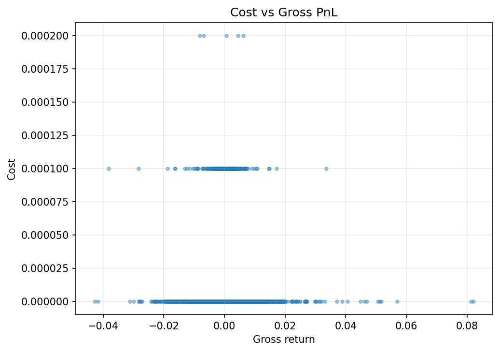

### Diagnostics Lgbm Gain Importance
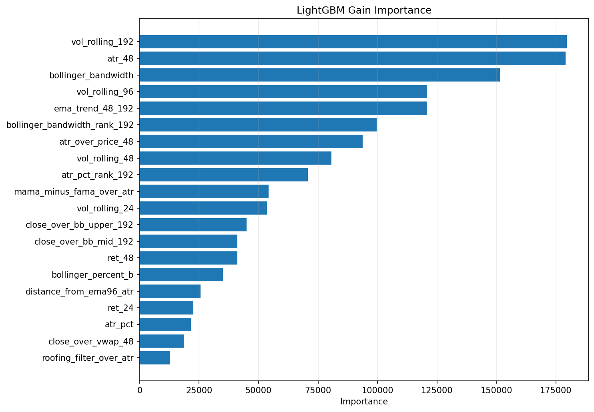

### Diagnostics Lgbm Split Importance


### Diagnostics Prediction Autocorrelation
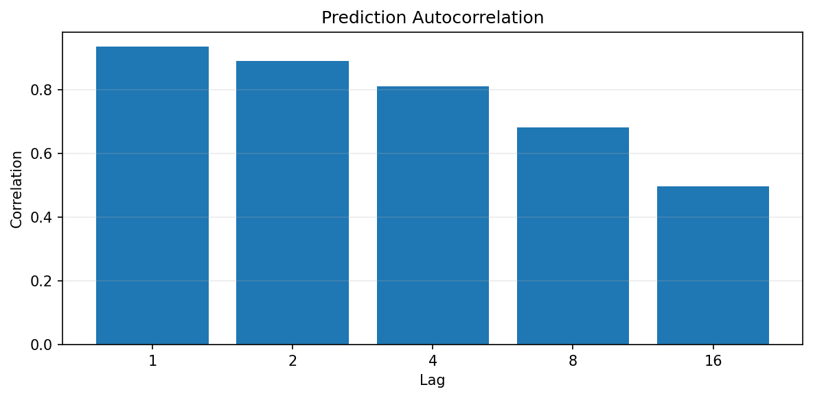

### Diagnostics Prediction Histogram
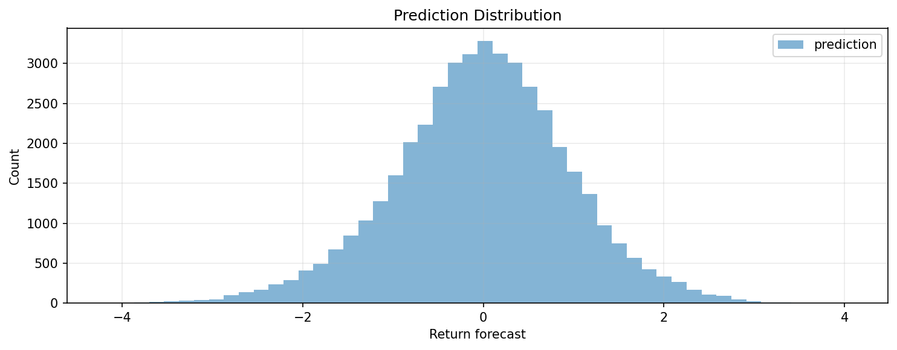

### Diagnostics Prediction Quantiles
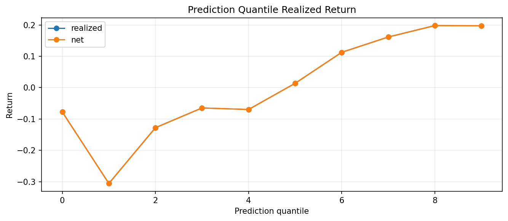

### Diagnostics Prediction Timeseries
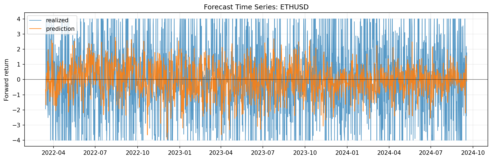

### Diagnostics Prediction Vs Realized
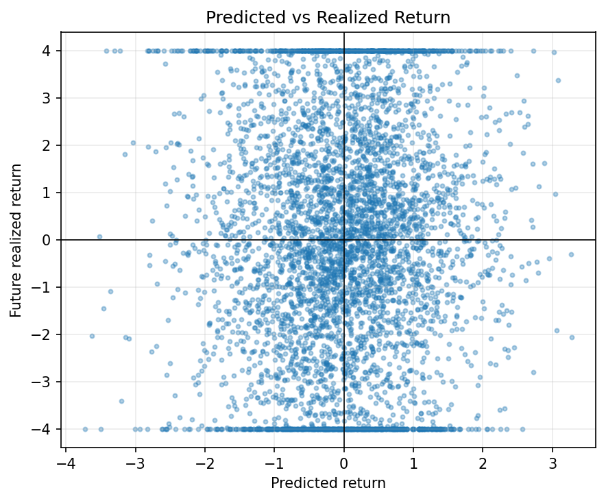

### Diagnostics Residual Histogram
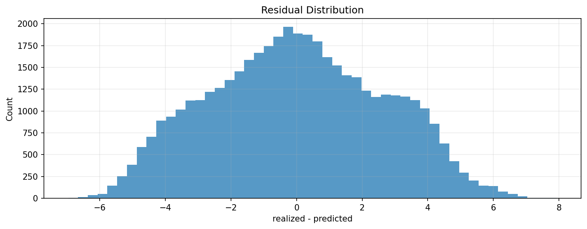

### Diagnostics Turnover Timeseries
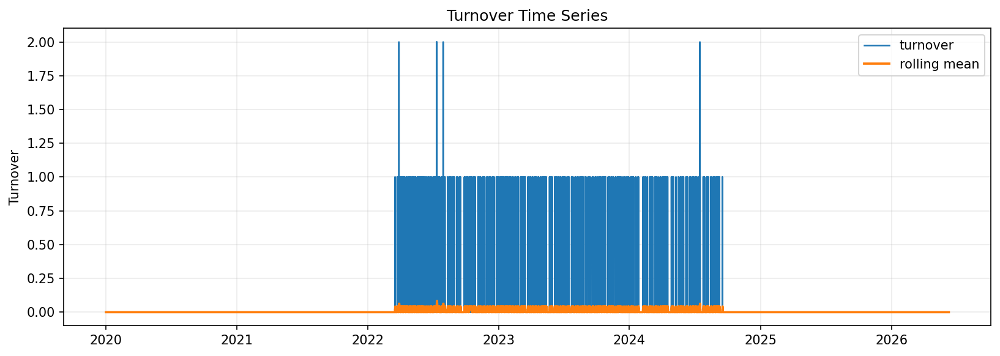

### Diagnostics Turnover Vs Net Pnl
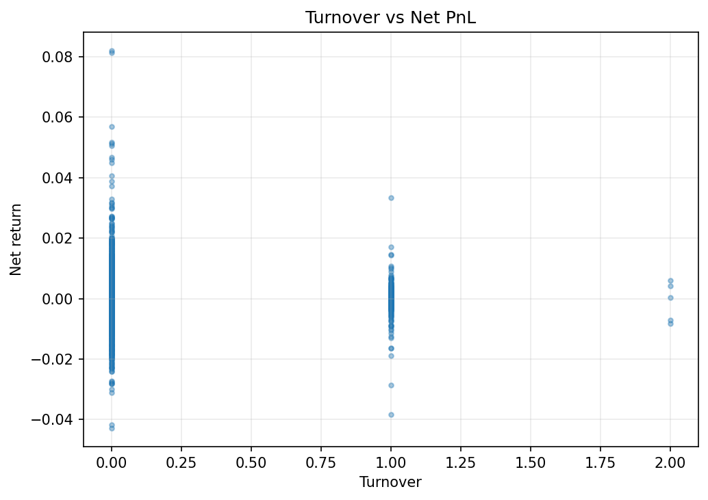

### Equity Curve Chart
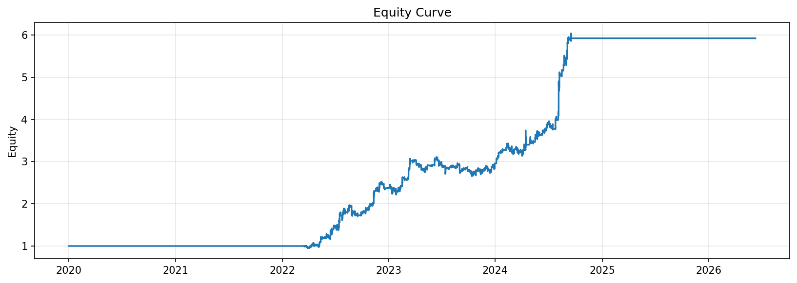

### Drawdown Curve
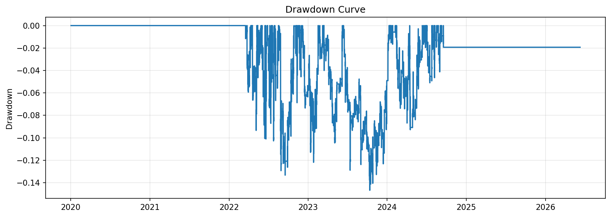

### Cumulative Returns
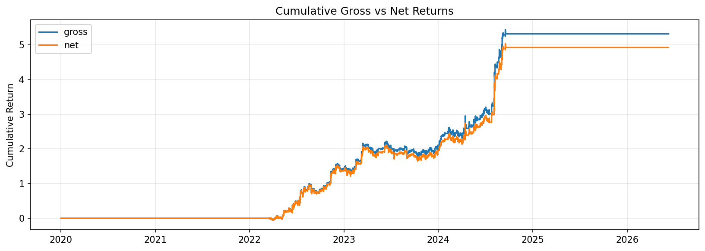

### Monthly Returns
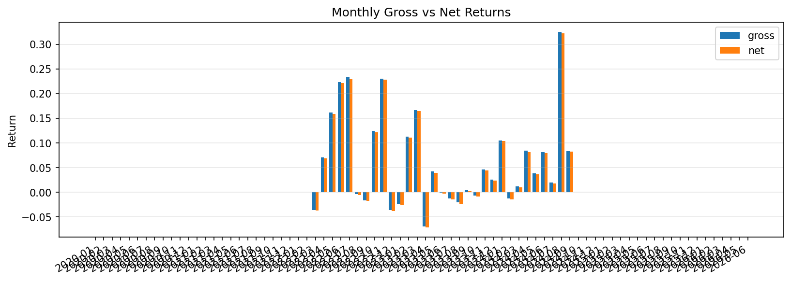

### Rolling Pnl
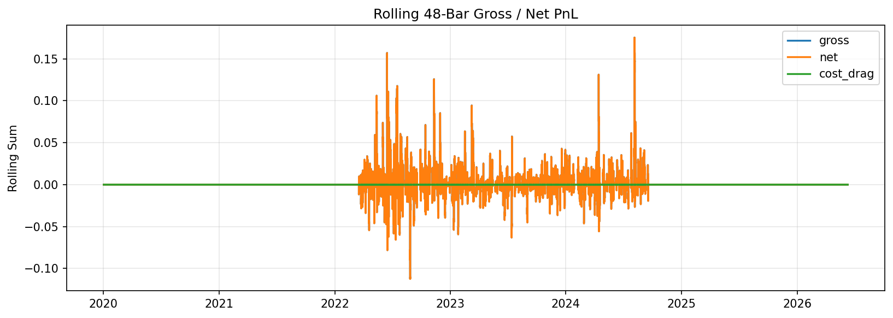

### Cumulative Cost Drag
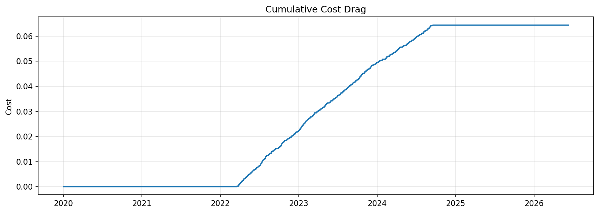

### Positions Turnover
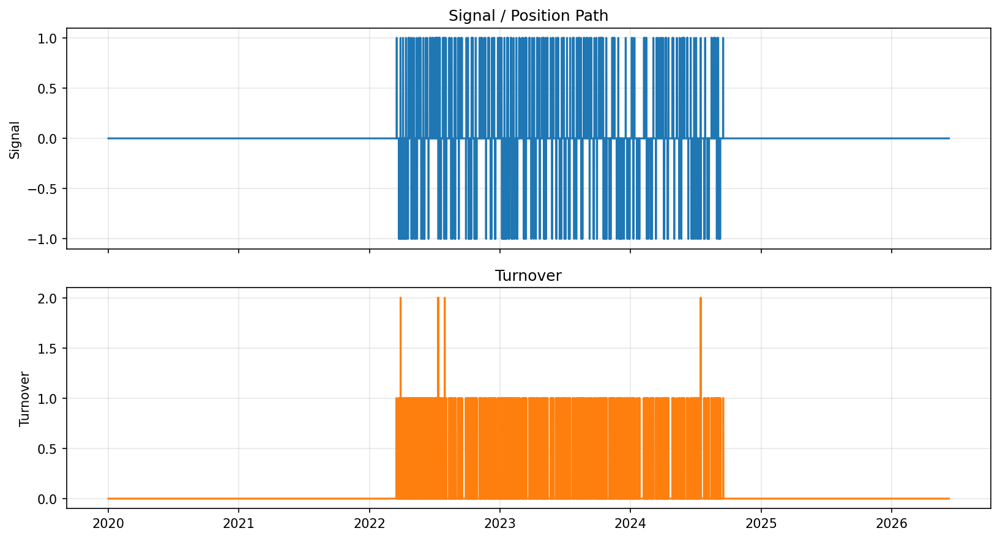

### Rolling Behavior
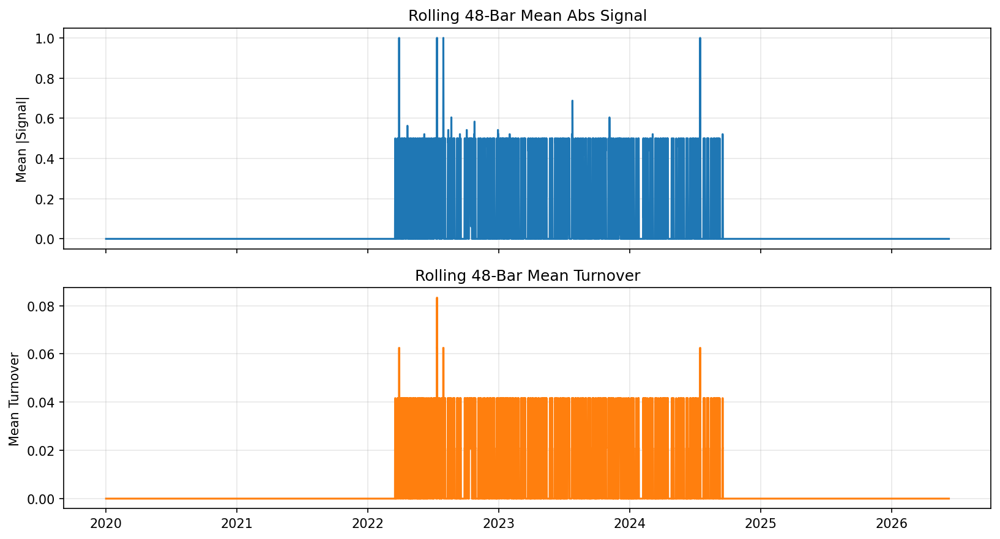

### Signal Distribution
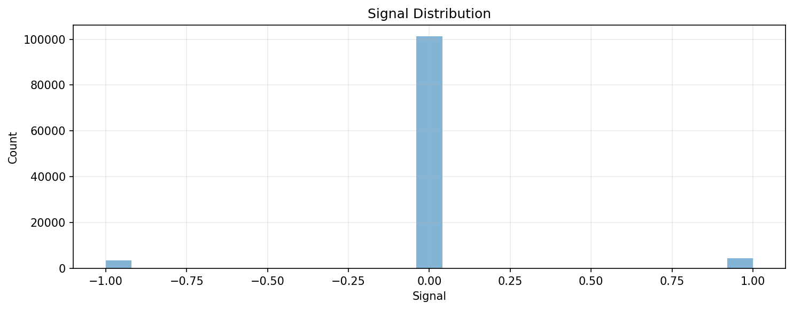

### Fold Net Pnl
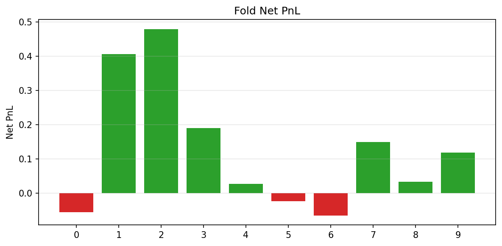

### Feature Importance Chart
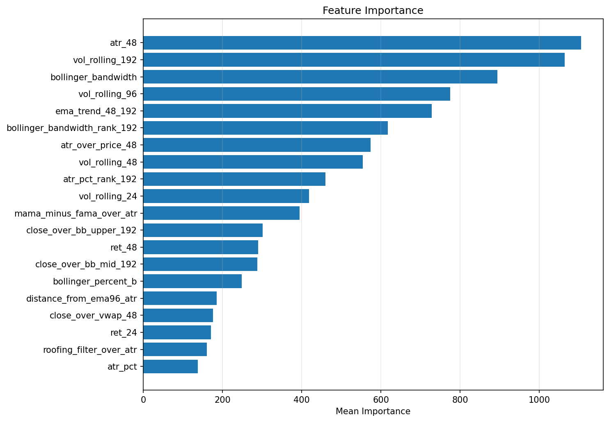

### Prediction Coverage By Fold


## Fold Breakdown
| Fold | Rows | Gross PnL | Net PnL | Cost | Sharpe | Avg Turnover | Mean Reward | Mean Abs Signal | Signal Turnover | Flat Rate |
| --- | --- | --- | --- | --- | --- | --- | --- | --- | --- | --- |
| 0 |  | -0.051619 | -0.055218 | 0.003800 | -0.802344 | 0.008676 |  |  |  |  |
| 1 |  | 0.415165 | 0.406704 | 0.006000 | 6.210358 | 0.013699 |  |  |  |  |
| 2 |  | 0.486558 | 0.480031 | 0.004400 | 10.774179 | 0.010046 |  |  |  |  |
| 3 |  | 0.195740 | 0.190013 | 0.004800 | 5.048310 | 0.010959 |  |  |  |  |
| 4 |  | 0.031810 | 0.027486 | 0.004200 | 0.776207 | 0.009589 |  |  |  |  |
| 5 |  | -0.019172 | -0.023478 | 0.004400 | -0.816614 | 0.010046 |  |  |  |  |
| 6 |  | -0.062226 | -0.065596 | 0.003600 | -1.675438 | 0.008219 |  |  |  |  |
| 7 |  | 0.153100 | 0.150104 | 0.002600 | 4.493170 | 0.005936 |  |  |  |  |
| 8 |  | 0.037883 | 0.034151 | 0.003600 | 0.829202 | 0.008219 |  |  |  |  |
| 9 |  | 0.122972 | 0.118934 | 0.003600 | 3.238782 | 0.008219 |  |  |  |  |


## Model Fold Diagnostics
| Fold | Train Raw | Train Used | Train Missing Features | Train Not Labeled | Train Without Fit | Test Rows | Pred Rows | Test Missing Features | Test Not Candidates | Test Without Prediction | Train Feature Missing | Test Feature Missing | Eval Rows |
| --- | --- | --- | --- | --- | --- | --- | --- | --- | --- | --- | --- | --- | --- |
| 0 | 35016 | 34969 | 0 | 0 | 0 | 4380 | 4380 | 0 | 0 | 0 | 382 | 0 | 4380 |
| 1 | 39396 | 39349 | 0 | 0 | 0 | 4380 | 4380 | 0 | 0 | 0 | 382 | 0 | 4380 |
| 2 | 43752 | 43705 | 0 | 0 | 0 | 4380 | 4380 | 0 | 0 | 0 | 382 | 0 | 4380 |
| 3 | 48108 | 48061 | 0 | 0 | 0 | 4380 | 4380 | 0 | 0 | 0 | 382 | 0 | 4380 |
| 4 | 52464 | 52417 | 0 | 0 | 0 | 4380 | 4380 | 0 | 0 | 0 | 382 | 0 | 4380 |
| 5 | 56820 | 56773 | 0 | 0 | 0 | 4380 | 4380 | 0 | 0 | 0 | 382 | 0 | 4380 |
| 6 | 61176 | 61129 | 0 | 0 | 0 | 4380 | 4380 | 0 | 0 | 0 | 382 | 0 | 4380 |
| 7 | 65532 | 65485 | 0 | 0 | 0 | 4380 | 4380 | 0 | 0 | 0 | 382 | 0 | 4380 |
| 8 | 69888 | 69841 | 0 | 0 | 0 | 4380 | 4380 | 0 | 0 | 0 | 382 | 0 | 4380 |
| 9 | 74244 | 74197 | 0 | 0 | 0 | 4380 | 4380 | 0 | 0 | 0 | 382 | 0 | 4380 |


## Monitoring
- Drifted feature count: `8` / `49`
| Asset | Feature | PSI |
| --- | --- | --- |
| ETHUSD | atr_48 | 1.187111 |
| ETHUSD | atr_over_price_48 | 0.669230 |
| ETHUSD | atr_pct | 0.669230 |
| ETHUSD | vol_rolling_192 | 0.612124 |
| ETHUSD | vol_rolling_96 | 0.551451 |
| ETHUSD | vol_rolling_48 | 0.474270 |
| ETHUSD | vol_rolling_24 | 0.406533 |
| ETHUSD | bollinger_bandwidth | 0.358901 |


## Drift By Family
| Family | Feature Count | Drifted Count | Drifted Ratio | Mean Abs PSI | Max Abs PSI |
| --- | --- | --- | --- | --- | --- |
| unclassified | 36 | 3 | 0.083333 | 0.103939 | 1.187111 |
| atr_adx_range | 1 | 1 | 1.000000 | 0.669230 | 0.669230 |
| volatility | 4 | 4 | 1.000000 | 0.511094 | 0.612124 |
| returns_lags | 8 | 0 | 0.0 | 0.118134 | 0.118186 |


## Feature Set
| Order | Feature |
| --- | --- |
| 1 | close_ret |
| 2 | lag_close_ret_1 |
| 3 | lag_close_ret_2 |
| 4 | lag_close_ret_4 |
| 5 | lag_close_ret_8 |
| 6 | lag_close_ret_16 |
| 7 | lag_close_ret_24 |
| 8 | lag_close_ret_48 |
| 9 | ret_1 |
| 10 | ret_4 |
| 11 | ret_8 |
| 12 | ret_16 |
| 13 | ret_24 |
| 14 | ret_48 |
| 15 | rolling_return_24 |
| 16 | rolling_return_48 |
| 17 | vol_rolling_24 |
| 18 | vol_rolling_48 |
| 19 | vol_rolling_96 |
| 20 | vol_rolling_192 |
| 21 | atr_48 |
| 22 | atr_over_price_48 |
| 23 | atr_pct |
| 24 | atr_pct_rank_192 |
| 25 | ema_trend_48_192 |
| 26 | close_over_bb_upper_192 |
| 27 | close_over_bb_mid_192 |
| 28 | bollinger_percent_b |
| 29 | bollinger_bandwidth |
| 30 | bollinger_bandwidth_rank_192 |
| 31 | ema_alignment_score |
| 32 | distance_from_ema24_atr |
| 33 | distance_from_ema96_atr |
| 34 | mama_minus_fama_over_atr |
| 35 | close_minus_decycler_over_atr |
| 36 | instantaneous_trendline_slope_over_atr |
| 37 | decycler_slope_over_atr |
| 38 | frama_slope_over_atr |
| 39 | supersmoother_slope_over_atr |
| 40 | roofing_filter_over_atr |
| 41 | dominant_cycle_phase_normalized |
| 42 | body_ratio |
| 43 | upper_wick_ratio |
| 44 | lower_wick_ratio |
| 45 | close_location |
| 46 | range_to_atr |
| 47 | close_over_vwap_48 |
| 48 | close_ret_over_vol_48 |
| 49 | close_ret_robust_z_192 |

## Feature Steps
```yaml
- step: returns
  params:
    log: false
    col_name: close_ret
  outputs: {}
  enabled: true
  transforms:
    lag:
      enabled: true
      items:
      - source_col: close_ret
        lag: 1
        output_col: lag_close_ret_1
      - source_col: close_ret
        lag: 2
        output_col: lag_close_ret_2
      - source_col: close_ret
        lag: 4
        output_col: lag_close_ret_4
      - source_col: close_ret
        lag: 8
        output_col: lag_close_ret_8
      - source_col: close_ret
        lag: 16
        output_col: lag_close_ret_16
      - source_col: close_ret
        lag: 24
        output_col: lag_close_ret_24
      - source_col: close_ret
        lag: 48
        output_col: lag_close_ret_48
- step: volatility
  params:
    returns_col: close_ret
    rolling_windows:
    - 24
    - 48
    - 96
    - 192
    ewma_spans: []
    annualization_factor: null
  outputs: {}
  enabled: true
  normalizations:
    volatility_scaled_return:
      params:
        return_col: close_ret
        volatility_col: vol_rolling_48
        output_col: close_ret_over_vol_48
    robust_zscore:
      params:
        source_col: close_ret
        window: 192
        output_col: close_ret_robust_z_192
        shift_stats: true
- step: trend
  params:
    price_col: close
    sma_windows: []
    ema_spans:
    - 24
    - 48
    - 96
    - 192
    ema_col_template: ema_{span}
    add_ratios: false
  outputs: {}
  enabled: true
  transforms:
    ratio:
      enabled: true
      items:
      - numerator_col: ema_24
        denominator_col: ema_96
        output_col: ema_trend_24_96
        subtract: 1.0
      - numerator_col: ema_48
        denominator_col: ema_192
        output_col: ema_trend_48_192
        subtract: 1.0
      - numerator_col: close
        denominator_col: ema_96
        output_col: close_over_ema_96
        subtract: 1.0
      - numerator_col: close
        denominator_col: ema_192
        output_col: close_over_ema_192
        subtract: 1.0
- step: atr
  params:
    high_col: high
    low_col: low
    close_col: close
    window: 48
    windows:
    - 48
    method: wilder
    add_over_price: false
    atr_col: atr_48
  outputs: {}
  enabled: true
  transforms:
    ratio:
      enabled: true
      items:
      - numerator_col: atr_48
        denominator_col: close
        output_col: atr_over_price_48
- step: hilbert_transform
  params:
    price_col: close
    window: 64
    amplitude_col: hilbert_amplitude
    phase_col: hilbert_phase
    instantaneous_frequency_col: hilbert_instantaneous_frequency
    add_derived: false
  outputs: {}
  enabled: true
- step: dominant_cycle_period
  params:
    price_col: close
    output_col: dominant_cycle_period
  outputs: {}
  enabled: true
- step: dominant_cycle_phase
  params:
    price_col: close
    output_col: dominant_cycle_phase
    unit: degrees
  outputs: {}
  enabled: true
- step: mama
  params:
    price_col: close
    fast_limit: 0.5
    slow_limit: 0.05
    output_col: mama
  outputs: {}
  enabled: true
- step: fama
  params:
    price_col: close
    fast_limit: 0.5
    slow_limit: 0.05
    output_col: fama
  outputs: {}
  enabled: true
- step: decycler
  params:
    price_col: close
    period: 60
    output_col: decycler
  outputs: {}
  enabled: true
- step: decycler_oscillator
  params:
    price_col: close
    fast_period: 30
    slow_period: 60
    output_col: decycler_oscillator_30_60
  outputs: {}
  enabled: true
- step: instantaneous_trendline
  params:
    price_col: close
    alpha: 0.07
    output_col: instantaneous_trendline
    add_trigger: false
  outputs: {}
  enabled: true
- step: frama
  params:
    price_col: close
    high_col: high
    low_col: low
    window: 16
    fast_period: 4
    slow_period: 300
    output_col: frama
    add_diagnostics: false
  outputs: {}
  enabled: true
- step: supersmoother
  params:
    price_col: close
    period: 10
    output_col: supersmoother
  outputs: {}
  enabled: true
- step: roofing_filter
  params:
    price_col: close
    high_pass_period: 48
    low_pass_period: 10
    output_col: roofing_filter
  outputs: {}
  enabled: true
- step: ehlers_ml_long_candidate
  params:
    amplitude_col: hilbert_amplitude
    cycle_period_col: dominant_cycle_period
    roofing_col: roofing_filter
    mama_col: mama
    fama_col: fama
    close_col: close
    decycler_col: decycler
    instantaneous_trendline_col: instantaneous_trendline
    frama_col: frama
    supersmoother_col: supersmoother
    dominant_cycle_phase_col: dominant_cycle_phase
    dominant_cycle_phase_unit: degrees
    atr_col: atr_48
    amplitude_lookback: 128
    amplitude_min_quantile: 0.5
    min_cycle_period: 8.0
    max_cycle_period: 60.0
    slope_bars: 1
    candidate_col: ehlers_ml_candidate
    side_col: ehlers_ml_side
  outputs: {}
  enabled: true
- step: macd
  params:
    price_col: close
    fast: 12
    slow: 26
    signal: 9
  outputs:
    macd_12_26: macd
    macd_signal_9: macd_signal
    macd_hist_12_26_9: macd_hist
  enabled: true
- step: rsi
  params:
    price_col: close
    windows:
    - 14
    method: wilder
  outputs:
    close_rsi_14: rsi_14
  enabled: true
- step: stochastic_rsi
  params:
    price_col: close
    rsi_period: 14
    stoch_period: 14
    k_period: 3
    d_period: 3
    oversold: 0.2
    overbought: 0.8
    prefix: stoch_rsi
  outputs:
    stoch_rsi_k: stoch_rsi_k
    stoch_rsi_d: stoch_rsi_d
  enabled: true
- step: bollinger
  params:
    price_col: close
    window: 192
    n_std: 2.0
  outputs:
    bb_ma_192: bollinger_mid_192
    bb_upper_192_2.0: bollinger_upper_192
    bb_lower_192_2.0: bollinger_lower_192
    bb_width_192_2.0: bollinger_bandwidth
    bb_percent_b_192_2.0: bollinger_percent_b
  enabled: true
  transforms:
    ratio:
      enabled: true
      items:
      - numerator_col: close
        denominator_col: bb_upper_192_2.0
        output_col: close_over_bb_upper_192
        subtract: 1.0
      - numerator_col: close
        denominator_col: bb_ma_192
        output_col: close_over_bb_mid_192
        subtract: 1.0
- step: indicator_pullback
  params:
    asset_vocab:
    - ETHUSD
    open_col: open
    high_col: high
    low_col: low
    close_col: close
    ema_fast_period: 24
    ema_mid_period: 96
    ema_slow_period: 192
    atr_period: 48
    atr_pct_rank_window: 192
    macd_hist_col: macd_hist
    rsi_period: 14
    stoch_k_col: stoch_rsi_k
    stoch_d_col: stoch_rsi_d
    bollinger_bandwidth_col: bollinger_bandwidth
    bollinger_percent_b_col: bollinger_percent_b
    bb_bandwidth_rank_window: 192
    realized_vol_windows:
    - 24
    - 48
    - 96
    - 192
    return_windows:
    - 1
    - 4
    - 8
    - 16
    - 24
    - 48
    rolling_return_windows:
    - 24
    - 48
  outputs: {}
  enabled: true
- step: vwap
  params:
    high_col: high
    low_col: low
    close_col: close
    volume_col: volume
    windows:
    - 48
  outputs: {}
  enabled: true
  transforms:
    ratio:
      enabled: true
      items:
      - numerator_col: close
        denominator_col: vwap_48
        output_col: close_over_vwap_48
        subtract: 1.0
```

## Config Snapshot
```yaml
data:
  source: dukascopy_csv
  interval: 30m
  start: null
  end: null
  alignment: inner
  symbol: ETHUSD
  symbols: null
  api_key: null
  api_key_env: null
  pit:
    timestamp_alignment:
      source_timezone: UTC
      output_timezone: UTC
      normalize_daily: false
      duplicate_policy: last
    corporate_actions:
      policy: none
      adj_close_col: adj_close
    universe_snapshot:
      inactive_policy: raise
  storage:
    mode: cached_only
    dataset_id: ethusd_30m_lightgbm_h24_structured_tail_alpha_v3_7_ehlers_trend_hybrid
    save_raw: false
    save_processed: true
    load_path: /workspace/data/raw/dukascopy_30m_clean/ethusd_30m.csv
    raw_dir: /workspace/data/raw
    processed_dir: /workspace/data/processed
    load_paths: null
model:
  kind: lightgbm_regressor
  params:
    n_estimators: 800
    learning_rate: 0.0549537895493607
    max_depth: 6
    num_leaves: 15
    min_child_samples: 200
    subsample: 0.9
    colsample_bytree: 0.75
    reg_alpha: 0.019934229992965794
    reg_lambda: 1.8786413727433209
    random_state: 7
    n_jobs: 1
    verbosity: -1
  outputs:
    pred_ret_col: pred_ret
    pred_prob_col: pred_prob
    pred_is_oos_col: pred_is_oos
  preprocessing:
    scaler: none
  calibration: {}
  feature_cols:
  - close_ret
  - lag_close_ret_1
  - lag_close_ret_2
  - lag_close_ret_4
  - lag_close_ret_8
  - lag_close_ret_16
  - lag_close_ret_24
  - lag_close_ret_48
  - ret_1
  - ret_4
  - ret_8
  - ret_16
  - ret_24
  - ret_48
  - rolling_return_24
  - rolling_return_48
  - vol_rolling_24
  - vol_rolling_48
  - vol_rolling_96
  - vol_rolling_192
  - atr_48
  - atr_over_price_48
  - atr_pct
  - atr_pct_rank_192
  - ema_trend_48_192
  - close_over_bb_upper_192
  - close_over_bb_mid_192
  - bollinger_percent_b
  - bollinger_bandwidth
  - bollinger_bandwidth_rank_192
  - ema_alignment_score
  - distance_from_ema24_atr
  - distance_from_ema96_atr
  - mama_minus_fama_over_atr
  - close_minus_decycler_over_atr
  - instantaneous_trendline_slope_over_atr
  - decycler_slope_over_atr
  - frama_slope_over_atr
  - supersmoother_slope_over_atr
  - roofing_filter_over_atr
  - dominant_cycle_phase_normalized
  - body_ratio
  - upper_wick_ratio
  - lower_wick_ratio
  - close_location
  - range_to_atr
  - close_over_vwap_48
  - close_ret_over_vol_48
  - close_ret_robust_z_192
  target:
    kind: future_return_regression
    price_col: close
    returns_col: close_ret
    returns_type: simple
    horizon_bars: 24
    normalize_by_volatility: true
    volatility_col: atr_48
    clip:
    - -4.0
    - 4.0
    fwd_col: target_future_return_h24_atr
    label_col: target_future_return_h24_atr
  split:
    method: purged
    train_size: 35040
    test_size: 4380
    step_size: 4380
    expanding: true
    max_folds: 10
    purge_bars: 24
    embargo_bars: 24
  runtime: {}
  env: {}
  use_features: true
  pred_prob_col: pred_prob
  pred_raw_prob_col: null
  pred_ret_col: pred_ret
  pred_is_oos_col: pred_is_oos
  returns_input_col: null
  signal_col: null
  action_col: null
  final_refit: true
signals:
  kind: forecast_threshold
  params:
    forecast_col: pred_ret
    signal_col: signal_structured_tail
    upper: 0.6
    lower: -0.8
    mode: long_short
    activation_filters:
    - col: atr_pct_rank_192
      op: ge
      value: 0.25
    - col: atr_pct_rank_192
      op: le
      value: 0.85
    - col: range_to_atr
      op: ge
      value: 0.8999999999999999
    - col: bollinger_bandwidth_rank_192
      op: ge
      value: 0.4
  outputs: {}
risk:
  cost_per_turnover: 0.0001
  slippage_per_turnover: 0.0
  target_vol: null
  max_leverage: 1.0
  dd_guard:
    enabled: false
    max_drawdown: 0.2
    cooloff_bars: 20
    rearm_drawdown: 0.2
  portfolio_guard: {}
  sizing: {}
  drawdown_sizing: {}
  vol_col: null
backtest:
  engine: vectorized
  returns_col: close_ret
  signal_col: signal_structured_tail
  periods_per_year: 17520
  returns_type: simple
  missing_return_policy: raise_if_exposed
  min_holding_bars: 24
  subset: test
  stop_mode: fixed_return
  vol_col: null
  open_col: open
  high_col: high
  low_col: low
  close_col: close
  take_profit_r: null
  stop_loss_r: null
  volatility_col: null
  entry_price_mode: null
  profit_barrier_r: null
  stop_barrier_r: null
  vertical_barrier_bars: null
  tie_break: null
  event_time_remap_policy: null
  annualization_mode: null
  max_cost_r: null
  risk_per_trade: null
  max_holding_bars: null
  asset_params: {}
  dynamic_exit: {}
  strategy_path: {}
  dynamic_exits: {}
  partial_exits: {}
  allow_short: true
  oos_mode: strict
  execution_price: close_lagged
  execution_delay_bars: 0
  estimated_spread_cost_per_unit_turnover: 0.0
  commission_per_unit_turnover: 0.0
  slippage_per_unit_turnover: 0.0
  holding_cost_per_exposed_bar: 0.0
  allow_cost_layering: false
portfolio:
  enabled: false
  construction: signal_weights
  gross_target: 1.0
  long_short: true
  expected_return_col: null
  covariance_window: 60
  covariance_rebalance_step: 1
  risk_aversion: 5.0
  trade_aversion: 0.0
  selection:
    enabled: false
    top_k: 1
    min_expected_net_return: 0.0
    rank_by_abs: true
    weighting: score
    rebalance_every_n_bars: 1
  constraints:
    enforce_target_net_exposure: true
  asset_groups: {}
runtime:
  seed: 7
  repro_mode: strict
  deterministic: true
  threads: 1
  seed_torch: false
```

## Artifact Inventory
- `report_markdown`: `report.md`
- `config`: `config_used.yaml`
- `summary`: `summary.json`
- `run_metadata`: `run_metadata.json`
- `equity_curve`: `equity_curve.csv`
- `returns`: `returns.csv`
- `gross_returns`: `gross_returns.csv`
- `costs`: `costs.csv`
- `turnover`: `turnover.csv`
- `trade_events`: `trade_events.csv`
- `positions`: `positions.csv`
- `monitoring`: `monitoring_report.json`
- `diagnostic_trade_events`: `report_assets/trade_events.csv`
- `trades`: `report_assets/trades.csv`
- `trades_enriched`: `report_assets/trades_enriched.csv`
- `trade_path_summary`: `report_assets/trade_path_summary.json`
- `trade_paths`: `report_assets/trade_paths.parquet`
- `trade_path_diagnostics`: `report_assets/trade_path_diagnostics.json`
- `probability_trade_quality`: `report_assets/probability_trade_quality.csv`
- `counterfactual_exit_summary`: `report_assets/counterfactual_exit_summary.csv`
- `counterfactual_exit_trades`: `report_assets/counterfactual_exit_trades.csv`
- `feature_importance`: `feature_importance.csv`
- `prediction_diagnostics`: `prediction_diagnostics.json`
- `missing_value_diagnostics`: `missing_value_diagnostics.json`
- `fold_model_summary`: `fold_model_summary.csv`
- `stage_tails`: `stage_tails.json`
- `diagnostics_fold_backtest_diagnostics`: `artifacts/diagnostics/fold_backtest_diagnostics.csv`
- `diagnostics_forecast_alpha_diagnostics_summary`: `artifacts/diagnostics/forecast_alpha_diagnostics_summary.json`
- `diagnostics_forecast_baselines`: `artifacts/diagnostics/forecast_baselines.csv`
- `diagnostics_lightgbm_importance`: `artifacts/diagnostics/lightgbm_importance.csv`
- `diagnostics_prediction_autocorrelation`: `artifacts/diagnostics/prediction_autocorrelation.png`
- `diagnostics_prediction_distribution`: `artifacts/diagnostics/prediction_distribution.csv`
- `diagnostics_prediction_metrics`: `artifacts/diagnostics/prediction_metrics.csv`
- `diagnostics_prediction_quantiles`: `artifacts/diagnostics/prediction_quantiles.png`
- `diagnostics_regime_diagnostics`: `artifacts/diagnostics/regime_diagnostics.csv`
- `diagnostics_regime_performance`: `artifacts/diagnostics/regime_performance.csv`
- `diagnostics_summary`: `artifacts/diagnostics/summary.json`
- `diagnostics_turnover_cost_timeseries`: `artifacts/diagnostics/turnover_cost_timeseries.csv`
- `diagnostics_cost_vs_gross_pnl`: `artifacts/diagnostics/cost_vs_gross_pnl.png`
- `diagnostics_lgbm_gain_importance`: `artifacts/diagnostics/lgbm_gain_importance.png`
- `diagnostics_lgbm_split_importance`: `artifacts/diagnostics/lgbm_split_importance.png`
- `diagnostics_prediction_histogram`: `artifacts/diagnostics/prediction_histogram.png`
- `diagnostics_prediction_timeseries`: `artifacts/diagnostics/prediction_timeseries.png`
- `diagnostics_prediction_vs_realized`: `artifacts/diagnostics/prediction_vs_realized.png`
- `diagnostics_residual_histogram`: `artifacts/diagnostics/residual_histogram.png`
- `diagnostics_turnover_timeseries`: `artifacts/diagnostics/turnover_timeseries.png`
- `diagnostics_turnover_vs_net_pnl`: `artifacts/diagnostics/turnover_vs_net_pnl.png`
- `equity_curve_chart`: `report_assets/equity_curve.png`
- `drawdown_curve`: `report_assets/drawdown_curve.png`
- `cumulative_returns`: `report_assets/cumulative_returns.png`
- `monthly_returns`: `report_assets/monthly_returns.png`
- `rolling_pnl`: `report_assets/rolling_pnl.png`
- `cumulative_cost_drag`: `report_assets/cumulative_cost_drag.png`
- `positions_turnover`: `report_assets/positions_turnover.png`
- `rolling_behavior`: `report_assets/rolling_behavior.png`
- `signal_distribution`: `report_assets/signal_distribution.png`
- `fold_net_pnl`: `report_assets/fold_net_pnl.png`
- `feature_importance_chart`: `report_assets/feature_importance.png`
- `prediction_coverage_by_fold`: `report_assets/prediction_coverage_by_fold.png`
