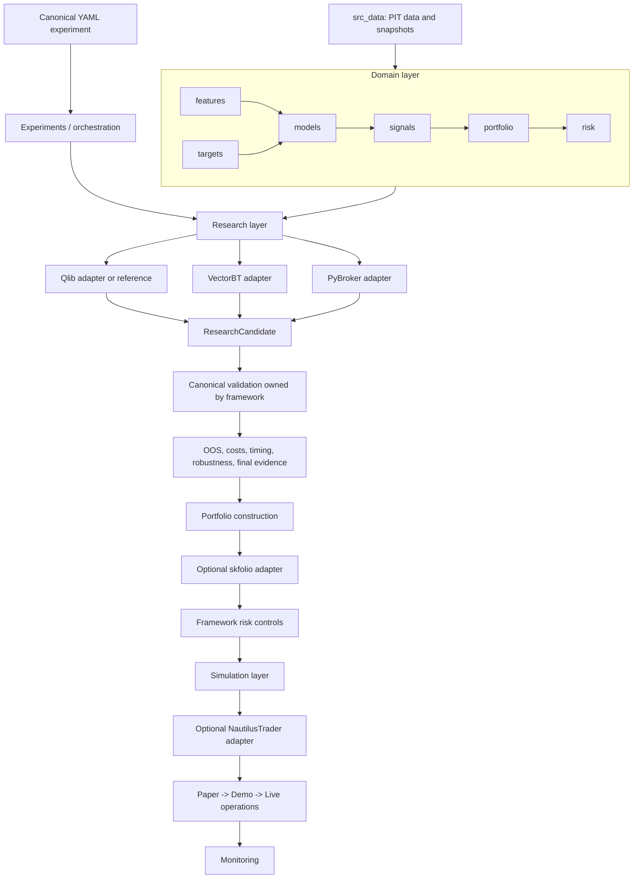

# Systematic Trading Framework — Architecture V2

Κατάσταση: **Phase 3C-R1/R2 STF-native multi-asset prediction research implemented**

Ημερομηνία επιθεώρησης: 2026-08-15

## 1. Architecture decision

Το υπάρχον repository παραμένει το canonical framework. Η Architecture V2
είναι incremental εξέλιξη των σημερινών packages και contracts, όχι rewrite,
νέο repository ή δεύτερο framework μέσα στο ίδιο tree.

Η κεντρική σχέση με future libraries είναι:

```text
Our YAML -> Our contracts/domain API -> Adapter -> External library
```

Το framework διατηρεί ownership πάνω στα εξής:

- YAML experiment schema και stable entrypoint,
- data/PIT contracts και evidence roles,
- features, targets, models, signals και portfolio/risk semantics,
- backtest timing, transaction costs και canonical validation,
- candidate/evidence/promotion records,
- paper/demo/live safety και monitoring.

External results είναι screening evidence με provenance. Δεν γίνονται final
evidence επειδή ένα τρίτο backend παρήγαγε ελκυστικά metrics.

## 2. Current state — πραγματική execution path

Το user-facing entrypoint είναι:

```bash
python -m src.experiments.runner path/to/config.yaml
```

Η επιβεβαιωμένη canonical διαδρομή είναι:

```text
src.experiments.runner.run_experiment
  |
  +-- διαβάζει μόνο το optional pipeline.kind
  |
  +-- canonical ή χωρίς selector
  |     -> src.experiments.orchestration.pipeline.run_experiment_pipeline
  |          -> src.utils.config.load_experiment_config
  |          -> src.experiments.orchestration.data_stage
  |          -> feature / target / model / signal stages
  |          -> backtest / portfolio / evaluation
  |          -> monitoring / execution output / artifacts
  |
  +-- custom pipeline.kind
        -> src.pipelines.registry.get_pipeline_fn(kind)
        -> registered custom pipeline
```

Το `src.pipelines.canonical_pipeline.run_canonical_pipeline` είναι public facade
που επιστρέφει στο stable `run_experiment`. Το registry key
`canonical_experiment` παραμένει canonical.

### 2.1 Σημερινά package owners

| Package | Επιβεβαιωμένη τρέχουσα ευθύνη |
|---|---|
| `src/src_data` | loaders, providers, PIT hardening, OHLCV/quote contracts, quality, immutable research snapshots και evidence-role access |
| `src/features` | feature builders, technical indicators, systems, panel features και helper transforms |
| `src/targets` | forward/path/barrier labels και target output aliases |
| `src/models` | classification, forecasting, transforms, RL και lazy model registry |
| `src/signals` | rule/model-column decision logic και signal registry |
| `src/portfolio` | construction, covariance, optimizer και constraints |
| `src/risk` | sizing, controls και entry modifiers |
| `src/backtesting` | canonical bar-based engines, manual/portfolio barriers και trade path |
| `src/evaluation` | metrics, time splits, diagnostics, robustness και fold reporting |
| `src/experiments` | runner facade, orchestration stages, search, custom research workflows και artifacts |
| `src/pipelines` | canonical/custom pipeline facades και registry |
| `src/execution` | broker contracts, paper/dry-run, MT5/OANDA operational adapters |
| `src/monitoring` | drift, health, latency και PnL monitoring |
| `src/simulation` | μικρό deterministic order-book replay helper |
| `src/market_making` | event-driven quoting, risk, paper/live engine, reporting και order-book assumptions |

### 2.2 Υφιστάμενο research/evidence foundation

Η V2 δεν ξεκινά από μηδενική βάση. Υπάρχουν ήδη:

- `src/src_data/research_roles.py`: immutable `EvidenceRole` values,
- `src/src_data/research_snapshot.py` και `research_access.py`: frozen snapshot
  provenance και role-bound access,
- `src/experiments/alpha_contracts.py`: point-in-time availability και material
  change rules,
- `src/experiments/alpha_registry.py`: append-only hypothesis lifecycle,
- `src/experiments/orchestration/alpha_discovery_pipeline.py`: approval-gated
  discovery pipeline,
- `src/experiments/orchestration/alpha_discovery_artifacts.py`: immutable
  research artifact layout.

Το `src/research` συμπληρώνει αυτά τα contracts με portable
`ResearchHypothesis`, `ResearchRequest`, `ResearchRun`, `ResearchResult`,
`SelectionRecord`, `ResearchCandidate`, evidence/validation/robustness records,
guarded decisions και `ResearchBackend`. Δεν αντικαθιστά ούτε αντιγράφει το
snapshot ή append-only alpha-hypothesis infrastructure. Η αναλυτική Phase 1
σύμβαση βρίσκεται στο [Research & Evidence Layer](research_evidence_layer.md)
και το support migration inventory στο
[Research Layer Inventory](research_layer_inventory.md).

Η Phase 2 προσθέτει στο `src/research/discovery` framework-owned
`DiscoverySpecification`, neutral search spaces, portable trials, configured
eligibility, deterministic ranking/selection, pending canonical-validation
requests και create-once artifacts. Το υπάρχον Optuna engine παραμένει στο
`src/experiments` και συνδέεται μέσω thin adapter. Η αναλυτική σύμβαση βρίσκεται
στο [Canonical Alpha Discovery](alpha_discovery.md).

Η Phase 3A προσθέτει πραγματικό αλλά στενά οριοθετημένο
`src/research/backends/vectorbt` adapter. Καταναλώνει finite Phase 2 search
spaces, εκτελεί μόνο framework-produced long-only rule signals με explicit
next-open timing/cost mapping και επιστρέφει ένα portable `DiscoveryTrial` ανά
combination. Τα VectorBT-native objects μένουν μέσα στον adapter και κάθε
selected candidate σταματά στο `PENDING_CANONICAL_VALIDATION`. Η αναλυτική
σύμβαση βρίσκεται στο [VectorBT Research Backend](vectorbt_backend.md).

Η Phase 3B προσθέτει το optional `src/research/backends/pybroker` για
single-asset supervised ML walk-forward screening. Τα chronological purged
folds, το target horizon, το embargo και το fold-local preprocessing ορίζονται
από STF contracts· το PyBroker `ModelTrainer` χρησιμοποιείται μόνο μέσα στον
adapter για fit σε train και `predict_proba` σε test rows. Κάθε prediction έχει
explicit OOS/fold provenance, ενώ τα selected results παραμένουν `DISCOVERY`
evidence και σταματούν στο `PENDING_CANONICAL_VALIDATION`. Η πλήρης σύμβαση
βρίσκεται στο [PyBroker ML Walk-Forward Research Backend](pybroker_backend.md).

Η Phase 3C-R1 προσθέτει το framework-owned
`src/research/dataset.py`: portable `PanelResearchDataset`, explicit
`TRAINING/TUNING/SCREENING` discovery segments, row-level prediction
eligibility και deterministic validation της canonical long-form ταυτότητας
`(timestamp, asset_id)`. Features, targets, horizon, evidence roles, source
snapshot fingerprints και dataset identity παραμένουν STF-owned. Η R1 δεν
εκτελεί models, δεν δημιουργεί predictions/portfolio και δεν προσθέτει external
dependency ή persistence root. Η πλήρης σύμβαση βρίσκεται στο
[STF-native Multi-Asset Research Dataset](multi_asset_research_dataset.md).

Η Phase 3C-R2 προσθέτει το `src/research/multi_asset.py` πάνω στο ίδιο R1
contract. Υποστηρίζει explicit per-asset και pooled cross-sectional LightGBM
prediction research, target-horizon purge, train-only preprocessing, portable
OOS prediction provenance, per-asset coverage/metrics, deterministic rank-IC και
target-quantile diagnostics. Κάθε alternative παραμένει canonical
`DiscoveryTrial` και οι selected candidates σταματούν στο
`PENDING_CANONICAL_VALIDATION`. Δεν δημιουργούνται signal, portfolio return,
weights ή canonical evidence. Η πλήρης σύμβαση βρίσκεται στο
[STF-native Multi-Asset Alpha Research](multi_asset_alpha_research.md).

Η αξιολόγηση Qlib παραμένει reference-only: το τρέχον canonical Linux aarch64
environment δεν έχει supported runtime distribution και η R1 δεν επιχειρεί
workaround, source build ή δεύτερο amd64 image.

## 3. Problems / architectural debt που εντοπίστηκε

Τα παρακάτω προκύπτουν από τον κώδικα που επιθεωρήθηκε. Δεν αποτελούν αίτημα
για άμεσο mass refactor.

### 3.1 Broad runner compatibility surface

Το `src/experiments/runner.py` είναι 318 γραμμές και παραμένει stable entrypoint,
αλλά εκθέτει μεγάλο σύνολο underscore-prefixed orchestration helpers μέσω
imports και `__all__`. Η πραγματική orchestration έχει ήδη μεταφερθεί σε stage
modules, επομένως το runner είναι κυρίως CLI/dispatch/compatibility facade. Η
αφαίρεση re-exports χωρίς import inventory θα έσπαγε tests ή legacy consumers.

### 3.2 Μεγάλα orchestration modules

Η stage διάσπαση είναι πραγματική, αλλά ορισμένα responsibilities παραμένουν
συγκεντρωμένα: κατά την επιθεώρηση τα `artifacts.py` και `reporting.py` ήταν πάνω
από 3.000 γραμμές, το `backtest_stage.py` πάνω από 1.300 και το canonical
`pipeline.py` περίπου 675. Αυτό αυξάνει change coupling μεταξύ backtesting,
robustness, reporting και artifact serialization. Χρειάζεται contract-first
decomposition, όχι μηχανικό split αρχείων.

### 3.3 Inconsistent registry loading policy

Το model registry χρησιμοποιεί συστηματικά `lazy_callable`. Τα feature, signal
και target registries εισάγουν τα περισσότερα implementations eagerly. Το
pipeline registry εισάγει custom research/support pipelines eagerly. Η
συμπεριφορά είναι σήμερα λειτουργική, αλλά ένα optional backend δεν πρέπει να
ακολουθήσει αυτό το pattern: οι adapter dependencies πρέπει να είναι lazy και
να αποτυγχάνουν με capability-specific μήνυμα μόνο όταν ζητηθούν.

### 3.4 Strategy/asset bundles μέσα σε generic packages

Υπάρχουν επιβεβαιωμένα names όπως:

- `src/features/btcusd_dual_trend_ftmo.py`,
- `src/features/eurusd_ftmo_ml_v2.py`,
- `src/risk/eurusd_ftmo_ml_v2_sizing.py`,
- `src/backtesting/btcusd_dual_trend_ftmo.py`,
- `src/backtesting/eurusd_ftmo_ml_v2.py`.

Μερικά μπορεί να κωδικοποιούν πραγματικό asset/execution contract. Άλλα μπορεί
να είναι composition από generic indicators, signals και risk rules. Πριν από
μετακίνηση απαιτείται classification: generic primitive, asset contract,
strategy composition ή locked compatibility implementation.

### 3.5 Reusable research algorithms στο `experiments/support`

Το `src/experiments/support` περιλαμβάνει μεγάλες implementations για fresh
alpha discovery, funding carry, trial labs, locked confirmation, tsfresh
discovery και strategy-specific diagnostics. Το package είναι νόμιμο
compatibility location, αλλά reusable discovery/selection/robustness algorithms
δεν πρέπει μακροπρόθεσμα να εξαρτώνται από experiment orchestration. Η Phase 1
πρέπει να τα ταξινομήσει πριν μετακινήσει οτιδήποτε.

### 3.6 Domain logic σε scripts

Υπάρχουν importable/tested functions μόνο μέσα στο `scripts/`, ιδίως για data
merge/validation, quote-contract migration, FTMO dataset preparation, config
suite generation και market-making runners. Τα CLI wrappers είναι σωστά στο
`scripts/`; reusable calculation/validation logic χρειάζεται σταδιακά owner
module σε `src/`, με το script να μένει thin facade.

### 3.7 Ονομασία data package και simulation overlap

Το `src/src_data` είναι stable path παρότι το target vocabulary θα προτιμούσε
`src/data`. Rename τώρα θα είχε μεγάλο compatibility surface. Παράλληλα,
`src/simulation` εξυπηρετεί σήμερα order-book replay ενώ το `src/backtesting`
είναι το canonical bar engine. Η διάκριση πρέπει να τεκμηριωθεί πριν προστεθεί
event-driven adapter ώστε να μην εμφανιστεί τρίτο overlapping simulation API.

## 4. Target Architecture V2



### 4.1 Γιατί δεν δημιουργήθηκε `src/core` στο Phase 0

Το target tree επιτρέπει μελλοντικά `core/contracts`, `types`, `registry` και
`lifecycle`, αλλά σήμερα τα πραγματικά owners υπάρχουν ήδη σε `src/utils`,
`src/evaluation`, `src/src_data` και package-specific registries. Ένα άδειο
`src/core` θα δημιουργούσε νέο namespace χωρίς migration contract. Θα
δημιουργηθεί μόνο όταν ένα συγκεκριμένο shared contract μετακινηθεί με
compatibility facade και tests.

## 5. Layer ownership και dependency rules

### 5.1 Domain layer

Το domain layer περιέχει reusable trading/data-science logic: data, features,
targets, models, signals, portfolio και risk. Δεν εισάγει experiment runner,
artifact orchestration ή broker implementations.

### 5.2 Research layer

Το `src/research` ορίζει portable contracts και οργανώνει:

```text
discovery -> validation -> selection -> robustness -> evidence
```

Το discovery/selection boundary έχει πλέον πραγματική Phase 2 implementation,
ενώ validation/robustness/evidence/promotion επαναχρησιμοποιούν τα Phase 1
records και guarded transitions. Η εξέλιξη έγινε additive:

```text
src/research/
  discovery/
    contracts.py
    search_space.py
    service.py
    validation.py
    artifacts.py
```

### 5.3 Simulation layer

- `src/backtesting` παραμένει canonical bar-based engine.
- `src/simulation` παραμένει deterministic order-book/event helper.
- `src/market_making` κρατά event-driven bounded-context assumptions.
- Future Nautilus simulation μεταφράζει framework-owned intents προς backend
  objects μέσα στον adapter.

### 5.4 Operations layer

Execution, monitoring, broker adapters, paper/demo/live state και operational
artifacts ανήκουν εδώ. Δεν επηρεάζουν selection evidence σιωπηλά και δεν
ενεργοποιούνται από research imports.

### 5.5 Allowed dependencies

- `experiments` μπορεί να orchestrate όλα τα layers.
- `research` μπορεί να χρησιμοποιεί domain contracts και frozen data/evidence
  references.
- `backtesting` μπορεί να χρησιμοποιεί signals, portfolio, risk και evaluation.
- `execution` μπορεί να μετατρέπει framework order intents σε broker requests.
- `monitoring` μπορεί να διαβάζει stable artifacts/runtime events.
- adapters μπορούν να εισάγουν την optional library τους εσωτερικά και lazy.

### 5.6 Forbidden dependencies

| From | Forbidden dependency | Αιτία |
|---|---|---|
| `features` | `experiments` | reverse orchestration coupling |
| `targets` | `execution` | labels δεν γνωρίζουν broker/runtime |
| `models` | `experiments.runner` | estimator δεν ξεκινά experiment |
| `signals` | data loaders | signal καταναλώνει supplied columns |
| `portfolio` | broker/execution | weights δεν είναι orders |
| `evaluation` | training implementation | metrics δεν εκπαιδεύουν model |
| `research` contracts | optional backend library | portable API must import everywhere |
| domain | external-library classes | adapter leakage και lock-in |

Το `tests/test_architecture_v2.py` ελέγχει επιλεγμένα σημαντικά import
boundaries χωρίς να παγώνει ολόκληρο το file tree.

## 6. Research backend and candidate contracts

### 6.1 `ResearchBackend`

Το minimal protocol είναι:

```python
class ResearchBackend(Protocol):
    name: str
    capabilities: frozenset[str]

    def run(self, request: ResearchRequest) -> ResearchResult:
        ...
```

Δεν υπάρχει registry ή active backend config στο Phase 0. Το protocol είναι
standard-library-only και δεν εισάγει VectorBT, PyBroker ή Qlib.

### 6.2 `ResearchCandidate`

Το neutral candidate καταγράφει:

- candidate και strategy identifiers,
- backend provenance,
- config/reference και sample reference,
- assets και timeframe,
- finite scalar metrics,
- JSON-compatible cost assumptions και search metadata,
- explicit candidate status,
- evidence references.

Δεν επιτρέπονται backend-native objects ή non-finite metrics. Αυτό κρατά το
candidate serializable και επαναξιολογήσιμο από το canonical framework.

### 6.3 Evidence boundary

Η V2 χρησιμοποιεί τους ήδη canonical immutable roles:

| V2 stage | Existing `EvidenceRole` | Επιτρεπόμενη χρήση |
|---|---|---|
| `development` | `DISCOVERY` | hypothesis generation, tuning, fitted exploratory state |
| `validation` | `VALIDATION` | frozen hypothesis validation |
| `final_holdout` | `PROSPECTIVE_FINAL` | separately sourced post-freeze final evidence |

Το `HISTORICAL_PSEUDO_OOS` παραμένει diagnostics-only και σκόπιμα δεν
αντιστοιχίζεται σε final stage. Το `EvidenceReference` απορρίπτει mismatched
stage/role combinations.

## 7. External backend architecture

### 7.1 Capability model

Κάθε adapter δηλώνει explicit capability names. Δεν υπάρχει υπόθεση feature
parity μεταξύ backends.

| Tool | Ρόλος | Intended capability examples | Future extension point |
|---|---|---|---|
| ML4T | methodology/reference | hypothesis discipline, research lifecycle, robustness | docs και `src/research` methodology, όχι runtime adapter |
| Qlib | reference-only· runtime blocked στο canonical Linux aarch64 environment | καμία runtime capability δηλωμένη | μελλοντικός adapter μόνο μετά από νέο compatibility review |
| VectorBT | fast finite-grid rule/vectorized screening | `vectorized_screening`, `parameter_grid_search`, `rule_based_strategy_screening` | `src/research/backends/vectorbt/` |
| PyBroker | supervised ML walk-forward OOS screening | `ml_walk_forward`, `supervised_model_screening`, `oos_prediction_screening`, `chronological_fold_evaluation`, `probability_signal_screening` | `src/research/backends/pybroker/` |
| STF multi-asset R2 | native per-asset/cross-sectional discovery OOS prediction research | `per_asset_prediction_research`, `cross_sectional_prediction_research`, `cross_sectional_rank_diagnostics` | `src/research/multi_asset.py` |
| skfolio | portfolio optimization | `portfolio_optimization`, `model_selection` | `src/portfolio/adapters/skfolio/` |
| NautilusTrader | event-driven simulation/execution | `event_driven_simulation`, `execution` | `src/backtesting/adapters/nautilus/` και/ή `src/execution/adapters/nautilus/` |

Τα directories δημιουργούνται μόνο μαζί με πραγματικό adapter work. Δεν
δημιουργούνται empty placeholder packages.

### 7.2 Canonical validation remains ours

Η υποχρεωτική promotion flow είναι:

```text
idea
  -> optional external screening
  -> ResearchCandidate
  -> canonical YAML/config reconstruction
  -> our data/PIT assumptions
  -> our chronological OOS rules
  -> our timing and transaction costs
  -> our robustness and final evidence boundary
  -> accepted/rejected promotion decision
```

Backend metrics δεν παρακάμπτουν κανένα canonical gate.

## 8. Market making bounded context

Το `src/market_making` παραμένει ξεχωριστό από bar-based alpha research. Μπορεί
να μοιράζεται framework-owned identifiers, risk concepts, order intents και
artifact provenance, αλλά διατηρεί:

- order-book snapshots/updates και sequence semantics,
- queue/latency/fill assumptions,
- inventory-aware quoting,
- asynchronous event lifecycle,
- venue-specific adapters και safety.

Δεν μετατρέπουμε order-book events σε bars μόνο για package ομοιομορφία και δεν
χρησιμοποιούμε bar-based transaction-cost semantics χωρίς explicit mapping.

## 9. Artifact model

Η V2 προβλέπει τις εξής logical artifacts:

```text
ResearchRequest
  -> backend result
  -> ResearchCandidate
  -> EvidenceReference(s)
  -> canonical validation result
  -> promotion decision
```

Στο Phase 0 δεν προστέθηκε database ή νέο artifact store. Τα contracts κρατούν
references προς το υπάρχον run/snapshot infrastructure. Μελλοντική persistence
πρέπει να διατηρεί config hash, code/data fingerprint, backend/version,
capabilities, costs, split/evidence role και immutable artifact references.

## 10. Config evolution

Το YAML παραμένει η canonical interface. Το παρακάτω είναι **documentation-only
target**, δεν είναι ενεργό schema:

```yaml
research:
  backend: pybroker
  capability: ml_walk_forward
```

Δεν προστέθηκε τέτοιο key σε loader/defaults/schema. Οι Phase 3 adapters
επιλέγονται μόνο από το explicit discovery executor factory. Μελλοντική
ενεργοποίηση production YAML backend key χρειάζεται schema versioning,
validator, capability check και documented migration· δεν ενεργοποιείται
σιωπηλά από την παρούσα φάση.

## 11. Compatibility strategy

- Διατηρούνται το CLI, `run_experiment`, `canonical_experiment` και
  `run_canonical_pipeline`.
- Δεν αλλάχθηκε YAML schema ή runtime default.
- Δεν μετακινήθηκε κανένα υπάρχον module.
- Δεν άλλαξε registry name ή resolver.
- Δεν άλλαξε feature, target, model, signal, portfolio, risk, transaction-cost ή
  execution behavior.
- Το `src.experiments.registry` παραμένει compatibility facade.
- Το νέο `src/research` είναι additive και standard-library-only.
- Future moves θα κρατούν old-path re-export facade μέχρι import/config
  inventory, deprecation tests και documented removal criteria.

## 12. Incremental migration strategy

1. **Inventory before move.** Καταγραφή imports/configs/tests/artifacts για κάθε
   compatibility surface.
2. **Contract first.** Ορισμός owner και neutral input/output πριν από adapter ή
   move.
3. **Add canonical path.** Νέο code path με tests χωρίς αλλαγή defaults.
4. **Compatibility facade.** Old import/config προωθεί one-way στον canonical
   owner.
5. **Dual validation.** Contract/parity tests για old και new path.
6. **Config migration.** Tracked configs/scripts ενημερώνονται explicit.
7. **Deprecation/removal.** Μόνο όταν usage inventory είναι μηδενικό και έχει
   εγκριθεί η breaking change.

Συγκεκριμένα Phase 1 migration candidates είναι τα reusable alpha/research
contracts στο `experiments`, όχι strategy code ή ολόκληρα stage modules.

## 13. Testing strategy

### Existing protections

Το `tests/test_architecture_registries.py` προστατεύει canonical names,
informative lookup failures, component documentation, target validation,
`canonical_experiment` registry identity και canonical smoke execution.

### Phase 0 additions

Το `tests/test_architecture_v2.py` προστατεύει:

- canonical registry identity,
- import του research foundation χωρίς optional libraries,
- evidence stage/role mapping,
- portable request/result/candidate exchange,
- rejection backend-native metadata και non-finite metrics,
- selected important dependency boundaries με standard-library AST.

### Future adapter tests

Κάθε adapter θα χρειαστεί:

- optional-dependency absent/present behavior,
- capability declaration,
- conversion από/προς framework contracts,
- timing/cost/unit mapping,
- deterministic fixture parity όπου είναι δυνατό,
- proof ότι backend result δεν χαρακτηρίζεται final evidence,
- canonical replay/promotion gate coverage.

## 14. Phase 0 non-goals

Σκόπιμα δεν έγιναν:

- εγκατάσταση ή import VectorBT, PyBroker, Qlib, skfolio, NautilusTrader,
- ML4T runtime dependency,
- production YAML backend schema,
- candidate database ή νέο artifact platform,
- `src/src_data` rename,
- registry-wide lazy-loading refactor,
- decomposition μεγάλων orchestration/support modules,
- strategy/indicator/hyperparameter/risk/cost αλλαγές,
- live execution αλλαγές,
- mass creation των target directories.

Οι παραπάνω εργασίες ανήκουν στο roadmap και απαιτούν phase-specific contracts,
tests και explicit migration decisions.
