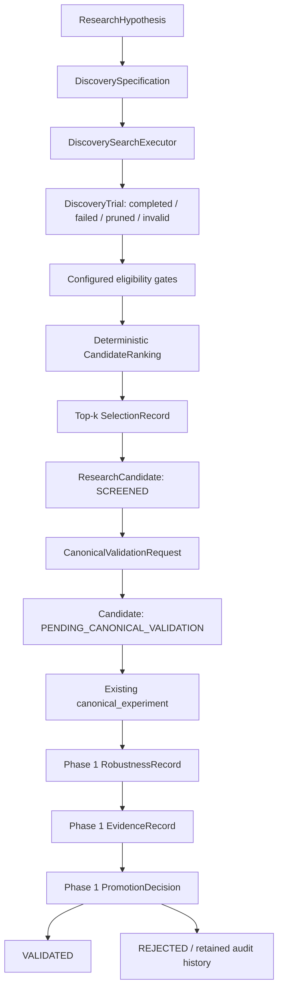

# Canonical Alpha Discovery — Phase 2

Κατάσταση: **implemented — Grid, Optuna, VectorBT και PyBroker executors**

Η Phase 2 προσθέτει ένα framework-owned, auditable discovery lifecycle πάνω
στα Phase 0/1 contracts. Δεν προσθέτει strategy, optimizer, backtest engine ή
external trading backend. Το discovery layer επιλέγει μόνο ποιο portable
candidate αξίζει να εισέλθει στο υπάρχον canonical validation boundary.

## Τελική ροή



Το discovery service σταματά υποχρεωτικά στο
`PENDING_CANONICAL_VALIDATION`. Το rank 1, ένα καλό Optuna objective ή ένα
ελκυστικό screening Sharpe δεν δημιουργούν `CanonicalValidationRecord` και δεν
μπορούν να παρακάμψουν robustness, final-evidence ή promotion gates.

## Hypothesis

Το `ResearchHypothesis` της Phase 1 παραμένει το portable preregistration
contract. Το append-only alpha-specific status/version history εξακολουθεί να
ανήκει στο `src.experiments.alpha_registry.HypothesisRegistry`. Η Phase 2 δεν
δημιουργεί δεύτερο alpha registry.

Πριν εκτελεστεί search, το hypothesis ID, το asset universe και το timeframe
πρέπει να συμφωνούν με το frozen discovery specification.

## Discovery specification

Το `DiscoverySpecification` συνθέτει μικρά explicit contracts αντί για ένα
γενικό AutoML schema. Καταγράφει:

- hypothesis ID, assets και timeframe,
- feature, target, model και signal families,
- search method και positive trial budget,
- library-independent `SearchSpace`,
- configured eligibility και selection policies,
- frozen config reference και canonical config hash,
- discovery dataset reference και SHA-256 fingerprint,
- explicit `development -> DISCOVERY` evidence reference,
- transaction-cost assumptions,
- random seed,
- canonical validation method.

Το `specification_hash` υπολογίζεται από το υπάρχον
`src.utils.run_metadata.compute_config_hash`. Δεν υπάρχει δεύτερος hash
algorithm. Ίδιο deterministic hash μπορεί να δηλωθεί ως intentional rerun μέσω
`duplicate_of_run_ids`: το rerun δεν εμποδίζεται, αλλά καταγράφεται.

Discovery specification με `VALIDATION`, `HISTORICAL_PSEUDO_OOS` ή
`PROSPECTIVE_FINAL` sample απορρίπτεται. Το discovery/ranking code δεν λαμβάνει
validation ή final data object.

## Search space

Τα `ParameterSpec` και `SearchSpace` είναι backend-neutral και strict. Υπάρχουν
τέσσερα kinds:

- `categorical`: explicit finite choices,
- `integer`: inclusive range, optional positive integer step, optional log
  scaling,
- `float`: finite range, optional positive step ή log scaling,
- `fixed`: ακριβώς μία JSON-compatible τιμή.

Duplicate names/values, invalid bounds, non-positive steps, non-finite values,
`log` με non-positive lower bound και `log + step` απορρίπτονται πριν από
search. Ένα deterministic grid απαιτεί finite categorical/fixed dimensions ή
explicit steps. Continuous/log ranges ανήκουν σε adaptive executors όπως το
υπάρχον Optuna implementation.

Το `path` είναι optional στο neutral contract, αλλά required από τον Optuna
adapter επειδή το υπάρχον optimizer μεταβάλλει canonical config paths.

## Candidate generator / search executor

Το research layer ορίζει το `DiscoverySearchExecutor` protocol. Σήμερα
υπάρχουν τέσσερις πραγματικές διαδρομές:

1. `GridCandidateGenerator`: deterministic lightweight grid για manual/smoke
   research. Καλεί injected evaluator και μετατρέπει exceptions σε auditable
   failed/invalid trials.
2. `ExistingOptunaSearchExecutor`: thin adapter στο
   `src.experiments.optuna_search.optimize_experiment`. Μετατρέπει το neutral
   search space στο υπάρχον `SearchDimension`, εκτελεί τον υφιστάμενο optimizer
   και μεταφράζει όλα τα Optuna states σε portable `DiscoveryTrial` records.
3. `VectorBTSearchExecutor`: optional batched adapter για μεγάλο finite,
   vectorizable, rule-based grid. Χρησιμοποιεί framework-produced signals,
   explicit next-open timing/cost mapping και μετατρέπει κάθε combination σε
   portable trial. Δεν εκτελεί canonical validation και δεν επιστρέφει native
   portfolio/trade objects.
4. `PyBrokerSearchExecutor`: optional adapter για finite supervised ML
   combinations. Χρησιμοποιεί framework-produced features/targets, STF-owned
   purged chronological folds, train-fold-only preprocessing/model fit και
   test-fold-only probabilities. Επιστρέφει portable OOS trials και δεν
   επιστρέφει fitted/native model objects.

Το Optuna adapter παραμένει στο `src/experiments`, επειδή το implementation
καλεί config-driven experiment orchestration. Το `src/research` δεν εισάγει
`src.experiments` ή Optuna internals. Το VectorBT adapter βρίσκεται στο
`src/research/backends/vectorbt`, αλλά φορτώνει την optional library lazy και
μόνο όταν επιλεγεί explicit.

Ο PyBroker adapter βρίσκεται αντίστοιχα στο
`src/research/backends/pybroker`, φορτώνει την optional dependency lazy και
κρατά PyBroker-native callbacks/objects μέσα στο adapter boundary. Τα OOS
results του παραμένουν `DISCOVERY`, επειδή χρησιμοποιούνται για model/feature/
threshold selection, και δεν χαρακτηρίζονται validation ή final evidence.

Δεν προστέθηκε δεύτερος optimizer. Διατηρούνται το σημερινό sampling, pruning,
config mutation, canonical runner invocation, objective constraints, selection
risk diagnostics και parameter-stability reporting του υπάρχοντος Optuna code.

## Trials και failed search breadth

Κάθε alternative γίνεται `DiscoveryTrial` με:

- stable trial ID και research-run ID,
- portable parameter mapping,
- `completed`, `failed`, `pruned` ή `invalid` status,
- finite metrics,
- structural checks,
- failure/pruning reason,
- artifact references,
- runtime metadata και seed.

Failed, pruned και invalid trials δεν διαγράφονται και δεν συμπτύσσονται σε
"best trial". Παραμένουν στο `trials.jsonl`, στα state counts και στο candidate
search provenance. Η Phase 1 `SearchMetadata.failed_trials` κρατά το aggregate
non-completed count για compatibility, ενώ τα Phase 2 artifacts διατηρούν τα
τρία statuses ξεχωριστά.

Completed trial με NaN ή infinity απορρίπτεται. Completed trial χωρίς το
selection metric παραμένει audit record αλλά είναι ineligible.

## Eligibility

Eligibility εφαρμόζεται πριν από ranking. Κανένα financial threshold δεν είναι
global ή implicit. Το `EligibilityPolicy` μπορεί να δηλώσει:

- minimum observations,
- minimum OOS rows,
- minimum trades/events,
- minimum coverage,
- maximum missing-data rate,
- arbitrary finite metric constraints με `lt`, `le`, `gt`, `ge`, `eq`,
- named required checks.

Οι non-negotiable structural checks `causal_features` και
`target_signal_compatible` απαιτούνται για κάθε completed trial. Model-driven
discovery απαιτεί επιπλέον `fold_safe_preprocessing` και `oos_predictions`.
Απουσία αυτών δεν μετατρέπεται σε optimistic default: ο trial αποκλείεται από
ranking.

Για trading-basis selection απαιτούνται explicit cost assumptions. Gross και
net results δεν συγκρίνονται μέσα στο ίδιο discovery run, επειδή κάθε run έχει
ένα frozen cost/sample/timeframe/asset context. Αποτελέσματα από διαφορετικό
context χρειάζονται ξεχωριστό specification/run και δεν συγχωνεύονται
σιωπηλά σε ένα ranking.

## Ranking και selection

Το `CandidateRanking` αποθηκεύει:

- selection metric και direction,
- deterministic rank,
- configured secondary metric tie-breakers,
- τελικό `trial_id` ascending tie-break,
- total/completed/eligible counts,
- κάθε ineligible entry και όλους τους rejection reasons,
- aggregated rejection counts.

Υποστηρίζονται `maximize` και `minimize`. Τα missing secondary metrics μπαίνουν
μετά από trials που έχουν διαθέσιμη συγκρίσιμη τιμή. Το selection είναι
configured top-k, όχι hardcoded winner-takes-all.

Το `SelectionRecord` της Phase 1 παραμένει authoritative για τη μετατροπή
screening result σε candidate. Μόνο selected trials γίνονται
`ResearchCandidate`. Οι υπόλοιποι trials παραμένουν στο rejection/search
archive χωρίς να δημιουργούν ανταγωνιστικό candidate registry.

## Search breadth και multiple testing

Το καλύτερο αποτέλεσμα από 5 trials δεν έχει την ίδια evidential βαρύτητα με
το καλύτερο αποτέλεσμα από 50.000 trials. Όσο αυξάνονται οι alternatives,
αυξάνεται η πιθανότητα ο winner να είναι προϊόν selection noise, ακόμα και αν
κάθε individual metric υπολογίστηκε σωστά.

Για αυτό κάθε selected candidate κρατά:

- requested budget,
- total emitted trials,
- completed/failed/pruned/invalid counts,
- eligible count,
- rank, metric, direction και tie-break rule,
- parameter dimensions και selected parameter values,
- search method και random seed.

Η Phase 2 δεν επιβάλλει ακόμη formal multiple-testing correction. Τα metadata
είναι επαρκή ώστε μελλοντικές phases να προσθέσουν, με explicit policy:

- Deflated Sharpe Ratio,
- Probability of Backtest Overfitting,
- White's Reality Check,
- SPA-type tests,
- False Discovery Rate controls.

Το υπάρχον Optuna report συνεχίζει να παρέχει conservative selection-gap proxy
και parameter-stability diagnostics, αλλά αυτά δεν παρουσιάζονται ως formal
Deflated Sharpe ή final evidence.

## Candidate provenance

Το deterministic candidate ID βασίζεται στο frozen discovery specification
hash και στις trial parameters, όχι σε mutable metrics. Έτσι ένα intentional
rerun μπορεί να αναγνωρίσει την ίδια candidate identity.

Ο linked candidate και ο `ResearchRun` διατηρούν:

- hypothesis, research run, trial και selection IDs,
- search specification hash,
- config reference/hash,
- discovery dataset reference/fingerprint,
- asset/timeframe,
- cost assumptions,
- git revision, random seed και runtime provenance,
- trial artifacts και complete search breadth.

Backend-native objects, fitted estimators, Optuna trials/studies και external
portfolio objects δεν επιτρέπονται στα records.

## Canonical validation

Το `prepare_canonical_validation` δημιουργεί δύο outputs:

1. νέο immutable candidate snapshot σε
   `PENDING_CANONICAL_VALIDATION`,
2. `CanonicalValidationRequest` προς το stable
   `canonical_experiment` entrypoint.

Το request απαιτεί stage `validation` και role `VALIDATION`, αλλά σκόπιμα δεν
περιέχει validation dataset ή data-access object. Το experiment orchestration
πρέπει να επιλύσει role-bound validation data μετά το candidate freeze και να
παράγει το Phase 1 `CanonicalValidationRecord` με chronological OOS coverage,
timing, costs και artifacts.

Δεν υπάρχει transition `PENDING_CANONICAL_VALIDATION -> VALIDATED`. Το Phase 1
lifecycle απαιτεί canonical PASS, configured robustness και optional genuinely
prospective final evidence πριν από promotion.

## Robustness

Η Phase 2 επαναχρησιμοποιεί `RobustnessRecord` / `RobustnessCheck` για:

- configured cost/spread/slippage multipliers,
- entry-delay stress,
- subperiod stability,
- regime-level results,
- asset-level results,
- bootstrap/other declared diagnostics.

Δεν δημιουργήθηκε δεύτερο robustness engine ούτε hardcoded x2/x3 policy.

Για parameter neighborhoods υπάρχει το portable
`ParameterNeighborhoodStability`. Η απλή implementation αξιολογεί ήδη
observed trials που διαφέρουν μόνο σε μία parameter dimension και εφαρμόζει
configured absolute maximum degradation. Δεν ξεκινά νέο optimization και δεν
βαφτίζει την απουσία neighbors ως PASS· επιστρέφει `NOT_RUN`.

## Evidence και promotion

Τα Phase 1 contracts παραμένουν authoritative:

- `CanonicalValidationRecord`,
- `RobustnessRecord`,
- `EvidenceRecord`,
- `MinimumEvidencePolicy`,
- `PromotionDecision`,
- `FilesystemResearchStore`.

`HISTORICAL_PSEUDO_OOS` παραμένει diagnostics-only. Final evidence απαιτεί
`PROSPECTIVE_FINAL`, `used_for_tuning=False`, matching frozen specification hash
και καμία material αλλαγή μετά την αξιολόγηση. Rejection/retirement είναι
append-only ιστορία, όχι διαγραφή.

## Persistence και artifacts

Το `DiscoveryArtifactWriter` γράφει create-once artifacts κάτω από
caller-provided run root:

```text
discovery_spec.json
trials.jsonl
ranking.json
selected_candidates.json
canonical_validation_requests.json
parameter_neighborhood.json
discovery_summary.json
discovery_report.md
```

Το JSON είναι strict, deterministic και `allow_nan=False`. Existing artifacts
δεν γίνονται overwrite. Το `FilesystemResearchStore` εξακολουθεί να
αποθηκεύει run, selection και pending candidate records· δεν προστέθηκε database
ή δεύτερο global artifact root.

## Existing code disposition

| Existing mechanism | Phase 2 απόφαση |
|---|---|
| Phase 1 research/evidence/lifecycle/store | **REUSE** ως authoritative contracts |
| `src.experiments.optuna_search` | **WRAP** με thin executor· δεν ξαναγράφεται optimizer |
| `src.experiments.alpha_registry` | **REUSE / LEAVE AS AUTHORITY** |
| AR-0001 approval-gated discovery pipeline | **LEAVE AS COMPATIBILITY**· δεν αλλάζει approval/data access |
| `fresh_alpha_discovery.py` | **DEPRECATE LATER** μετά από parity extraction, όχι Phase 2 rewrite |
| `tsfresh_extrema_feature_discovery.py` | **LEAVE AS COMPATIBILITY**· fold-safe optional workflow |
| Trial0041 / locked confirmation workflows | **LEAVE AS COMPATIBILITY**· inspected history δεν relabel γίνεται final |
| Strategy-specific ETHUSD grids/atlases | **LEAVE AS COMPATIBILITY** μέχρι explicit parity migration |

Δεν μετακινήθηκε support module και δεν άλλαξε υπάρχον artifact path ή trading
calculation.

## Dependencies και non-goals

Η Phase 2 δεν εισάγει external backends στα domain contracts. Η Phase 3A
προσθέτει μόνο το bounded optional VectorBT manifest και τον adapter boundary·
δεν προσθέτει στα domain contracts:

- PyBroker,
- Qlib,
- skfolio,
- NautilusTrader,
- ML4T runtime dependency.

Δεν άλλαξαν feature calculations, target semantics, model training, signal
timing, portfolio/risk rules, transaction costs, execution fills, runtime
defaults, live safety, YAML loader ή το stable CLI. Δεν προστέθηκε fake sample
YAML επειδή η Phase 2 API είναι programmatic και δεν εγκρίθηκε νέο public YAML
schema.

## Phase 3A και deferred συνέχεια

- VectorBT screening adapter με timing/cost parity: **implemented**, με την
  πλήρη σύμβαση στο [VectorBT Research Backend](vectorbt_backend.md).
- PyBroker walk-forward adapter με explicit OOS masks/fold provenance.
- Written Qlib reference-only versus runtime-adapter decision.
- Formal multiple-testing/PBO/Reality-Check policies.
- Approved, parity-tested migration συγκεκριμένων legacy support workflows.
- Concrete canonical-validation result mapper για κάθε candidate config family.

Οι adapters θα επιστρέφουν τα ίδια `DiscoveryTrial`, `SelectionRecord` και
`ResearchCandidate` contracts χωρίς redesign του lifecycle.
