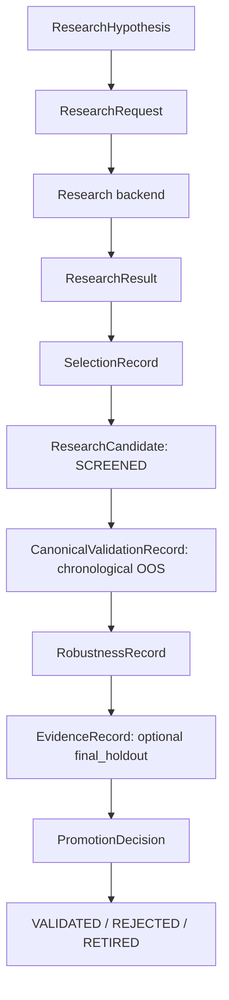

# Research & Evidence Layer

Κατάσταση: **Phase 1 implementation**

Η research layer είναι το όριο ανάμεσα στην exploratory αναζήτηση και στην
canonical απόδειξη. Ένα γρήγορο backend μπορεί να μετρήσει χιλιάδες
εναλλακτικές και να προτείνει candidates· δεν μπορεί όμως να τους χαρακτηρίσει
validated, robust ή production-ready. Αυτές οι καταστάσεις προκύπτουν μόνο από
framework-owned records και guarded transitions.

## Canonical lifecycle



Η ακολουθία είναι:

```text
HYPOTHESIS -> RESEARCH RUN -> SCREENED -> CANDIDATE
-> CANONICAL VALIDATION -> ROBUSTNESS -> FINAL HOLDOUT
-> PROMOTION DECISION
```

Το `ResearchResult` είναι screening output. Η μετατροπή του σε linked candidate
γίνεται αποκλειστικά από το `candidate_from_research_result`, μαζί με
`ResearchRun` και `SelectionRecord`. Έτσι δεν χάνεται το πλήθος των δοκιμών, το
ranking metric, η θέση του candidate ή ο tie-break rule.

## Contracts και ownership

### ResearchHypothesis

Καταγράφει πριν από την επιθεώρηση αποτελεσμάτων:

- stable `hypothesis_id`, όνομα και οικονομική/στατιστική thesis,
- asset universe και timeframe,
- προαιρετικά feature/target/signal families, expected mechanism και tags,
- timezone-aware `created_at`.

Δεν αντικαθιστά το `src.experiments.alpha_registry.HypothesisRegistry`. Το
registry παραμένει ο append-only owner των alpha-specific versions, frozen spec
hashes, snapshot IDs, evidence roles και status history. Το
`ResearchHypothesis` είναι η portable definition που αναφέρεται από ένα run.

### ResearchRun και SearchMetadata

Το `ResearchRun` συνδέει hypothesis, request, backend/version, frozen config
hash, dataset reference/fingerprint, immutable evidence role, timestamps,
artifacts, runtime provenance και candidate IDs.

Το `SearchMetadata` καταγράφει ουδέτερα:

- manual/grid/random/optimizer search method,
- requested, completed και failed trials,
- evaluated alternatives και emitted candidates,
- parameter dimensions,
- selection metric/direction,
- random seed και optional study name.

Δεν περιέχει Optuna, VectorBT ή άλλο backend-native type. Ένα pre-specified test
και ένα search 20.000 trials διατηρούν διαφορετικό evidential context, ακόμη κι
αν εμφανίζουν το ίδιο metric.

### ResearchCandidate και SelectionRecord

Ο candidate περιέχει portable metrics, cost assumptions, config/sample
references και links προς hypothesis/run/selection. Τα metrics μπορούν να είναι
IC, rank IC, AUC, PR-AUC, log loss, forecast error, Sharpe, drawdown, profit
factor ή turnover, αλλά πρέπει να είναι finite. Θετικός αριθμός δεν αλλάζει
αυτόματα status.

Το `SelectionRecord` κρατά `evaluated_alternatives`, metric, direction, rank και
tie-break. Δεν αποθηκεύουμε απλώς `best_sharpe`, γιατί αυτό αποκρύπτει selection
breadth και leaderboard bias.

### EvidenceRecord

Συνδέει candidate, immutable `EvidenceReference`, sample/artifacts, metrics,
cost assumptions, timing assumptions, validation checks και frozen
specification hash. Τα stages επαναχρησιμοποιούν ακριβώς το Phase 0 mapping:

| Research stage | Canonical evidence role |
|---|---|
| `development` | `DISCOVERY` |
| `validation` | `VALIDATION` |
| `final_holdout` | `PROSPECTIVE_FINAL` |

Το `HISTORICAL_PSEUDO_OOS` δεν έχει mapping σε `final_holdout` και η κατασκευή
τέτοιου reference αποτυγχάνει.

### CanonicalValidationRecord

Αποθηκεύει το αποτέλεσμα replay από το canonical framework, χωρίς να
ξαναγράφει backtest engine:

- candidate/config/specification hashes και dataset fingerprint,
- OOS rows, prediction rows, exact coverage και OOS marker,
- explicit costs και timing/fill assumptions,
- finite metrics, tests, artifacts, PASS/FAIL/NOT_RUN και failure reasons.

Ένα PASS απαιτεί πραγματικές OOS predictions, metrics, cost assumptions και
timing assumptions. Το contract δεν επιβάλλει κρυφό Sharpe ή drawdown cutoff.

### RobustnessRecord

Αποτελείται από named `RobustnessCheck` values. Κάθε check έχει status
`pass`, `fail`, `warning` ή `not_run`, optional baseline/stressed metric,
configuration-driven threshold, details και artifacts. Το schema μπορεί να
καταγράψει cost/spread/slippage stress, entry delay, parameter perturbation,
subperiod/regime/asset stability και bootstrap χωρίς να υλοποιεί τα tests στο
Phase 1.

### MinimumEvidencePolicy και PromotionDecision

Το `MinimumEvidencePolicy` ορίζει completeness:

- αν απαιτείται robustness,
- ποια named robustness checks πρέπει να έχουν PASS,
- αν απαιτείται prospective final holdout.

Δεν περιέχει global financial thresholds. Τα metric gates, όταν προστεθούν,
πρέπει να έρχονται από approved configuration.

Το `PromotionDecision` καταγράφει `promote`, `reject`, `hold` ή `retire`,
from/to status, reason, evidence IDs, timestamp και optional `decided_by`. Το
rejection είναι first-class result: ένας candidate δεν διαγράφεται επειδή είχε
cost sensitivity, χαμηλή OOS coverage, unstable neighborhood, calibration/data
quality failure ή holdout failure.

## Guarded lifecycle

Οι structural transitions είναι explicit. Για παράδειγμα, δεν υπάρχει
`SCREENED -> VALIDATED`. Η βασική διαδρομή είναι:

```text
SCREENED
  -> PENDING_CANONICAL_VALIDATION
  -> CANONICALLY_VALIDATED
  -> ROBUSTNESS_PENDING
  -> ROBUSTNESS_PASSED
  -> FINAL_HOLDOUT_PENDING        (όταν απαιτείται)
  -> FINAL_HOLDOUT_PASSED
  -> VALIDATED
```

Κάθε evidence-gated transition ελέγχει τον ίδιο `candidate_id` και το τρέχον
specification hash. Η μετάβαση σε `VALIDATED` απαιτεί canonical PASS,
policy-required robustness PASS και, όπου ζητείται, usable final evidence.
`REJECTED` και `VALIDATED` μπορούν αργότερα να γίνουν `RETIRED`, αλλά η ιστορία
δεν διαγράφεται. Το παλιό Phase 0 serialized status `promoted` διαβάζεται μόνο
για compatibility· η νέα lifecycle εκπέμπει `validated`.

## Final-holdout discipline

Final evidence είναι usable μόνο όταν ισχύουν όλα:

1. το stage είναι `final_holdout`, άρα ο role είναι υποχρεωτικά
   `PROSPECTIVE_FINAL`,
2. `used_for_tuning=False`,
3. το evidence `specification_hash` είναι ίδιο με το current frozen hash,
4. δεν έχει γίνει material specification change μετά την αξιολόγηση.

Αλλαγή feature/window/target/threshold/hyperparameter/strategy rule/cost ή
execution semantic μετά την επιθεώρηση final αποτελεσμάτων καταναλώνει το
sample. Το συγκεκριμένο history δεν ξαναβαφτίζεται untouched final evidence·
χρειάζεται νέο freeze και νέα prospective clock/sample. Τα alpha-specific
`MaterialSpecificationChange` και `prospective_clock_must_restart` παραμένουν
στο `src.experiments.alpha_contracts`; η generic research layer εφαρμόζει το
ίδιο fail-closed αποτέλεσμα χωρίς forbidden `research -> experiments`
dependency.

## Persistence και audit trail

Το `FilesystemResearchStore` γράφει deterministic, strict JSON κάτω από
caller-provided artifact root:

```text
research_records/
  candidates/
  runs/
  selections/
  evidence/
  validations/
  robustness/
  decisions/
```

Δεν επιλέγει νέο global artifact root και δεν αλλάζει το canonical runner. Ο
caller μπορεί να το τοποθετήσει μέσα στο υπάρχον immutable run/artifact layout.
Κάθε ID αντιστοιχεί σε ένα create-once JSON file· overwrite απορρίπτεται.
Candidate identity γράφεται μία φορά και το current status ανακατασκευάζεται
από ordered immutable decisions. Έτσι rejected candidates και reasons
παραμένουν auditable χωρίς database, service, pickle ή event-sourcing
framework. Πριν αποθηκεύσει advanced promotion decision, το store επαναφορτώνει
τα candidate-linked validation/robustness/final records και εφαρμόζει το ίδιο
evidence-gated lifecycle· structural decision sequence χωρίς evidence δεν
αρκεί. Τα φορτωμένα envelopes ελέγχονται για schema version, record type,
ID/filename agreement και canonical deterministic JSON.

Το store δεν αντικαθιστά το `HypothesisRegistry`: αποθηκεύει candidate-side
portable records, ενώ το alpha registry διατηρεί το alpha hypothesis lifecycle.

## Future backend mappings

```text
VectorBT -> vectorized screening ResearchResult
PyBroker -> ML walk-forward ResearchResult με OOS provenance
Qlib     -> dataset/workflow ResearchResult
                |
                v
       candidate_from_research_result
                |
                v
          ResearchCandidate
                |
                v
 framework-owned canonical validation / costs / timing / robustness
```

Τα future adapters θα είναι optional και lazy. Native portfolios, strategies,
recorders, estimators ή dataset handlers δεν επιτρέπεται να περάσουν στα
contracts.

## Conceptual example

```text
Hypothesis:
  Trend continuation after volatility contraction

Vectorized screening:
  1.200 parameter combinations, rank by a declared metric

SelectionRecord:
  rank 1, explicit metric/direction/tie-break

Candidate:
  EMA20/EMA100 + ATR filter (portable config/sample references only)

Canonical validation:
  purged chronological walk-forward, OOS coverage, next-bar timing, costs

Robustness:
  cost x2, entry delay +1, parameter neighborhood

Prospective final holdout, if policy requires it

PromotionDecision:
  promote or reject with evidence IDs and reason
```

Το παράδειγμα είναι lifecycle illustration και δεν προσθέτει strategy, signal
ή financial threshold στο framework.
