# Experiment Report: btcusd_1h_shock_meta_xgboost_long_only

## Overview
- Config path: `/workspace/config/experiments/btcusd_1h_shock_meta_xgboost_long_only.yaml`
- Model kind: `xgboost_clf`
- Symbols: `BTCUSD`
- Data source: `dukascopy_csv` at interval `1h`
- Data window: `2017-05-07 23:00:00` to `2024-12-31 13:00:00`
- Rows / columns: `58186` rows, `52` columns
- Target: `triple_barrier` horizon `n/a`
- Feature count: `12`
- Runtime seed: `7`

## Pipeline Trace

### 1. Entry Point
- `runner.run_experiment` -> `src.experiments.runner.run_experiment(config_path: 'str | Path') -> 'ExperimentResult'`
- `runner._load_asset_frames` -> `src.experiments.runner._load_asset_frames(data_cfg: 'dict[str, object]')`
- `pipeline.run_experiment_pipeline` -> `src.experiments.orchestration.pipeline.run_experiment_pipeline(config_path: 'str | Path', *, load_asset_frames_fn: 'LoadAssetFramesFn', save_processed_snapshot_fn: 'SaveProcessedFn') -> 'ExperimentResult'`

```yaml
config_path: /workspace/config/experiments/btcusd_1h_shock_meta_xgboost_long_only.yaml
runtime:
  seed: 7
  repro_mode: strict
  deterministic: true
  threads: 1
  seed_torch: false
```

### 2. Data Load And PIT
- `data_stage.load_asset_frames` -> `src.experiments.orchestration.data_stage.load_asset_frames(data_cfg: 'dict[str, Any]', *, load_ohlcv_fn: 'SingleAssetLoader', load_ohlcv_panel_fn: 'PanelLoader', apply_pit_hardening_fn: 'PitFn', validate_ohlcv_fn: 'ValidateFrameFn', validate_data_contract_fn: 'ValidateFrameFn') -> 'tuple[dict[str, pd.DataFrame], dict[str, Any]]'`
- `src_data.loaders.load_ohlcv` -> `src.src_data.loaders.load_ohlcv(symbol: 'str', start: 'str | None' = None, end: 'str | None' = None, interval: 'str' = '1d', source: "Literal['yahoo', 'alpha', 'twelve_data', 'twelve', 'dukascopy_csv']" = 'yahoo', api_key: 'Optional[str]' = None) -> 'pd.DataFrame'`
- `src_data.loaders.load_ohlcv_panel` -> `src.src_data.loaders.load_ohlcv_panel(symbols: 'Sequence[str]', start: 'str | None' = None, end: 'str | None' = None, interval: 'str' = '1d', source: "Literal['yahoo', 'alpha', 'twelve_data', 'twelve', 'dukascopy_csv']" = 'yahoo', api_key: 'Optional[str]' = None) -> 'dict[str, pd.DataFrame]'`
- `src_data.pit.apply_pit_hardening` -> `src.src_data.pit.apply_pit_hardening(df: 'pd.DataFrame', *, pit_cfg: 'Mapping[str, Any] | None' = None, symbol: 'str | None' = None) -> 'tuple[pd.DataFrame, dict[str, Any]]'`
- `src_data.validation.validate_ohlcv` -> `src.src_data.validation.validate_ohlcv(df: 'pd.DataFrame', required_columns: 'Iterable[str]' = ('open', 'high', 'low', 'close', 'volume'), allow_missing_volume: 'bool' = True) -> 'None'`
- `experiments.contracts.validate_data_contract` -> `src.experiments.contracts.validate_data_contract(df: 'pd.DataFrame', contract: 'DataContract | None' = None) -> 'dict[str, int]'`
- `schemas.StorageContext` -> `src.experiments.schemas.StorageContext(symbols: 'list[str]', source: 'str | None', interval: 'str | None', start: 'str | None', end: 'str | None', pit: 'dict[str, Any]' = <factory>, pit_hash_sha256: 'str | None' = None) -> None`  
  Context object persisted into snapshot metadata.
- `data_stage.save_processed_snapshot_if_enabled` -> `src.experiments.orchestration.data_stage.save_processed_snapshot_if_enabled(asset_frames: 'dict[str, pd.DataFrame]', *, data_cfg: 'dict[str, Any]', config_hash_sha256: 'str', feature_steps: 'list[dict[str, Any]]') -> 'dict[str, Any] | None'`

```yaml
data:
  source: dukascopy_csv
  interval: 1h
  start: '2017-05-07 23:00:00'
  end: '2024-12-31 14:00:00'
  alignment: inner
  symbol: BTCUSD
  symbols: null
  api_key: null
  api_key_env: null
  pit:
    timestamp_alignment:
      source_timezone: UTC
      output_timezone: UTC
      normalize_daily: false
      duplicate_policy: last
    corporate_actions:
      policy: none
      adj_close_col: adj_close
    universe_snapshot:
      inactive_policy: raise
  storage:
    mode: cached_only
    dataset_id: btcusd_1h_shock_meta_xgboost_long_only
    save_raw: false
    save_processed: true
    load_path: /workspace/data/raw/dukas_copy_bank/btcusd_h1.csv
    raw_dir: /workspace/data/raw
    processed_dir: /workspace/data/processed
```

### 3. Feature Engineering
- `feature_stage.apply_steps_to_assets` -> `src.experiments.orchestration.feature_stage.apply_steps_to_assets(asset_frames: 'dict[str, pd.DataFrame]', *, feature_steps: 'list[dict[str, Any]]') -> 'dict[str, pd.DataFrame]'`
- `feature_stage.apply_feature_steps` -> `src.experiments.orchestration.feature_stage.apply_feature_steps(df: 'pd.DataFrame', steps: 'list[dict[str, Any]]') -> 'pd.DataFrame'`
- `feature[returns]` -> `src.features.returns.add_close_returns(df: 'pd.DataFrame', log: 'bool' = False, col_name: 'str | None' = None) -> 'pd.DataFrame'`  
  params={'log': True, 'col_name': 'close_logret'}
- `feature[trend]` -> `src.features.technical.trend.add_trend_features(df: 'pd.DataFrame', price_col: 'str' = 'close', sma_windows: 'Sequence[int]' = (20, 50, 200), ema_spans: 'Sequence[int]' = (20, 50), inplace: 'bool' = False) -> 'pd.DataFrame'`  
  params={'price_col': 'close', 'sma_windows': [], 'ema_spans': [24]}
- `feature[regime_context]` -> `src.features.regime_context.add_regime_context_features(df: 'pd.DataFrame', *, price_col: 'str' = 'close', returns_col: 'str' = 'close_ret', vol_short_window: 'int' = 24, vol_long_window: 'int' = 168, trend_fast_span: 'int' = 24, trend_slow_span: 'int' = 72, vol_ratio_high_threshold: 'float' = 1.25, vol_ratio_low_threshold: 'float' = 0.85) -> 'pd.DataFrame'`  
  params={'price_col': 'close', 'returns_col': 'close_logret', 'vol_short_window': 24, 'vol_long_window': 168, 'trend_fast_span': 24, 'trend_slow_span': 72, 'vol_ratio_high_threshold': 1.35, 'vol_ratio_low_threshold': 0.8}
- `feature[bollinger]` -> `src.features.technical.bollinger.add_bollinger_features(df: 'pd.DataFrame', price_col: 'str' = 'close', window: 'int' = 20, n_std: 'float' = 2.0, inplace: 'bool' = False) -> 'pd.DataFrame'`  
  params={'price_col': 'close', 'window': 24, 'n_std': 2.0}
- `feature[atr]` -> `src.features.technical.atr.add_atr_features(df: 'pd.DataFrame', high_col: 'str' = 'high', low_col: 'str' = 'low', close_col: 'str' = 'close', window: 'int' = 14, method: 'str' = 'wilder', add_over_price: 'bool' = True, inplace: 'bool' = False) -> 'pd.DataFrame'`  
  params={'high_col': 'high', 'low_col': 'low', 'close_col': 'close', 'window': 24, 'method': 'wilder', 'add_over_price': True}
- `feature[shock_context]` -> `src.features.shock_context.add_shock_context_features(df: 'pd.DataFrame', *, price_col: 'str' = 'close', high_col: 'str' = 'high', low_col: 'str' = 'low', returns_col: 'str' = 'close_logret', ema_col: 'str | None' = None, ema_window: 'int' = 24, atr_col: 'str | None' = None, atr_window: 'int' = 24, short_horizon: 'int' = 1, medium_horizon: 'int' = 4, vol_window: 'int' = 24, ret_z_threshold: 'float' = 2.0, atr_mult_threshold: 'float' = 1.5, distance_from_mean_threshold: 'float' = 1.0, post_shock_active_bars: 'int' = 1, use_log_returns: 'bool' = True, inplace: 'bool' = False) -> 'pd.DataFrame'`  
  params={'price_col': 'close', 'high_col': 'high', 'low_col': 'low', 'returns_col': 'close_logret', 'ema_col': 'close_ema_24', 'atr_col': 'atr_24', 'short_horizon': 1, 'medium_horizon': 4, 'vol_window': 24, 'ret_z_threshold': 2.5, 'atr_mult_threshold': 1.75, 'distance_from_mean_threshold': 1.1, 'post_shock_active_bars': 5}
- `feature[rsi]` -> `src.features.technical.rsi.add_rsi_features(df: 'pd.DataFrame', price_col: 'str' = 'close', windows: 'Sequence[int]' = (14,), method: 'str' = 'wilder', inplace: 'bool' = False) -> 'pd.DataFrame'`  
  params={'price_col': 'close', 'windows': [2, 14], 'method': 'wilder'}
- `feature[lags]` -> `src.features.lags.add_lagged_features(df: 'pd.DataFrame', cols: 'Iterable[str]', lags: 'Sequence[int]' = (1, 2, 5), prefix: 'str' = 'lag') -> 'pd.DataFrame'`  
  params={'cols': ['close_logret'], 'lags': [1]}

```yaml
features:
- step: returns
  params:
    log: true
    col_name: close_logret
  enabled: true
- step: trend
  params:
    price_col: close
    sma_windows: []
    ema_spans:
    - 24
  enabled: true
- step: regime_context
  params:
    price_col: close
    returns_col: close_logret
    vol_short_window: 24
    vol_long_window: 168
    trend_fast_span: 24
    trend_slow_span: 72
    vol_ratio_high_threshold: 1.35
    vol_ratio_low_threshold: 0.8
  enabled: true
- step: bollinger
  params:
    price_col: close
    window: 24
    n_std: 2.0
  enabled: true
- step: atr
  params:
    high_col: high
    low_col: low
    close_col: close
    window: 24
    method: wilder
    add_over_price: true
  enabled: true
- step: shock_context
  params:
    price_col: close
    high_col: high
    low_col: low
    returns_col: close_logret
    ema_col: close_ema_24
    atr_col: atr_24
    short_horizon: 1
    medium_horizon: 4
    vol_window: 24
    ret_z_threshold: 2.5
    atr_mult_threshold: 1.75
    distance_from_mean_threshold: 1.1
    post_shock_active_bars: 5
  enabled: true
- step: rsi
  params:
    price_col: close
    windows:
    - 2
    - 14
    method: wilder
  enabled: true
- step: lags
  params:
    cols:
    - close_logret
    lags:
    - 1
  enabled: true
resolved_feature_columns:
- shock_ret_z_1h
- shock_ret_z_4h
- shock_atr_multiple_1h
- shock_atr_multiple_4h
- shock_distance_ema
- shock_strength
- regime_vol_ratio_24_168
- regime_absret_z_24_168
- bb_percent_b_24_2.0
- close_rsi_2
- close_rsi_14
- lag_close_logret_1
```

### 4. Model And Training
- `model_stage.apply_model_pipeline_to_assets` -> `src.experiments.orchestration.model_stage.apply_model_pipeline_to_assets(asset_frames: 'dict[str, pd.DataFrame]', *, model_cfg: 'dict[str, Any] | None', model_stages: 'list[dict[str, Any]] | None', returns_col: 'str | None') -> 'tuple[dict[str, pd.DataFrame], object | dict[str, object] | None, dict[str, Any]]'`
- `model_stage.apply_model_to_assets` -> `src.experiments.orchestration.model_stage.apply_model_to_assets(asset_frames: 'dict[str, pd.DataFrame]', *, model_cfg: 'dict[str, Any]', returns_col: 'str | None') -> 'tuple[dict[str, pd.DataFrame], object | dict[str, object] | None, dict[str, Any]]'`
- `feature_stage.apply_model_step` -> `src.experiments.orchestration.model_stage.apply_model_step(df: 'pd.DataFrame', model_cfg: 'dict[str, Any]', returns_col: 'str | None') -> 'tuple[pd.DataFrame, object | None, dict[str, Any]]'`
- `model[xgboost_clf]` -> `src.models.classification.train_xgboost_classifier(df: 'pd.DataFrame', model_cfg: 'dict[str, Any]', returns_col: 'str | None' = None) -> 'tuple[pd.DataFrame, object, dict[str, Any]]'`
- `modeling.runtime.resolve_runtime_for_model` -> `src.models.runtime.resolve_runtime_for_model(model_cfg: 'dict[str, Any]', model_params: 'dict[str, Any]', *, estimator_family: 'str') -> 'dict[str, Any]'`

```yaml
model:
  kind: xgboost_clf
  params:
    n_estimators: 350
    learning_rate: 0.03
    num_leaves: null
    max_depth: 4
    subsample: 0.9
    colsample_bytree: 0.9
    min_child_samples: null
    random_state: 7
    min_child_weight: 5.0
    reg_lambda: 1.0
    objective: binary:logistic
    eval_metric: logloss
    tree_method: hist
  preprocessing:
    scaler: none
  feature_cols:
  - shock_ret_z_1h
  - shock_ret_z_4h
  - shock_atr_multiple_1h
  - shock_atr_multiple_4h
  - shock_distance_ema
  - shock_strength
  - regime_vol_ratio_24_168
  - regime_absret_z_24_168
  - bb_percent_b_24_2.0
  - close_rsi_2
  - close_rsi_14
  - lag_close_logret_1
  target:
    kind: triple_barrier
    price_col: close
    open_col: open
    high_col: high
    low_col: low
    returns_col: close_logret
    max_holding: 24
    upper_mult: 1.5
    lower_mult: 1.5
    vol_window: 24
    neutral_label: drop
    side_col: shock_side_contrarian
    candidate_col: shock_down_candidate
    candidate_out_col: meta_candidate
  split:
    method: walk_forward
    train_size: 8760
    test_size: 336
    step_size: 336
    expanding: true
    max_folds: null
  runtime: {}
  env: {}
  use_features: true
  pred_prob_col: null
  pred_ret_col: null
  returns_input_col: null
  signal_col: null
  action_col: null
model_stages: []
resolved_reward_config:
  cost_per_turnover: 0.0005
  slippage_per_turnover: 0.00015
  inventory_penalty: 0.0
  drawdown_penalty: 0.0
  switching_penalty: 0.0
resolved_execution_config:
  backtest_min_holding_bars: 3
  min_holding_bars: 0
  action_hysteresis: 0.0
  dd_guard_enabled: true
  max_drawdown: 0.12
  cooloff_bars: 48
  rearm_drawdown: 0.08
```

### 5. Signal Stage
- `feature_stage.apply_signals_to_assets` -> `src.experiments.orchestration.feature_stage.apply_signals_to_assets(asset_frames: 'dict[str, pd.DataFrame]', *, signals_cfg: 'dict[str, Any]') -> 'dict[str, pd.DataFrame]'`
- `feature_stage.apply_signal_step` -> `src.experiments.orchestration.feature_stage.apply_signal_step(df: 'pd.DataFrame', signals_cfg: 'dict[str, Any]') -> 'pd.DataFrame'`
- `signal[probability_threshold]` -> `src.signals.probabilistic_signal.probabilistic_signal(df: 'pd.DataFrame', prob_col: 'str', signal_col: 'str | None' = None, upper: 'float' = 0.55, lower: 'float' = 0.45, upper_exit: 'float | None' = None, lower_exit: 'float | None' = None, mode: 'str' = 'long_short_hold', base_signal_col: 'str | None' = None) -> 'pd.Series'`  
  params={'prob_col': 'pred_prob', 'signal_col': 'signal_prob_threshold', 'base_signal_col': 'shock_side_contrarian_active', 'upper': 0.555, 'upper_exit': 0.49, 'lower': 0.43, 'lower_exit': 0.48, 'mode': 'long_only'}

```yaml
signals:
  kind: probability_threshold
  params:
    prob_col: pred_prob
    signal_col: signal_prob_threshold
    base_signal_col: shock_side_contrarian_active
    upper: 0.555
    upper_exit: 0.49
    lower: 0.43
    lower_exit: 0.48
    mode: long_only
```

### 6. Backtest
- `backtest_stage.run_single_asset_backtest` -> `src.experiments.orchestration.backtest_stage.run_single_asset_backtest(asset: 'str', df: 'pd.DataFrame', *, cfg: 'dict[str, Any]', model_meta: 'dict[str, Any]') -> 'BacktestResult'`
- `backtesting.engine.run_backtest` -> `src.backtesting.engine.run_backtest(df: 'pd.DataFrame', signal_col: 'str', returns_col: 'str', returns_type: "Literal['simple', 'log']" = 'simple', missing_return_policy: 'str' = 'raise_if_exposed', cost_per_unit_turnover: 'float' = 0.0, slippage_per_unit_turnover: 'float' = 0.0, target_vol: 'Optional[float]' = None, vol_col: 'Optional[str]' = None, max_leverage: 'float' = 3.0, dd_guard: 'bool' = True, max_drawdown: 'float' = 0.2, cooloff_bars: 'int' = 20, rearm_drawdown: 'Optional[float]' = None, periods_per_year: 'int' = 252, min_holding_bars: 'int' = 0) -> 'BacktestResult'`
- `backtesting.engine.BacktestResult` -> `src.backtesting.engine.BacktestResult(equity_curve: 'pd.Series', returns: 'pd.Series', gross_returns: 'pd.Series', costs: 'pd.Series', positions: 'pd.Series', turnover: 'pd.Series', summary: 'dict') -> None`

```yaml
backtest:
  returns_col: close_logret
  signal_col: signal_prob_threshold
  periods_per_year: 8760
  returns_type: log
  missing_return_policy: raise_if_exposed
  min_holding_bars: 3
  subset: test
  vol_col: null
risk:
  cost_per_turnover: 0.0005
  slippage_per_turnover: 0.00015
  target_vol: null
  max_leverage: 1.0
  dd_guard:
    enabled: true
    max_drawdown: 0.12
    rearm_drawdown: 0.08
    cooloff_bars: 48
  vol_col: null
portfolio:
  enabled: false
  construction: signal_weights
  gross_target: 1.0
  long_short: false
  expected_return_col: null
  covariance_window: 60
  covariance_rebalance_step: 1
  risk_aversion: 5.0
  trade_aversion: 0.0
  constraints: {}
  asset_groups: {}
```

### 7. Monitoring And Execution
- `reporting.compute_monitoring_report` -> `src.experiments.orchestration.reporting.compute_monitoring_report(asset_frames: 'dict[str, pd.DataFrame]', *, model_meta: 'dict[str, Any]', monitoring_cfg: 'dict[str, Any]') -> 'dict[str, Any]'`
- `execution_stage.build_execution_output` -> `src.experiments.orchestration.execution_stage.build_execution_output(*, asset_frames: 'dict[str, pd.DataFrame]', execution_cfg: 'dict[str, object]', portfolio_weights: 'pd.DataFrame | None', performance: 'BacktestResult | PortfolioPerformance', alignment: 'str') -> 'tuple[dict[str, object], pd.DataFrame | None]'`
- `schemas.MonitoringPayload` -> `src.experiments.schemas.MonitoringPayload(asset_count: 'int', drifted_feature_count: 'int', feature_count: 'int', per_asset: 'dict[str, Any]' = <factory>) -> None`
- `schemas.ExecutionPayload` -> `src.experiments.schemas.ExecutionPayload(mode: 'str', capital: 'float', as_of: 'str | None', order_count: 'int', gross_target: 'float', extra: 'dict[str, Any]' = <factory>) -> None`
- `reporting.build_single_asset_evaluation` -> `src.experiments.orchestration.reporting.build_single_asset_evaluation(asset: 'str', df: 'pd.DataFrame', *, performance: 'BacktestResult', model_meta: 'dict[str, Any]', periods_per_year: 'int') -> 'dict[str, Any]'`
- `schemas.EvaluationPayload` -> `src.experiments.schemas.EvaluationPayload(scope: 'str', primary_summary: 'dict[str, Any]', timeline_summary: 'dict[str, Any]', oos_only_summary: 'dict[str, Any] | None' = None, extra: 'dict[str, Any]' = <factory>) -> None`

```yaml
monitoring:
  enabled: true
  psi_threshold: 0.15
  n_bins: 10
execution:
  enabled: false
  mode: paper
  capital: 1000000.0
  price_col: close
  min_trade_notional: 0.0
  current_weights: {}
  current_prices: {}
```

### 8. Artifact And Report
- `artifacts.save_artifacts` -> `src.experiments.orchestration.artifacts.save_artifacts(*, run_dir: 'Path', cfg: 'dict[str, Any]', data: 'pd.DataFrame | dict[str, pd.DataFrame]', performance: 'BacktestResult | PortfolioPerformance', model_meta: 'dict[str, Any]', evaluation: 'dict[str, Any]', monitoring: 'dict[str, Any]', execution: 'dict[str, Any]', execution_orders: 'pd.DataFrame | None', portfolio_weights: 'pd.DataFrame | None', portfolio_diagnostics: 'pd.DataFrame | None', portfolio_meta: 'dict[str, Any]', storage_meta: 'dict[str, Any]', run_metadata: 'dict[str, Any]', config_hash_sha256: 'str', data_fingerprint: 'dict[str, Any]', stage_tails: 'dict[str, Any] | None' = None) -> 'dict[str, str]'`
- `artifacts.write_experiment_report_from_run_dir` -> `src.experiments.orchestration.artifacts.write_experiment_report_from_run_dir(run_dir: 'Path') -> 'dict[str, str]'`
- `reporting.build_experiment_report_markdown` -> `src.experiments.orchestration.reporting.build_experiment_report_markdown(*, cfg: 'dict[str, Any]', summary_payload: 'dict[str, Any]', run_metadata: 'dict[str, Any]', chart_paths: 'dict[str, str]', artifact_paths: 'dict[str, str]') -> 'str'`

## Primary Summary
| Metric | Value |
| --- | --- |
| cumulative_return | 0.396175 |
| annualized_return | 0.060934 |
| annualized_vol | 0.159450 |
| sharpe | 0.382152 |
| sortino | 0.647291 |
| calmar | 0.262229 |
| max_drawdown | -0.232370 |
| profit_factor | 1.138763 |
| hit_rate | 0.453163 |
| avg_turnover | 0.008498 |
| total_turnover | 420.000000 |
| gross_pnl | 0.676148 |
| net_pnl | 0.403148 |
| total_cost | 0.273000 |
| cost_drag | 0.273000 |
| cost_to_gross_pnl | 0.403758 |


## Stage Tail Trace

### raw_loaded
| Metric | Value |
| --- | --- |
| asset_count | 1 |
| shown_asset_count | 1 |
| tail_limit | 10 |
| max_columns | 18 |
| max_assets | 1 |

#### Asset: BTCUSD
| Metric | Value |
| --- | --- |
| rows | 58186 |
| row_delta | 58186 |
| column_count | 5 |
| column_delta | 5 |
| added_columns | open, high, low, close, volume |
| removed_columns |  |
| shown_columns | timestamp, open, high, low, close, volume |
| truncated_columns |  |


```text
          timestamp    open    high     low   close  volume
2024-12-31 04:00:00 92303.6 92593.3 92172.7 92256.9  0.0143
2024-12-31 05:00:00 92243.5 92559.2 92160.0 92412.2  0.0160
2024-12-31 06:00:00 92413.9 92838.7 92397.1 92642.5  0.0142
2024-12-31 07:00:00 92647.2 92743.9 92611.7 92693.6  0.0119
2024-12-31 08:00:00 92693.1 94475.3 92674.7 93734.7  0.0212
2024-12-31 09:00:00 93729.2 93954.2 93641.0 93822.5  0.0243
2024-12-31 10:00:00 93825.2 94073.5 93471.7 93925.1  0.0231
2024-12-31 11:00:00 93924.6 94098.2 93808.3 94040.7  0.0160
2024-12-31 12:00:00 94041.0 94762.9 94040.7 94366.0  0.0217
2024-12-31 13:00:00 94365.6 95850.8 94360.0 95411.2  0.0258
```

### features_applied
| Metric | Value |
| --- | --- |
| asset_count | 1 |
| shown_asset_count | 1 |
| tail_limit | 10 |
| max_columns | 18 |
| max_assets | 1 |

#### Asset: BTCUSD
| Metric | Value |
| --- | --- |
| rows | 58186 |
| row_delta | 0 |
| column_count | 40 |
| column_delta | 35 |
| added_columns | close_logret, close_ema_24, close_over_ema_24, regime_vol_ratio_24_168, regime_high_vol_state_24_168, regime_low_vol_state_24_168, regime_vol_ratio_z_24_168, regime_trend_ratio_24_72, regime_trend_state_24_72, regime_absret_z_24_168, bb_ma_24, bb_upper_24_2.0, bb_lower_24_2.0, bb_width_24_2.0, bb_percent_b_24_2.0, atr_24, atr_over_price_24, shock_ret_1h, shock_ret_4h, shock_ret_z_1h, shock_ret_z_4h, shock_atr_multiple_1h, shock_atr_multiple_4h, shock_distance_ema, shock_up_candidate, shock_down_candidate, shock_candidate, shock_side_contrarian, shock_side_contrarian_active, shock_active_window, shock_strength, bars_since_shock, close_rsi_2, close_rsi_14, lag_close_logret_1 |
| removed_columns |  |
| shown_columns | timestamp, open, high, low, close, volume, close_logret, close_ema_24, close_over_ema_24, regime_vol_ratio_24_168, regime_high_vol_state_24_168, regime_low_vol_state_24_168, regime_vol_ratio_z_24_168, regime_trend_ratio_24_72, regime_trend_state_24_72, regime_absret_z_24_168, bb_ma_24, bb_upper_24_2.0 |
| truncated_columns | bb_lower_24_2.0, bb_width_24_2.0, bb_percent_b_24_2.0, atr_24, atr_over_price_24, shock_ret_1h, shock_ret_4h, shock_ret_z_1h, shock_ret_z_4h, shock_atr_multiple_1h, shock_atr_multiple_4h, shock_distance_ema, shock_up_candidate, shock_down_candidate, shock_candidate, shock_side_contrarian, shock_side_contrarian_active, shock_active_window, shock_strength, bars_since_shock, close_rsi_2, close_rsi_14, lag_close_logret_1 |


```text
          timestamp    open    high     low   close  volume  close_logret  close_ema_24  close_over_ema_24  regime_vol_ratio_24_168  regime_high_vol_state_24_168  regime_low_vol_state_24_168  regime_vol_ratio_z_24_168  regime_trend_ratio_24_72  regime_trend_state_24_72  regime_absret_z_24_168     bb_ma_24  bb_upper_24_2.0
2024-12-31 04:00:00 92303.6 92593.3 92172.7 92256.9  0.0143     -0.000496  92907.553392          -0.007003                 1.472636                           1.0                          0.0                   2.442034                 -0.009212                      -1.0                0.252469 92978.441667     94675.289473
2024-12-31 05:00:00 92243.5 92559.2 92160.0 92412.2  0.0160      0.001682  92867.925120          -0.004907                 1.481554                           1.0                          0.0                   2.424699                 -0.009241                      -1.0                0.251418 92940.137500     94644.862369
2024-12-31 06:00:00 92413.9 92838.7 92397.1 92642.5  0.0142      0.002489  92849.891111          -0.002234                 1.502966                           1.0                          0.0                   2.451223                 -0.009117                      -1.0                0.259810 92897.833333     94579.455490
2024-12-31 07:00:00 92647.2 92743.9 92611.7 92693.6  0.0119      0.000551  92837.387822          -0.001549                 1.504046                           1.0                          0.0                   2.410093                 -0.008958                      -1.0                0.253222 92863.370833     94526.318162
2024-12-31 08:00:00 92693.1 94475.3 92674.7 93734.7  0.0212      0.011169  92909.172796           0.008885                 1.552117                           1.0                          0.0                   2.516175                 -0.008208                      -1.0                0.343335 92867.583333     94538.805370
2024-12-31 09:00:00 93729.2 93954.2 93641.0 93822.5  0.0243      0.000936  92982.238972           0.009037                 1.555773                           1.0                          0.0                   2.477366                 -0.007470                      -1.0                0.353161 92873.554167     94557.309255
2024-12-31 10:00:00 93825.2 94073.5 93471.7 93925.1  0.0231      0.001093  93057.667855           0.009321                 1.556315                           1.0                          0.0                   2.430637                 -0.006736                      -1.0                0.356964 92887.083333     94598.965243
2024-12-31 11:00:00 93924.6 94098.2 93808.3 94040.7  0.0160      0.001230  93136.310426           0.009710                 1.559241                           1.0                          0.0                   2.389332                 -0.005999                      -1.0                0.361214 92900.591667     94643.279152
2024-12-31 12:00:00 94041.0 94762.9 94040.7 94366.0  0.0217      0.003453  93234.685592           0.012134                 1.561246                           1.0                          0.0                   2.347199                 -0.005143                      -1.0                0.379353 92932.979167     94752.801124
2024-12-31 13:00:00 94365.6 95850.8 94360.0 95411.2  0.0258      0.011015  93408.806745           0.021437                 1.507810                           1.0                          0.0                   2.145916                 -0.003779                      -1.0                0.350289 93055.908333     95114.490110
```

### model_applied
| Metric | Value |
| --- | --- |
| asset_count | 1 |
| shown_asset_count | 1 |
| tail_limit | 10 |
| max_columns | 18 |
| max_assets | 1 |

#### Asset: BTCUSD
| Metric | Value |
| --- | --- |
| rows | 58186 |
| row_delta | 0 |
| column_count | 51 |
| column_delta | 11 |
| added_columns | triple_barrier_vol_24, meta_candidate, label_meta_side, label_oriented_ret, tb_event_ret, label, label_hit_step, label_upper_barrier, label_lower_barrier, pred_prob, pred_is_oos |
| removed_columns |  |
| shown_columns | timestamp, open, high, low, close, volume, triple_barrier_vol_24, meta_candidate, label_meta_side, label_oriented_ret, tb_event_ret, label, label_hit_step, label_upper_barrier, label_lower_barrier, pred_prob, pred_is_oos, close_logret |
| truncated_columns | close_ema_24, close_over_ema_24, regime_vol_ratio_24_168, regime_high_vol_state_24_168, regime_low_vol_state_24_168, regime_vol_ratio_z_24_168, regime_trend_ratio_24_72, regime_trend_state_24_72, regime_absret_z_24_168, bb_ma_24, bb_upper_24_2.0, bb_lower_24_2.0, bb_width_24_2.0, bb_percent_b_24_2.0, atr_24, atr_over_price_24, shock_ret_1h, shock_ret_4h, shock_ret_z_1h, shock_ret_z_4h, shock_atr_multiple_1h, shock_atr_multiple_4h, shock_distance_ema, shock_up_candidate, shock_down_candidate, shock_candidate, shock_side_contrarian, shock_side_contrarian_active, shock_active_window, shock_strength, bars_since_shock, close_rsi_2, close_rsi_14, lag_close_logret_1 |


```text
          timestamp    open    high     low   close  volume  triple_barrier_vol_24  meta_candidate  label_meta_side  label_oriented_ret  tb_event_ret  label  label_hit_step  label_upper_barrier  label_lower_barrier  pred_prob  pred_is_oos  close_logret
2024-12-31 04:00:00 92303.6 92593.3 92172.7 92256.9  0.0143               0.007727             0.0              0.0                 NaN           NaN    NaN             NaN                  NaN                  NaN        NaN         True     -0.000496
2024-12-31 05:00:00 92243.5 92559.2 92160.0 92412.2  0.0160               0.007708             0.0              0.0                 NaN           NaN    NaN             NaN                  NaN                  NaN        NaN         True      0.001682
2024-12-31 06:00:00 92413.9 92838.7 92397.1 92642.5  0.0142               0.007689             0.0              0.0                 NaN           NaN    NaN             NaN                  NaN                  NaN        NaN         True      0.002489
2024-12-31 07:00:00 92647.2 92743.9 92611.7 92693.6  0.0119               0.007688             0.0              0.0                 NaN           NaN    NaN             NaN                  NaN                  NaN        NaN         True      0.000551
2024-12-31 08:00:00 92693.1 94475.3 92674.7 93734.7  0.0212               0.008038             0.0              0.0                 NaN           NaN    NaN             NaN                  NaN                  NaN        NaN         True      0.011169
2024-12-31 09:00:00 93729.2 93954.2 93641.0 93822.5  0.0243               0.008040             0.0              0.0                 NaN           NaN    NaN             NaN                  NaN                  NaN        NaN         True      0.000936
2024-12-31 10:00:00 93825.2 94073.5 93471.7 93925.1  0.0231               0.008040             0.0              0.0                 NaN           NaN    NaN             NaN                  NaN                  NaN        NaN         True      0.001093
2024-12-31 11:00:00 93924.6 94098.2 93808.3 94040.7  0.0160               0.008040             0.0              0.0                 NaN           NaN    NaN             NaN                  NaN                  NaN        NaN         True      0.001230
2024-12-31 12:00:00 94041.0 94762.9 94040.7 94366.0  0.0217               0.008061             0.0              0.0                 NaN           NaN    NaN             NaN                  NaN                  NaN        NaN         True      0.003453
2024-12-31 13:00:00 94365.6 95850.8 94360.0 95411.2  0.0258               0.007886             0.0              0.0                 NaN           NaN    NaN             NaN                  NaN                  NaN        NaN         True      0.011015
```

### signals_applied
| Metric | Value |
| --- | --- |
| asset_count | 1 |
| shown_asset_count | 1 |
| tail_limit | 10 |
| max_columns | 18 |
| max_assets | 1 |

#### Asset: BTCUSD
| Metric | Value |
| --- | --- |
| rows | 58186 |
| row_delta | 0 |
| column_count | 52 |
| column_delta | 1 |
| added_columns | signal_prob_threshold |
| removed_columns |  |
| shown_columns | timestamp, open, high, low, close, volume, signal_prob_threshold, close_logret, pred_is_oos, pred_prob, close_ema_24, close_over_ema_24, regime_vol_ratio_24_168, regime_high_vol_state_24_168, regime_low_vol_state_24_168, regime_vol_ratio_z_24_168, regime_trend_ratio_24_72, regime_trend_state_24_72 |
| truncated_columns | regime_absret_z_24_168, bb_ma_24, bb_upper_24_2.0, bb_lower_24_2.0, bb_width_24_2.0, bb_percent_b_24_2.0, atr_24, atr_over_price_24, shock_ret_1h, shock_ret_4h, shock_ret_z_1h, shock_ret_z_4h, shock_atr_multiple_1h, shock_atr_multiple_4h, shock_distance_ema, shock_up_candidate, shock_down_candidate, shock_candidate, shock_side_contrarian, shock_side_contrarian_active, shock_active_window, shock_strength, bars_since_shock, close_rsi_2, close_rsi_14, lag_close_logret_1, triple_barrier_vol_24, meta_candidate, label_meta_side, label_oriented_ret, tb_event_ret, label, label_hit_step, label_upper_barrier, label_lower_barrier |


```text
          timestamp    open    high     low   close  volume  signal_prob_threshold  close_logret  pred_is_oos  pred_prob  close_ema_24  close_over_ema_24  regime_vol_ratio_24_168  regime_high_vol_state_24_168  regime_low_vol_state_24_168  regime_vol_ratio_z_24_168  regime_trend_ratio_24_72  regime_trend_state_24_72
2024-12-31 04:00:00 92303.6 92593.3 92172.7 92256.9  0.0143                    0.0     -0.000496         True        NaN  92907.553392          -0.007003                 1.472636                           1.0                          0.0                   2.442034                 -0.009212                      -1.0
2024-12-31 05:00:00 92243.5 92559.2 92160.0 92412.2  0.0160                    0.0      0.001682         True        NaN  92867.925120          -0.004907                 1.481554                           1.0                          0.0                   2.424699                 -0.009241                      -1.0
2024-12-31 06:00:00 92413.9 92838.7 92397.1 92642.5  0.0142                    0.0      0.002489         True        NaN  92849.891111          -0.002234                 1.502966                           1.0                          0.0                   2.451223                 -0.009117                      -1.0
2024-12-31 07:00:00 92647.2 92743.9 92611.7 92693.6  0.0119                    0.0      0.000551         True        NaN  92837.387822          -0.001549                 1.504046                           1.0                          0.0                   2.410093                 -0.008958                      -1.0
2024-12-31 08:00:00 92693.1 94475.3 92674.7 93734.7  0.0212                    0.0      0.011169         True        NaN  92909.172796           0.008885                 1.552117                           1.0                          0.0                   2.516175                 -0.008208                      -1.0
2024-12-31 09:00:00 93729.2 93954.2 93641.0 93822.5  0.0243                    0.0      0.000936         True        NaN  92982.238972           0.009037                 1.555773                           1.0                          0.0                   2.477366                 -0.007470                      -1.0
2024-12-31 10:00:00 93825.2 94073.5 93471.7 93925.1  0.0231                    0.0      0.001093         True        NaN  93057.667855           0.009321                 1.556315                           1.0                          0.0                   2.430637                 -0.006736                      -1.0
2024-12-31 11:00:00 93924.6 94098.2 93808.3 94040.7  0.0160                    0.0      0.001230         True        NaN  93136.310426           0.009710                 1.559241                           1.0                          0.0                   2.389332                 -0.005999                      -1.0
2024-12-31 12:00:00 94041.0 94762.9 94040.7 94366.0  0.0217                    0.0      0.003453         True        NaN  93234.685592           0.012134                 1.561246                           1.0                          0.0                   2.347199                 -0.005143                      -1.0
2024-12-31 13:00:00 94365.6 95850.8 94360.0 95411.2  0.0258                    0.0      0.011015         True        NaN  93408.806745           0.021437                 1.507810                           1.0                          0.0                   2.145916                 -0.003779                      -1.0
```

## Model OOS Diagnostics
| Metric | Value |
| --- | --- |
| classification.evaluation_rows | 908 |
| classification.positive_rate | 0.462555 |
| classification.accuracy | 0.515419 |
| classification.brier | 0.280442 |
| classification.roc_auc | 0.506850 |
| classification.log_loss | 0.769901 |
| regression.evaluation_rows | 0 |
| regression.mae |  |
| regression.rmse |  |
| regression.mse |  |
| regression.r2 |  |
| regression.correlation |  |
| regression.directional_accuracy |  |
| regression.mean_prediction |  |
| regression.mean_target |  |
| volatility.evaluation_rows | 0 |
| volatility.mae |  |
| volatility.rmse |  |
| volatility.correlation |  |
| volatility.mean_prediction |  |
| volatility.mean_target |  |


## Prediction Diagnostics
| Metric | Value |
| --- | --- |
| oos_rows | 49426 |
| predicted_rows | 910 |
| non_oos_prediction_rows | 0 |
| missing_oos_prediction_rows | 48516 |
| oos_prediction_coverage | 0.018411 |
| alignment_ok | true |
| first_prediction_index | 2018-10-23T10:00:00 |
| last_prediction_index | 2024-12-30T21:00:00 |
| prediction_distribution.rows | 910 |
| prediction_distribution.mean | 0.449574 |
| prediction_distribution.std | 0.186133 |
| prediction_distribution.min | 0.079639 |
| prediction_distribution.max | 0.947582 |
| prediction_distribution.median | 0.434043 |
| prediction_distribution.q05 | 0.163328 |
| prediction_distribution.q95 | 0.795868 |
| prediction_distribution.positive_rate | 1.000000 |
| prediction_distribution.negative_rate | 0.0 |
| prediction_distribution.zero_rate | 0.0 |
| target_distribution.rows | 908 |
| target_distribution.mean | 0.462555 |
| target_distribution.std | 0.498871 |
| target_distribution.min | 0.0 |
| target_distribution.max | 1.000000 |
| target_distribution.median | 0.0 |
| target_distribution.q05 | 0.0 |
| target_distribution.q95 | 1.000000 |
| target_distribution.positive_rate | 0.462555 |
| target_distribution.negative_rate | 0.0 |
| target_distribution.zero_rate | 0.537445 |
| probability_distribution.rows | 910 |
| probability_distribution.mean | 0.449574 |
| probability_distribution.std | 0.186133 |
| probability_distribution.min | 0.079639 |
| probability_distribution.max | 0.947582 |
| probability_distribution.median | 0.434043 |
| probability_distribution.q05 | 0.163328 |
| probability_distribution.q95 | 0.795868 |
| probability_distribution.positive_rate | 1.000000 |
| probability_distribution.negative_rate | 0.0 |
| probability_distribution.zero_rate | 0.0 |


## Missing-Value Diagnostics
| Metric | Value |
| --- | --- |
| train_rows_dropped_missing | 4852902 |
| test_rows_missing_features | 48516 |
| folds_with_zero_predictions | 1 |


## Label Distribution
| Metric | Value |
| --- | --- |
| oos_evaluation.labeled_rows | 908 |
| oos_evaluation.class_counts.0 | 488 |
| oos_evaluation.class_counts.1 | 420 |
| oos_evaluation.positive_rate | 0.462555 |
| oos_evaluation.negative_rate | 0.537445 |
| train.labeled_rows | 95034 |
| train.class_counts.0 | 51513 |
| train.class_counts.1 | 43521 |
| train.positive_rate | 0.457952 |
| train.negative_rate | 0.542048 |


## Feature Importance
| Rank | Feature | Mean Importance | Mean Importance Normalized | Fold Count | Source |
| --- | --- | --- | --- | --- | --- |
| 1 | regime_vol_ratio_24_168 | 0.100549 | 0.100549 | 148 | feature_importances_ |
| 2 | shock_atr_multiple_1h | 0.090448 | 0.090448 | 148 | feature_importances_ |
| 3 | regime_absret_z_24_168 | 0.084873 | 0.084873 | 148 | feature_importances_ |
| 4 | lag_close_logret_1 | 0.084532 | 0.084532 | 148 | feature_importances_ |
| 5 | bb_percent_b_24_2.0 | 0.081478 | 0.081478 | 148 | feature_importances_ |
| 6 | shock_strength | 0.081063 | 0.081063 | 148 | feature_importances_ |
| 7 | shock_distance_ema | 0.081024 | 0.081024 | 148 | feature_importances_ |
| 8 | close_rsi_14 | 0.080083 | 0.080083 | 148 | feature_importances_ |
| 9 | shock_atr_multiple_4h | 0.079498 | 0.079498 | 148 | feature_importances_ |
| 10 | close_rsi_2 | 0.078962 | 0.078962 | 148 | feature_importances_ |
| 11 | shock_ret_z_1h | 0.078861 | 0.078861 | 148 | feature_importances_ |
| 12 | shock_ret_z_4h | 0.078629 | 0.078629 | 148 | feature_importances_ |


## Cost / Exposure / Turnover
| Metric | Value |
| --- | --- |
| gross_pnl | 0.676148 |
| net_pnl | 0.403148 |
| total_cost | 0.273000 |
| cost_drag | 0.273000 |
| cost_to_gross_pnl | 0.403758 |
| avg_turnover | 0.008498 |
| total_turnover | 420.000000 |
| mean_abs_signal |  |
| signal_turnover |  |
| flat_rate |  |

## Diagnostics
- The policy never meaningfully abstains; it chooses direction almost all the time instead of learning a true hold state.
- Fold outcomes are mixed, which points to regime dependence rather than a stable cross-period edge.
- Feature drift is present in OOS inputs; the largest drifted features are lag_close_logret_1.

## Charts
### Equity Curve Chart
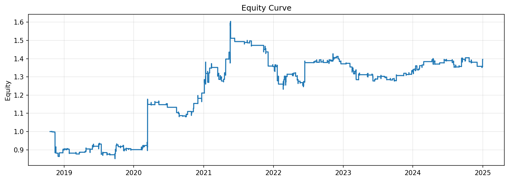

### Drawdown Curve
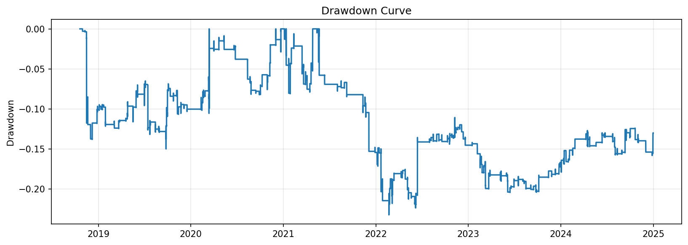

### Cumulative Returns
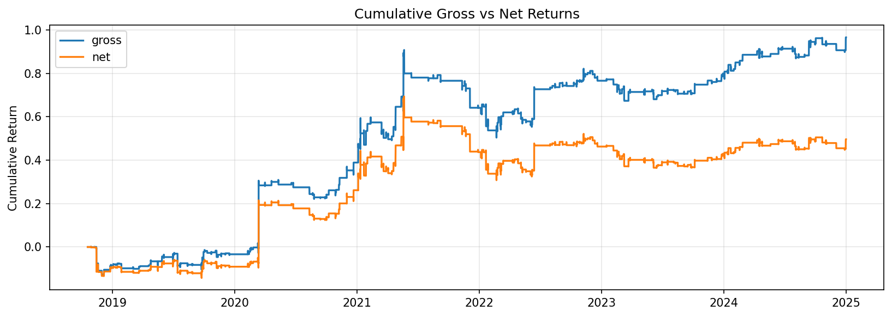

### Monthly Returns
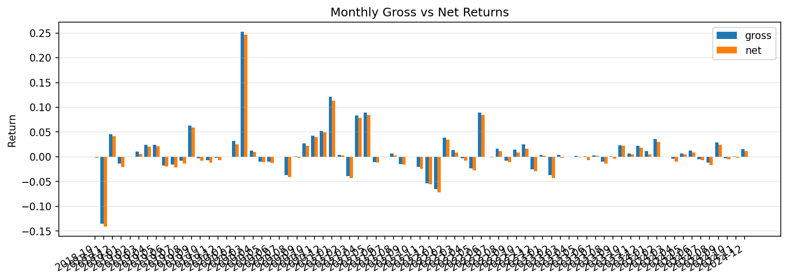

### Rolling Pnl
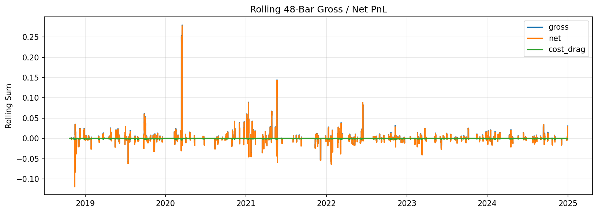

### Cumulative Cost Drag
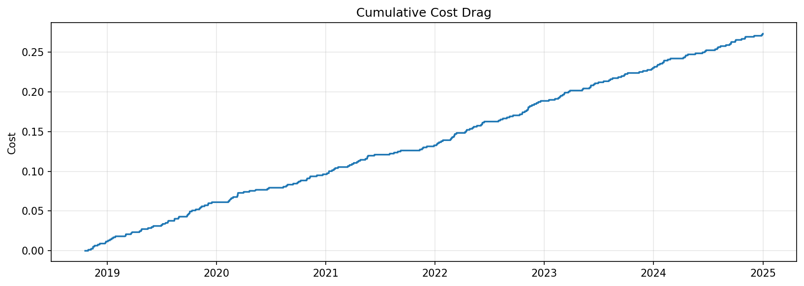

### Positions Turnover
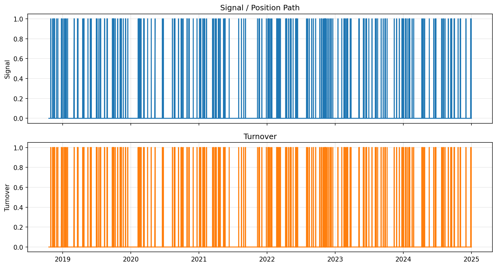

### Rolling Behavior
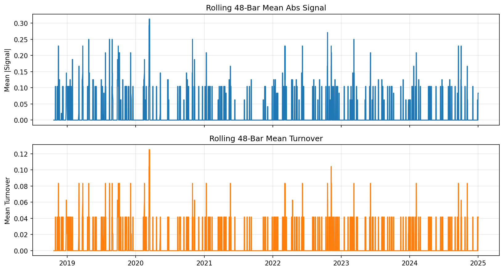

### Signal Distribution
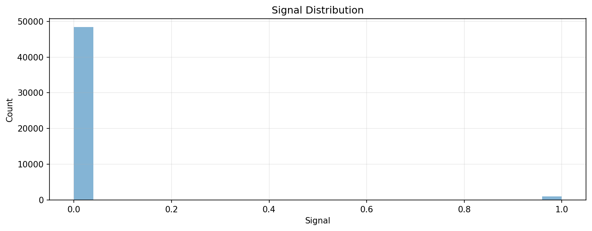

### Fold Net Pnl
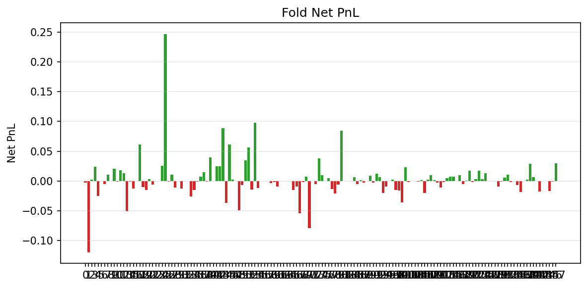

### Feature Importance Chart
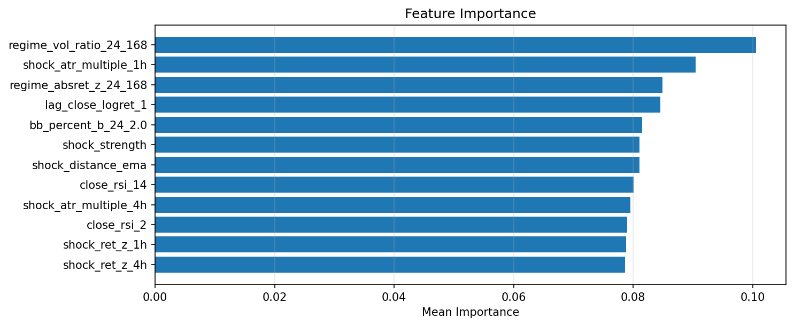

### Label Distribution Chart
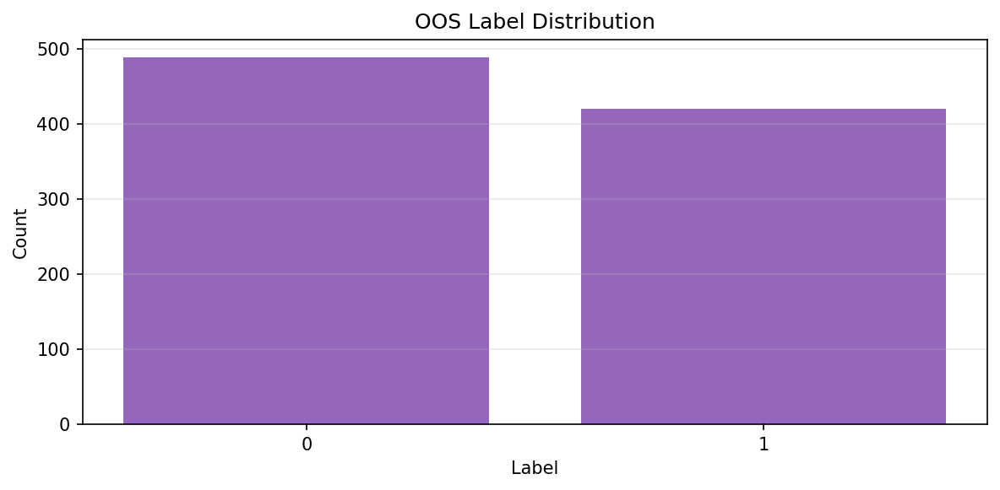

### Prediction Coverage By Fold
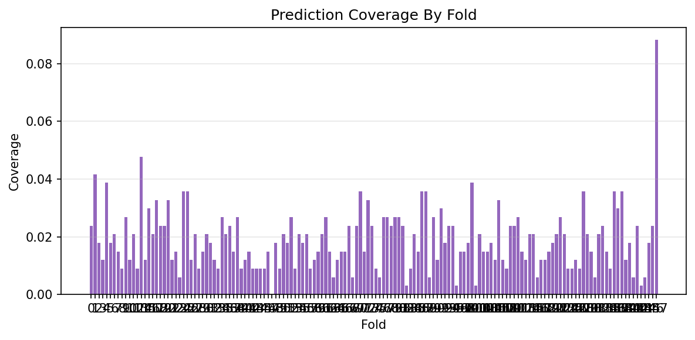


## Fold Breakdown
| Fold | Rows | Gross PnL | Net PnL | Cost | Sharpe | Avg Turnover | Mean Reward | Mean Abs Signal | Signal Turnover | Flat Rate |
| --- | --- | --- | --- | --- | --- | --- | --- | --- | --- | --- |
| 0 | 336 | 0.000166 | -0.002434 | 0.002600 | -3.167745 | 0.011905 |  |  |  |  |
| 1 | 336 | -0.116094 | -0.119994 | 0.003900 | -2.230654 | 0.017857 |  |  |  |  |
| 2 | 336 | 0.005141 | 0.002541 | 0.002600 | 0.397793 | 0.011905 |  |  |  |  |
| 3 | 336 | 0.027503 | 0.023603 | 0.003900 | 8.062824 | 0.017857 |  |  |  |  |
| 4 | 336 | -0.020020 | -0.025220 | 0.005200 | -4.600210 | 0.023810 |  |  |  |  |
| 5 | 336 | 0.0 | 0.0 | 0.0 | 0.0 | 0.0 |  |  |  |  |
| 6 | 336 | -0.002555 | -0.005155 | 0.002600 | -3.581543 | 0.011905 |  |  |  |  |
| 7 | 336 | 0.013426 | 0.010826 | 0.002600 | 7.063325 | 0.011905 |  |  |  |  |
| 8 | 336 | 0.0 | 0.0 | 0.0 | 0.0 | 0.0 |  |  |  |  |
| 9 | 336 | 0.024166 | 0.020266 | 0.003900 | 6.946479 | 0.017857 |  |  |  |  |
| 10 | 336 | 0.000168 | -0.001132 | 0.001300 | -0.303339 | 0.005952 |  |  |  |  |
| 11 | 336 | 0.020609 | 0.018009 | 0.002600 | 5.184810 | 0.011905 |  |  |  |  |
| 12 | 336 | 0.014734 | 0.013434 | 0.001300 | 2.401820 | 0.005952 |  |  |  |  |
| 13 | 336 | -0.045199 | -0.050399 | 0.005200 | -3.063608 | 0.023810 |  |  |  |  |
| 14 | 336 | 0.0 | -0.000650 | 0.000650 | -5.064630 | 0.002976 |  |  |  |  |
| 15 | 336 | -0.008074 | -0.012624 | 0.004550 | -2.790752 | 0.020833 |  |  |  |  |
| 16 | 336 | 0.0 | 0.0 | 0.0 | 0.0 | 0.0 |  |  |  |  |
| 17 | 336 | 0.067954 | 0.061454 | 0.006500 | 13.325890 | 0.029762 |  |  |  |  |
| 18 | 336 | -0.007067 | -0.009667 | 0.002600 | -3.896438 | 0.011905 |  |  |  |  |
| 19 | 336 | -0.011227 | -0.015127 | 0.003900 | -2.507173 | 0.017857 |  |  |  |  |
| 20 | 336 | 0.006836 | 0.002936 | 0.003900 | 0.679284 | 0.017857 |  |  |  |  |
| 21 | 336 | -0.004536 | -0.005836 | 0.001300 | -3.671338 | 0.005952 |  |  |  |  |
| 22 | 336 | 0.0 | 0.0 | 0.0 | 0.0 | 0.0 |  |  |  |  |
| 23 | 336 | 0.0 | 0.0 | 0.0 | 0.0 | 0.0 |  |  |  |  |
| 24 | 336 | 0.032004 | 0.025504 | 0.006500 | 6.129604 | 0.029762 |  |  |  |  |
| 25 | 336 | 0.252115 | 0.246915 | 0.005200 | 232.839061 | 0.023810 |  |  |  |  |
| 26 | 336 | 0.000218 | -0.001082 | 0.001300 | -0.463650 | 0.005952 |  |  |  |  |
| 27 | 336 | 0.012201 | 0.010901 | 0.001300 | 4.813303 | 0.005952 |  |  |  |  |
| 28 | 336 | -0.009474 | -0.010774 | 0.001300 | -2.994958 | 0.005952 |  |  |  |  |
| 29 | 336 | 0.0 | 0.0 | 0.0 | 0.0 | 0.0 |  |  |  |  |
| 30 | 336 | -0.009958 | -0.012558 | 0.002600 | -3.121708 | 0.011905 |  |  |  |  |
| 31 | 336 | 0.0 | 0.0 | 0.0 | 0.0 | 0.0 |  |  |  |  |
| 32 | 336 | 0.0 | 0.0 | 0.0 | 0.0 | 0.0 |  |  |  |  |
| 33 | 336 | -0.024679 | -0.025979 | 0.001300 | -5.049875 | 0.005952 |  |  |  |  |
| 34 | 336 | -0.012230 | -0.014830 | 0.002600 | -3.697220 | 0.011905 |  |  |  |  |
| 35 | 336 | -4.778e-05 | -0.001348 | 0.001300 | -1.477726 | 0.005952 |  |  |  |  |
| 36 | 336 | 0.009682 | 0.007082 | 0.002600 | 3.007405 | 0.011905 |  |  |  |  |
| 37 | 336 | 0.016485 | 0.015185 | 0.001300 | 9.069109 | 0.005952 |  |  |  |  |
| 38 | 336 | 0.001727 | -0.000873 | 0.002600 | -0.264691 | 0.011905 |  |  |  |  |
| 39 | 336 | 0.042735 | 0.040135 | 0.002600 | 17.621814 | 0.011905 |  |  |  |  |
| 40 | 336 | 0.0 | 0.0 | 0.0 | 0.0 | 0.0 |  |  |  |  |
| 41 | 336 | 0.025731 | 0.024431 | 0.001300 | 5.334537 | 0.005952 |  |  |  |  |
| 42 | 336 | 0.026313 | 0.025013 | 0.001300 | 5.390819 | 0.005952 |  |  |  |  |
| 43 | 336 | 0.092496 | 0.088596 | 0.003900 | 18.345423 | 0.017857 |  |  |  |  |
| 44 | 336 | -0.035281 | -0.036581 | 0.001300 | -3.018693 | 0.005952 |  |  |  |  |
| 45 | 336 | 0.063798 | 0.061198 | 0.002600 | 13.006014 | 0.011905 |  |  |  |  |
| 46 | 336 | 0.004044 | 0.002744 | 0.001300 | 0.703332 | 0.005952 |  |  |  |  |
| 47 | 336 | 0.0 | 0.0 | 0.0 | 0.0 | 0.0 |  |  |  |  |
| 48 | 336 | -0.046408 | -0.049008 | 0.002600 | -3.555787 | 0.011905 |  |  |  |  |
| 49 | 336 | -0.004126 | -0.006726 | 0.002600 | -1.752564 | 0.011905 |  |  |  |  |
| 50 | 336 | 0.037446 | 0.034846 | 0.002600 | 18.313670 | 0.011905 |  |  |  |  |
| 51 | 336 | 0.057791 | 0.056491 | 0.001300 | 14.308875 | 0.005952 |  |  |  |  |
| 52 | 336 | -0.011539 | -0.014139 | 0.002600 | -1.517757 | 0.011905 |  |  |  |  |
| 53 | 336 | 0.100863 | 0.098263 | 0.002600 | 20.343178 | 0.011905 |  |  |  |  |
| 54 | 336 | -0.010736 | -0.012036 | 0.001300 | -5.175915 | 0.005952 |  |  |  |  |
| 55 | 336 | 0.0 | 0.0 | 0.0 | 0.0 | 0.0 |  |  |  |  |
| 56 | 336 | 0.0 | 0.0 | 0.0 | 0.0 | 0.0 |  |  |  |  |
| 57 | 336 | 0.0 | 0.0 | 0.0 | 0.0 | 0.0 |  |  |  |  |
| 58 | 336 | -0.001728 | -0.003028 | 0.001300 | -1.570587 | 0.005952 |  |  |  |  |
| 59 | 336 | -0.000138 | -0.001438 | 0.001300 | -0.690993 | 0.005952 |  |  |  |  |
| 60 | 336 | -0.006345 | -0.008945 | 0.002600 | -1.373071 | 0.011905 |  |  |  |  |
| 61 | 336 | 0.0 | 0.0 | 0.0 | 0.0 | 0.0 |  |  |  |  |
| 62 | 336 | 0.0 | 0.0 | 0.0 | 0.0 | 0.0 |  |  |  |  |
| 63 | 336 | 0.0 | 0.0 | 0.0 | 0.0 | 0.0 |  |  |  |  |
| 64 | 336 | 0.0 | 0.0 | 0.0 | 0.0 | 0.0 |  |  |  |  |
| 65 | 336 | -0.013551 | -0.014851 | 0.001300 | -2.307383 | 0.005952 |  |  |  |  |
| 66 | 336 | -0.006665 | -0.009265 | 0.002600 | -2.498796 | 0.011905 |  |  |  |  |
| 67 | 336 | -0.052907 | -0.054207 | 0.001300 | -2.841131 | 0.005952 |  |  |  |  |
| 68 | 336 | -0.000353 | -0.001653 | 0.001300 | -0.967802 | 0.005952 |  |  |  |  |
| 69 | 336 | 0.009683 | 0.007083 | 0.002600 | 1.599239 | 0.011905 |  |  |  |  |
| 70 | 336 | -0.074958 | -0.078858 | 0.003900 | -2.883424 | 0.017857 |  |  |  |  |
| 71 | 336 | 0.0 | 0.0 | 0.0 | 0.0 | 0.0 |  |  |  |  |
| 72 | 336 | -0.002764 | -0.004714 | 0.001950 | -0.664408 | 0.008929 |  |  |  |  |
| 73 | 336 | 0.044129 | 0.038279 | 0.005850 | 10.072671 | 0.026786 |  |  |  |  |
| 74 | 336 | 0.011191 | 0.009891 | 0.001300 | 7.896567 | 0.005952 |  |  |  |  |
| 75 | 336 | 0.0 | 0.0 | 0.0 | 0.0 | 0.0 |  |  |  |  |
| 76 | 336 | 0.008773 | 0.004873 | 0.003900 | 1.878734 | 0.017857 |  |  |  |  |
| 77 | 336 | -0.011750 | -0.013050 | 0.001300 | -6.002636 | 0.005952 |  |  |  |  |
| 78 | 336 | -0.018381 | -0.020981 | 0.002600 | -3.324176 | 0.011905 |  |  |  |  |
| 79 | 336 | -0.004537 | -0.005837 | 0.001300 | -3.113854 | 0.005952 |  |  |  |  |
| 80 | 336 | 0.089670 | 0.084470 | 0.005200 | 24.907747 | 0.023810 |  |  |  |  |
| 81 | 336 | 0.0 | 0.0 | 0.0 | 0.0 | 0.0 |  |  |  |  |
| 82 | 336 | 0.0 | 0.0 | 0.0 | 0.0 | 0.0 |  |  |  |  |
| 83 | 336 | 0.0 | 0.0 | 0.0 | 0.0 | 0.0 |  |  |  |  |
| 84 | 336 | 0.008965 | 0.006365 | 0.002600 | 5.776516 | 0.011905 |  |  |  |  |
| 85 | 336 | -0.003488 | -0.004788 | 0.001300 | -1.806400 | 0.005952 |  |  |  |  |
| 86 | 336 | 0.004231 | 0.001631 | 0.002600 | 0.533114 | 0.011905 |  |  |  |  |
| 87 | 336 | -0.001052 | -0.002352 | 0.001300 | -1.189239 | 0.005952 |  |  |  |  |
| 88 | 336 | 0.0 | 0.0 | 0.0 | 0.0 | 0.0 |  |  |  |  |
| 89 | 336 | 0.013010 | 0.009110 | 0.003900 | 2.653153 | 0.017857 |  |  |  |  |
| 90 | 336 | -2.971e-05 | -0.002630 | 0.002600 | -1.915848 | 0.011905 |  |  |  |  |
| 91 | 336 | 0.017283 | 0.012083 | 0.005200 | 1.898464 | 0.023810 |  |  |  |  |
| 92 | 336 | 0.008933 | 0.006333 | 0.002600 | 4.545469 | 0.011905 |  |  |  |  |
| 93 | 336 | -0.017604 | -0.020204 | 0.002600 | -7.112671 | 0.011905 |  |  |  |  |
| 94 | 336 | -0.007753 | -0.009053 | 0.001300 | -3.689849 | 0.005952 |  |  |  |  |
| 95 | 336 | 0.0 | 0.0 | 0.0 | 0.0 | 0.0 |  |  |  |  |
| 96 | 336 | 0.003397 | 0.002097 | 0.001300 | 2.508336 | 0.005952 |  |  |  |  |
| 97 | 336 | -0.013373 | -0.014673 | 0.001300 | -5.808907 | 0.005952 |  |  |  |  |
| 98 | 336 | -0.012899 | -0.015499 | 0.002600 | -2.665692 | 0.011905 |  |  |  |  |
| 99 | 336 | -0.030985 | -0.036185 | 0.005200 | -2.987061 | 0.023810 |  |  |  |  |
| 100 | 336 | 0.024643 | 0.023343 | 0.001300 | 5.970412 | 0.005952 |  |  |  |  |
| 101 | 336 | -0.000553 | -0.001853 | 0.001300 | -0.800845 | 0.005952 |  |  |  |  |
| 102 | 336 | 0.0 | 0.0 | 0.0 | 0.0 | 0.0 |  |  |  |  |
| 103 | 336 | 0.0 | 0.0 | 0.0 | 0.0 | 0.0 |  |  |  |  |
| 104 | 336 | 0.001534 | -0.001066 | 0.002600 | -0.296800 | 0.011905 |  |  |  |  |
| 105 | 336 | 0.002892 | 0.001592 | 0.001300 | 2.156443 | 0.005952 |  |  |  |  |
| 106 | 336 | -0.016465 | -0.020365 | 0.003900 | -5.207974 | 0.017857 |  |  |  |  |
| 107 | 336 | 0.003285 | 0.001985 | 0.001300 | 2.952350 | 0.005952 |  |  |  |  |
| 108 | 336 | 0.010889 | 0.009589 | 0.001300 | 4.675542 | 0.005952 |  |  |  |  |
| 109 | 336 | 0.003193 | 0.001893 | 0.001300 | 0.651167 | 0.005952 |  |  |  |  |
| 110 | 336 | -0.000381 | -0.002981 | 0.002600 | -2.340374 | 0.011905 |  |  |  |  |
| 111 | 336 | -0.009518 | -0.010818 | 0.001300 | -6.037367 | 0.005952 |  |  |  |  |
| 112 | 336 | -0.000271 | -0.001571 | 0.001300 | -1.250973 | 0.005952 |  |  |  |  |
| 113 | 336 | 0.006307 | 0.005007 | 0.001300 | 6.395450 | 0.005952 |  |  |  |  |
| 114 | 336 | 0.010231 | 0.006981 | 0.003250 | 2.454524 | 0.014881 |  |  |  |  |
| 115 | 336 | 0.007759 | 0.007109 | 0.000650 | 3.766266 | 0.002976 |  |  |  |  |
| 116 | 336 | 0.0 | 0.0 | 0.0 | 0.0 | 0.0 |  |  |  |  |
| 117 | 336 | 0.010745 | 0.009445 | 0.001300 | 11.109539 | 0.005952 |  |  |  |  |
| 118 | 336 | -0.003720 | -0.005020 | 0.001300 | -2.866756 | 0.005952 |  |  |  |  |
| 119 | 336 | 0.002277 | 0.000977 | 0.001300 | 0.483236 | 0.005952 |  |  |  |  |
| 120 | 336 | 0.019715 | 0.017115 | 0.002600 | 7.561009 | 0.011905 |  |  |  |  |
| 121 | 336 | 0.001035 | -0.001565 | 0.002600 | -0.389656 | 0.011905 |  |  |  |  |
| 122 | 336 | 0.005898 | 0.003298 | 0.002600 | 0.779592 | 0.011905 |  |  |  |  |
| 123 | 336 | 0.020945 | 0.017045 | 0.003900 | 11.609711 | 0.017857 |  |  |  |  |
| 124 | 336 | 0.004232 | 0.002932 | 0.001300 | 1.661312 | 0.005952 |  |  |  |  |
| 125 | 336 | 0.014691 | 0.013391 | 0.001300 | 8.072831 | 0.005952 |  |  |  |  |
| 126 | 336 | 0.0 | 0.0 | 0.0 | 0.0 | 0.0 |  |  |  |  |
| 127 | 336 | 0.0 | 0.0 | 0.0 | 0.0 | 0.0 |  |  |  |  |
| 128 | 336 | 0.003827 | -7.259e-05 | 0.003900 | -0.079245 | 0.017857 |  |  |  |  |
| 129 | 336 | -0.007972 | -0.009272 | 0.001300 | -3.409458 | 0.005952 |  |  |  |  |
| 130 | 336 | 0.0 | -0.000650 | 0.000650 | -5.064630 | 0.002976 |  |  |  |  |
| 131 | 336 | 0.006255 | 0.005605 | 0.000650 | 8.229038 | 0.002976 |  |  |  |  |
| 132 | 336 | 0.011720 | 0.010420 | 0.001300 | 5.634326 | 0.005952 |  |  |  |  |
| 133 | 336 | 0.000949 | -0.001651 | 0.002600 | -0.861479 | 0.011905 |  |  |  |  |
| 134 | 336 | 0.0 | 0.0 | 0.0 | 0.0 | 0.0 |  |  |  |  |
| 135 | 336 | -0.005656 | -0.006956 | 0.001300 | -3.148197 | 0.005952 |  |  |  |  |
| 136 | 336 | -0.015499 | -0.018099 | 0.002600 | -5.457972 | 0.011905 |  |  |  |  |
| 137 | 336 | 0.001222 | -7.759e-05 | 0.001300 | -0.064193 | 0.005952 |  |  |  |  |
| 138 | 336 | 0.003430 | 0.002130 | 0.001300 | 1.531837 | 0.005952 |  |  |  |  |
| 139 | 336 | 0.032706 | 0.028806 | 0.003900 | 8.914010 | 0.017857 |  |  |  |  |
| 140 | 336 | 0.008739 | 0.006139 | 0.002600 | 2.301100 | 0.011905 |  |  |  |  |
| 141 | 336 | 0.0 | 0.0 | 0.0 | 0.0 | 0.0 |  |  |  |  |
| 142 | 336 | -0.013578 | -0.017478 | 0.003900 | -3.806362 | 0.017857 |  |  |  |  |
| 143 | 336 | 0.0 | 0.0 | 0.0 | 0.0 | 0.0 |  |  |  |  |
| 144 | 336 | 0.0 | 0.0 | 0.0 | 0.0 | 0.0 |  |  |  |  |
| 145 | 336 | -0.015111 | -0.016411 | 0.001300 | -5.102439 | 0.005952 |  |  |  |  |
| 146 | 336 | -4.100e-05 | -0.001341 | 0.001300 | -1.298368 | 0.005952 |  |  |  |  |
| 147 | 34 | 0.030687 | 0.029387 | 0.001300 | 5.534e+03 | 0.058824 |  |  |  |  |


## Model Fold Diagnostics
| Fold | Train Raw | Train Used | Train Missing Drop | Test Rows | Pred Rows | Test Missing / No Pred | Train Feature Missing | Test Feature Missing | Eval Rows |
| --- | --- | --- | --- | --- | --- | --- | --- | --- | --- |
| 0 | 8736 | 175 | 8561 | 336 | 8 | 328 | 168 | 0 | 8 |
| 1 | 9072 | 183 | 8889 | 336 | 14 | 322 | 168 | 0 | 14 |
| 2 | 9408 | 199 | 9209 | 336 | 6 | 330 | 168 | 0 | 6 |
| 3 | 9744 | 205 | 9539 | 336 | 4 | 332 | 168 | 0 | 4 |
| 4 | 10080 | 209 | 9871 | 336 | 13 | 323 | 168 | 0 | 13 |
| 5 | 10416 | 222 | 10194 | 336 | 6 | 330 | 168 | 0 | 6 |
| 6 | 10752 | 227 | 10525 | 336 | 7 | 329 | 168 | 0 | 7 |
| 7 | 11088 | 235 | 10853 | 336 | 5 | 331 | 168 | 0 | 5 |
| 8 | 11424 | 240 | 11184 | 336 | 3 | 333 | 168 | 0 | 3 |
| 9 | 11760 | 243 | 11517 | 336 | 9 | 327 | 168 | 0 | 9 |
| 10 | 12096 | 252 | 11844 | 336 | 4 | 332 | 168 | 0 | 4 |
| 11 | 12432 | 256 | 12176 | 336 | 7 | 329 | 168 | 0 | 7 |
| 12 | 12768 | 263 | 12505 | 336 | 3 | 333 | 168 | 0 | 3 |
| 13 | 13104 | 266 | 12838 | 336 | 16 | 320 | 168 | 0 | 16 |
| 14 | 13440 | 281 | 13159 | 336 | 4 | 332 | 168 | 0 | 4 |
| 15 | 13776 | 285 | 13491 | 336 | 10 | 326 | 168 | 0 | 10 |
| 16 | 14112 | 296 | 13816 | 336 | 7 | 329 | 168 | 0 | 7 |
| 17 | 14448 | 303 | 14145 | 336 | 11 | 325 | 168 | 0 | 11 |
| 18 | 14784 | 314 | 14470 | 336 | 8 | 328 | 168 | 0 | 8 |
| 19 | 15120 | 322 | 14798 | 336 | 8 | 328 | 168 | 0 | 8 |
| 20 | 15456 | 329 | 15127 | 336 | 11 | 325 | 168 | 0 | 11 |
| 21 | 15792 | 341 | 15451 | 336 | 4 | 332 | 168 | 0 | 4 |
| 22 | 16128 | 345 | 15783 | 336 | 5 | 331 | 168 | 0 | 5 |
| 23 | 16464 | 348 | 16116 | 336 | 2 | 334 | 168 | 0 | 2 |
| 24 | 16800 | 352 | 16448 | 336 | 12 | 324 | 168 | 0 | 12 |
| 25 | 17136 | 363 | 16773 | 336 | 12 | 324 | 168 | 0 | 12 |
| 26 | 17472 | 376 | 17096 | 336 | 4 | 332 | 168 | 0 | 4 |
| 27 | 17808 | 380 | 17428 | 336 | 7 | 329 | 168 | 0 | 7 |
| 28 | 18144 | 387 | 17757 | 336 | 3 | 333 | 168 | 0 | 3 |
| 29 | 18480 | 390 | 18090 | 336 | 5 | 331 | 168 | 0 | 5 |
| 30 | 18816 | 395 | 18421 | 336 | 7 | 329 | 168 | 0 | 7 |
| 31 | 19152 | 399 | 18753 | 336 | 6 | 330 | 168 | 0 | 6 |
| 32 | 19488 | 408 | 19080 | 336 | 4 | 332 | 168 | 0 | 4 |
| 33 | 19824 | 410 | 19414 | 336 | 3 | 333 | 168 | 0 | 3 |
| 34 | 20160 | 415 | 19745 | 336 | 9 | 327 | 168 | 0 | 9 |
| 35 | 20496 | 424 | 20072 | 336 | 7 | 329 | 168 | 0 | 7 |
| 36 | 20832 | 428 | 20404 | 336 | 8 | 328 | 168 | 0 | 8 |
| 37 | 21168 | 439 | 20729 | 336 | 5 | 331 | 168 | 0 | 5 |
| 38 | 21504 | 444 | 21060 | 336 | 9 | 327 | 168 | 0 | 9 |
| 39 | 21840 | 451 | 21389 | 336 | 3 | 333 | 168 | 0 | 3 |
| 40 | 22176 | 456 | 21720 | 336 | 4 | 332 | 168 | 0 | 4 |
| 41 | 22512 | 460 | 22052 | 336 | 5 | 331 | 168 | 0 | 5 |
| 42 | 22848 | 465 | 22383 | 336 | 3 | 333 | 168 | 0 | 3 |
| 43 | 23184 | 468 | 22716 | 336 | 3 | 333 | 168 | 0 | 3 |
| 44 | 23520 | 471 | 23049 | 336 | 3 | 333 | 168 | 0 | 3 |
| 45 | 23856 | 474 | 23382 | 336 | 3 | 333 | 168 | 0 | 3 |
| 46 | 24192 | 477 | 23715 | 336 | 5 | 331 | 168 | 0 | 5 |
| 47 | 24528 | 481 | 24047 | 336 | 0 | 336 | 168 | 0 | 0 |
| 48 | 24864 | 482 | 24382 | 336 | 6 | 330 | 168 | 0 | 6 |
| 49 | 25200 | 488 | 24712 | 336 | 3 | 333 | 168 | 0 | 3 |
| 50 | 25536 | 491 | 25045 | 336 | 7 | 329 | 168 | 0 | 7 |
| 51 | 25872 | 498 | 25374 | 336 | 6 | 330 | 168 | 0 | 6 |
| 52 | 26208 | 504 | 25704 | 336 | 9 | 327 | 168 | 0 | 9 |
| 53 | 26544 | 511 | 26033 | 336 | 3 | 333 | 168 | 0 | 3 |
| 54 | 26880 | 516 | 26364 | 336 | 7 | 329 | 168 | 0 | 7 |
| 55 | 27216 | 523 | 26693 | 336 | 6 | 330 | 168 | 0 | 6 |
| 56 | 27552 | 529 | 27023 | 336 | 7 | 329 | 168 | 0 | 7 |
| 57 | 27888 | 534 | 27354 | 336 | 3 | 333 | 168 | 0 | 3 |
| 58 | 28224 | 539 | 27685 | 336 | 4 | 332 | 168 | 0 | 4 |
| 59 | 28560 | 543 | 28017 | 336 | 5 | 331 | 168 | 0 | 5 |
| 60 | 28896 | 547 | 28349 | 336 | 7 | 329 | 168 | 0 | 7 |
| 61 | 29232 | 552 | 28680 | 336 | 9 | 327 | 168 | 0 | 9 |
| 62 | 29568 | 564 | 29004 | 336 | 5 | 331 | 168 | 0 | 5 |
| 63 | 29904 | 569 | 29335 | 336 | 2 | 334 | 168 | 0 | 2 |
| 64 | 30240 | 571 | 29669 | 336 | 4 | 332 | 168 | 0 | 4 |
| 65 | 30576 | 575 | 30001 | 336 | 5 | 331 | 168 | 0 | 5 |
| 66 | 30912 | 580 | 30332 | 336 | 5 | 331 | 168 | 0 | 5 |
| 67 | 31248 | 585 | 30663 | 336 | 8 | 328 | 168 | 0 | 8 |
| 68 | 31584 | 593 | 30991 | 336 | 2 | 334 | 168 | 0 | 2 |
| 69 | 31920 | 595 | 31325 | 336 | 8 | 328 | 168 | 0 | 8 |
| 70 | 32256 | 603 | 31653 | 336 | 12 | 324 | 168 | 0 | 12 |
| 71 | 32592 | 613 | 31979 | 336 | 5 | 331 | 168 | 0 | 5 |
| 72 | 32928 | 620 | 32308 | 336 | 11 | 325 | 168 | 0 | 11 |
| 73 | 33264 | 629 | 32635 | 336 | 8 | 328 | 168 | 0 | 8 |
| 74 | 33600 | 638 | 32962 | 336 | 3 | 333 | 168 | 0 | 3 |
| 75 | 33936 | 642 | 33294 | 336 | 2 | 334 | 168 | 0 | 2 |
| 76 | 34272 | 644 | 33628 | 336 | 9 | 327 | 168 | 0 | 9 |
| 77 | 34608 | 653 | 33955 | 336 | 9 | 327 | 168 | 0 | 9 |
| 78 | 34944 | 660 | 34284 | 336 | 8 | 328 | 168 | 0 | 8 |
| 79 | 35280 | 670 | 34610 | 336 | 9 | 327 | 168 | 0 | 9 |
| 80 | 35616 | 677 | 34939 | 336 | 9 | 327 | 168 | 0 | 9 |
| 81 | 35952 | 688 | 35264 | 336 | 8 | 328 | 168 | 0 | 8 |
| 82 | 36288 | 693 | 35595 | 336 | 1 | 335 | 168 | 0 | 1 |
| 83 | 36624 | 697 | 35927 | 336 | 3 | 333 | 168 | 0 | 3 |
| 84 | 36960 | 700 | 36260 | 336 | 7 | 329 | 168 | 0 | 7 |
| 85 | 37296 | 707 | 36589 | 336 | 5 | 331 | 168 | 0 | 5 |
| 86 | 37632 | 712 | 36920 | 336 | 12 | 324 | 168 | 0 | 12 |
| 87 | 37968 | 724 | 37244 | 336 | 12 | 324 | 168 | 0 | 12 |
| 88 | 38304 | 734 | 37570 | 336 | 2 | 334 | 168 | 0 | 2 |
| 89 | 38640 | 738 | 37902 | 336 | 9 | 327 | 168 | 0 | 9 |
| 90 | 38976 | 746 | 38230 | 336 | 4 | 332 | 168 | 0 | 4 |
| 91 | 39312 | 749 | 38563 | 336 | 10 | 326 | 168 | 0 | 10 |
| 92 | 39648 | 761 | 38887 | 336 | 6 | 330 | 168 | 0 | 6 |
| 93 | 39984 | 767 | 39217 | 336 | 8 | 328 | 168 | 0 | 8 |
| 94 | 40320 | 775 | 39545 | 336 | 8 | 328 | 168 | 0 | 8 |
| 95 | 40656 | 783 | 39873 | 336 | 1 | 335 | 168 | 0 | 1 |
| 96 | 40992 | 784 | 40208 | 336 | 5 | 331 | 168 | 0 | 5 |
| 97 | 41328 | 789 | 40539 | 336 | 5 | 331 | 168 | 0 | 5 |
| 98 | 41664 | 793 | 40871 | 336 | 6 | 330 | 168 | 0 | 6 |
| 99 | 42000 | 800 | 41200 | 336 | 13 | 323 | 168 | 0 | 13 |
| 100 | 42336 | 809 | 41527 | 336 | 1 | 335 | 168 | 0 | 1 |
| 101 | 42672 | 814 | 41858 | 336 | 7 | 329 | 168 | 0 | 7 |
| 102 | 43008 | 821 | 42187 | 336 | 5 | 331 | 168 | 0 | 5 |
| 103 | 43344 | 826 | 42518 | 336 | 5 | 331 | 168 | 0 | 5 |
| 104 | 43680 | 831 | 42849 | 336 | 6 | 330 | 168 | 0 | 6 |
| 105 | 44016 | 836 | 43180 | 336 | 4 | 332 | 168 | 0 | 4 |
| 106 | 44352 | 841 | 43511 | 336 | 11 | 325 | 168 | 0 | 11 |
| 107 | 44688 | 852 | 43836 | 336 | 4 | 332 | 168 | 0 | 4 |
| 108 | 45024 | 854 | 44170 | 336 | 3 | 333 | 168 | 0 | 3 |
| 109 | 45360 | 859 | 44501 | 336 | 8 | 328 | 168 | 0 | 8 |
| 110 | 45696 | 867 | 44829 | 336 | 8 | 328 | 168 | 0 | 8 |
| 111 | 46032 | 875 | 45157 | 336 | 9 | 327 | 168 | 0 | 9 |
| 112 | 46368 | 883 | 45485 | 336 | 5 | 331 | 168 | 0 | 5 |
| 113 | 46704 | 889 | 45815 | 336 | 4 | 332 | 168 | 0 | 4 |
| 114 | 47040 | 893 | 46147 | 336 | 7 | 329 | 168 | 0 | 7 |
| 115 | 47376 | 898 | 46478 | 336 | 7 | 329 | 168 | 0 | 7 |
| 116 | 47712 | 907 | 46805 | 336 | 2 | 334 | 168 | 0 | 2 |
| 117 | 48048 | 909 | 47139 | 336 | 4 | 332 | 168 | 0 | 4 |
| 118 | 48384 | 913 | 47471 | 336 | 4 | 332 | 168 | 0 | 4 |
| 119 | 48720 | 917 | 47803 | 336 | 5 | 331 | 168 | 0 | 5 |
| 120 | 49056 | 922 | 48134 | 336 | 6 | 330 | 168 | 0 | 6 |
| 121 | 49392 | 925 | 48467 | 336 | 7 | 329 | 168 | 0 | 7 |
| 122 | 49728 | 935 | 48793 | 336 | 9 | 327 | 168 | 0 | 9 |
| 123 | 50064 | 944 | 49120 | 336 | 7 | 329 | 168 | 0 | 7 |
| 124 | 50400 | 951 | 49449 | 336 | 3 | 333 | 168 | 0 | 3 |
| 125 | 50736 | 954 | 49782 | 336 | 3 | 333 | 168 | 0 | 3 |
| 126 | 51072 | 957 | 50115 | 336 | 4 | 332 | 168 | 0 | 4 |
| 127 | 51408 | 961 | 50447 | 336 | 3 | 333 | 168 | 0 | 3 |
| 128 | 51744 | 964 | 50780 | 336 | 12 | 324 | 168 | 0 | 12 |
| 129 | 52080 | 976 | 51104 | 336 | 7 | 329 | 168 | 0 | 7 |
| 130 | 52416 | 983 | 51433 | 336 | 5 | 331 | 168 | 0 | 5 |
| 131 | 52752 | 987 | 51765 | 336 | 2 | 334 | 168 | 0 | 2 |
| 132 | 53088 | 990 | 52098 | 336 | 7 | 329 | 168 | 0 | 7 |
| 133 | 53424 | 997 | 52427 | 336 | 8 | 328 | 168 | 0 | 8 |
| 134 | 53760 | 1005 | 52755 | 336 | 5 | 331 | 168 | 0 | 5 |
| 135 | 54096 | 1010 | 53086 | 336 | 3 | 333 | 168 | 0 | 3 |
| 136 | 54432 | 1013 | 53419 | 336 | 12 | 324 | 168 | 0 | 12 |
| 137 | 54768 | 1025 | 53743 | 336 | 10 | 326 | 168 | 0 | 10 |
| 138 | 55104 | 1035 | 54069 | 336 | 12 | 324 | 168 | 0 | 12 |
| 139 | 55440 | 1046 | 54394 | 336 | 4 | 332 | 168 | 0 | 4 |
| 140 | 55776 | 1051 | 54725 | 336 | 6 | 330 | 168 | 0 | 6 |
| 141 | 56112 | 1057 | 55055 | 336 | 2 | 334 | 168 | 0 | 2 |
| 142 | 56448 | 1059 | 55389 | 336 | 8 | 328 | 168 | 0 | 8 |
| 143 | 56784 | 1065 | 55719 | 336 | 1 | 335 | 168 | 0 | 1 |
| 144 | 57120 | 1068 | 56052 | 336 | 2 | 334 | 168 | 0 | 2 |
| 145 | 57456 | 1070 | 56386 | 336 | 6 | 330 | 168 | 0 | 6 |
| 146 | 57792 | 1076 | 56716 | 336 | 8 | 328 | 168 | 0 | 8 |
| 147 | 58128 | 1084 | 57044 | 34 | 3 | 31 | 168 | 0 | 1 |


## Monitoring
- Drifted feature count: `1` / `12`
| Asset | Feature | PSI |
| --- | --- | --- |
| BTCUSD | lag_close_logret_1 | 0.168190 |


## Feature Set
| Order | Feature |
| --- | --- |
| 1 | shock_ret_z_1h |
| 2 | shock_ret_z_4h |
| 3 | shock_atr_multiple_1h |
| 4 | shock_atr_multiple_4h |
| 5 | shock_distance_ema |
| 6 | shock_strength |
| 7 | regime_vol_ratio_24_168 |
| 8 | regime_absret_z_24_168 |
| 9 | bb_percent_b_24_2.0 |
| 10 | close_rsi_2 |
| 11 | close_rsi_14 |
| 12 | lag_close_logret_1 |

## Feature Steps
```yaml
- step: returns
  params:
    log: true
    col_name: close_logret
  enabled: true
- step: trend
  params:
    price_col: close
    sma_windows: []
    ema_spans:
    - 24
  enabled: true
- step: regime_context
  params:
    price_col: close
    returns_col: close_logret
    vol_short_window: 24
    vol_long_window: 168
    trend_fast_span: 24
    trend_slow_span: 72
    vol_ratio_high_threshold: 1.35
    vol_ratio_low_threshold: 0.8
  enabled: true
- step: bollinger
  params:
    price_col: close
    window: 24
    n_std: 2.0
  enabled: true
- step: atr
  params:
    high_col: high
    low_col: low
    close_col: close
    window: 24
    method: wilder
    add_over_price: true
  enabled: true
- step: shock_context
  params:
    price_col: close
    high_col: high
    low_col: low
    returns_col: close_logret
    ema_col: close_ema_24
    atr_col: atr_24
    short_horizon: 1
    medium_horizon: 4
    vol_window: 24
    ret_z_threshold: 2.5
    atr_mult_threshold: 1.75
    distance_from_mean_threshold: 1.1
    post_shock_active_bars: 5
  enabled: true
- step: rsi
  params:
    price_col: close
    windows:
    - 2
    - 14
    method: wilder
  enabled: true
- step: lags
  params:
    cols:
    - close_logret
    lags:
    - 1
  enabled: true
```

## Config Snapshot
```yaml
data:
  source: dukascopy_csv
  interval: 1h
  start: '2017-05-07 23:00:00'
  end: '2024-12-31 14:00:00'
  alignment: inner
  symbol: BTCUSD
  symbols: null
  api_key: null
  api_key_env: null
  pit:
    timestamp_alignment:
      source_timezone: UTC
      output_timezone: UTC
      normalize_daily: false
      duplicate_policy: last
    corporate_actions:
      policy: none
      adj_close_col: adj_close
    universe_snapshot:
      inactive_policy: raise
  storage:
    mode: cached_only
    dataset_id: btcusd_1h_shock_meta_xgboost_long_only
    save_raw: false
    save_processed: true
    load_path: /workspace/data/raw/dukas_copy_bank/btcusd_h1.csv
    raw_dir: /workspace/data/raw
    processed_dir: /workspace/data/processed
model:
  kind: xgboost_clf
  params:
    n_estimators: 350
    learning_rate: 0.03
    num_leaves: null
    max_depth: 4
    subsample: 0.9
    colsample_bytree: 0.9
    min_child_samples: null
    random_state: 7
    min_child_weight: 5.0
    reg_lambda: 1.0
    objective: binary:logistic
    eval_metric: logloss
    tree_method: hist
  preprocessing:
    scaler: none
  feature_cols:
  - shock_ret_z_1h
  - shock_ret_z_4h
  - shock_atr_multiple_1h
  - shock_atr_multiple_4h
  - shock_distance_ema
  - shock_strength
  - regime_vol_ratio_24_168
  - regime_absret_z_24_168
  - bb_percent_b_24_2.0
  - close_rsi_2
  - close_rsi_14
  - lag_close_logret_1
  target:
    kind: triple_barrier
    price_col: close
    open_col: open
    high_col: high
    low_col: low
    returns_col: close_logret
    max_holding: 24
    upper_mult: 1.5
    lower_mult: 1.5
    vol_window: 24
    neutral_label: drop
    side_col: shock_side_contrarian
    candidate_col: shock_down_candidate
    candidate_out_col: meta_candidate
  split:
    method: walk_forward
    train_size: 8760
    test_size: 336
    step_size: 336
    expanding: true
    max_folds: null
  runtime: {}
  env: {}
  use_features: true
  pred_prob_col: null
  pred_ret_col: null
  returns_input_col: null
  signal_col: null
  action_col: null
signals:
  kind: probability_threshold
  params:
    prob_col: pred_prob
    signal_col: signal_prob_threshold
    base_signal_col: shock_side_contrarian_active
    upper: 0.555
    upper_exit: 0.49
    lower: 0.43
    lower_exit: 0.48
    mode: long_only
risk:
  cost_per_turnover: 0.0005
  slippage_per_turnover: 0.00015
  target_vol: null
  max_leverage: 1.0
  dd_guard:
    enabled: true
    max_drawdown: 0.12
    rearm_drawdown: 0.08
    cooloff_bars: 48
  vol_col: null
backtest:
  returns_col: close_logret
  signal_col: signal_prob_threshold
  periods_per_year: 8760
  returns_type: log
  missing_return_policy: raise_if_exposed
  min_holding_bars: 3
  subset: test
  vol_col: null
portfolio:
  enabled: false
  construction: signal_weights
  gross_target: 1.0
  long_short: false
  expected_return_col: null
  covariance_window: 60
  covariance_rebalance_step: 1
  risk_aversion: 5.0
  trade_aversion: 0.0
  constraints: {}
  asset_groups: {}
runtime:
  seed: 7
  repro_mode: strict
  deterministic: true
  threads: 1
  seed_torch: false
```

## Artifact Inventory
- `config`: `config_used.yaml`
- `summary`: `summary.json`
- `run_metadata`: `run_metadata.json`
- `equity_curve`: `equity_curve.csv`
- `returns`: `returns.csv`
- `gross_returns`: `gross_returns.csv`
- `costs`: `costs.csv`
- `turnover`: `turnover.csv`
- `positions`: `positions.csv`
- `monitoring`: `monitoring_report.json`
- `feature_importance`: `feature_importance.csv`
- `label_distribution`: `label_distribution.csv`
- `prediction_diagnostics`: `prediction_diagnostics.json`
- `missing_value_diagnostics`: `missing_value_diagnostics.json`
- `fold_model_summary`: `fold_model_summary.csv`
- `stage_tails`: `stage_tails.json`
- `equity_curve_chart`: `report_assets/equity_curve.png`
- `drawdown_curve`: `report_assets/drawdown_curve.png`
- `cumulative_returns`: `report_assets/cumulative_returns.png`
- `monthly_returns`: `report_assets/monthly_returns.png`
- `rolling_pnl`: `report_assets/rolling_pnl.png`
- `cumulative_cost_drag`: `report_assets/cumulative_cost_drag.png`
- `positions_turnover`: `report_assets/positions_turnover.png`
- `rolling_behavior`: `report_assets/rolling_behavior.png`
- `signal_distribution`: `report_assets/signal_distribution.png`
- `fold_net_pnl`: `report_assets/fold_net_pnl.png`
- `feature_importance_chart`: `report_assets/feature_importance.png`
- `label_distribution_chart`: `report_assets/label_distribution.png`
- `prediction_coverage_by_fold`: `report_assets/prediction_coverage_by_fold.png`
