# Experiment Report: ethusd_30m_trial0041_direction_trend_only_lgbm_v1

## Overview
- Config path: `/workspace/config/experiments/foundation_alpha/ethusd_30m_trial_0041_alpha_lab/06_direction_lab/ethusd_30m_trial0041_direction_trend_only_lgbm_v1.yaml`
- Model kind: `lightgbm_regressor`
- Symbols: `ETHUSD`
- Data source: `dukascopy_csv` at interval `30m`
- Data window: `None` to `2026-06-09 23:30:00`
- Rows / columns: `109005` rows, `126` columns
- Target: `future_return_regression` horizon `24`
- Feature count: `16`
- Runtime seed: `7`

## Pipeline Trace

### 1. Entry Point
- `runner.run_experiment` -> `src.experiments.runner.run_experiment(config_path: 'str | Path') -> 'ExperimentResult'`
- `runner._load_asset_frames` -> `src.experiments.runner._load_asset_frames(data_cfg: 'dict[str, object]')`
- `pipeline.run_experiment_pipeline` -> `src.experiments.orchestration.pipeline.run_experiment_pipeline(config_path: 'str | Path', *, load_asset_frames_fn: 'LoadAssetFramesFn', save_processed_snapshot_fn: 'SaveProcessedFn') -> 'ExperimentResult'`

```yaml
config_path: /workspace/config/experiments/foundation_alpha/ethusd_30m_trial_0041_alpha_lab/06_direction_lab/ethusd_30m_trial0041_direction_trend_only_lgbm_v1.yaml
runtime:
  seed: 7
  repro_mode: strict
  deterministic: true
  threads: 1
  seed_torch: false
```

### 2. Data Load And PIT
- `data_stage.load_asset_frames` -> `src.experiments.orchestration.data_stage.load_asset_frames(data_cfg: 'dict[str, Any]', *, load_ohlcv_fn: 'SingleAssetLoader', load_ohlcv_panel_fn: 'PanelLoader', apply_pit_hardening_fn: 'PitFn', validate_ohlcv_fn: 'ValidateFrameFn', validate_data_contract_fn: 'ValidateFrameFn') -> 'tuple[dict[str, pd.DataFrame], dict[str, Any]]'`
- `src_data.loaders.load_ohlcv` -> `src.src_data.loaders.load_ohlcv(symbol: 'str', start: 'str | None' = None, end: 'str | None' = None, interval: 'str' = '1d', source: "Literal['yahoo', 'alpha', 'twelve_data', 'twelve', 'dukascopy_csv']" = 'yahoo', api_key: 'Optional[str]' = None) -> 'pd.DataFrame'`
- `src_data.loaders.load_ohlcv_panel` -> `src.src_data.loaders.load_ohlcv_panel(symbols: 'Sequence[str]', start: 'str | None' = None, end: 'str | None' = None, interval: 'str' = '1d', source: "Literal['yahoo', 'alpha', 'twelve_data', 'twelve', 'dukascopy_csv']" = 'yahoo', api_key: 'Optional[str]' = None) -> 'dict[str, pd.DataFrame]'`
- `src_data.pit.apply_pit_hardening` -> `src.src_data.pit.apply_pit_hardening(df: 'pd.DataFrame', *, pit_cfg: 'Mapping[str, Any] | None' = None, symbol: 'str | None' = None) -> 'tuple[pd.DataFrame, dict[str, Any]]'`
- `src_data.validation.validate_ohlcv` -> `src.src_data.validation.validate_ohlcv(df: 'pd.DataFrame', required_columns: 'Iterable[str]' = ('open', 'high', 'low', 'close', 'volume'), allow_missing_volume: 'bool' = True) -> 'None'`
- `experiments.contracts.validate_data_contract` -> `src.evaluation.contracts.validate_data_contract(df: 'pd.DataFrame', contract: 'DataContract | None' = None) -> 'dict[str, int]'`
- `schemas.StorageContext` -> `src.experiments.schemas.StorageContext(symbols: 'list[str]', source: 'str | None', interval: 'str | None', start: 'str | None', end: 'str | None', pit: 'dict[str, Any]' = <factory>, pit_hash_sha256: 'str | None' = None) -> None`  
  Context object persisted into snapshot metadata.
- `data_stage.save_processed_snapshot_if_enabled` -> `src.experiments.orchestration.data_stage.save_processed_snapshot_if_enabled(asset_frames: 'dict[str, pd.DataFrame]', *, data_cfg: 'dict[str, Any]', config_hash_sha256: 'str', feature_steps: 'list[dict[str, Any]]', logging_cfg: 'dict[str, Any] | None' = None) -> 'dict[str, Any] | None'`

```yaml
data:
  source: dukascopy_csv
  interval: 30m
  start: null
  end: null
  alignment: inner
  symbol: ETHUSD
  symbols: null
  api_key: null
  api_key_env: null
  pit:
    timestamp_alignment:
      source_timezone: UTC
      output_timezone: UTC
      normalize_daily: false
      duplicate_policy: last
    corporate_actions:
      policy: none
      adj_close_col: adj_close
    universe_snapshot:
      inactive_policy: raise
  storage:
    mode: cached_only
    dataset_id: ethusd_30m_lightgbm_h24_structured_tail_alpha_v3_7_ehlers_trend_hybrid
    save_raw: false
    save_processed: true
    load_path: /workspace/data/raw/dukascopy_30m_clean/ethusd_30m.csv
    raw_dir: /workspace/data/raw
    processed_dir: /workspace/data/processed
    load_paths: null
```

### 3. Feature Engineering
- `feature_stage.apply_steps_to_assets` -> `src.experiments.orchestration.feature_stage.apply_steps_to_assets(asset_frames: 'dict[str, pd.DataFrame]', *, feature_steps: 'list[dict[str, Any]]') -> 'dict[str, pd.DataFrame]'`
- `feature_stage.apply_feature_steps` -> `src.experiments.orchestration.feature_stage.apply_feature_steps(df: 'pd.DataFrame', steps: 'list[dict[str, Any]]', *, asset: 'str | None' = None) -> 'pd.DataFrame'`
- `feature[returns]` -> `src.features.helpers.normalizations.returns.add_close_returns(df: 'pd.DataFrame', log: 'bool' = False, col_name: 'str | None' = None) -> 'pd.DataFrame'`  
  params={'log': False, 'col_name': 'close_ret'}
- `feature[volatility]` -> `src.features.volatility.add_volatility_features(df: 'pd.DataFrame', returns_col: 'str' = 'close_logret', rolling_windows: 'Sequence[int]' = (10, 20, 60), ewma_spans: 'Sequence[int]' = (10, 20), annualization_factor: 'Optional[float]' = 252.0, inplace: 'bool' = False) -> 'pd.DataFrame'`  
  params={'returns_col': 'close_ret', 'rolling_windows': [24, 48, 96, 192], 'ewma_spans': [], 'annualization_factor': None}
- `feature[trend]` -> `src.features.technical.trend.add_trend_features(df: 'pd.DataFrame', price_col: 'str' = 'close', sma_windows: 'Sequence[int]' = (20, 50, 200), ema_spans: 'Sequence[int]' = (20, 50), sma_col_template: 'str | None' = None, ema_col_template: 'str | None' = None, add_ratios: 'bool' = False, inplace: 'bool' = False) -> 'pd.DataFrame'`  
  params={'price_col': 'close', 'sma_windows': [], 'ema_spans': [24, 48, 96, 192], 'ema_col_template': 'ema_{span}', 'add_ratios': False}
- `feature[atr]` -> `src.features.technical.atr.add_atr_features(df: 'pd.DataFrame', high_col: 'str' = 'high', low_col: 'str' = 'low', close_col: 'str' = 'close', window: 'int' = 14, windows: 'Sequence[int] | None' = None, method: 'str' = 'wilder', add_over_price: 'bool' = False, atr_col: 'str | None' = None, over_price_col: 'str | None' = None, inplace: 'bool' = False) -> 'pd.DataFrame'`  
  params={'high_col': 'high', 'low_col': 'low', 'close_col': 'close', 'window': 48, 'windows': [48], 'method': 'wilder', 'add_over_price': False, 'atr_col': 'atr_48'}
- `feature[hilbert_transform]` -> `src.features.hilbert_transform.add_hilbert_transform(df: 'pd.DataFrame', price_col: 'str' = 'close', window: 'int' = 64, amplitude_col: 'str | None' = None, phase_col: 'str | None' = None, instantaneous_frequency_col: 'str | None' = None, dominant_cycle_col: 'str | None' = None, cycle_ok_col: 'str | None' = None, amplitude_rising_col: 'str | None' = None, min_cycle: 'int' = 10, max_cycle: 'int' = 48, amplitude_slope_bars: 'int' = 3, add_derived: 'bool' = False) -> 'pd.DataFrame'`  
  params={'price_col': 'close', 'window': 64, 'amplitude_col': 'hilbert_amplitude', 'phase_col': 'hilbert_phase', 'instantaneous_frequency_col': 'hilbert_instantaneous_frequency', 'add_derived': False}
- `feature[dominant_cycle_period]` -> `src.features.dominant_cycle_period.add_dominant_cycle_period(df: 'pd.DataFrame', price_col: 'str' = 'close', output_col: 'str | None' = None) -> 'pd.DataFrame'`  
  params={'price_col': 'close', 'output_col': 'dominant_cycle_period'}
- `feature[dominant_cycle_phase]` -> `src.features.dominant_cycle_phase.add_dominant_cycle_phase(df: 'pd.DataFrame', price_col: 'str' = 'close', output_col: 'str | None' = None, unit: 'str' = 'degrees') -> 'pd.DataFrame'`  
  params={'price_col': 'close', 'output_col': 'dominant_cycle_phase', 'unit': 'degrees'}
- `feature[mama]` -> `src.features.mama.add_mama(df: 'pd.DataFrame', price_col: 'str' = 'close', fast_limit: 'float' = 0.5, slow_limit: 'float' = 0.05, output_col: 'str | None' = None) -> 'pd.DataFrame'`  
  params={'price_col': 'close', 'fast_limit': 0.5, 'slow_limit': 0.05, 'output_col': 'mama'}
- `feature[fama]` -> `src.features.fama.add_fama(df: 'pd.DataFrame', price_col: 'str' = 'close', fast_limit: 'float' = 0.5, slow_limit: 'float' = 0.05, output_col: 'str | None' = None) -> 'pd.DataFrame'`  
  params={'price_col': 'close', 'fast_limit': 0.5, 'slow_limit': 0.05, 'output_col': 'fama'}
- `feature[decycler]` -> `src.features.decycler.add_decycler(df: 'pd.DataFrame', price_col: 'str' = 'close', period: 'int' = 60, output_col: 'str | None' = None) -> 'pd.DataFrame'`  
  params={'price_col': 'close', 'period': 60, 'output_col': 'decycler'}
- `feature[decycler_oscillator]` -> `src.features.decycler_oscillator.add_decycler_oscillator(df: 'pd.DataFrame', price_col: 'str' = 'close', fast_period: 'int' = 30, slow_period: 'int' = 60, output_col: 'str | None' = None) -> 'pd.DataFrame'`  
  params={'price_col': 'close', 'fast_period': 30, 'slow_period': 60, 'output_col': 'decycler_oscillator_30_60'}
- `feature[instantaneous_trendline]` -> `src.features.instantaneous_trendline.add_instantaneous_trendline(df: 'pd.DataFrame', price_col: 'str' = 'close', alpha: 'float' = 0.07, output_col: 'str | None' = None, trigger_col: 'str | None' = None, add_trigger: 'bool' = True) -> 'pd.DataFrame'`  
  params={'price_col': 'close', 'alpha': 0.07, 'output_col': 'instantaneous_trendline', 'add_trigger': False}
- `feature[frama]` -> `src.features.frama.add_frama(df: 'pd.DataFrame', price_col: 'str' = 'close', high_col: 'str' = 'high', low_col: 'str' = 'low', window: 'int' = 16, fast_period: 'int' = 4, slow_period: 'int' = 300, output_col: 'str | None' = None, alpha_col: 'str | None' = None, fractal_dimension_col: 'str | None' = None, add_diagnostics: 'bool' = False) -> 'pd.DataFrame'`  
  params={'price_col': 'close', 'high_col': 'high', 'low_col': 'low', 'window': 16, 'fast_period': 4, 'slow_period': 300, 'output_col': 'frama', 'add_diagnostics': False}
- `feature[supersmoother]` -> `src.features.supersmoother.add_supersmoother(df: 'pd.DataFrame', price_col: 'str' = 'close', period: 'int' = 10, output_col: 'str | None' = None) -> 'pd.DataFrame'`  
  params={'price_col': 'close', 'period': 10, 'output_col': 'supersmoother'}
- `feature[roofing_filter]` -> `src.features.roofing_filter.add_roofing_filter(df: 'pd.DataFrame', price_col: 'str' = 'close', high_pass_period: 'int' = 48, low_pass_period: 'int' = 10, output_col: 'str | None' = None) -> 'pd.DataFrame'`  
  params={'price_col': 'close', 'high_pass_period': 48, 'low_pass_period': 10, 'output_col': 'roofing_filter'}
- `feature[ehlers_ml_long_candidate]` -> `src.features.ehlers_ml_long_candidate.ehlers_ml_long_candidate_feature(df: 'pd.DataFrame', *, amplitude_col: 'str' = 'hilbert_amplitude', cycle_period_col: 'str' = 'dominant_cycle_period', roofing_col: 'str' = 'roofing_filter', mama_col: 'str' = 'mama', fama_col: 'str' = 'fama', close_col: 'str' = 'close', decycler_col: 'str' = 'decycler', instantaneous_trendline_col: 'str' = 'instantaneous_trendline', frama_col: 'str' = 'frama', supersmoother_col: 'str' = 'supersmoother', dominant_cycle_phase_col: 'str' = 'dominant_cycle_phase', dominant_cycle_phase_unit: 'str' = 'degrees', atr_col: 'str | None' = None, amplitude_lookback: 'int' = 128, amplitude_min_quantile: 'float' = 0.5, min_cycle_period: 'float' = 8.0, max_cycle_period: 'float' = 60.0, slope_bars: 'int' = 1, candidate_col: 'str' = 'ehlers_ml_candidate', side_col: 'str' = 'signal_side') -> 'pd.DataFrame'`  
  params={'amplitude_col': 'hilbert_amplitude', 'cycle_period_col': 'dominant_cycle_period', 'roofing_col': 'roofing_filter', 'mama_col': 'mama', 'fama_col': 'fama', 'close_col': 'close', 'decycler_col': 'decycler', 'instantaneous_trendline_col': 'instantaneous_trendline', 'frama_col': 'frama', 'supersmoother_col': 'supersmoother', 'dominant_cycle_phase_col': 'dominant_cycle_phase', 'dominant_cycle_phase_unit': 'degrees', 'atr_col': 'atr_48', 'amplitude_lookback': 128, 'amplitude_min_quantile': 0.5, 'min_cycle_period': 8.0, 'max_cycle_period': 60.0, 'slope_bars': 1, 'candidate_col': 'ehlers_ml_candidate', 'side_col': 'ehlers_ml_side'}
- `feature[macd]` -> `src.features.technical.macd.add_macd_features(df: 'pd.DataFrame', price_col: 'str' = 'close', fast: 'int' = 12, slow: 'int' = 26, signal: 'int' = 9, inplace: 'bool' = False) -> 'pd.DataFrame'`  
  params={'price_col': 'close', 'fast': 12, 'slow': 26, 'signal': 9}
- `feature[rsi]` -> `src.features.technical.rsi.add_rsi_features(df: 'pd.DataFrame', price_col: 'str' = 'close', windows: 'Sequence[int]' = (14,), method: 'str' = 'wilder', inplace: 'bool' = False) -> 'pd.DataFrame'`  
  params={'price_col': 'close', 'windows': [14], 'method': 'wilder'}
- `feature[stochastic_rsi]` -> `src.features.technical.stochastic_rsi.add_stochastic_rsi_features(df: 'pd.DataFrame', price_col: 'str' = 'close', rsi_period: 'int' = 14, stoch_period: 'int' = 14, k_period: 'int' = 3, d_period: 'int' = 3, oversold: 'float' = 0.2, overbought: 'float' = 0.8, prefix: 'str' = 'stoch_rsi', method: 'str' = 'wilder', inplace: 'bool' = False) -> 'pd.DataFrame'`  
  params={'price_col': 'close', 'rsi_period': 14, 'stoch_period': 14, 'k_period': 3, 'd_period': 3, 'oversold': 0.2, 'overbought': 0.8, 'prefix': 'stoch_rsi'}
- `feature[bollinger]` -> `src.features.technical.bollinger.add_bollinger_features(df: 'pd.DataFrame', price_col: 'str' = 'close', window: 'int' = 20, n_std: 'float' = 2.0, inplace: 'bool' = False) -> 'pd.DataFrame'`  
  params={'price_col': 'close', 'window': 192, 'n_std': 2.0}
- `feature[indicator_pullback]` -> `src.features.technical.indicator_pullback.add_indicator_pullback_features(df: 'pd.DataFrame', *, asset: 'str | None' = None, asset_vocab: 'Sequence[str] | None' = None, asset_aliases: 'Mapping[str, str] | None' = None, open_col: 'str' = 'open', high_col: 'str' = 'high', low_col: 'str' = 'low', close_col: 'str' = 'close', ema_fast_period: 'int' = 20, ema_mid_period: 'int' = 50, ema_slow_period: 'int' = 100, ema_fast_col: 'str | None' = None, ema_mid_col: 'str | None' = None, ema_slow_col: 'str | None' = None, atr_period: 'int' = 14, atr_col: 'str | None' = None, atr_pct_col: 'str' = 'atr_pct', atr_pct_rank_window: 'int' = 100, macd_hist_col: 'str' = 'macd_hist', rsi_period: 'int' = 14, rsi_col: 'str | None' = None, stoch_k_col: 'str' = 'stoch_rsi_k', stoch_d_col: 'str' = 'stoch_rsi_d', bollinger_bandwidth_col: 'str' = 'bollinger_bandwidth', bollinger_percent_b_col: 'str' = 'bollinger_percent_b', realized_vol_windows: 'Sequence[int] | None' = (10, 20), return_windows: 'Sequence[int] | None' = (1, 2, 3, 6), rolling_return_windows: 'Sequence[int] | None' = (4, 8), bb_bandwidth_rank_window: 'int | None' = 100, include_asset_id: 'bool' = True, inplace: 'bool' = False) -> 'pd.DataFrame'`  
  params={'asset_vocab': ['ETHUSD'], 'open_col': 'open', 'high_col': 'high', 'low_col': 'low', 'close_col': 'close', 'ema_fast_period': 24, 'ema_mid_period': 96, 'ema_slow_period': 192, 'atr_period': 48, 'atr_pct_rank_window': 192, 'macd_hist_col': 'macd_hist', 'rsi_period': 14, 'stoch_k_col': 'stoch_rsi_k', 'stoch_d_col': 'stoch_rsi_d', 'bollinger_bandwidth_col': 'bollinger_bandwidth', 'bollinger_percent_b_col': 'bollinger_percent_b', 'bb_bandwidth_rank_window': 192, 'realized_vol_windows': [24, 48, 96, 192], 'return_windows': [1, 4, 8, 16, 24, 48], 'rolling_return_windows': [24, 48]}

```yaml
features:
- step: returns
  params:
    log: false
    col_name: close_ret
  outputs: {}
  enabled: true
  transforms:
    lag:
      enabled: true
      items:
      - source_col: close_ret
        lag: 1
        output_col: lag_close_ret_1
      - source_col: close_ret
        lag: 2
        output_col: lag_close_ret_2
      - source_col: close_ret
        lag: 4
        output_col: lag_close_ret_4
      - source_col: close_ret
        lag: 8
        output_col: lag_close_ret_8
      - source_col: close_ret
        lag: 16
        output_col: lag_close_ret_16
      - source_col: close_ret
        lag: 24
        output_col: lag_close_ret_24
      - source_col: close_ret
        lag: 48
        output_col: lag_close_ret_48
- step: volatility
  params:
    returns_col: close_ret
    rolling_windows:
    - 24
    - 48
    - 96
    - 192
    ewma_spans: []
    annualization_factor: null
  outputs: {}
  enabled: true
- step: trend
  params:
    price_col: close
    sma_windows: []
    ema_spans:
    - 24
    - 48
    - 96
    - 192
    ema_col_template: ema_{span}
    add_ratios: false
  outputs: {}
  enabled: true
  transforms:
    ratio:
      enabled: true
      items:
      - numerator_col: ema_24
        denominator_col: ema_96
        output_col: ema_trend_24_96
        subtract: 1.0
      - numerator_col: ema_48
        denominator_col: ema_192
        output_col: ema_trend_48_192
        subtract: 1.0
      - numerator_col: close
        denominator_col: ema_96
        output_col: close_over_ema_96
        subtract: 1.0
      - numerator_col: close
        denominator_col: ema_192
        output_col: close_over_ema_192
        subtract: 1.0
- step: atr
  params:
    high_col: high
    low_col: low
    close_col: close
    window: 48
    windows:
    - 48
    method: wilder
    add_over_price: false
    atr_col: atr_48
  outputs: {}
  enabled: true
  transforms:
    ratio:
      enabled: true
      items:
      - numerator_col: atr_48
        denominator_col: close
        output_col: atr_over_price_48
- step: hilbert_transform
  params:
    price_col: close
    window: 64
    amplitude_col: hilbert_amplitude
    phase_col: hilbert_phase
    instantaneous_frequency_col: hilbert_instantaneous_frequency
    add_derived: false
  outputs: {}
  enabled: true
- step: dominant_cycle_period
  params:
    price_col: close
    output_col: dominant_cycle_period
  outputs: {}
  enabled: true
- step: dominant_cycle_phase
  params:
    price_col: close
    output_col: dominant_cycle_phase
    unit: degrees
  outputs: {}
  enabled: true
- step: mama
  params:
    price_col: close
    fast_limit: 0.5
    slow_limit: 0.05
    output_col: mama
  outputs: {}
  enabled: true
- step: fama
  params:
    price_col: close
    fast_limit: 0.5
    slow_limit: 0.05
    output_col: fama
  outputs: {}
  enabled: true
- step: decycler
  params:
    price_col: close
    period: 60
    output_col: decycler
  outputs: {}
  enabled: true
- step: decycler_oscillator
  params:
    price_col: close
    fast_period: 30
    slow_period: 60
    output_col: decycler_oscillator_30_60
  outputs: {}
  enabled: true
- step: instantaneous_trendline
  params:
    price_col: close
    alpha: 0.07
    output_col: instantaneous_trendline
    add_trigger: false
  outputs: {}
  enabled: true
- step: frama
  params:
    price_col: close
    high_col: high
    low_col: low
    window: 16
    fast_period: 4
    slow_period: 300
    output_col: frama
    add_diagnostics: false
  outputs: {}
  enabled: true
- step: supersmoother
  params:
    price_col: close
    period: 10
    output_col: supersmoother
  outputs: {}
  enabled: true
- step: roofing_filter
  params:
    price_col: close
    high_pass_period: 48
    low_pass_period: 10
    output_col: roofing_filter
  outputs: {}
  enabled: true
- step: ehlers_ml_long_candidate
  params:
    amplitude_col: hilbert_amplitude
    cycle_period_col: dominant_cycle_period
    roofing_col: roofing_filter
    mama_col: mama
    fama_col: fama
    close_col: close
    decycler_col: decycler
    instantaneous_trendline_col: instantaneous_trendline
    frama_col: frama
    supersmoother_col: supersmoother
    dominant_cycle_phase_col: dominant_cycle_phase
    dominant_cycle_phase_unit: degrees
    atr_col: atr_48
    amplitude_lookback: 128
    amplitude_min_quantile: 0.5
    min_cycle_period: 8.0
    max_cycle_period: 60.0
    slope_bars: 1
    candidate_col: ehlers_ml_candidate
    side_col: ehlers_ml_side
  outputs: {}
  enabled: true
- step: macd
  params:
    price_col: close
    fast: 12
    slow: 26
    signal: 9
  outputs:
    macd_12_26: macd
    macd_signal_9: macd_signal
    macd_hist_12_26_9: macd_hist
  enabled: true
- step: rsi
  params:
    price_col: close
    windows:
    - 14
    method: wilder
  outputs:
    close_rsi_14: rsi_14
  enabled: true
- step: stochastic_rsi
  params:
    price_col: close
    rsi_period: 14
    stoch_period: 14
    k_period: 3
    d_period: 3
    oversold: 0.2
    overbought: 0.8
    prefix: stoch_rsi
  outputs:
    stoch_rsi_k: stoch_rsi_k
    stoch_rsi_d: stoch_rsi_d
  enabled: true
- step: bollinger
  params:
    price_col: close
    window: 192
    n_std: 2.0
  outputs:
    bb_ma_192: bollinger_mid_192
    bb_upper_192_2.0: bollinger_upper_192
    bb_lower_192_2.0: bollinger_lower_192
    bb_width_192_2.0: bollinger_bandwidth
    bb_percent_b_192_2.0: bollinger_percent_b
  enabled: true
  transforms:
    ratio:
      enabled: true
      items:
      - numerator_col: close
        denominator_col: bb_upper_192_2.0
        output_col: close_over_bb_upper_192
        subtract: 1.0
      - numerator_col: close
        denominator_col: bb_ma_192
        output_col: close_over_bb_mid_192
        subtract: 1.0
- step: indicator_pullback
  params:
    asset_vocab:
    - ETHUSD
    open_col: open
    high_col: high
    low_col: low
    close_col: close
    ema_fast_period: 24
    ema_mid_period: 96
    ema_slow_period: 192
    atr_period: 48
    atr_pct_rank_window: 192
    macd_hist_col: macd_hist
    rsi_period: 14
    stoch_k_col: stoch_rsi_k
    stoch_d_col: stoch_rsi_d
    bollinger_bandwidth_col: bollinger_bandwidth
    bollinger_percent_b_col: bollinger_percent_b
    bb_bandwidth_rank_window: 192
    realized_vol_windows:
    - 24
    - 48
    - 96
    - 192
    return_windows:
    - 1
    - 4
    - 8
    - 16
    - 24
    - 48
    rolling_return_windows:
    - 24
    - 48
  outputs: {}
  enabled: true
resolved_feature_columns:
- ema_trend_24_96
- ema_trend_48_192
- close_over_ema_96
- close_over_ema_192
- ema_alignment_score
- distance_from_ema24_atr
- distance_from_ema96_atr
- mama_minus_fama_over_atr
- close_minus_decycler_over_atr
- instantaneous_trendline_slope_over_atr
- decycler_slope_over_atr
- frama_slope_over_atr
- supersmoother_slope_over_atr
- mama_minus_close_over_atr
- fama_minus_close_over_atr
- roofing_filter_slope_over_atr
```

### 4. Model And Training
- `model_stage.apply_model_pipeline_to_assets` -> `src.experiments.orchestration.model_stage.apply_model_pipeline_to_assets(asset_frames: 'dict[str, pd.DataFrame]', *, model_cfg: 'dict[str, Any] | None', model_stages: 'list[dict[str, Any]] | None', returns_col: 'str | None') -> 'tuple[dict[str, pd.DataFrame], object | dict[str, object] | None, dict[str, Any]]'`
- `model_stage.apply_model_to_assets` -> `src.experiments.orchestration.model_stage.apply_model_to_assets(asset_frames: 'dict[str, pd.DataFrame]', *, model_cfg: 'dict[str, Any]', returns_col: 'str | None') -> 'tuple[dict[str, pd.DataFrame], object | dict[str, object] | None, dict[str, Any]]'`
- `feature_stage.apply_model_step` -> `src.experiments.orchestration.model_stage.apply_model_step(df: 'pd.DataFrame', model_cfg: 'dict[str, Any]', returns_col: 'str | None') -> 'tuple[pd.DataFrame, object | None, dict[str, Any]]'`
- `model[lightgbm_regressor]` -> `src.models.forecasting.base.train_lightgbm_regressor(*args: 'object', **kwargs: 'object') -> 'object'`
- `modeling.runtime.resolve_runtime_for_model` -> `src.models.common.runtime.resolve_runtime_for_model(model_cfg: 'dict[str, Any]', model_params: 'dict[str, Any]', *, estimator_family: 'str') -> 'dict[str, Any]'`

```yaml
model:
  kind: lightgbm_regressor
  params:
    n_estimators: 800
    learning_rate: 0.0549537895493607
    max_depth: 6
    num_leaves: 15
    min_child_samples: 200
    subsample: 0.9
    colsample_bytree: 0.75
    reg_alpha: 0.019934229992965794
    reg_lambda: 1.8786413727433209
    random_state: 7
    n_jobs: 1
    verbosity: -1
  outputs:
    pred_ret_col: pred_ret
    pred_prob_col: pred_prob
    pred_is_oos_col: pred_is_oos
  preprocessing:
    scaler: none
  calibration: {}
  feature_cols:
  - ema_trend_24_96
  - ema_trend_48_192
  - close_over_ema_96
  - close_over_ema_192
  - ema_alignment_score
  - distance_from_ema24_atr
  - distance_from_ema96_atr
  - mama_minus_fama_over_atr
  - close_minus_decycler_over_atr
  - instantaneous_trendline_slope_over_atr
  - decycler_slope_over_atr
  - frama_slope_over_atr
  - supersmoother_slope_over_atr
  - mama_minus_close_over_atr
  - fama_minus_close_over_atr
  - roofing_filter_slope_over_atr
  target:
    kind: future_return_regression
    price_col: close
    returns_col: close_ret
    returns_type: simple
    horizon_bars: 24
    normalize_by_volatility: true
    volatility_col: atr_48
    clip:
    - -4.0
    - 4.0
    fwd_col: target_future_return_h24_atr
    label_col: target_future_return_h24_atr
  split:
    method: purged
    train_size: 35040
    test_size: 4380
    step_size: 4380
    expanding: true
    max_folds: 10
    purge_bars: 24
    embargo_bars: 24
  runtime: {}
  env: {}
  use_features: true
  pred_prob_col: pred_prob
  pred_raw_prob_col: null
  pred_ret_col: pred_ret
  pred_is_oos_col: pred_is_oos
  returns_input_col: null
  signal_col: null
  action_col: null
model_stages: []
resolved_reward_config:
  cost_per_turnover: 0.0001
  slippage_per_turnover: 0.0
  inventory_penalty: 0.0
  drawdown_penalty: 0.0
  switching_penalty: 0.0
resolved_execution_config:
  backtest_min_holding_bars: 24
  min_holding_bars: 0
  action_hysteresis: 0.0
  dd_guard_enabled: false
  max_drawdown: 0.2
  cooloff_bars: 20
  rearm_drawdown: 0.2
```

### 5. Signal Stage
- `feature_stage.apply_signals_to_assets` -> `src.experiments.orchestration.feature_stage.apply_signals_to_assets(asset_frames: 'dict[str, pd.DataFrame]', *, signals_cfg: 'dict[str, Any]') -> 'dict[str, pd.DataFrame]'`
- `feature_stage.apply_signal_step` -> `src.experiments.orchestration.feature_stage.apply_signal_step(df: 'pd.DataFrame', signals_cfg: 'dict[str, Any]', *, asset: 'str | None' = None) -> 'pd.DataFrame'`
- `signal[forecast_threshold]` -> `src.signals.forecast_threshold_signal.forecast_threshold_signal(df: 'pd.DataFrame', forecast_col: 'str' = 'pred_ret', signal_col: 'str | None' = None, upper: 'float' = 0.0, lower: 'float | None' = None, mode: 'str' = 'long_short_hold', activation_filters: 'list[dict[str, object]] | None' = None) -> 'pd.Series'`  
  params={'forecast_col': 'pred_ret', 'signal_col': 'signal_direction_disabled', 'upper': 999.0, 'lower': -999.0, 'mode': 'long_short', 'activation_filters': []}

```yaml
signals:
  kind: forecast_threshold
  params:
    forecast_col: pred_ret
    signal_col: signal_direction_disabled
    upper: 999.0
    lower: -999.0
    mode: long_short
    activation_filters: []
  outputs: {}
```

### 6. Backtest
- `backtest_stage.run_single_asset_backtest` -> `src.experiments.orchestration.backtest_stage.run_single_asset_backtest(asset: 'str', df: 'pd.DataFrame', *, cfg: 'dict[str, Any]', model_meta: 'dict[str, Any]') -> 'BacktestResult'`
- `backtesting.engine.run_backtest` -> `src.backtesting.engine.run_backtest(df: 'pd.DataFrame', signal_col: 'str', returns_col: 'str', returns_type: "Literal['simple', 'log']" = 'simple', missing_return_policy: 'str' = 'raise_if_exposed', cost_per_unit_turnover: 'float' = 0.0, slippage_per_unit_turnover: 'float' = 0.0, target_vol: 'Optional[float]' = None, vol_col: 'Optional[str]' = None, max_leverage: 'float' = 3.0, dd_guard: 'bool' = True, max_drawdown: 'float' = 0.2, cooloff_bars: 'int' = 20, rearm_drawdown: 'Optional[float]' = None, periods_per_year: 'int' = 252, min_holding_bars: 'int' = 0) -> 'BacktestResult'`
- `backtesting.engine.BacktestResult` -> `src.backtesting.engine.BacktestResult(equity_curve: 'pd.Series', returns: 'pd.Series', gross_returns: 'pd.Series', costs: 'pd.Series', positions: 'pd.Series', turnover: 'pd.Series', summary: 'dict', trades: 'pd.DataFrame | None' = None, mark_to_market_returns: 'pd.Series | None' = None, mark_to_market_equity_curve: 'pd.Series | None' = None, mark_to_market_summary: 'dict | None' = None) -> None`

```yaml
backtest:
  engine: vectorized
  returns_col: close_ret
  signal_col: signal_direction_disabled
  periods_per_year: 17520
  returns_type: simple
  missing_return_policy: raise_if_exposed
  min_holding_bars: 24
  subset: test
  stop_mode: fixed_return
  vol_col: null
  open_col: open
  high_col: high
  low_col: low
  close_col: close
  take_profit_r: null
  stop_loss_r: null
  volatility_col: null
  entry_price_mode: null
  profit_barrier_r: null
  stop_barrier_r: null
  vertical_barrier_bars: null
  tie_break: null
  event_time_remap_policy: null
  max_cost_r: null
  risk_per_trade: null
  max_holding_bars: null
  asset_params: {}
  dynamic_exits: {}
  partial_exits: {}
  allow_short: false
risk:
  cost_per_turnover: 0.0001
  slippage_per_turnover: 0.0
  target_vol: null
  max_leverage: 1.0
  dd_guard:
    enabled: false
    max_drawdown: 0.2
    cooloff_bars: 20
    rearm_drawdown: 0.2
  portfolio_guard: {}
  sizing: {}
  drawdown_sizing: {}
  vol_col: null
portfolio:
  enabled: false
  construction: signal_weights
  gross_target: 1.0
  long_short: true
  expected_return_col: null
  covariance_window: 60
  covariance_rebalance_step: 1
  risk_aversion: 5.0
  trade_aversion: 0.0
  selection:
    enabled: false
    top_k: 1
    min_expected_net_return: 0.0
    rank_by_abs: true
    weighting: score
    rebalance_every_n_bars: 1
  constraints:
    enforce_target_net_exposure: true
  asset_groups: {}
```

### 7. Monitoring And Execution
- `reporting.compute_monitoring_report` -> `src.experiments.orchestration.reporting.compute_monitoring_report(asset_frames: 'dict[str, pd.DataFrame]', *, model_meta: 'dict[str, Any]', monitoring_cfg: 'dict[str, Any]') -> 'dict[str, Any]'`
- `execution_stage.build_execution_output` -> `src.experiments.orchestration.execution_stage.build_execution_output(*, asset_frames: 'dict[str, pd.DataFrame]', execution_cfg: 'dict[str, object]', portfolio_weights: 'pd.DataFrame | None', performance: 'BacktestResult | PortfolioPerformance', alignment: 'str') -> 'tuple[dict[str, object], pd.DataFrame | None]'`
- `schemas.MonitoringPayload` -> `src.experiments.schemas.MonitoringPayload(asset_count: 'int', drifted_feature_count: 'int', feature_count: 'int', per_asset: 'dict[str, Any]' = <factory>) -> None`
- `schemas.ExecutionPayload` -> `src.experiments.schemas.ExecutionPayload(mode: 'str', capital: 'float', as_of: 'str | None', order_count: 'int', gross_target: 'float', extra: 'dict[str, Any]' = <factory>) -> None`
- `reporting.build_single_asset_evaluation` -> `src.experiments.orchestration.reporting.build_single_asset_evaluation(asset: 'str', df: 'pd.DataFrame', *, performance: 'BacktestResult', model_meta: 'dict[str, Any]', periods_per_year: 'int', backtest_cfg: 'dict[str, Any] | None' = None) -> 'dict[str, Any]'`
- `schemas.EvaluationPayload` -> `src.experiments.schemas.EvaluationPayload(scope: 'str', primary_summary: 'dict[str, Any]', timeline_summary: 'dict[str, Any]', oos_only_summary: 'dict[str, Any] | None' = None, extra: 'dict[str, Any]' = <factory>) -> None`

```yaml
monitoring:
  enabled: true
  psi_threshold: 0.2
  n_bins: 10
execution:
  enabled: false
  mode: paper
  capital: 1000000.0
  price_col: close
  min_trade_notional: 0.0
  hysteresis:
    enabled: false
    entry_threshold: 0.0
    exit_threshold: 0.0
    min_holding_bars: 0
  current_weights: {}
  current_prices: {}
```

### 8. Artifact And Report
- `artifacts.save_artifacts` -> `src.experiments.orchestration.artifacts.save_artifacts(*, run_dir: 'Path', cfg: 'dict[str, Any]', data: 'pd.DataFrame | dict[str, pd.DataFrame]', model: 'object | None' = None, performance: 'BacktestResult | PortfolioPerformance', model_meta: 'dict[str, Any]', evaluation: 'dict[str, Any]', monitoring: 'dict[str, Any]', execution: 'dict[str, Any]', execution_orders: 'pd.DataFrame | None', portfolio_weights: 'pd.DataFrame | None', portfolio_diagnostics: 'pd.DataFrame | None', portfolio_meta: 'dict[str, Any]', storage_meta: 'dict[str, Any]', run_metadata: 'dict[str, Any]', config_hash_sha256: 'str', data_fingerprint: 'dict[str, Any]', stage_tails: 'dict[str, Any] | None' = None) -> 'dict[str, str]'`
- `artifacts.write_experiment_report_from_run_dir` -> `src.experiments.orchestration.artifacts.write_experiment_report_from_run_dir(run_dir: 'Path') -> 'dict[str, str]'`
- `reporting.build_experiment_report_markdown` -> `src.experiments.orchestration.reporting.build_experiment_report_markdown(*, cfg: 'dict[str, Any]', summary_payload: 'dict[str, Any]', run_metadata: 'dict[str, Any]', chart_paths: 'dict[str, str]', artifact_paths: 'dict[str, str]') -> 'str'`

## Primary Summary
| Metric | Value |
| --- | --- |
| cumulative_return | 0.0 |
| annualized_return | 0.0 |
| annualized_vol | 0.0 |
| sharpe | 0.0 |
| sortino | 0.0 |
| calmar | 0.0 |
| max_drawdown | 0.0 |
| profit_factor | 0.0 |
| hit_rate | 0.0 |
| avg_turnover | 0.0 |
| total_turnover | 0.0 |
| gross_pnl | 0.0 |
| net_pnl | 0.0 |
| total_cost | 0.0 |
| cost_drag | 0.0 |
| cost_to_gross_pnl | 0.0 |
| flat_rate | 1.000000 |
| long_rate | 0.0 |
| short_rate | 0.0 |

## OOS Policy Summary
| Metric | Value |
| --- | --- |
| evaluation_rows | 43800 |
| signal_rows | 43800 |
| mean_abs_signal | 0.0 |
| signal_turnover | 0.0 |
| long_rate | 0.0 |
| short_rate | 0.0 |
| flat_rate | 1.000000 |
| executed_trade_count | 0 |
| trade_rate | 0.0 |
| avg_signal_executed |  |
| avg_pred_prob_executed |  |
| avg_realized_r_executed |  |


## Model OOS Diagnostics
| Metric | Value |
| --- | --- |
| classification.evaluation_rows | 43800 |
| classification.positive_rate | 0.497032 |
| classification.accuracy | 0.513676 |
| classification.brier | 0.285708 |
| classification.roc_auc | 0.517674 |
| classification.log_loss | 0.792650 |
| regression.evaluation_rows | 43800 |
| regression.mae | 2.110478 |
| regression.rmse | 2.553246 |
| regression.mse | 6.519066 |
| regression.r2 | -0.044057 |
| regression.correlation | 0.027957 |
| regression.directional_accuracy | 0.513562 |
| regression.mean_prediction | 0.069985 |
| regression.mean_target | 0.003813 |
| volatility.evaluation_rows | 0 |
| volatility.mae |  |
| volatility.rmse |  |
| volatility.correlation |  |
| volatility.mean_prediction |  |
| volatility.mean_target |  |


## Prediction Diagnostics
| Metric | Value |
| --- | --- |
| oos_rows | 43800 |
| predicted_rows | 43800 |
| non_oos_prediction_rows | 0 |
| missing_oos_prediction_rows | 0 |
| oos_prediction_coverage | 1.000000 |
| alignment_ok | true |
| first_prediction_index | 2022-03-14T15:00:00 |
| last_prediction_index | 2024-09-17T10:30:00 |
| prediction_distribution.rows | 43800 |
| prediction_distribution.mean | 0.069985 |
| prediction_distribution.std | 0.594833 |
| prediction_distribution.min | -2.973262 |
| prediction_distribution.max | 3.801246 |
| prediction_distribution.median | 0.051411 |
| prediction_distribution.q01 | -1.362697 |
| prediction_distribution.q05 | -0.840658 |
| prediction_distribution.q25 | -0.308511 |
| prediction_distribution.q75 | 0.417153 |
| prediction_distribution.q95 | 1.063741 |
| prediction_distribution.q99 | 1.673553 |
| prediction_distribution.skew | 0.283635 |
| prediction_distribution.kurtosis | 1.379392 |
| prediction_distribution.positive_rate | 0.535913 |
| prediction_distribution.negative_rate | 0.464087 |
| prediction_distribution.zero_rate | 0.0 |
| target_distribution.rows | 43800 |
| target_distribution.mean | 0.003813 |
| target_distribution.std | 2.498824 |
| target_distribution.min | -4.000000 |
| target_distribution.max | 4.000000 |
| target_distribution.median | -0.015923 |
| target_distribution.q01 | -4.000000 |
| target_distribution.q05 | -4.000000 |
| target_distribution.q25 | -1.825757 |
| target_distribution.q75 | 1.873421 |
| target_distribution.q95 | 4.000000 |
| target_distribution.q99 | 4.000000 |
| target_distribution.skew | 0.008876 |
| target_distribution.kurtosis | -0.990125 |
| target_distribution.positive_rate | 0.497032 |
| target_distribution.negative_rate | 0.502671 |
| target_distribution.zero_rate | 0.000297 |
| probability_distribution.rows | 43800 |
| probability_distribution.mean | 0.521678 |
| probability_distribution.std | 0.203048 |
| probability_distribution.min | 0.005137 |
| probability_distribution.max | 0.998165 |
| probability_distribution.median | 0.522064 |
| probability_distribution.q01 | 0.090635 |
| probability_distribution.q05 | 0.191309 |
| probability_distribution.q25 | 0.368976 |
| probability_distribution.q75 | 0.672951 |
| probability_distribution.q95 | 0.856737 |
| probability_distribution.q99 | 0.940287 |
| probability_distribution.skew | -0.006928 |
| probability_distribution.kurtosis | -0.684373 |
| probability_distribution.positive_rate | 1.000000 |
| probability_distribution.negative_rate | 0.0 |
| probability_distribution.zero_rate | 0.0 |


## Dense Forecast Diagnostics
| Artifact | Link |
| --- | --- |
| fold_backtest_diagnostics | [open](artifacts/diagnostics/fold_backtest_diagnostics.csv) |
| forecast_alpha_summary | [open](artifacts/diagnostics/forecast_alpha_diagnostics_summary.json) |
| forecast_baselines | [open](artifacts/diagnostics/forecast_baselines.csv) |
| lab_feature_ETHUSD | [open](artifacts/diagnostics/lab_feature_diagnostics_ETHUSD.json) |
| lightgbm_importance | [open](artifacts/diagnostics/lightgbm_importance.csv) |
| prediction_distribution | [open](artifacts/diagnostics/prediction_distribution.csv) |
| prediction_metrics | [open](artifacts/diagnostics/prediction_metrics.csv) |
| regime_diagnostics | [open](artifacts/diagnostics/regime_diagnostics.csv) |
| summary | [open](artifacts/diagnostics/summary.json) |
| turnover_cost_timeseries | [open](artifacts/diagnostics/turnover_cost_timeseries.csv) |


## Forecast Baselines
| Name | Cum Return | Ann Return | Ann Vol | Sharpe | Sortino | Calmar | Max DD | Profit Factor | Hit Rate | Turnover | Cost/Gross |
| --- | --- | --- | --- | --- | --- | --- | --- | --- | --- | --- | --- |
| model_strategy | 0.0 | 0.0 | 0.0 | 0.0 | 0.0 | 0.0 | 0.0 | 0.0 | 0.0 | 0.0 | 0.0 |
| buy_and_hold | -0.102619 | -0.042385 | 0.665486 | -0.063691 | -0.089284 | -0.056670 | -0.747935 | 1.006790 | 0.507216 | 1.000000 | 0.000224 |
| random_sign_same_rate | 0.0 | 0.0 | 0.0 | 0.0 | 0.0 | 0.0 | 0.0 | 0.0 | 0.0 | 0.0 | 0.0 |
| volatility_regime_only | -0.166762 | -0.070375 | 0.404959 | -0.173784 | -0.240522 | -0.120210 | -0.585437 | 1.000890 | 0.494392 | 862.000000 | 0.789225 |
| simple_trend | -0.867002 | -0.553792 | 0.665797 | -0.831772 | -1.181822 | -0.608132 | -0.910644 | 0.978047 | 0.491683 | 1.545e+03 | 0.118038 |


## Fold Robustness
| Metric | Value |
| --- | --- |
| fold_count | 10.000000 |
| median_fold_return | 0.0 |
| mean_fold_return | 0.0 |
| fold_return_std | 0.0 |
| worst_fold_return | 0.0 |
| best_fold_return | 0.0 |
| worst_3_fold_average_return | 0.0 |
| profitable_fold_count | 0.0 |
| profitable_fold_rate | 0.0 |
| median_fold_sharpe | 0.0 |
| feature_importance_rank_stability.available | true |
| feature_importance_rank_stability.folds_with_importance | 10 |
| feature_importance_rank_stability.top_features | [{'feature': 'ema_trend_48_192', 'family': 'unclassified', 'fold_count': 10, 'fold_coverage': 1.0, 'mean_rank': 1.0, 'best_rank': 1, 'mean_importance': 1666.7, 'mean_importance_normalized': 0.1580379184422482, 'folds': [{'fold': 0, 'rank': 1, 'importance': 1670.0, 'importance_normalized': 0.16146185826162623}, {'fold': 1, 'rank': 1, 'importance': 1553.0, 'importance_normalized': 0.15009181405238234}, {'fold': 2, 'rank': 1, 'importance': 1662.0, 'importance_normalized': 0.15822543792840824}, {'fold': 3, 'rank': 1, 'importance': 1706.0, 'importance_normalized': 0.16114102200812316}, {'fold': 4, 'rank': 1, 'importance': 1664.0, 'importance_normalized': 0.15921921347239498}, {'fold': 5, 'rank': 1, 'importance': 1648.0, 'importance_normalized': 0.1555010379316852}, {'fold': 6, 'rank': 1, 'importance': 1674.0, 'importance_normalized': 0.15776081424936386}, {'fold': 7, 'rank': 1, 'importance': 1740.0, 'importance_normalized': 0.16356457980823463}, {'fold': 8, 'rank': 1, 'importance': 1714.0, 'importance_normalized': 0.16050191965539845}, {'fold': 9, 'rank': 1, 'importance': 1636.0, 'importance_normalized': 0.15291148705486493}], 'stability_rank': 1}, {'feature': 'mama_minus_fama_over_atr', 'family': 'unclassified', 'fold_count': 10, 'fold_coverage': 1.0, 'mean_rank': 2.4, 'best_rank': 2, 'mean_importance': 1168.1, 'mean_importance_normalized': 0.11074359390076363, 'folds': [{'fold': 0, 'rank': 2, 'importance': 1156.0, 'importance_normalized': 0.11176641206613168}, {'fold': 1, 'rank': 3, 'importance': 1140.0, 'importance_normalized': 0.11017686285879966}, {'fold': 2, 'rank': 2, 'importance': 1135.0, 'importance_normalized': 0.10805407463823305}, {'fold': 3, 'rank': 3, 'importance': 1088.0, 'importance_normalized': 0.10276754510248418}, {'fold': 4, 'rank': 3, 'importance': 1103.0, 'importance_normalized': 0.10554013969955028}, {'fold': 5, 'rank': 2, 'importance': 1143.0, 'importance_normalized': 0.1078505378373278}, {'fold': 6, 'rank': 2, 'importance': 1225.0, 'importance_normalized': 0.11544623503911036}, {'fold': 7, 'rank': 3, 'importance': 1181.0, 'importance_normalized': 0.11101710847903741}, {'fold': 8, 'rank': 2, 'importance': 1232.0, 'importance_normalized': 0.11536660736023972}, {'fold': 9, 'rank': 2, 'importance': 1278.0, 'importance_normalized': 0.11945041592672212}], 'stability_rank': 2}, {'feature': 'ema_trend_24_96', 'family': 'unclassified', 'fold_count': 10, 'fold_coverage': 1.0, 'mean_rank': 2.6, 'best_rank': 2, 'mean_importance': 1153.8, 'mean_importance_normalized': 0.10940190096095384, 'folds': [{'fold': 0, 'rank': 3, 'importance': 1107.0, 'importance_normalized': 0.10702890844049115}, {'fold': 1, 'rank': 2, 'importance': 1177.0, 'importance_normalized': 0.1137527785831642}, {'fold': 2, 'rank': 3, 'importance': 1113.0, 'importance_normalized': 0.10595963442498096}, {'fold': 3, 'rank': 2, 'importance': 1184.0, 'importance_normalized': 0.11183526967035043}, {'fold': 4, 'rank': 2, 'importance': 1109.0, 'importance_normalized': 0.10611424744043632}, {'fold': 5, 'rank': 3, 'importance': 1133.0, 'importance_normalized': 0.10690696357803359}, {'fold': 6, 'rank': 3, 'importance': 1142.0, 'importance_normalized': 0.10762416360380737}, {'fold': 7, 'rank': 2, 'importance': 1184.0, 'importance_normalized': 0.11129911637525851}, {'fold': 8, 'rank': 3, 'importance': 1177.0, 'importance_normalized': 0.11021631238880045}, {'fold': 9, 'rank': 3, 'importance': 1212.0, 'importance_normalized': 0.11328161510421535}], 'stability_rank': 3}, {'feature': 'distance_from_ema96_atr', 'family': 'unclassified', 'fold_count': 10, 'fold_coverage': 1.0, 'mean_rank': 4.1, 'best_rank': 4, 'mean_importance': 834.7, 'mean_importance_normalized': 0.07914755114187914, 'folds': [{'fold': 0, 'rank': 4, 'importance': 797.0, 'importance_normalized': 0.07705694672725515}, {'fold': 1, 'rank': 4, 'importance': 811.0, 'importance_normalized': 0.07838020682323378}, {'fold': 2, 'rank': 4, 'importance': 845.0, 'importance_normalized': 0.08044554455445545}, {'fold': 3, 'rank': 5, 'importance': 811.0, 'importance_normalized': 0.0766033815056201}, {'fold': 4, 'rank': 4, 'importance': 846.0, 'importance_normalized': 0.08094919146493158}, {'fold': 5, 'rank': 4, 'importance': 864.0, 'importance_normalized': 0.08152481600301943}, {'fold': 6, 'rank': 4, 'importance': 830.0, 'importance_normalized': 0.07822071435302988}, {'fold': 7, 'rank': 4, 'importance': 854.0, 'importance_normalized': 0.08027824779093815}, {'fold': 8, 'rank': 4, 'importance': 864.0, 'importance_normalized': 0.08090645191497331}, {'fold': 9, 'rank': 4, 'importance': 825.0, 'importance_normalized': 0.0771100102813347}], 'stability_rank': 4}, {'feature': 'close_over_ema_192', 'family': 'trend', 'fold_count': 10, 'fold_coverage': 1.0, 'mean_rank': 5.0, 'best_rank': 4, 'mean_importance': 785.4, 'mean_importance_normalized': 0.07448899467712504, 'folds': [{'fold': 0, 'rank': 5, 'importance': 765.0, 'importance_normalized': 0.0739630668084695}, {'fold': 1, 'rank': 5, 'importance': 780.0, 'importance_normalized': 0.07538416932444186}, {'fold': 2, 'rank': 5, 'importance': 830.0, 'importance_normalized': 0.07901751713632901}, {'fold': 3, 'rank': 4, 'importance': 854.0, 'importance_normalized': 0.08066496646831019}, {'fold': 4, 'rank': 5, 'importance': 798.0, 'importance_normalized': 0.07635632953784327}, {'fold': 5, 'rank': 5, 'importance': 719.0, 'importance_normalized': 0.06784298924325344}, {'fold': 6, 'rank': 5, 'importance': 800.0, 'importance_normalized': 0.07539345961737819}, {'fold': 7, 'rank': 5, 'importance': 780.0, 'importance_normalized': 0.07332205301748448}, {'fold': 8, 'rank': 5, 'importance': 733.0, 'importance_normalized': 0.06863938571027249}, {'fold': 9, 'rank': 6, 'importance': 795.0, 'importance_normalized': 0.07430600990746798}], 'stability_rank': 5}, {'feature': 'close_over_ema_96', 'family': 'trend', 'fold_count': 10, 'fold_coverage': 1.0, 'mean_rank': 5.9, 'best_rank': 5, 'mean_importance': 718.9, 'mean_importance_normalized': 0.06814001872326096, 'folds': [{'fold': 0, 'rank': 6, 'importance': 635.0, 'importance_normalized': 0.06139417963840278}, {'fold': 1, 'rank': 6, 'importance': 689.0, 'importance_normalized': 0.06658934956992366}, {'fold': 2, 'rank': 6, 'importance': 734.0, 'importance_normalized': 0.06987814166031987}, {'fold': 3, 'rank': 6, 'importance': 724.0, 'importance_normalized': 0.0683857561159913}, {'fold': 4, 'rank': 6, 'importance': 682.0, 'importance_normalized': 0.0652569132140465}, {'fold': 5, 'rank': 6, 'importance': 700.0, 'importance_normalized': 0.06605019815059446}, {'fold': 6, 'rank': 6, 'importance': 748.0, 'importance_normalized': 0.07049288474224862}, {'fold': 7, 'rank': 6, 'importance': 758.0, 'importance_normalized': 0.07125399511186313}, {'fold': 8, 'rank': 6, 'importance': 702.0, 'importance_normalized': 0.06573649218091582}, {'fold': 9, 'rank': 5, 'importance': 817.0, 'importance_normalized': 0.07636227684830357}], 'stability_rank': 6}, {'feature': 'fama_minus_close_over_atr', 'family': 'unclassified', 'fold_count': 10, 'fold_coverage': 1.0, 'mean_rank': 7.5, 'best_rank': 7, 'mean_importance': 587.0, 'mean_importance_normalized': 0.055644474325511485, 'folds': [{'fold': 0, 'rank': 10, 'importance': 530.0, 'importance_normalized': 0.05124238615488736}, {'fold': 1, 'rank': 8, 'importance': 547.0, 'importance_normalized': 0.05286556489803808}, {'fold': 2, 'rank': 8, 'importance': 597.0, 'importance_normalized': 0.056835491241431835}, {'fold': 3, 'rank': 7, 'importance': 588.0, 'importance_normalized': 0.05553981297818079}, {'fold': 4, 'rank': 7, 'importance': 592.0, 'importance_normalized': 0.05664529710075591}, {'fold': 5, 'rank': 7, 'importance': 591.0, 'importance_normalized': 0.055765238724287604}, {'fold': 6, 'rank': 7, 'importance': 587.0, 'importance_normalized': 0.05531995099425125}, {'fold': 7, 'rank': 7, 'importance': 620.0, 'importance_normalized': 0.0582816318856928}, {'fold': 8, 'rank': 7, 'importance': 611.0, 'importance_normalized': 0.05721509504635265}, {'fold': 9, 'rank': 7, 'importance': 607.0, 'importance_normalized': 0.056734274231236566}], 'stability_rank': 7}, {'feature': 'frama_slope_over_atr', 'family': 'unclassified', 'fold_count': 10, 'fold_coverage': 1.0, 'mean_rank': 8.5, 'best_rank': 7, 'mean_importance': 556.6, 'mean_importance_normalized': 0.05279899330712402, 'folds': [{'fold': 0, 'rank': 8, 'importance': 552.0, 'importance_normalized': 0.0533694285990525}, {'fold': 1, 'rank': 7, 'importance': 555.0, 'importance_normalized': 0.05363873586546825}, {'fold': 2, 'rank': 7, 'importance': 598.0, 'importance_normalized': 0.05693069306930693}, {'fold': 3, 'rank': 10, 'importance': 531.0, 'importance_normalized': 0.0501558515160102}, {'fold': 4, 'rank': 8, 'importance': 589.0, 'importance_normalized': 0.05635824323031289}, {'fold': 5, 'rank': 9, 'importance': 574.0, 'importance_normalized': 0.05416116248348745}, {'fold': 6, 'rank': 8, 'importance': 580.0, 'importance_normalized': 0.05466025822259919}, {'fold': 7, 'rank': 9, 'importance': 540.0, 'importance_normalized': 0.050761421319796954}, {'fold': 8, 'rank': 9, 'importance': 540.0, 'importance_normalized': 0.05056653244685832}, {'fold': 9, 'rank': 10, 'importance': 507.0, 'importance_normalized': 0.04738760631834751}], 'stability_rank': 8}, {'feature': 'mama_minus_close_over_atr', 'family': 'unclassified', 'fold_count': 10, 'fold_coverage': 1.0, 'mean_rank': 9.1, 'best_rank': 7, 'mean_importance': 537.4, 'mean_importance_normalized': 0.050969094809420246, 'folds': [{'fold': 0, 'rank': 7, 'importance': 593.0, 'importance_normalized': 0.057333462244996615}, {'fold': 1, 'rank': 9, 'importance': 540.0, 'importance_normalized': 0.05218904030153668}, {'fold': 2, 'rank': 10, 'importance': 499.0, 'importance_normalized': 0.047505712109672506}, {'fold': 3, 'rank': 8, 'importance': 548.0, 'importance_normalized': 0.051761594408236515}, {'fold': 4, 'rank': 10, 'importance': 522.0, 'importance_normalized': 0.04994737345708545}, {'fold': 5, 'rank': 11, 'importance': 512.0, 'importance_normalized': 0.04831100207586337}, {'fold': 6, 'rank': 12, 'importance': 462.0, 'importance_normalized': 0.04353972292903591}, {'fold': 7, 'rank': 8, 'importance': 547.0, 'importance_normalized': 0.05141943974431284}, {'fold': 8, 'rank': 8, 'importance': 591.0, 'importance_normalized': 0.055342260511283825}, {'fold': 9, 'rank': 8, 'importance': 560.0, 'importance_normalized': 0.05234134031217871}], 'stability_rank': 9}, {'feature': 'close_minus_decycler_over_atr', 'family': 'unclassified', 'fold_count': 10, 'fold_coverage': 1.0, 'mean_rank': 9.9, 'best_rank': 9, 'mean_importance': 523.8, 'mean_importance_normalized': 0.04969667685280262, 'folds': [{'fold': 0, 'rank': 9, 'importance': 546.0, 'importance_normalized': 0.05278932611428019}, {'fold': 1, 'rank': 10, 'importance': 533.0, 'importance_normalized': 0.051512515705035275}, {'fold': 2, 'rank': 9, 'importance': 523.0, 'importance_normalized': 0.04979055597867479}, {'fold': 3, 'rank': 9, 'importance': 533.0, 'importance_normalized': 0.05034476244450742}, {'fold': 4, 'rank': 9, 'importance': 578.0, 'importance_normalized': 0.055305712372021816}, {'fold': 5, 'rank': 10, 'importance': 543.0, 'importance_normalized': 0.05123608227967541}, {'fold': 6, 'rank': 10, 'importance': 503.0, 'importance_normalized': 0.04740363773442654}, {'fold': 7, 'rank': 11, 'importance': 487.0, 'importance_normalized': 0.04577928181989096}, {'fold': 8, 'rank': 11, 'importance': 491.0, 'importance_normalized': 0.04597808783593969}, {'fold': 9, 'rank': 11, 'importance': 501.0, 'importance_normalized': 0.046826806243574166}], 'stability_rank': 10}] |


## Missing-Value Diagnostics
| Metric | Value |
| --- | --- |
| test_rows_without_prediction | 0 |
| folds_with_zero_predictions | 0 |


## Baseline VWAP/RMS Diagnostics
### Primary
| Metric | Value |
| --- | --- |
| trade_count | 0 |
| gross_pnl | 0.0 |
| net_pnl | 0.0 |
| total_cost | 0.0 |
| cost_to_gross_pnl | 0.0 |


## STC Roofing Hilbert Diagnostics
### Signal Counts
| Metric | Value |
| --- | --- |
| total_rows | 109005 |
| final_signal_rows | 0 |
| actual_trade_count | 0 |

### Performance
| Metric | Value |
| --- | --- |
| cumulative_return | 0.0 |
| sharpe | 0.0 |
| sortino | 0.0 |
| calmar | 0.0 |
| max_drawdown | 0.0 |
| profit_factor | 0.0 |
| hit_rate | 0.0 |
| gross_pnl | 0.0 |
| net_pnl | 0.0 |
| total_cost | 0.0 |
| cost_to_gross_pnl | 0.0 |


## Target Diagnostics
| Metric | Value |
| --- | --- |
| kind | future_return_regression |
| labeled_rows | 108981 |
| unavailable_tail_count | 24 |


## Target Distribution
| Metric | Value |
| --- | --- |
| oos_direction.labeled_rows | 43800 |
| oos_direction.class_counts.0 | 22030 |
| oos_direction.class_counts.1 | 21770 |
| oos_direction.positive_rate | 0.497032 |
| oos_direction.negative_rate | 0.502968 |
| oos_prediction.rows | 43800 |
| oos_prediction.mean | 0.069985 |
| oos_prediction.std | 0.594833 |
| oos_prediction.min | -2.973262 |
| oos_prediction.max | 3.801246 |
| oos_prediction.median | 0.051411 |
| oos_prediction.q01 | -1.362697 |
| oos_prediction.q05 | -0.840658 |
| oos_prediction.q25 | -0.308511 |
| oos_prediction.q75 | 0.417153 |
| oos_prediction.q95 | 1.063741 |
| oos_prediction.q99 | 1.673553 |
| oos_prediction.skew | 0.283635 |
| oos_prediction.kurtosis | 1.379392 |
| oos_prediction.positive_rate | 0.535913 |
| oos_prediction.negative_rate | 0.464087 |
| oos_prediction.zero_rate | 0.0 |
| oos_target.rows | 43800 |
| oos_target.mean | 0.003813 |
| oos_target.std | 2.498824 |
| oos_target.min | -4.000000 |
| oos_target.max | 4.000000 |
| oos_target.median | -0.015923 |
| oos_target.q01 | -4.000000 |
| oos_target.q05 | -4.000000 |
| oos_target.q25 | -1.825757 |
| oos_target.q75 | 1.873421 |
| oos_target.q95 | 4.000000 |
| oos_target.q99 | 4.000000 |
| oos_target.skew | 0.008876 |
| oos_target.kurtosis | -0.990125 |
| oos_target.positive_rate | 0.497032 |
| oos_target.negative_rate | 0.502671 |
| oos_target.zero_rate | 0.000297 |


## Feature Importance
| Rank | Feature | Mean Importance | Mean Importance Normalized | Fold Count | Source |
| --- | --- | --- | --- | --- | --- |
| 1 | ema_trend_48_192 | 1.667e+03 | 0.158038 | 10 | feature_importances_ |
| 2 | mama_minus_fama_over_atr | 1.168e+03 | 0.110744 | 10 | feature_importances_ |
| 3 | ema_trend_24_96 | 1.154e+03 | 0.109402 | 10 | feature_importances_ |
| 4 | distance_from_ema96_atr | 834.700000 | 0.079148 | 10 | feature_importances_ |
| 5 | close_over_ema_192 | 785.400000 | 0.074489 | 10 | feature_importances_ |
| 6 | close_over_ema_96 | 718.900000 | 0.068140 | 10 | feature_importances_ |
| 7 | fama_minus_close_over_atr | 587.000000 | 0.055644 | 10 | feature_importances_ |
| 8 | frama_slope_over_atr | 556.600000 | 0.052799 | 10 | feature_importances_ |
| 9 | mama_minus_close_over_atr | 537.400000 | 0.050969 | 10 | feature_importances_ |
| 10 | close_minus_decycler_over_atr | 523.800000 | 0.049697 | 10 | feature_importances_ |
| 11 | distance_from_ema24_atr | 514.100000 | 0.048724 | 10 | feature_importances_ |
| 12 | roofing_filter_slope_over_atr | 466.700000 | 0.044260 | 10 | feature_importances_ |
| 13 | supersmoother_slope_over_atr | 342.400000 | 0.032498 | 10 | feature_importances_ |
| 14 | instantaneous_trendline_slope_over_atr | 339.900000 | 0.032248 | 10 | feature_importances_ |
| 15 | decycler_slope_over_atr | 289.700000 | 0.027459 | 10 | feature_importances_ |
| 16 | ema_alignment_score | 60.500000 | 0.005740 | 10 | feature_importances_ |


## Cost / Exposure / Turnover
| Metric | Value |
| --- | --- |
| gross_pnl | 0.0 |
| net_pnl | 0.0 |
| total_cost | 0.0 |
| cost_drag | 0.0 |
| cost_to_gross_pnl | 0.0 |
| avg_turnover | 0.0 |
| total_turnover | 0.0 |
| mean_abs_signal | 0.0 |
| signal_turnover | 0.0 |
| flat_rate | 1.000000 |
| long_rate | 0.0 |
| short_rate | 0.0 |
| trade_rate | 0.0 |
| executed_trade_count | 0 |
| avg_signal_executed |  |
| avg_pred_prob_executed |  |
| avg_realized_r_executed |  |

## Diagnostics
- Gross PnL is non-positive, so the dominant problem is missing edge rather than execution drag.
- Turnover is already low, so more cost tuning alone is unlikely to rescue the run.

## Charts
### Diagnostics Cost Vs Gross Pnl
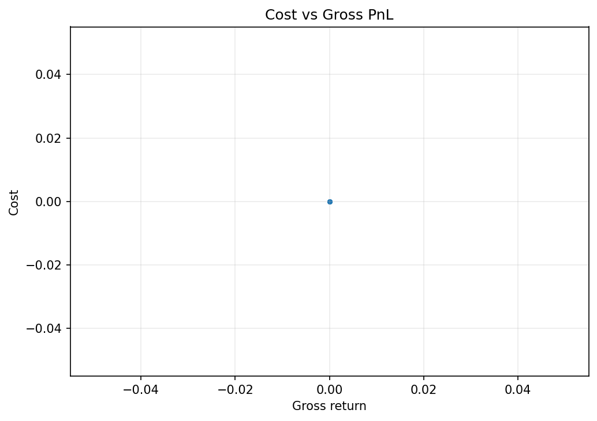

### Diagnostics Lgbm Gain Importance
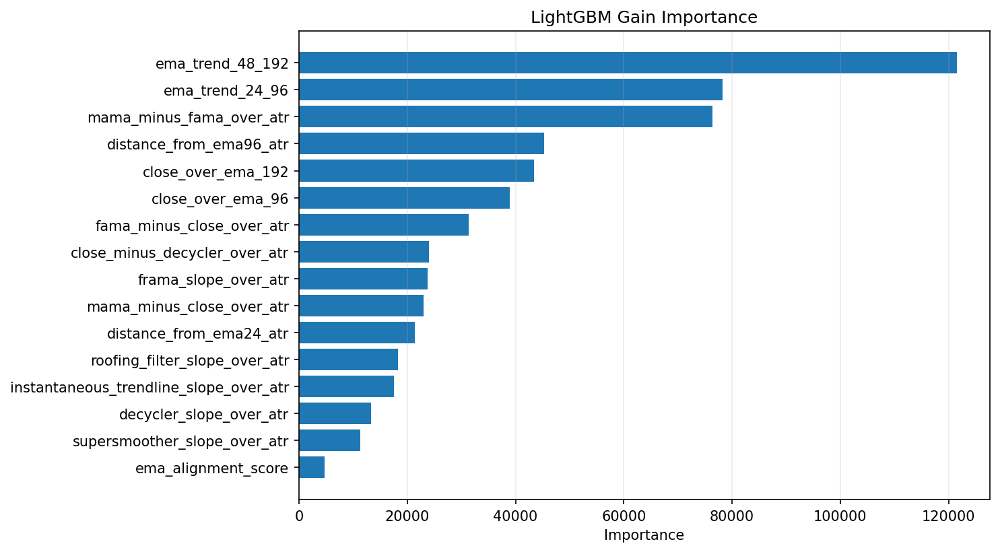

### Diagnostics Lgbm Split Importance
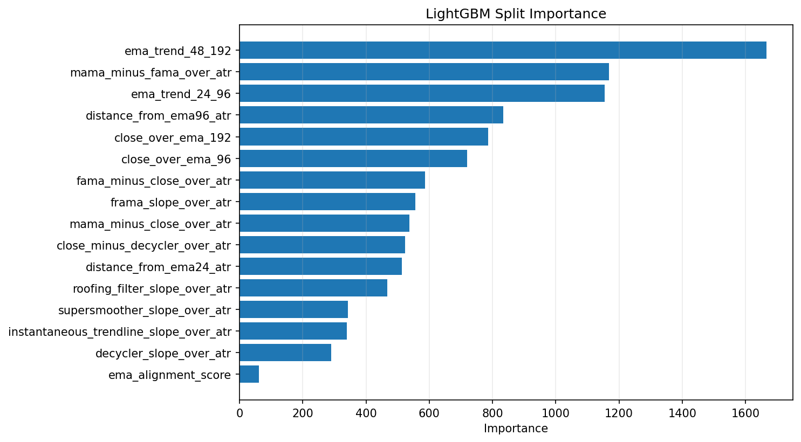

### Diagnostics Prediction Autocorrelation
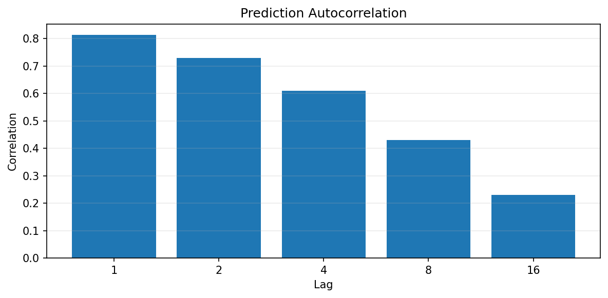

### Diagnostics Prediction Histogram
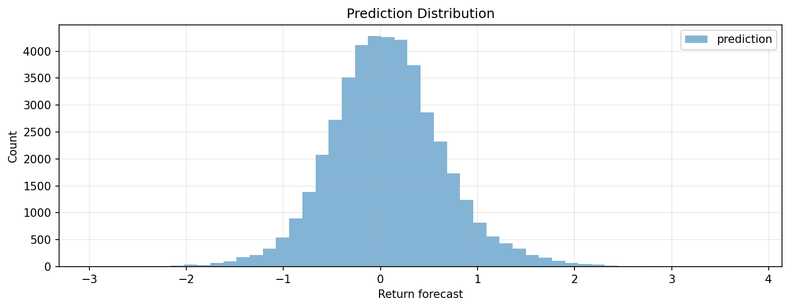

### Diagnostics Prediction Quantiles
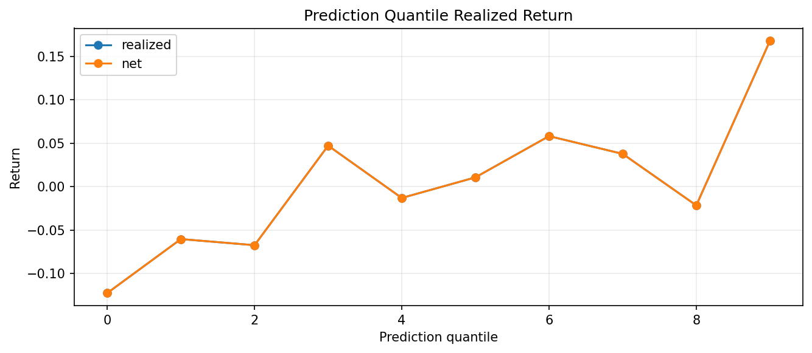

### Diagnostics Prediction Timeseries
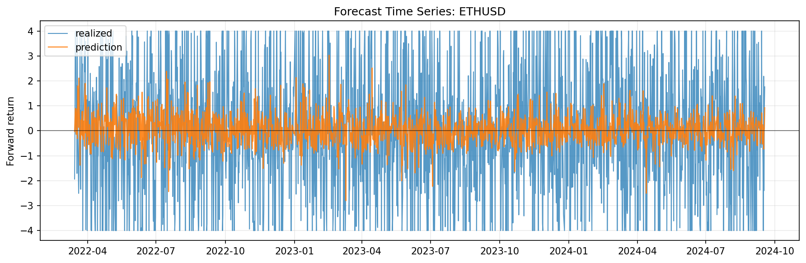

### Diagnostics Prediction Vs Realized
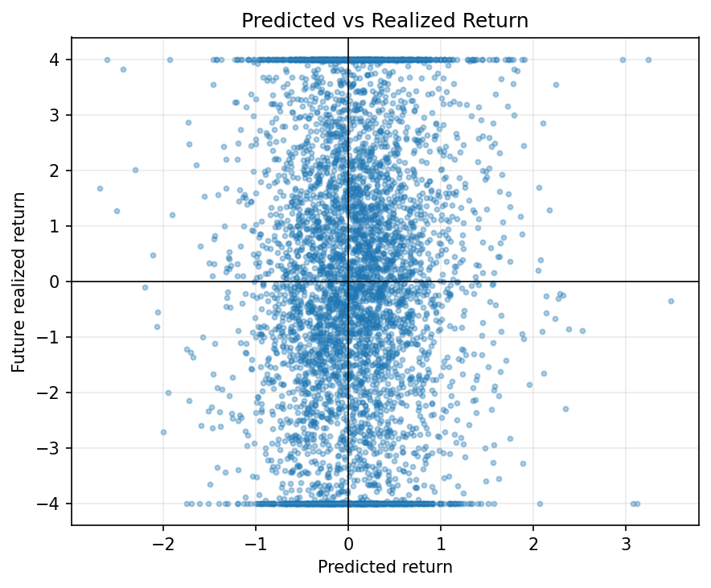

### Diagnostics Residual Histogram
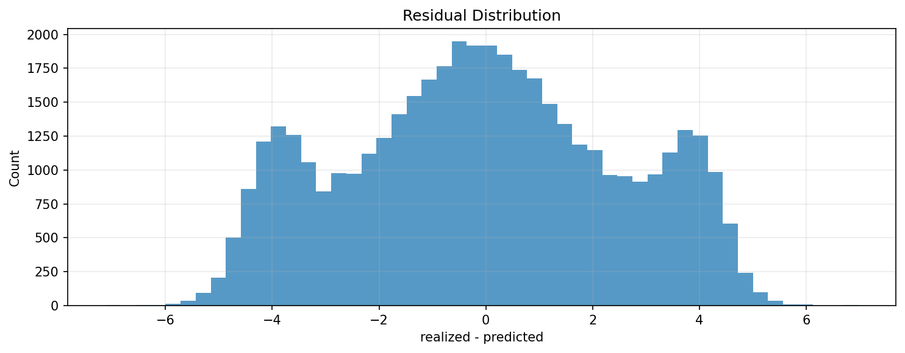

### Diagnostics Turnover Timeseries
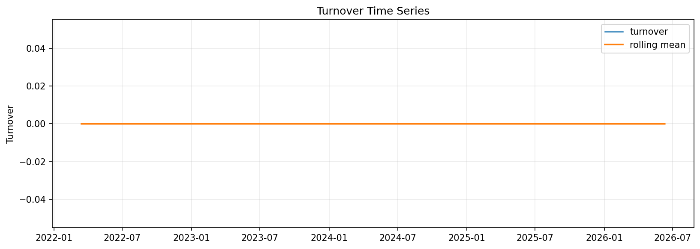

### Diagnostics Turnover Vs Net Pnl
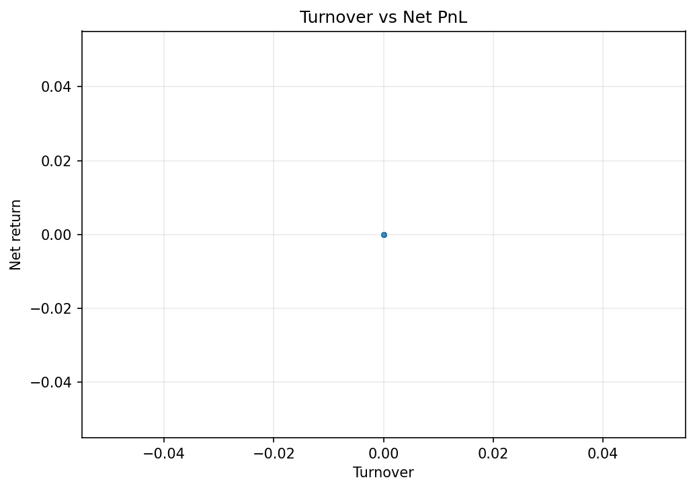

### Equity Curve Chart
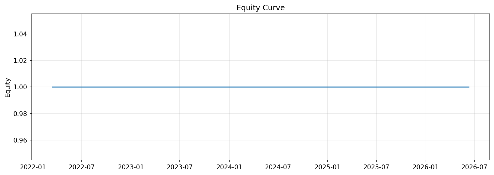

### Drawdown Curve
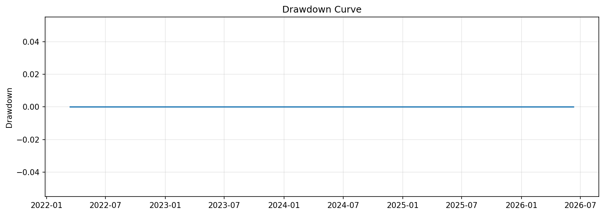

### Cumulative Returns
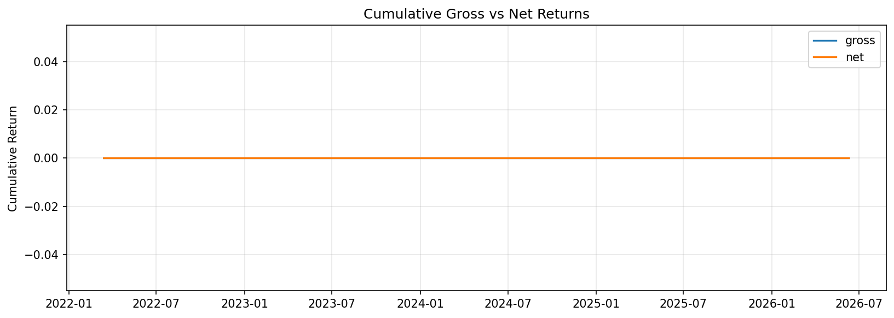

### Monthly Returns
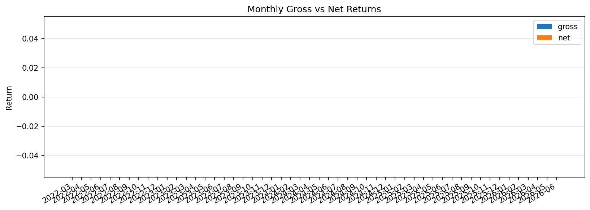

### Rolling Pnl
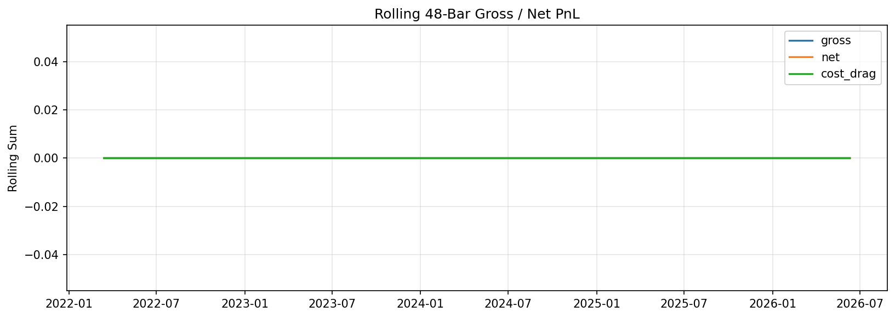

### Cumulative Cost Drag
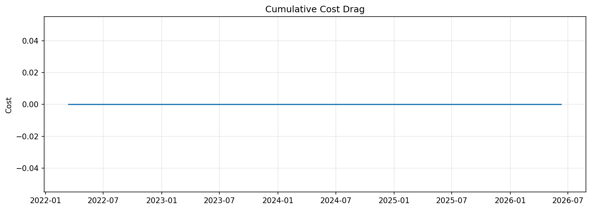

### Positions Turnover
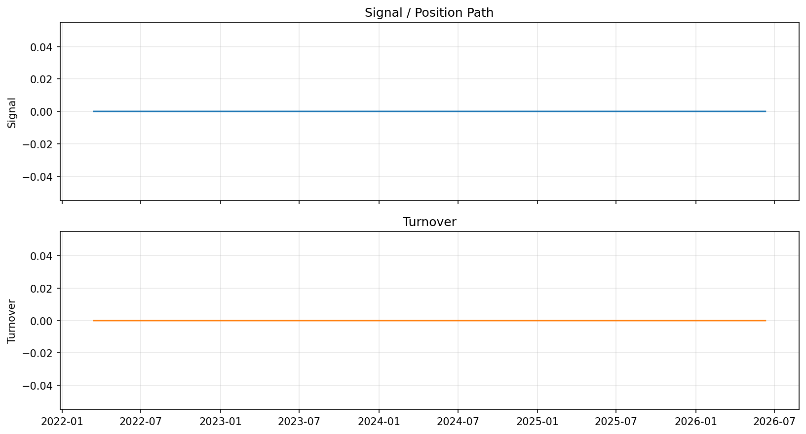

### Rolling Behavior
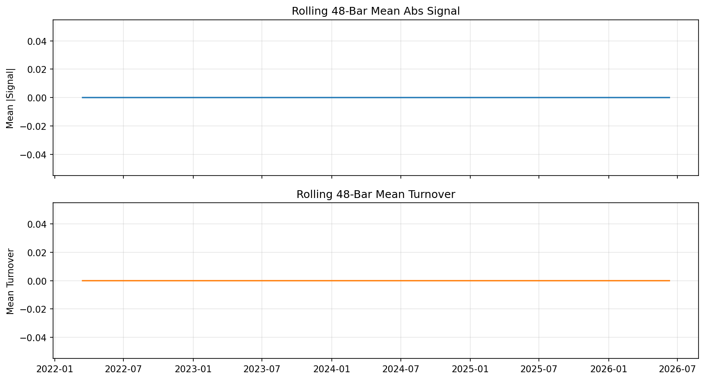

### Signal Distribution
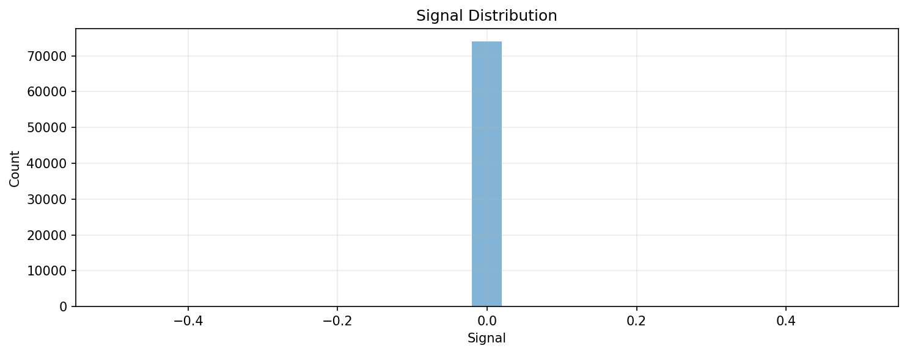

### Fold Net Pnl
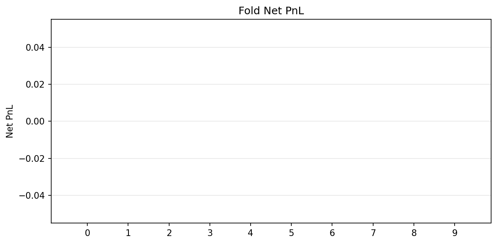

### Feature Importance Chart


### Prediction Coverage By Fold
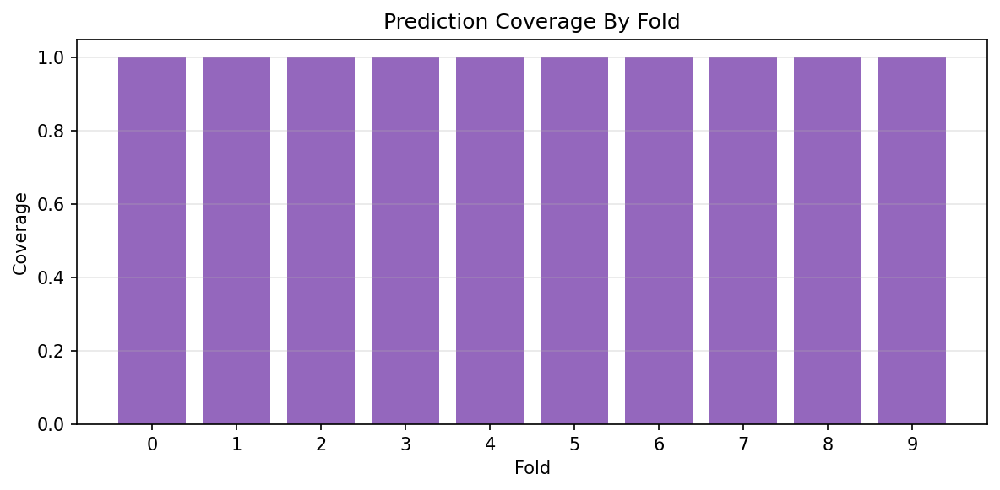


## Fold Breakdown
| Fold | Rows | Gross PnL | Net PnL | Cost | Sharpe | Avg Turnover | Mean Reward | Mean Abs Signal | Signal Turnover | Flat Rate |
| --- | --- | --- | --- | --- | --- | --- | --- | --- | --- | --- |
| 0 |  | 0.0 | 0.0 | 0.0 | 0.0 | 0.0 |  |  |  |  |
| 1 |  | 0.0 | 0.0 | 0.0 | 0.0 | 0.0 |  |  |  |  |
| 2 |  | 0.0 | 0.0 | 0.0 | 0.0 | 0.0 |  |  |  |  |
| 3 |  | 0.0 | 0.0 | 0.0 | 0.0 | 0.0 |  |  |  |  |
| 4 |  | 0.0 | 0.0 | 0.0 | 0.0 | 0.0 |  |  |  |  |
| 5 |  | 0.0 | 0.0 | 0.0 | 0.0 | 0.0 |  |  |  |  |
| 6 |  | 0.0 | 0.0 | 0.0 | 0.0 | 0.0 |  |  |  |  |
| 7 |  | 0.0 | 0.0 | 0.0 | 0.0 | 0.0 |  |  |  |  |
| 8 |  | 0.0 | 0.0 | 0.0 | 0.0 | 0.0 |  |  |  |  |
| 9 |  | 0.0 | 0.0 | 0.0 | 0.0 | 0.0 |  |  |  |  |


## Model Fold Diagnostics
| Fold | Train Raw | Train Used | Train Missing Features | Train Not Labeled | Train Without Fit | Test Rows | Pred Rows | Test Missing Features | Test Not Candidates | Test Without Prediction | Train Feature Missing | Test Feature Missing | Eval Rows |
| --- | --- | --- | --- | --- | --- | --- | --- | --- | --- | --- | --- | --- | --- |
| 0 | 35016 | 35016 | 0 | 0 | 0 | 4380 | 4380 | 0 | 0 | 0 | 3 | 0 | 4380 |
| 1 | 39396 | 39396 | 0 | 0 | 0 | 4380 | 4380 | 0 | 0 | 0 | 3 | 0 | 4380 |
| 2 | 43752 | 43752 | 0 | 0 | 0 | 4380 | 4380 | 0 | 0 | 0 | 3 | 0 | 4380 |
| 3 | 48108 | 48108 | 0 | 0 | 0 | 4380 | 4380 | 0 | 0 | 0 | 3 | 0 | 4380 |
| 4 | 52464 | 52464 | 0 | 0 | 0 | 4380 | 4380 | 0 | 0 | 0 | 3 | 0 | 4380 |
| 5 | 56820 | 56820 | 0 | 0 | 0 | 4380 | 4380 | 0 | 0 | 0 | 3 | 0 | 4380 |
| 6 | 61176 | 61176 | 0 | 0 | 0 | 4380 | 4380 | 0 | 0 | 0 | 3 | 0 | 4380 |
| 7 | 65532 | 65532 | 0 | 0 | 0 | 4380 | 4380 | 0 | 0 | 0 | 3 | 0 | 4380 |
| 8 | 69888 | 69888 | 0 | 0 | 0 | 4380 | 4380 | 0 | 0 | 0 | 3 | 0 | 4380 |
| 9 | 74244 | 74244 | 0 | 0 | 0 | 4380 | 4380 | 0 | 0 | 0 | 3 | 0 | 4380 |


## Monitoring
- Drifted feature count: `0` / `16`
_No drifted features were flagged._

## Drift By Family
| Family | Feature Count | Drifted Count | Drifted Ratio | Mean Abs PSI | Max Abs PSI |
| --- | --- | --- | --- | --- | --- |
| unclassified | 14 | 0 | 0.0 | 0.024300 | 0.147042 |
| trend | 2 | 0 | 0.0 | 0.133008 | 0.139304 |


## Feature Set
| Order | Feature |
| --- | --- |
| 1 | ema_trend_24_96 |
| 2 | ema_trend_48_192 |
| 3 | close_over_ema_96 |
| 4 | close_over_ema_192 |
| 5 | ema_alignment_score |
| 6 | distance_from_ema24_atr |
| 7 | distance_from_ema96_atr |
| 8 | mama_minus_fama_over_atr |
| 9 | close_minus_decycler_over_atr |
| 10 | instantaneous_trendline_slope_over_atr |
| 11 | decycler_slope_over_atr |
| 12 | frama_slope_over_atr |
| 13 | supersmoother_slope_over_atr |
| 14 | mama_minus_close_over_atr |
| 15 | fama_minus_close_over_atr |
| 16 | roofing_filter_slope_over_atr |

## Feature Steps
```yaml
- step: returns
  params:
    log: false
    col_name: close_ret
  outputs: {}
  enabled: true
  transforms:
    lag:
      enabled: true
      items:
      - source_col: close_ret
        lag: 1
        output_col: lag_close_ret_1
      - source_col: close_ret
        lag: 2
        output_col: lag_close_ret_2
      - source_col: close_ret
        lag: 4
        output_col: lag_close_ret_4
      - source_col: close_ret
        lag: 8
        output_col: lag_close_ret_8
      - source_col: close_ret
        lag: 16
        output_col: lag_close_ret_16
      - source_col: close_ret
        lag: 24
        output_col: lag_close_ret_24
      - source_col: close_ret
        lag: 48
        output_col: lag_close_ret_48
- step: volatility
  params:
    returns_col: close_ret
    rolling_windows:
    - 24
    - 48
    - 96
    - 192
    ewma_spans: []
    annualization_factor: null
  outputs: {}
  enabled: true
- step: trend
  params:
    price_col: close
    sma_windows: []
    ema_spans:
    - 24
    - 48
    - 96
    - 192
    ema_col_template: ema_{span}
    add_ratios: false
  outputs: {}
  enabled: true
  transforms:
    ratio:
      enabled: true
      items:
      - numerator_col: ema_24
        denominator_col: ema_96
        output_col: ema_trend_24_96
        subtract: 1.0
      - numerator_col: ema_48
        denominator_col: ema_192
        output_col: ema_trend_48_192
        subtract: 1.0
      - numerator_col: close
        denominator_col: ema_96
        output_col: close_over_ema_96
        subtract: 1.0
      - numerator_col: close
        denominator_col: ema_192
        output_col: close_over_ema_192
        subtract: 1.0
- step: atr
  params:
    high_col: high
    low_col: low
    close_col: close
    window: 48
    windows:
    - 48
    method: wilder
    add_over_price: false
    atr_col: atr_48
  outputs: {}
  enabled: true
  transforms:
    ratio:
      enabled: true
      items:
      - numerator_col: atr_48
        denominator_col: close
        output_col: atr_over_price_48
- step: hilbert_transform
  params:
    price_col: close
    window: 64
    amplitude_col: hilbert_amplitude
    phase_col: hilbert_phase
    instantaneous_frequency_col: hilbert_instantaneous_frequency
    add_derived: false
  outputs: {}
  enabled: true
- step: dominant_cycle_period
  params:
    price_col: close
    output_col: dominant_cycle_period
  outputs: {}
  enabled: true
- step: dominant_cycle_phase
  params:
    price_col: close
    output_col: dominant_cycle_phase
    unit: degrees
  outputs: {}
  enabled: true
- step: mama
  params:
    price_col: close
    fast_limit: 0.5
    slow_limit: 0.05
    output_col: mama
  outputs: {}
  enabled: true
- step: fama
  params:
    price_col: close
    fast_limit: 0.5
    slow_limit: 0.05
    output_col: fama
  outputs: {}
  enabled: true
- step: decycler
  params:
    price_col: close
    period: 60
    output_col: decycler
  outputs: {}
  enabled: true
- step: decycler_oscillator
  params:
    price_col: close
    fast_period: 30
    slow_period: 60
    output_col: decycler_oscillator_30_60
  outputs: {}
  enabled: true
- step: instantaneous_trendline
  params:
    price_col: close
    alpha: 0.07
    output_col: instantaneous_trendline
    add_trigger: false
  outputs: {}
  enabled: true
- step: frama
  params:
    price_col: close
    high_col: high
    low_col: low
    window: 16
    fast_period: 4
    slow_period: 300
    output_col: frama
    add_diagnostics: false
  outputs: {}
  enabled: true
- step: supersmoother
  params:
    price_col: close
    period: 10
    output_col: supersmoother
  outputs: {}
  enabled: true
- step: roofing_filter
  params:
    price_col: close
    high_pass_period: 48
    low_pass_period: 10
    output_col: roofing_filter
  outputs: {}
  enabled: true
- step: ehlers_ml_long_candidate
  params:
    amplitude_col: hilbert_amplitude
    cycle_period_col: dominant_cycle_period
    roofing_col: roofing_filter
    mama_col: mama
    fama_col: fama
    close_col: close
    decycler_col: decycler
    instantaneous_trendline_col: instantaneous_trendline
    frama_col: frama
    supersmoother_col: supersmoother
    dominant_cycle_phase_col: dominant_cycle_phase
    dominant_cycle_phase_unit: degrees
    atr_col: atr_48
    amplitude_lookback: 128
    amplitude_min_quantile: 0.5
    min_cycle_period: 8.0
    max_cycle_period: 60.0
    slope_bars: 1
    candidate_col: ehlers_ml_candidate
    side_col: ehlers_ml_side
  outputs: {}
  enabled: true
- step: macd
  params:
    price_col: close
    fast: 12
    slow: 26
    signal: 9
  outputs:
    macd_12_26: macd
    macd_signal_9: macd_signal
    macd_hist_12_26_9: macd_hist
  enabled: true
- step: rsi
  params:
    price_col: close
    windows:
    - 14
    method: wilder
  outputs:
    close_rsi_14: rsi_14
  enabled: true
- step: stochastic_rsi
  params:
    price_col: close
    rsi_period: 14
    stoch_period: 14
    k_period: 3
    d_period: 3
    oversold: 0.2
    overbought: 0.8
    prefix: stoch_rsi
  outputs:
    stoch_rsi_k: stoch_rsi_k
    stoch_rsi_d: stoch_rsi_d
  enabled: true
- step: bollinger
  params:
    price_col: close
    window: 192
    n_std: 2.0
  outputs:
    bb_ma_192: bollinger_mid_192
    bb_upper_192_2.0: bollinger_upper_192
    bb_lower_192_2.0: bollinger_lower_192
    bb_width_192_2.0: bollinger_bandwidth
    bb_percent_b_192_2.0: bollinger_percent_b
  enabled: true
  transforms:
    ratio:
      enabled: true
      items:
      - numerator_col: close
        denominator_col: bb_upper_192_2.0
        output_col: close_over_bb_upper_192
        subtract: 1.0
      - numerator_col: close
        denominator_col: bb_ma_192
        output_col: close_over_bb_mid_192
        subtract: 1.0
- step: indicator_pullback
  params:
    asset_vocab:
    - ETHUSD
    open_col: open
    high_col: high
    low_col: low
    close_col: close
    ema_fast_period: 24
    ema_mid_period: 96
    ema_slow_period: 192
    atr_period: 48
    atr_pct_rank_window: 192
    macd_hist_col: macd_hist
    rsi_period: 14
    stoch_k_col: stoch_rsi_k
    stoch_d_col: stoch_rsi_d
    bollinger_bandwidth_col: bollinger_bandwidth
    bollinger_percent_b_col: bollinger_percent_b
    bb_bandwidth_rank_window: 192
    realized_vol_windows:
    - 24
    - 48
    - 96
    - 192
    return_windows:
    - 1
    - 4
    - 8
    - 16
    - 24
    - 48
    rolling_return_windows:
    - 24
    - 48
  outputs: {}
  enabled: true
```

## Config Snapshot
```yaml
data:
  source: dukascopy_csv
  interval: 30m
  start: null
  end: null
  alignment: inner
  symbol: ETHUSD
  symbols: null
  api_key: null
  api_key_env: null
  pit:
    timestamp_alignment:
      source_timezone: UTC
      output_timezone: UTC
      normalize_daily: false
      duplicate_policy: last
    corporate_actions:
      policy: none
      adj_close_col: adj_close
    universe_snapshot:
      inactive_policy: raise
  storage:
    mode: cached_only
    dataset_id: ethusd_30m_lightgbm_h24_structured_tail_alpha_v3_7_ehlers_trend_hybrid
    save_raw: false
    save_processed: true
    load_path: /workspace/data/raw/dukascopy_30m_clean/ethusd_30m.csv
    raw_dir: /workspace/data/raw
    processed_dir: /workspace/data/processed
    load_paths: null
model:
  kind: lightgbm_regressor
  params:
    n_estimators: 800
    learning_rate: 0.0549537895493607
    max_depth: 6
    num_leaves: 15
    min_child_samples: 200
    subsample: 0.9
    colsample_bytree: 0.75
    reg_alpha: 0.019934229992965794
    reg_lambda: 1.8786413727433209
    random_state: 7
    n_jobs: 1
    verbosity: -1
  outputs:
    pred_ret_col: pred_ret
    pred_prob_col: pred_prob
    pred_is_oos_col: pred_is_oos
  preprocessing:
    scaler: none
  calibration: {}
  feature_cols:
  - ema_trend_24_96
  - ema_trend_48_192
  - close_over_ema_96
  - close_over_ema_192
  - ema_alignment_score
  - distance_from_ema24_atr
  - distance_from_ema96_atr
  - mama_minus_fama_over_atr
  - close_minus_decycler_over_atr
  - instantaneous_trendline_slope_over_atr
  - decycler_slope_over_atr
  - frama_slope_over_atr
  - supersmoother_slope_over_atr
  - mama_minus_close_over_atr
  - fama_minus_close_over_atr
  - roofing_filter_slope_over_atr
  target:
    kind: future_return_regression
    price_col: close
    returns_col: close_ret
    returns_type: simple
    horizon_bars: 24
    normalize_by_volatility: true
    volatility_col: atr_48
    clip:
    - -4.0
    - 4.0
    fwd_col: target_future_return_h24_atr
    label_col: target_future_return_h24_atr
  split:
    method: purged
    train_size: 35040
    test_size: 4380
    step_size: 4380
    expanding: true
    max_folds: 10
    purge_bars: 24
    embargo_bars: 24
  runtime: {}
  env: {}
  use_features: true
  pred_prob_col: pred_prob
  pred_raw_prob_col: null
  pred_ret_col: pred_ret
  pred_is_oos_col: pred_is_oos
  returns_input_col: null
  signal_col: null
  action_col: null
signals:
  kind: forecast_threshold
  params:
    forecast_col: pred_ret
    signal_col: signal_direction_disabled
    upper: 999.0
    lower: -999.0
    mode: long_short
    activation_filters: []
  outputs: {}
risk:
  cost_per_turnover: 0.0001
  slippage_per_turnover: 0.0
  target_vol: null
  max_leverage: 1.0
  dd_guard:
    enabled: false
    max_drawdown: 0.2
    cooloff_bars: 20
    rearm_drawdown: 0.2
  portfolio_guard: {}
  sizing: {}
  drawdown_sizing: {}
  vol_col: null
backtest:
  engine: vectorized
  returns_col: close_ret
  signal_col: signal_direction_disabled
  periods_per_year: 17520
  returns_type: simple
  missing_return_policy: raise_if_exposed
  min_holding_bars: 24
  subset: test
  stop_mode: fixed_return
  vol_col: null
  open_col: open
  high_col: high
  low_col: low
  close_col: close
  take_profit_r: null
  stop_loss_r: null
  volatility_col: null
  entry_price_mode: null
  profit_barrier_r: null
  stop_barrier_r: null
  vertical_barrier_bars: null
  tie_break: null
  event_time_remap_policy: null
  max_cost_r: null
  risk_per_trade: null
  max_holding_bars: null
  asset_params: {}
  dynamic_exits: {}
  partial_exits: {}
  allow_short: false
portfolio:
  enabled: false
  construction: signal_weights
  gross_target: 1.0
  long_short: true
  expected_return_col: null
  covariance_window: 60
  covariance_rebalance_step: 1
  risk_aversion: 5.0
  trade_aversion: 0.0
  selection:
    enabled: false
    top_k: 1
    min_expected_net_return: 0.0
    rank_by_abs: true
    weighting: score
    rebalance_every_n_bars: 1
  constraints:
    enforce_target_net_exposure: true
  asset_groups: {}
runtime:
  seed: 7
  repro_mode: strict
  deterministic: true
  threads: 1
  seed_torch: false
```

## Artifact Inventory
- `report_markdown`: `report.md`
- `config`: `config_used.yaml`
- `summary`: `summary.json`
- `run_metadata`: `run_metadata.json`
- `equity_curve`: `equity_curve.csv`
- `returns`: `returns.csv`
- `gross_returns`: `gross_returns.csv`
- `costs`: `costs.csv`
- `turnover`: `turnover.csv`
- `positions`: `positions.csv`
- `monitoring`: `monitoring_report.json`
- `feature_importance`: `feature_importance.csv`
- `prediction_diagnostics`: `prediction_diagnostics.json`
- `missing_value_diagnostics`: `missing_value_diagnostics.json`
- `fold_model_summary`: `fold_model_summary.csv`
- `stage_tails`: `stage_tails.json`
- `diagnostics_fold_backtest_diagnostics`: `artifacts/diagnostics/fold_backtest_diagnostics.csv`
- `diagnostics_forecast_alpha_diagnostics_summary`: `artifacts/diagnostics/forecast_alpha_diagnostics_summary.json`
- `diagnostics_forecast_baselines`: `artifacts/diagnostics/forecast_baselines.csv`
- `diagnostics_lab_feature_diagnostics_ETHUSD`: `artifacts/diagnostics/lab_feature_diagnostics_ETHUSD.json`
- `diagnostics_lightgbm_importance`: `artifacts/diagnostics/lightgbm_importance.csv`
- `diagnostics_prediction_autocorrelation`: `artifacts/diagnostics/prediction_autocorrelation.png`
- `diagnostics_prediction_distribution`: `artifacts/diagnostics/prediction_distribution.csv`
- `diagnostics_prediction_metrics`: `artifacts/diagnostics/prediction_metrics.csv`
- `diagnostics_prediction_quantiles`: `artifacts/diagnostics/prediction_quantiles.png`
- `diagnostics_regime_diagnostics`: `artifacts/diagnostics/regime_diagnostics.csv`
- `diagnostics_summary`: `artifacts/diagnostics/summary.json`
- `diagnostics_turnover_cost_timeseries`: `artifacts/diagnostics/turnover_cost_timeseries.csv`
- `diagnostics_cost_vs_gross_pnl`: `artifacts/diagnostics/cost_vs_gross_pnl.png`
- `diagnostics_lgbm_gain_importance`: `artifacts/diagnostics/lgbm_gain_importance.png`
- `diagnostics_lgbm_split_importance`: `artifacts/diagnostics/lgbm_split_importance.png`
- `diagnostics_prediction_histogram`: `artifacts/diagnostics/prediction_histogram.png`
- `diagnostics_prediction_timeseries`: `artifacts/diagnostics/prediction_timeseries.png`
- `diagnostics_prediction_vs_realized`: `artifacts/diagnostics/prediction_vs_realized.png`
- `diagnostics_residual_histogram`: `artifacts/diagnostics/residual_histogram.png`
- `diagnostics_turnover_timeseries`: `artifacts/diagnostics/turnover_timeseries.png`
- `diagnostics_turnover_vs_net_pnl`: `artifacts/diagnostics/turnover_vs_net_pnl.png`
- `equity_curve_chart`: `report_assets/equity_curve.png`
- `drawdown_curve`: `report_assets/drawdown_curve.png`
- `cumulative_returns`: `report_assets/cumulative_returns.png`
- `monthly_returns`: `report_assets/monthly_returns.png`
- `rolling_pnl`: `report_assets/rolling_pnl.png`
- `cumulative_cost_drag`: `report_assets/cumulative_cost_drag.png`
- `positions_turnover`: `report_assets/positions_turnover.png`
- `rolling_behavior`: `report_assets/rolling_behavior.png`
- `signal_distribution`: `report_assets/signal_distribution.png`
- `fold_net_pnl`: `report_assets/fold_net_pnl.png`
- `feature_importance_chart`: `report_assets/feature_importance.png`
- `prediction_coverage_by_fold`: `report_assets/prediction_coverage_by_fold.png`
