# Experiment Report: ethusd_30m_trial0041_tgt_triple_barrier_h24_lgbmclf_v1

## Overview
- Config path: `/workspace/config/experiments/foundation_alpha/ethusd_30m_trial_0041_alpha_lab/01_target_lab/ethusd_30m_trial0041_tgt_triple_barrier_h24_lgbmclf_v1.yaml`
- Model kind: `lightgbm_clf`
- Symbols: `ETHUSD`
- Data source: `dukascopy_csv` at interval `30m`
- Data window: `None` to `2026-06-09 23:30:00`
- Rows / columns: `109005` rows, `130` columns
- Target: `triple_barrier` horizon `24`
- Feature count: `46`
- Runtime seed: `7`

## Pipeline Trace

### 1. Entry Point
- `runner.run_experiment` -> `src.experiments.runner.run_experiment(config_path: 'str | Path') -> 'ExperimentResult'`
- `runner._load_asset_frames` -> `src.experiments.runner._load_asset_frames(data_cfg: 'dict[str, object]')`
- `pipeline.run_experiment_pipeline` -> `src.experiments.orchestration.pipeline.run_experiment_pipeline(config_path: 'str | Path', *, load_asset_frames_fn: 'LoadAssetFramesFn', save_processed_snapshot_fn: 'SaveProcessedFn') -> 'ExperimentResult'`

```yaml
config_path: /workspace/config/experiments/foundation_alpha/ethusd_30m_trial_0041_alpha_lab/01_target_lab/ethusd_30m_trial0041_tgt_triple_barrier_h24_lgbmclf_v1.yaml
runtime:
  seed: 7
  repro_mode: strict
  deterministic: true
  threads: 1
  seed_torch: false
```

### 2. Data Load And PIT
- `data_stage.load_asset_frames` -> `src.experiments.orchestration.data_stage.load_asset_frames(data_cfg: 'dict[str, Any]', *, load_ohlcv_fn: 'SingleAssetLoader', load_ohlcv_panel_fn: 'PanelLoader', apply_pit_hardening_fn: 'PitFn', validate_ohlcv_fn: 'ValidateFrameFn', validate_data_contract_fn: 'ValidateFrameFn') -> 'tuple[dict[str, pd.DataFrame], dict[str, Any]]'`
- `src_data.loaders.load_ohlcv` -> `src.src_data.loaders.load_ohlcv(symbol: 'str', start: 'str | None' = None, end: 'str | None' = None, interval: 'str' = '1d', source: "Literal['yahoo', 'alpha', 'twelve_data', 'twelve', 'dukascopy_csv']" = 'yahoo', api_key: 'Optional[str]' = None) -> 'pd.DataFrame'`
- `src_data.loaders.load_ohlcv_panel` -> `src.src_data.loaders.load_ohlcv_panel(symbols: 'Sequence[str]', start: 'str | None' = None, end: 'str | None' = None, interval: 'str' = '1d', source: "Literal['yahoo', 'alpha', 'twelve_data', 'twelve', 'dukascopy_csv']" = 'yahoo', api_key: 'Optional[str]' = None) -> 'dict[str, pd.DataFrame]'`
- `src_data.pit.apply_pit_hardening` -> `src.src_data.pit.apply_pit_hardening(df: 'pd.DataFrame', *, pit_cfg: 'Mapping[str, Any] | None' = None, symbol: 'str | None' = None) -> 'tuple[pd.DataFrame, dict[str, Any]]'`
- `src_data.validation.validate_ohlcv` -> `src.src_data.validation.validate_ohlcv(df: 'pd.DataFrame', required_columns: 'Iterable[str]' = ('open', 'high', 'low', 'close', 'volume'), allow_missing_volume: 'bool' = True) -> 'None'`
- `experiments.contracts.validate_data_contract` -> `src.evaluation.contracts.validate_data_contract(df: 'pd.DataFrame', contract: 'DataContract | None' = None) -> 'dict[str, int]'`
- `schemas.StorageContext` -> `src.experiments.schemas.StorageContext(symbols: 'list[str]', source: 'str | None', interval: 'str | None', start: 'str | None', end: 'str | None', pit: 'dict[str, Any]' = <factory>, pit_hash_sha256: 'str | None' = None) -> None`  
  Context object persisted into snapshot metadata.
- `data_stage.save_processed_snapshot_if_enabled` -> `src.experiments.orchestration.data_stage.save_processed_snapshot_if_enabled(asset_frames: 'dict[str, pd.DataFrame]', *, data_cfg: 'dict[str, Any]', config_hash_sha256: 'str', feature_steps: 'list[dict[str, Any]]', logging_cfg: 'dict[str, Any] | None' = None) -> 'dict[str, Any] | None'`

```yaml
data:
  source: dukascopy_csv
  interval: 30m
  start: null
  end: null
  alignment: inner
  symbol: ETHUSD
  symbols: null
  api_key: null
  api_key_env: null
  pit:
    timestamp_alignment:
      source_timezone: UTC
      output_timezone: UTC
      normalize_daily: false
      duplicate_policy: last
    corporate_actions:
      policy: none
      adj_close_col: adj_close
    universe_snapshot:
      inactive_policy: raise
  storage:
    mode: cached_only
    dataset_id: ethusd_30m_lightgbm_h24_structured_tail_alpha_v3_7_ehlers_trend_hybrid
    save_raw: false
    save_processed: false
    load_path: /workspace/data/raw/dukascopy_30m_clean/ethusd_30m.csv
    raw_dir: /workspace/data/raw
    processed_dir: /workspace/data/processed
    load_paths: null
```

### 3. Feature Engineering
- `feature_stage.apply_steps_to_assets` -> `src.experiments.orchestration.feature_stage.apply_steps_to_assets(asset_frames: 'dict[str, pd.DataFrame]', *, feature_steps: 'list[dict[str, Any]]') -> 'dict[str, pd.DataFrame]'`
- `feature_stage.apply_feature_steps` -> `src.experiments.orchestration.feature_stage.apply_feature_steps(df: 'pd.DataFrame', steps: 'list[dict[str, Any]]', *, asset: 'str | None' = None) -> 'pd.DataFrame'`
- `feature[returns]` -> `src.features.helpers.normalizations.returns.add_close_returns(df: 'pd.DataFrame', log: 'bool' = False, col_name: 'str | None' = None) -> 'pd.DataFrame'`  
  params={'log': False, 'col_name': 'close_ret'}
- `feature[volatility]` -> `src.features.volatility.add_volatility_features(df: 'pd.DataFrame', returns_col: 'str' = 'close_logret', rolling_windows: 'Sequence[int]' = (10, 20, 60), ewma_spans: 'Sequence[int]' = (10, 20), annualization_factor: 'Optional[float]' = 252.0, inplace: 'bool' = False) -> 'pd.DataFrame'`  
  params={'returns_col': 'close_ret', 'rolling_windows': [24, 48, 96, 192], 'ewma_spans': [], 'annualization_factor': None}
- `feature[trend]` -> `src.features.technical.trend.add_trend_features(df: 'pd.DataFrame', price_col: 'str' = 'close', sma_windows: 'Sequence[int]' = (20, 50, 200), ema_spans: 'Sequence[int]' = (20, 50), sma_col_template: 'str | None' = None, ema_col_template: 'str | None' = None, add_ratios: 'bool' = False, inplace: 'bool' = False) -> 'pd.DataFrame'`  
  params={'price_col': 'close', 'sma_windows': [], 'ema_spans': [24, 48, 96, 192], 'ema_col_template': 'ema_{span}', 'add_ratios': False}
- `feature[atr]` -> `src.features.technical.atr.add_atr_features(df: 'pd.DataFrame', high_col: 'str' = 'high', low_col: 'str' = 'low', close_col: 'str' = 'close', window: 'int' = 14, windows: 'Sequence[int] | None' = None, method: 'str' = 'wilder', add_over_price: 'bool' = False, atr_col: 'str | None' = None, over_price_col: 'str | None' = None, inplace: 'bool' = False) -> 'pd.DataFrame'`  
  params={'high_col': 'high', 'low_col': 'low', 'close_col': 'close', 'window': 48, 'windows': [48], 'method': 'wilder', 'add_over_price': False, 'atr_col': 'atr_48'}
- `feature[hilbert_transform]` -> `src.features.hilbert_transform.add_hilbert_transform(df: 'pd.DataFrame', price_col: 'str' = 'close', window: 'int' = 64, amplitude_col: 'str | None' = None, phase_col: 'str | None' = None, instantaneous_frequency_col: 'str | None' = None, dominant_cycle_col: 'str | None' = None, cycle_ok_col: 'str | None' = None, amplitude_rising_col: 'str | None' = None, min_cycle: 'int' = 10, max_cycle: 'int' = 48, amplitude_slope_bars: 'int' = 3, add_derived: 'bool' = False) -> 'pd.DataFrame'`  
  params={'price_col': 'close', 'window': 64, 'amplitude_col': 'hilbert_amplitude', 'phase_col': 'hilbert_phase', 'instantaneous_frequency_col': 'hilbert_instantaneous_frequency', 'add_derived': False}
- `feature[dominant_cycle_period]` -> `src.features.dominant_cycle_period.add_dominant_cycle_period(df: 'pd.DataFrame', price_col: 'str' = 'close', output_col: 'str | None' = None) -> 'pd.DataFrame'`  
  params={'price_col': 'close', 'output_col': 'dominant_cycle_period'}
- `feature[dominant_cycle_phase]` -> `src.features.dominant_cycle_phase.add_dominant_cycle_phase(df: 'pd.DataFrame', price_col: 'str' = 'close', output_col: 'str | None' = None, unit: 'str' = 'degrees') -> 'pd.DataFrame'`  
  params={'price_col': 'close', 'output_col': 'dominant_cycle_phase', 'unit': 'degrees'}
- `feature[mama]` -> `src.features.mama.add_mama(df: 'pd.DataFrame', price_col: 'str' = 'close', fast_limit: 'float' = 0.5, slow_limit: 'float' = 0.05, output_col: 'str | None' = None) -> 'pd.DataFrame'`  
  params={'price_col': 'close', 'fast_limit': 0.5, 'slow_limit': 0.05, 'output_col': 'mama'}
- `feature[fama]` -> `src.features.fama.add_fama(df: 'pd.DataFrame', price_col: 'str' = 'close', fast_limit: 'float' = 0.5, slow_limit: 'float' = 0.05, output_col: 'str | None' = None) -> 'pd.DataFrame'`  
  params={'price_col': 'close', 'fast_limit': 0.5, 'slow_limit': 0.05, 'output_col': 'fama'}
- `feature[decycler]` -> `src.features.decycler.add_decycler(df: 'pd.DataFrame', price_col: 'str' = 'close', period: 'int' = 60, output_col: 'str | None' = None) -> 'pd.DataFrame'`  
  params={'price_col': 'close', 'period': 60, 'output_col': 'decycler'}
- `feature[decycler_oscillator]` -> `src.features.decycler_oscillator.add_decycler_oscillator(df: 'pd.DataFrame', price_col: 'str' = 'close', fast_period: 'int' = 30, slow_period: 'int' = 60, output_col: 'str | None' = None) -> 'pd.DataFrame'`  
  params={'price_col': 'close', 'fast_period': 30, 'slow_period': 60, 'output_col': 'decycler_oscillator_30_60'}
- `feature[instantaneous_trendline]` -> `src.features.instantaneous_trendline.add_instantaneous_trendline(df: 'pd.DataFrame', price_col: 'str' = 'close', alpha: 'float' = 0.07, output_col: 'str | None' = None, trigger_col: 'str | None' = None, add_trigger: 'bool' = True) -> 'pd.DataFrame'`  
  params={'price_col': 'close', 'alpha': 0.07, 'output_col': 'instantaneous_trendline', 'add_trigger': False}
- `feature[frama]` -> `src.features.frama.add_frama(df: 'pd.DataFrame', price_col: 'str' = 'close', high_col: 'str' = 'high', low_col: 'str' = 'low', window: 'int' = 16, fast_period: 'int' = 4, slow_period: 'int' = 300, output_col: 'str | None' = None, alpha_col: 'str | None' = None, fractal_dimension_col: 'str | None' = None, add_diagnostics: 'bool' = False) -> 'pd.DataFrame'`  
  params={'price_col': 'close', 'high_col': 'high', 'low_col': 'low', 'window': 16, 'fast_period': 4, 'slow_period': 300, 'output_col': 'frama', 'add_diagnostics': False}
- `feature[supersmoother]` -> `src.features.supersmoother.add_supersmoother(df: 'pd.DataFrame', price_col: 'str' = 'close', period: 'int' = 10, output_col: 'str | None' = None) -> 'pd.DataFrame'`  
  params={'price_col': 'close', 'period': 10, 'output_col': 'supersmoother'}
- `feature[roofing_filter]` -> `src.features.roofing_filter.add_roofing_filter(df: 'pd.DataFrame', price_col: 'str' = 'close', high_pass_period: 'int' = 48, low_pass_period: 'int' = 10, output_col: 'str | None' = None) -> 'pd.DataFrame'`  
  params={'price_col': 'close', 'high_pass_period': 48, 'low_pass_period': 10, 'output_col': 'roofing_filter'}
- `feature[ehlers_ml_long_candidate]` -> `src.features.ehlers_ml_long_candidate.ehlers_ml_long_candidate_feature(df: 'pd.DataFrame', *, amplitude_col: 'str' = 'hilbert_amplitude', cycle_period_col: 'str' = 'dominant_cycle_period', roofing_col: 'str' = 'roofing_filter', mama_col: 'str' = 'mama', fama_col: 'str' = 'fama', close_col: 'str' = 'close', decycler_col: 'str' = 'decycler', instantaneous_trendline_col: 'str' = 'instantaneous_trendline', frama_col: 'str' = 'frama', supersmoother_col: 'str' = 'supersmoother', dominant_cycle_phase_col: 'str' = 'dominant_cycle_phase', dominant_cycle_phase_unit: 'str' = 'degrees', atr_col: 'str | None' = None, amplitude_lookback: 'int' = 128, amplitude_min_quantile: 'float' = 0.5, min_cycle_period: 'float' = 8.0, max_cycle_period: 'float' = 60.0, slope_bars: 'int' = 1, candidate_col: 'str' = 'ehlers_ml_candidate', side_col: 'str' = 'signal_side') -> 'pd.DataFrame'`  
  params={'amplitude_col': 'hilbert_amplitude', 'cycle_period_col': 'dominant_cycle_period', 'roofing_col': 'roofing_filter', 'mama_col': 'mama', 'fama_col': 'fama', 'close_col': 'close', 'decycler_col': 'decycler', 'instantaneous_trendline_col': 'instantaneous_trendline', 'frama_col': 'frama', 'supersmoother_col': 'supersmoother', 'dominant_cycle_phase_col': 'dominant_cycle_phase', 'dominant_cycle_phase_unit': 'degrees', 'atr_col': 'atr_48', 'amplitude_lookback': 128, 'amplitude_min_quantile': 0.5, 'min_cycle_period': 8.0, 'max_cycle_period': 60.0, 'slope_bars': 1, 'candidate_col': 'ehlers_ml_candidate', 'side_col': 'ehlers_ml_side'}
- `feature[macd]` -> `src.features.technical.macd.add_macd_features(df: 'pd.DataFrame', price_col: 'str' = 'close', fast: 'int' = 12, slow: 'int' = 26, signal: 'int' = 9, inplace: 'bool' = False) -> 'pd.DataFrame'`  
  params={'price_col': 'close', 'fast': 12, 'slow': 26, 'signal': 9}
- `feature[rsi]` -> `src.features.technical.rsi.add_rsi_features(df: 'pd.DataFrame', price_col: 'str' = 'close', windows: 'Sequence[int]' = (14,), method: 'str' = 'wilder', inplace: 'bool' = False) -> 'pd.DataFrame'`  
  params={'price_col': 'close', 'windows': [14], 'method': 'wilder'}
- `feature[stochastic_rsi]` -> `src.features.technical.stochastic_rsi.add_stochastic_rsi_features(df: 'pd.DataFrame', price_col: 'str' = 'close', rsi_period: 'int' = 14, stoch_period: 'int' = 14, k_period: 'int' = 3, d_period: 'int' = 3, oversold: 'float' = 0.2, overbought: 'float' = 0.8, prefix: 'str' = 'stoch_rsi', method: 'str' = 'wilder', inplace: 'bool' = False) -> 'pd.DataFrame'`  
  params={'price_col': 'close', 'rsi_period': 14, 'stoch_period': 14, 'k_period': 3, 'd_period': 3, 'oversold': 0.2, 'overbought': 0.8, 'prefix': 'stoch_rsi'}
- `feature[bollinger]` -> `src.features.technical.bollinger.add_bollinger_features(df: 'pd.DataFrame', price_col: 'str' = 'close', window: 'int' = 20, n_std: 'float' = 2.0, inplace: 'bool' = False) -> 'pd.DataFrame'`  
  params={'price_col': 'close', 'window': 192, 'n_std': 2.0}
- `feature[indicator_pullback]` -> `src.features.technical.indicator_pullback.add_indicator_pullback_features(df: 'pd.DataFrame', *, asset: 'str | None' = None, asset_vocab: 'Sequence[str] | None' = None, asset_aliases: 'Mapping[str, str] | None' = None, open_col: 'str' = 'open', high_col: 'str' = 'high', low_col: 'str' = 'low', close_col: 'str' = 'close', ema_fast_period: 'int' = 20, ema_mid_period: 'int' = 50, ema_slow_period: 'int' = 100, ema_fast_col: 'str | None' = None, ema_mid_col: 'str | None' = None, ema_slow_col: 'str | None' = None, atr_period: 'int' = 14, atr_col: 'str | None' = None, atr_pct_col: 'str' = 'atr_pct', atr_pct_rank_window: 'int' = 100, macd_hist_col: 'str' = 'macd_hist', rsi_period: 'int' = 14, rsi_col: 'str | None' = None, stoch_k_col: 'str' = 'stoch_rsi_k', stoch_d_col: 'str' = 'stoch_rsi_d', bollinger_bandwidth_col: 'str' = 'bollinger_bandwidth', bollinger_percent_b_col: 'str' = 'bollinger_percent_b', realized_vol_windows: 'Sequence[int] | None' = (10, 20), return_windows: 'Sequence[int] | None' = (1, 2, 3, 6), rolling_return_windows: 'Sequence[int] | None' = (4, 8), bb_bandwidth_rank_window: 'int | None' = 100, include_asset_id: 'bool' = True, inplace: 'bool' = False) -> 'pd.DataFrame'`  
  params={'asset_vocab': ['ETHUSD'], 'open_col': 'open', 'high_col': 'high', 'low_col': 'low', 'close_col': 'close', 'ema_fast_period': 24, 'ema_mid_period': 96, 'ema_slow_period': 192, 'atr_period': 48, 'atr_pct_rank_window': 192, 'macd_hist_col': 'macd_hist', 'rsi_period': 14, 'stoch_k_col': 'stoch_rsi_k', 'stoch_d_col': 'stoch_rsi_d', 'bollinger_bandwidth_col': 'bollinger_bandwidth', 'bollinger_percent_b_col': 'bollinger_percent_b', 'bb_bandwidth_rank_window': 192, 'realized_vol_windows': [24, 48, 96, 192], 'return_windows': [1, 4, 8, 16, 24, 48], 'rolling_return_windows': [24, 48]}

```yaml
features:
- step: returns
  params:
    log: false
    col_name: close_ret
  outputs: {}
  enabled: true
  transforms:
    lag:
      enabled: true
      items:
      - source_col: close_ret
        lag: 1
        output_col: lag_close_ret_1
      - source_col: close_ret
        lag: 2
        output_col: lag_close_ret_2
      - source_col: close_ret
        lag: 4
        output_col: lag_close_ret_4
      - source_col: close_ret
        lag: 8
        output_col: lag_close_ret_8
      - source_col: close_ret
        lag: 16
        output_col: lag_close_ret_16
      - source_col: close_ret
        lag: 24
        output_col: lag_close_ret_24
      - source_col: close_ret
        lag: 48
        output_col: lag_close_ret_48
- step: volatility
  params:
    returns_col: close_ret
    rolling_windows:
    - 24
    - 48
    - 96
    - 192
    ewma_spans: []
    annualization_factor: null
  outputs: {}
  enabled: true
- step: trend
  params:
    price_col: close
    sma_windows: []
    ema_spans:
    - 24
    - 48
    - 96
    - 192
    ema_col_template: ema_{span}
    add_ratios: false
  outputs: {}
  enabled: true
  transforms:
    ratio:
      enabled: true
      items:
      - numerator_col: ema_24
        denominator_col: ema_96
        output_col: ema_trend_24_96
        subtract: 1.0
      - numerator_col: ema_48
        denominator_col: ema_192
        output_col: ema_trend_48_192
        subtract: 1.0
      - numerator_col: close
        denominator_col: ema_96
        output_col: close_over_ema_96
        subtract: 1.0
      - numerator_col: close
        denominator_col: ema_192
        output_col: close_over_ema_192
        subtract: 1.0
- step: atr
  params:
    high_col: high
    low_col: low
    close_col: close
    window: 48
    windows:
    - 48
    method: wilder
    add_over_price: false
    atr_col: atr_48
  outputs: {}
  enabled: true
  transforms:
    ratio:
      enabled: true
      items:
      - numerator_col: atr_48
        denominator_col: close
        output_col: atr_over_price_48
- step: hilbert_transform
  params:
    price_col: close
    window: 64
    amplitude_col: hilbert_amplitude
    phase_col: hilbert_phase
    instantaneous_frequency_col: hilbert_instantaneous_frequency
    add_derived: false
  outputs: {}
  enabled: true
- step: dominant_cycle_period
  params:
    price_col: close
    output_col: dominant_cycle_period
  outputs: {}
  enabled: true
- step: dominant_cycle_phase
  params:
    price_col: close
    output_col: dominant_cycle_phase
    unit: degrees
  outputs: {}
  enabled: true
- step: mama
  params:
    price_col: close
    fast_limit: 0.5
    slow_limit: 0.05
    output_col: mama
  outputs: {}
  enabled: true
- step: fama
  params:
    price_col: close
    fast_limit: 0.5
    slow_limit: 0.05
    output_col: fama
  outputs: {}
  enabled: true
- step: decycler
  params:
    price_col: close
    period: 60
    output_col: decycler
  outputs: {}
  enabled: true
- step: decycler_oscillator
  params:
    price_col: close
    fast_period: 30
    slow_period: 60
    output_col: decycler_oscillator_30_60
  outputs: {}
  enabled: true
- step: instantaneous_trendline
  params:
    price_col: close
    alpha: 0.07
    output_col: instantaneous_trendline
    add_trigger: false
  outputs: {}
  enabled: true
- step: frama
  params:
    price_col: close
    high_col: high
    low_col: low
    window: 16
    fast_period: 4
    slow_period: 300
    output_col: frama
    add_diagnostics: false
  outputs: {}
  enabled: true
- step: supersmoother
  params:
    price_col: close
    period: 10
    output_col: supersmoother
  outputs: {}
  enabled: true
- step: roofing_filter
  params:
    price_col: close
    high_pass_period: 48
    low_pass_period: 10
    output_col: roofing_filter
  outputs: {}
  enabled: true
- step: ehlers_ml_long_candidate
  params:
    amplitude_col: hilbert_amplitude
    cycle_period_col: dominant_cycle_period
    roofing_col: roofing_filter
    mama_col: mama
    fama_col: fama
    close_col: close
    decycler_col: decycler
    instantaneous_trendline_col: instantaneous_trendline
    frama_col: frama
    supersmoother_col: supersmoother
    dominant_cycle_phase_col: dominant_cycle_phase
    dominant_cycle_phase_unit: degrees
    atr_col: atr_48
    amplitude_lookback: 128
    amplitude_min_quantile: 0.5
    min_cycle_period: 8.0
    max_cycle_period: 60.0
    slope_bars: 1
    candidate_col: ehlers_ml_candidate
    side_col: ehlers_ml_side
  outputs: {}
  enabled: true
- step: macd
  params:
    price_col: close
    fast: 12
    slow: 26
    signal: 9
  outputs:
    macd_12_26: macd
    macd_signal_9: macd_signal
    macd_hist_12_26_9: macd_hist
  enabled: true
- step: rsi
  params:
    price_col: close
    windows:
    - 14
    method: wilder
  outputs:
    close_rsi_14: rsi_14
  enabled: true
- step: stochastic_rsi
  params:
    price_col: close
    rsi_period: 14
    stoch_period: 14
    k_period: 3
    d_period: 3
    oversold: 0.2
    overbought: 0.8
    prefix: stoch_rsi
  outputs:
    stoch_rsi_k: stoch_rsi_k
    stoch_rsi_d: stoch_rsi_d
  enabled: true
- step: bollinger
  params:
    price_col: close
    window: 192
    n_std: 2.0
  outputs:
    bb_ma_192: bollinger_mid_192
    bb_upper_192_2.0: bollinger_upper_192
    bb_lower_192_2.0: bollinger_lower_192
    bb_width_192_2.0: bollinger_bandwidth
    bb_percent_b_192_2.0: bollinger_percent_b
  enabled: true
  transforms:
    ratio:
      enabled: true
      items:
      - numerator_col: close
        denominator_col: bb_upper_192_2.0
        output_col: close_over_bb_upper_192
        subtract: 1.0
      - numerator_col: close
        denominator_col: bb_ma_192
        output_col: close_over_bb_mid_192
        subtract: 1.0
- step: indicator_pullback
  params:
    asset_vocab:
    - ETHUSD
    open_col: open
    high_col: high
    low_col: low
    close_col: close
    ema_fast_period: 24
    ema_mid_period: 96
    ema_slow_period: 192
    atr_period: 48
    atr_pct_rank_window: 192
    macd_hist_col: macd_hist
    rsi_period: 14
    stoch_k_col: stoch_rsi_k
    stoch_d_col: stoch_rsi_d
    bollinger_bandwidth_col: bollinger_bandwidth
    bollinger_percent_b_col: bollinger_percent_b
    bb_bandwidth_rank_window: 192
    realized_vol_windows:
    - 24
    - 48
    - 96
    - 192
    return_windows:
    - 1
    - 4
    - 8
    - 16
    - 24
    - 48
    rolling_return_windows:
    - 24
    - 48
  outputs: {}
  enabled: true
resolved_feature_columns:
- close_ret
- lag_close_ret_1
- lag_close_ret_2
- lag_close_ret_4
- lag_close_ret_8
- lag_close_ret_16
- lag_close_ret_24
- lag_close_ret_48
- ret_1
- ret_4
- ret_8
- ret_16
- ret_24
- ret_48
- rolling_return_24
- rolling_return_48
- vol_rolling_24
- vol_rolling_48
- vol_rolling_96
- vol_rolling_192
- atr_48
- atr_over_price_48
- atr_pct
- atr_pct_rank_192
- ema_trend_48_192
- close_over_bb_upper_192
- close_over_bb_mid_192
- bollinger_percent_b
- bollinger_bandwidth
- bollinger_bandwidth_rank_192
- ema_alignment_score
- distance_from_ema24_atr
- distance_from_ema96_atr
- mama_minus_fama_over_atr
- close_minus_decycler_over_atr
- instantaneous_trendline_slope_over_atr
- decycler_slope_over_atr
- frama_slope_over_atr
- supersmoother_slope_over_atr
- roofing_filter_over_atr
- dominant_cycle_phase_normalized
- body_ratio
- upper_wick_ratio
- lower_wick_ratio
- close_location
- range_to_atr
```

### 4. Model And Training
- `model_stage.apply_model_pipeline_to_assets` -> `src.experiments.orchestration.model_stage.apply_model_pipeline_to_assets(asset_frames: 'dict[str, pd.DataFrame]', *, model_cfg: 'dict[str, Any] | None', model_stages: 'list[dict[str, Any]] | None', returns_col: 'str | None') -> 'tuple[dict[str, pd.DataFrame], object | dict[str, object] | None, dict[str, Any]]'`
- `model_stage.apply_model_to_assets` -> `src.experiments.orchestration.model_stage.apply_model_to_assets(asset_frames: 'dict[str, pd.DataFrame]', *, model_cfg: 'dict[str, Any]', returns_col: 'str | None') -> 'tuple[dict[str, pd.DataFrame], object | dict[str, object] | None, dict[str, Any]]'`
- `feature_stage.apply_model_step` -> `src.experiments.orchestration.model_stage.apply_model_step(df: 'pd.DataFrame', model_cfg: 'dict[str, Any]', returns_col: 'str | None') -> 'tuple[pd.DataFrame, object | None, dict[str, Any]]'`
- `model[lightgbm_clf]` -> `src.models.classification.lightgbm.train_lightgbm_classifier(*args: 'object', **kwargs: 'object') -> 'object'`
- `modeling.runtime.resolve_runtime_for_model` -> `src.models.common.runtime.resolve_runtime_for_model(model_cfg: 'dict[str, Any]', model_params: 'dict[str, Any]', *, estimator_family: 'str') -> 'dict[str, Any]'`

```yaml
model:
  kind: lightgbm_clf
  params:
    n_estimators: 500
    learning_rate: 0.04
    max_depth: 5
    num_leaves: 15
    min_child_samples: 250
    subsample: 0.9
    colsample_bytree: 0.75
    reg_alpha: 0.02
    reg_lambda: 1.8
    random_state: 7
    n_jobs: 1
    verbosity: -1
  outputs:
    pred_prob_col: pred_prob
    pred_is_oos_col: pred_is_oos
  preprocessing:
    scaler: none
  calibration:
    method: none
    fraction: 0.2
    min_rows: 500
  feature_cols:
  - close_ret
  - lag_close_ret_1
  - lag_close_ret_2
  - lag_close_ret_4
  - lag_close_ret_8
  - lag_close_ret_16
  - lag_close_ret_24
  - lag_close_ret_48
  - ret_1
  - ret_4
  - ret_8
  - ret_16
  - ret_24
  - ret_48
  - rolling_return_24
  - rolling_return_48
  - vol_rolling_24
  - vol_rolling_48
  - vol_rolling_96
  - vol_rolling_192
  - atr_48
  - atr_over_price_48
  - atr_pct
  - atr_pct_rank_192
  - ema_trend_48_192
  - close_over_bb_upper_192
  - close_over_bb_mid_192
  - bollinger_percent_b
  - bollinger_bandwidth
  - bollinger_bandwidth_rank_192
  - ema_alignment_score
  - distance_from_ema24_atr
  - distance_from_ema96_atr
  - mama_minus_fama_over_atr
  - close_minus_decycler_over_atr
  - instantaneous_trendline_slope_over_atr
  - decycler_slope_over_atr
  - frama_slope_over_atr
  - supersmoother_slope_over_atr
  - roofing_filter_over_atr
  - dominant_cycle_phase_normalized
  - body_ratio
  - upper_wick_ratio
  - lower_wick_ratio
  - close_location
  - range_to_atr
  target:
    kind: triple_barrier
    price_col: close
    open_col: open
    high_col: high
    low_col: low
    returns_col: close_ret
    volatility_col: null
    vol_window: 48
    max_holding: 24
    upper_mult: 1.4
    lower_mult: 1.0
    min_vol: 1.0e-06
    neutral_label: drop
    tie_break: closest_to_open
    entry_price_mode: next_open
    label_mode: binary
    add_r_multiple: false
    label_col: tb_label_h24
    event_ret_col: tb_event_ret_h24
    fwd_col: tb_event_ret_h24
    hit_step_col: tb_hit_step_h24
    hit_type_col: tb_hit_type_h24
    upper_barrier_col: tb_upper_h24
    lower_barrier_col: tb_lower_h24
  split:
    method: purged
    train_size: 35040
    test_size: 4380
    step_size: 4380
    expanding: true
    max_folds: 10
    purge_bars: 24
    embargo_bars: 24
  runtime: {}
  env: {}
  use_features: true
  pred_prob_col: pred_prob
  pred_raw_prob_col: pred_prob_raw
  pred_ret_col: pred_ret
  pred_is_oos_col: pred_is_oos
  returns_input_col: null
  signal_col: null
  action_col: null
model_stages: []
resolved_reward_config:
  cost_per_turnover: 0.0001
  slippage_per_turnover: 0.0
  inventory_penalty: 0.0
  drawdown_penalty: 0.0
  switching_penalty: 0.0
resolved_execution_config:
  backtest_min_holding_bars: 24
  min_holding_bars: 0
  action_hysteresis: 0.0
  dd_guard_enabled: false
  max_drawdown: 0.2
  cooloff_bars: 20
  rearm_drawdown: 0.2
```

### 5. Signal Stage
- `feature_stage.apply_signals_to_assets` -> `src.experiments.orchestration.feature_stage.apply_signals_to_assets(asset_frames: 'dict[str, pd.DataFrame]', *, signals_cfg: 'dict[str, Any]') -> 'dict[str, pd.DataFrame]'`
- `feature_stage.apply_signal_step` -> `src.experiments.orchestration.feature_stage.apply_signal_step(df: 'pd.DataFrame', signals_cfg: 'dict[str, Any]', *, asset: 'str | None' = None) -> 'pd.DataFrame'`
- `signal[probability_threshold]` -> `src.signals.probabilistic_signal.probabilistic_signal(df: 'pd.DataFrame', prob_col: 'str', signal_col: 'str | None' = None, upper: 'float' = 0.55, lower: 'float' = 0.45, upper_exit: 'float | None' = None, lower_exit: 'float | None' = None, mode: 'str' = 'long_short_hold', base_signal_col: 'str | None' = None) -> 'pd.Series'`  
  params={'prob_col': 'pred_prob', 'signal_col': 'signal_tb_probability', 'upper': 0.56, 'lower': 0.44, 'mode': 'long_short'}

```yaml
signals:
  kind: probability_threshold
  params:
    prob_col: pred_prob
    signal_col: signal_tb_probability
    upper: 0.56
    lower: 0.44
    mode: long_short
  outputs: {}
```

### 6. Backtest
- `backtest_stage.run_single_asset_backtest` -> `src.experiments.orchestration.backtest_stage.run_single_asset_backtest(asset: 'str', df: 'pd.DataFrame', *, cfg: 'dict[str, Any]', model_meta: 'dict[str, Any]') -> 'BacktestResult'`
- `backtesting.engine.run_backtest` -> `src.backtesting.engine.run_backtest(df: 'pd.DataFrame', signal_col: 'str', returns_col: 'str', returns_type: "Literal['simple', 'log']" = 'simple', missing_return_policy: 'str' = 'raise_if_exposed', cost_per_unit_turnover: 'float' = 0.0, slippage_per_unit_turnover: 'float' = 0.0, target_vol: 'Optional[float]' = None, vol_col: 'Optional[str]' = None, max_leverage: 'float' = 3.0, dd_guard: 'bool' = True, max_drawdown: 'float' = 0.2, cooloff_bars: 'int' = 20, rearm_drawdown: 'Optional[float]' = None, periods_per_year: 'int' = 252, min_holding_bars: 'int' = 0) -> 'BacktestResult'`
- `backtesting.engine.BacktestResult` -> `src.backtesting.engine.BacktestResult(equity_curve: 'pd.Series', returns: 'pd.Series', gross_returns: 'pd.Series', costs: 'pd.Series', positions: 'pd.Series', turnover: 'pd.Series', summary: 'dict', trades: 'pd.DataFrame | None' = None, mark_to_market_returns: 'pd.Series | None' = None, mark_to_market_equity_curve: 'pd.Series | None' = None, mark_to_market_summary: 'dict | None' = None) -> None`

```yaml
backtest:
  engine: vectorized
  returns_col: close_ret
  signal_col: signal_tb_probability
  periods_per_year: 17520
  returns_type: simple
  missing_return_policy: raise_if_exposed
  min_holding_bars: 24
  subset: test
  stop_mode: fixed_return
  vol_col: null
  open_col: open
  high_col: high
  low_col: low
  close_col: close
  take_profit_r: null
  stop_loss_r: null
  volatility_col: null
  entry_price_mode: null
  profit_barrier_r: null
  stop_barrier_r: null
  vertical_barrier_bars: null
  tie_break: null
  event_time_remap_policy: null
  max_cost_r: null
  risk_per_trade: null
  max_holding_bars: null
  asset_params: {}
  dynamic_exits: {}
  partial_exits: {}
  allow_short: true
risk:
  cost_per_turnover: 0.0001
  slippage_per_turnover: 0.0
  target_vol: null
  max_leverage: 1.0
  dd_guard:
    enabled: false
    max_drawdown: 0.2
    cooloff_bars: 20
    rearm_drawdown: 0.2
  portfolio_guard: {}
  sizing: {}
  drawdown_sizing: {}
  vol_col: null
portfolio:
  enabled: false
  construction: signal_weights
  gross_target: 1.0
  long_short: true
  expected_return_col: null
  covariance_window: 60
  covariance_rebalance_step: 1
  risk_aversion: 5.0
  trade_aversion: 0.0
  selection:
    enabled: false
    top_k: 1
    min_expected_net_return: 0.0
    rank_by_abs: true
    weighting: score
    rebalance_every_n_bars: 1
  constraints:
    enforce_target_net_exposure: true
  asset_groups: {}
```

### 7. Monitoring And Execution
- `reporting.compute_monitoring_report` -> `src.experiments.orchestration.reporting.compute_monitoring_report(asset_frames: 'dict[str, pd.DataFrame]', *, model_meta: 'dict[str, Any]', monitoring_cfg: 'dict[str, Any]') -> 'dict[str, Any]'`
- `execution_stage.build_execution_output` -> `src.experiments.orchestration.execution_stage.build_execution_output(*, asset_frames: 'dict[str, pd.DataFrame]', execution_cfg: 'dict[str, object]', portfolio_weights: 'pd.DataFrame | None', performance: 'BacktestResult | PortfolioPerformance', alignment: 'str') -> 'tuple[dict[str, object], pd.DataFrame | None]'`
- `schemas.MonitoringPayload` -> `src.experiments.schemas.MonitoringPayload(asset_count: 'int', drifted_feature_count: 'int', feature_count: 'int', per_asset: 'dict[str, Any]' = <factory>) -> None`
- `schemas.ExecutionPayload` -> `src.experiments.schemas.ExecutionPayload(mode: 'str', capital: 'float', as_of: 'str | None', order_count: 'int', gross_target: 'float', extra: 'dict[str, Any]' = <factory>) -> None`
- `reporting.build_single_asset_evaluation` -> `src.experiments.orchestration.reporting.build_single_asset_evaluation(asset: 'str', df: 'pd.DataFrame', *, performance: 'BacktestResult', model_meta: 'dict[str, Any]', periods_per_year: 'int', backtest_cfg: 'dict[str, Any] | None' = None) -> 'dict[str, Any]'`
- `schemas.EvaluationPayload` -> `src.experiments.schemas.EvaluationPayload(scope: 'str', primary_summary: 'dict[str, Any]', timeline_summary: 'dict[str, Any]', oos_only_summary: 'dict[str, Any] | None' = None, extra: 'dict[str, Any]' = <factory>) -> None`

```yaml
monitoring:
  enabled: true
  psi_threshold: 0.2
  n_bins: 10
execution:
  enabled: false
  mode: paper
  capital: 1000000.0
  price_col: close
  min_trade_notional: 0.0
  hysteresis:
    enabled: false
    entry_threshold: 0.0
    exit_threshold: 0.0
    min_holding_bars: 0
  current_weights: {}
  current_prices: {}
```

### 8. Artifact And Report
- `artifacts.save_artifacts` -> `src.experiments.orchestration.artifacts.save_artifacts(*, run_dir: 'Path', cfg: 'dict[str, Any]', data: 'pd.DataFrame | dict[str, pd.DataFrame]', model: 'object | None' = None, performance: 'BacktestResult | PortfolioPerformance', model_meta: 'dict[str, Any]', evaluation: 'dict[str, Any]', monitoring: 'dict[str, Any]', execution: 'dict[str, Any]', execution_orders: 'pd.DataFrame | None', portfolio_weights: 'pd.DataFrame | None', portfolio_diagnostics: 'pd.DataFrame | None', portfolio_meta: 'dict[str, Any]', storage_meta: 'dict[str, Any]', run_metadata: 'dict[str, Any]', config_hash_sha256: 'str', data_fingerprint: 'dict[str, Any]', stage_tails: 'dict[str, Any] | None' = None) -> 'dict[str, str]'`
- `artifacts.write_experiment_report_from_run_dir` -> `src.experiments.orchestration.artifacts.write_experiment_report_from_run_dir(run_dir: 'Path') -> 'dict[str, str]'`
- `reporting.build_experiment_report_markdown` -> `src.experiments.orchestration.reporting.build_experiment_report_markdown(*, cfg: 'dict[str, Any]', summary_payload: 'dict[str, Any]', run_metadata: 'dict[str, Any]', chart_paths: 'dict[str, str]', artifact_paths: 'dict[str, str]') -> 'str'`

## Primary Summary
| Metric | Value |
| --- | --- |
| cumulative_return | -0.634727 |
| annualized_return | -0.331584 |
| annualized_vol | 0.499187 |
| sharpe | -0.664248 |
| sortino | -0.929662 |
| calmar | -0.390154 |
| max_drawdown | -0.849879 |
| profit_factor | 0.981809 |
| hit_rate | 0.481681 |
| avg_turnover | 0.035868 |
| total_turnover | 1.571e+03 |
| gross_pnl | -0.538184 |
| net_pnl | -0.695284 |
| total_cost | 0.157100 |
| cost_drag | 0.157100 |
| cost_to_gross_pnl | 0.291907 |
| flat_rate | 0.282991 |
| long_rate | 0.016644 |
| short_rate | 0.700365 |
| trade_count | 786 |
| average_r | -0.157758 |
| median_r | 0.143523 |
| avg_max_favorable_r | 3.588643 |
| avg_max_adverse_r | -3.366899 |
| loser_was_positive_rate | 0.984252 |
| avg_giveback_r | 3.746401 |
| avg_capture_ratio | -8.339924 |
| robustness_walk_forward_positive_fold_ratio | 0.0 |
| robustness_walk_forward_min_fold_cumulative_return | -0.416141 |
| robustness_walk_forward_worst_fold_max_drawdown | -0.553994 |
| robustness_walk_forward_mean_fold_sharpe | -0.415556 |
| robustness_walk_forward_std_fold_sharpe | 0.508263 |
| robustness_cost_x1_cumulative_return | -0.633707 |
| robustness_cost_x1_sharpe | -0.551135 |
| robustness_cost_x1_max_drawdown | -0.849879 |
| robustness_cost_x1_profit_factor | 0.981882 |
| robustness_cost_x2_cumulative_return | -0.687039 |
| robustness_cost_x2_sharpe | -0.626063 |
| robustness_cost_x2_max_drawdown | -0.868567 |
| robustness_cost_x2_profit_factor | 0.977836 |
| robustness_cost_x3_cumulative_return | -0.732611 |
| robustness_cost_x3_sharpe | -0.698200 |
| robustness_cost_x3_max_drawdown | -0.884930 |
| robustness_cost_x3_profit_factor | 0.973815 |
| robustness_cost_x5_cumulative_return | -0.804822 |
| robustness_cost_x5_sharpe | -0.834479 |
| robustness_cost_x5_max_drawdown | -0.911802 |
| robustness_cost_x5_profit_factor | 0.965848 |
| robustness_delay_1_bars_cumulative_return | -0.629279 |
| robustness_delay_1_bars_sharpe | -0.461357 |
| robustness_delay_1_bars_max_drawdown | -0.844306 |
| robustness_delay_1_bars_profit_factor | 0.982445 |
| robustness_delay_2_bars_cumulative_return | -0.693632 |
| robustness_delay_2_bars_sharpe | -0.542143 |
| robustness_delay_2_bars_max_drawdown | -0.862610 |
| robustness_delay_2_bars_profit_factor | 0.977555 |

## OOS Policy Summary
| Metric | Value |
| --- | --- |
| evaluation_rows | 43800 |
| signal_rows | 43800 |
| mean_abs_signal | 0.717009 |
| signal_turnover | 0.217877 |
| long_rate | 0.016644 |
| short_rate | 0.700365 |
| flat_rate | 0.282991 |
| executed_trade_count | 25409 |
| trade_rate | 0.580114 |
| avg_signal_executed | -0.768153 |
| avg_pred_prob_executed | 0.401164 |
| avg_realized_r_executed |  |


## Model OOS Diagnostics
| Metric | Value |
| --- | --- |
| classification.evaluation_rows | 43653 |
| classification.positive_rate | 0.410739 |
| classification.accuracy | 0.578242 |
| classification.brier | 0.244991 |
| classification.roc_auc | 0.508524 |
| classification.log_loss | 0.683425 |
| regression.evaluation_rows | 0 |
| regression.mae |  |
| regression.rmse |  |
| regression.mse |  |
| regression.r2 |  |
| regression.correlation |  |
| regression.directional_accuracy |  |
| regression.mean_prediction |  |
| regression.mean_target |  |
| volatility.evaluation_rows | 0 |
| volatility.mae |  |
| volatility.rmse |  |
| volatility.correlation |  |
| volatility.mean_prediction |  |
| volatility.mean_target |  |


## Prediction Diagnostics
| Metric | Value |
| --- | --- |
| oos_rows | 43800 |
| predicted_rows | 43800 |
| non_oos_prediction_rows | 0 |
| missing_oos_prediction_rows | 0 |
| oos_prediction_coverage | 1.000000 |
| alignment_ok | true |
| first_prediction_index | 2022-03-14T15:00:00 |
| last_prediction_index | 2024-09-17T10:30:00 |
| prediction_distribution.rows | 43800 |
| prediction_distribution.mean | 0.412302 |
| prediction_distribution.std | 0.062013 |
| prediction_distribution.min | 0.164206 |
| prediction_distribution.max | 0.750519 |
| prediction_distribution.median | 0.410291 |
| prediction_distribution.q01 | 0.267096 |
| prediction_distribution.q05 | 0.312930 |
| prediction_distribution.q25 | 0.372952 |
| prediction_distribution.q75 | 0.449176 |
| prediction_distribution.q95 | 0.518198 |
| prediction_distribution.q99 | 0.578183 |
| prediction_distribution.skew | 0.242588 |
| prediction_distribution.kurtosis | 0.725284 |
| prediction_distribution.positive_rate | 1.000000 |
| prediction_distribution.negative_rate | 0.0 |
| prediction_distribution.zero_rate | 0.0 |
| target_distribution.rows | 43653 |
| target_distribution.mean | 0.410739 |
| target_distribution.std | 0.491974 |
| target_distribution.min | 0.0 |
| target_distribution.max | 1.000000 |
| target_distribution.median | 0.0 |
| target_distribution.q01 | 0.0 |
| target_distribution.q05 | 0.0 |
| target_distribution.q25 | 0.0 |
| target_distribution.q75 | 1.000000 |
| target_distribution.q95 | 1.000000 |
| target_distribution.q99 | 1.000000 |
| target_distribution.skew | 0.362885 |
| target_distribution.kurtosis | -1.868400 |
| target_distribution.positive_rate | 0.410739 |
| target_distribution.negative_rate | 0.0 |
| target_distribution.zero_rate | 0.589261 |
| probability_distribution.rows | 43800 |
| probability_distribution.mean | 0.412302 |
| probability_distribution.std | 0.062013 |
| probability_distribution.min | 0.164206 |
| probability_distribution.max | 0.750519 |
| probability_distribution.median | 0.410291 |
| probability_distribution.q01 | 0.267096 |
| probability_distribution.q05 | 0.312930 |
| probability_distribution.q25 | 0.372952 |
| probability_distribution.q75 | 0.449176 |
| probability_distribution.q95 | 0.518198 |
| probability_distribution.q99 | 0.578183 |
| probability_distribution.skew | 0.242588 |
| probability_distribution.kurtosis | 0.725284 |
| probability_distribution.positive_rate | 1.000000 |
| probability_distribution.negative_rate | 0.0 |
| probability_distribution.zero_rate | 0.0 |


## Dense Forecast Diagnostics
| Artifact | Link |
| --- | --- |
| fold_backtest_diagnostics | [open](artifacts/diagnostics/fold_backtest_diagnostics.csv) |
| forecast_alpha_summary | [open](artifacts/diagnostics/forecast_alpha_diagnostics_summary.json) |
| forecast_baselines | [open](artifacts/diagnostics/forecast_baselines.csv) |
| lab_feature_ETHUSD | [open](artifacts/diagnostics/lab_feature_diagnostics_ETHUSD.json) |
| regime_performance | [open](artifacts/diagnostics/regime_performance.csv) |


## Forecast Baselines
| Name | Cum Return | Ann Return | Ann Vol | Sharpe | Sortino | Calmar | Max DD | Profit Factor | Hit Rate | Turnover | Cost/Gross |
| --- | --- | --- | --- | --- | --- | --- | --- | --- | --- | --- | --- |
| model_strategy | -0.634727 | -0.331584 | 0.499187 | -0.664248 | -0.929662 | -0.390154 | -0.849879 | 0.981809 | 0.481681 | 1.571e+03 | 0.291907 |
| buy_and_hold | -0.102619 | -0.042385 | 0.665486 | -0.063691 | -0.089284 | -0.056670 | -0.747935 | 1.006790 | 0.507216 | 1.000000 | 0.000224 |
| random_sign_same_rate | -0.613376 | -0.316221 | 0.502279 | -0.629574 | -0.887053 | -0.424677 | -0.744617 | 0.982690 | 0.475374 | 1.819e+03 | 0.401794 |
| volatility_regime_only | -0.166762 | -0.070375 | 0.404959 | -0.173784 | -0.240522 | -0.120210 | -0.585437 | 1.000890 | 0.494392 | 862.000000 | 0.789225 |
| simple_trend | -0.867002 | -0.553792 | 0.665797 | -0.831772 | -1.181822 | -0.608132 | -0.910644 | 0.978047 | 0.491683 | 1.545e+03 | 0.118038 |


## Fold Robustness
| Metric | Value |
| --- | --- |
| fold_count | 10.000000 |
| median_fold_return | -0.126227 |
| mean_fold_return | -0.079690 |
| fold_return_std | 0.237036 |
| worst_fold_return | -0.323322 |
| best_fold_return | 0.513971 |
| worst_3_fold_average_return | -0.268146 |
| profitable_fold_count | 2.000000 |
| profitable_fold_rate | 0.200000 |
| median_fold_sharpe | -0.909556 |
| feature_importance_rank_stability.available | true |
| feature_importance_rank_stability.folds_with_importance | 10 |
| feature_importance_rank_stability.top_features | [{'feature': 'bollinger_bandwidth', 'family': 'unclassified', 'fold_count': 10, 'fold_coverage': 1.0, 'mean_rank': 1.5, 'best_rank': 1, 'mean_importance': 329.7, 'mean_importance_normalized': 0.0518811980504479, 'folds': [{'fold': 0, 'rank': 1, 'importance': 326.0, 'importance_normalized': 0.05362724132258595}, {'fold': 1, 'rank': 1, 'importance': 310.0, 'importance_normalized': 0.05010505899466623}, {'fold': 2, 'rank': 1, 'importance': 358.0, 'importance_normalized': 0.05770470664087685}, {'fold': 3, 'rank': 2, 'importance': 331.0, 'importance_normalized': 0.052951527755559114}, {'fold': 4, 'rank': 1, 'importance': 338.0, 'importance_normalized': 0.0516030534351145}, {'fold': 5, 'rank': 1, 'importance': 367.0, 'importance_normalized': 0.055113380387445565}, {'fold': 6, 'rank': 1, 'importance': 353.0, 'importance_normalized': 0.05387667887667888}, {'fold': 7, 'rank': 2, 'importance': 314.0, 'importance_normalized': 0.04884878655880523}, {'fold': 8, 'rank': 2, 'importance': 299.0, 'importance_normalized': 0.04739261372642257}, {'fold': 9, 'rank': 3, 'importance': 301.0, 'importance_normalized': 0.04758893280632411}], 'stability_rank': 1}, {'feature': 'atr_48', 'family': 'unclassified', 'fold_count': 10, 'fold_coverage': 1.0, 'mean_rank': 2.0, 'best_rank': 1, 'mean_importance': 315.6, 'mean_importance_normalized': 0.04965270432316351, 'folds': [{'fold': 0, 'rank': 2, 'importance': 282.0, 'importance_normalized': 0.046389208751439384}, {'fold': 1, 'rank': 2, 'importance': 299.0, 'importance_normalized': 0.048327137546468404}, {'fold': 2, 'rank': 3, 'importance': 290.0, 'importance_normalized': 0.04674403610573823}, {'fold': 3, 'rank': 1, 'importance': 342.0, 'importance_normalized': 0.0547112462006079}, {'fold': 4, 'rank': 2, 'importance': 317.0, 'importance_normalized': 0.048396946564885496}, {'fold': 5, 'rank': 2, 'importance': 343.0, 'importance_normalized': 0.05150923562096411}, {'fold': 6, 'rank': 2, 'importance': 317.0, 'importance_normalized': 0.048382173382173384}, {'fold': 7, 'rank': 1, 'importance': 316.0, 'importance_normalized': 0.049159925326695705}, {'fold': 8, 'rank': 1, 'importance': 350.0, 'importance_normalized': 0.05547630369313679}, {'fold': 9, 'rank': 4, 'importance': 300.0, 'importance_normalized': 0.04743083003952569}], 'stability_rank': 2}, {'feature': 'vol_rolling_48', 'family': 'volatility', 'fold_count': 10, 'fold_coverage': 1.0, 'mean_rank': 4.7, 'best_rank': 2, 'mean_importance': 267.1, 'mean_importance_normalized': 0.04204369598779545, 'folds': [{'fold': 0, 'rank': 7, 'importance': 229.0, 'importance_normalized': 0.03767066951801283}, {'fold': 1, 'rank': 6, 'importance': 230.0, 'importance_normalized': 0.03717472118959108}, {'fold': 2, 'rank': 2, 'importance': 291.0, 'importance_normalized': 0.04690522243713733}, {'fold': 3, 'rank': 3, 'importance': 277.0, 'importance_normalized': 0.04431290993441049}, {'fold': 4, 'rank': 6, 'importance': 256.0, 'importance_normalized': 0.039083969465648856}, {'fold': 5, 'rank': 7, 'importance': 259.0, 'importance_normalized': 0.03889472893827902}, {'fold': 6, 'rank': 6, 'importance': 274.0, 'importance_normalized': 0.041819291819291816}, {'fold': 7, 'rank': 3, 'importance': 281.0, 'importance_normalized': 0.04371499688861232}, {'fold': 8, 'rank': 5, 'importance': 273.0, 'importance_normalized': 0.0432715168806467}, {'fold': 9, 'rank': 2, 'importance': 301.0, 'importance_normalized': 0.04758893280632411}], 'stability_rank': 3}, {'feature': 'mama_minus_fama_over_atr', 'family': 'unclassified', 'fold_count': 10, 'fold_coverage': 1.0, 'mean_rank': 5.9, 'best_rank': 3, 'mean_importance': 248.3, 'mean_importance_normalized': 0.03906829657914348, 'folds': [{'fold': 0, 'rank': 3, 'importance': 253.0, 'importance_normalized': 0.04161868728409278}, {'fold': 1, 'rank': 3, 'importance': 248.0, 'importance_normalized': 0.04008404719573299}, {'fold': 2, 'rank': 4, 'importance': 265.0, 'importance_normalized': 0.0427143778207608}, {'fold': 3, 'rank': 7, 'importance': 232.0, 'importance_normalized': 0.037114061750119984}, {'fold': 4, 'rank': 3, 'importance': 275.0, 'importance_normalized': 0.04198473282442748}, {'fold': 5, 'rank': 5, 'importance': 272.0, 'importance_normalized': 0.04084697402012314}, {'fold': 6, 'rank': 4, 'importance': 279.0, 'importance_normalized': 0.042582417582417584}, {'fold': 7, 'rank': 11, 'importance': 215.0, 'importance_normalized': 0.033447417548226506}, {'fold': 8, 'rank': 8, 'importance': 231.0, 'importance_normalized': 0.03661436043747028}, {'fold': 9, 'rank': 11, 'importance': 213.0, 'importance_normalized': 0.033675889328063244}], 'stability_rank': 4}, {'feature': 'vol_rolling_192', 'family': 'volatility', 'fold_count': 10, 'fold_coverage': 1.0, 'mean_rank': 6.2, 'best_rank': 3, 'mean_importance': 248.3, 'mean_importance_normalized': 0.039062854874867256, 'folds': [{'fold': 0, 'rank': 4, 'importance': 247.0, 'importance_normalized': 0.04063168284257279}, {'fold': 1, 'rank': 7, 'importance': 224.0, 'importance_normalized': 0.03620494585421044}, {'fold': 2, 'rank': 5, 'importance': 253.0, 'importance_normalized': 0.040780141843971635}, {'fold': 3, 'rank': 5, 'importance': 240.0, 'importance_normalized': 0.03839385698288274}, {'fold': 4, 'rank': 12, 'importance': 208.0, 'importance_normalized': 0.0317557251908397}, {'fold': 5, 'rank': 3, 'importance': 313.0, 'importance_normalized': 0.04700405466286229}, {'fold': 6, 'rank': 7, 'importance': 253.0, 'importance_normalized': 0.038614163614163616}, {'fold': 7, 'rank': 7, 'importance': 252.0, 'importance_normalized': 0.03920348475420037}, {'fold': 8, 'rank': 6, 'importance': 239.0, 'importance_normalized': 0.03788239023617055}, {'fold': 9, 'rank': 6, 'importance': 254.0, 'importance_normalized': 0.04015810276679842}], 'stability_rank': 5}, {'feature': 'vol_rolling_96', 'family': 'volatility', 'fold_count': 10, 'fold_coverage': 1.0, 'mean_rank': 6.6, 'best_rank': 1, 'mean_importance': 249.6, 'mean_importance_normalized': 0.03925299340039987, 'folds': [{'fold': 0, 'rank': 8, 'importance': 227.0, 'importance_normalized': 0.037341668037506166}, {'fold': 1, 'rank': 10, 'importance': 208.0, 'importance_normalized': 0.03361887829319541}, {'fold': 2, 'rank': 8, 'importance': 226.0, 'importance_normalized': 0.036428110896196006}, {'fold': 3, 'rank': 9, 'importance': 213.0, 'importance_normalized': 0.03407454807230843}, {'fold': 4, 'rank': 9, 'importance': 231.0, 'importance_normalized': 0.035267175572519086}, {'fold': 5, 'rank': 8, 'importance': 258.0, 'importance_normalized': 0.038744556239675626}, {'fold': 6, 'rank': 5, 'importance': 276.0, 'importance_normalized': 0.04212454212454213}, {'fold': 7, 'rank': 4, 'importance': 266.0, 'importance_normalized': 0.041381456129433725}, {'fold': 8, 'rank': 4, 'importance': 275.0, 'importance_normalized': 0.04358852433032176}, {'fold': 9, 'rank': 1, 'importance': 316.0, 'importance_normalized': 0.0499604743083004}], 'stability_rank': 6}, {'feature': 'bollinger_bandwidth_rank_192', 'family': 'unclassified', 'fold_count': 10, 'fold_coverage': 1.0, 'mean_rank': 6.6, 'best_rank': 4, 'mean_importance': 244.4, 'mean_importance_normalized': 0.038440963286396845, 'folds': [{'fold': 0, 'rank': 6, 'importance': 233.0, 'importance_normalized': 0.03832867247902615}, {'fold': 1, 'rank': 4, 'importance': 247.0, 'importance_normalized': 0.03992241797316955}, {'fold': 2, 'rank': 7, 'importance': 238.0, 'importance_normalized': 0.03836234687298517}, {'fold': 3, 'rank': 4, 'importance': 250.0, 'importance_normalized': 0.03999360102383619}, {'fold': 4, 'rank': 4, 'importance': 272.0, 'importance_normalized': 0.04152671755725191}, {'fold': 5, 'rank': 4, 'importance': 278.0, 'importance_normalized': 0.04174801021174351}, {'fold': 6, 'rank': 8, 'importance': 246.0, 'importance_normalized': 0.037545787545787544}, {'fold': 7, 'rank': 8, 'importance': 243.0, 'importance_normalized': 0.03780336029869322}, {'fold': 8, 'rank': 11, 'importance': 219.0, 'importance_normalized': 0.03471231573941987}, {'fold': 9, 'rank': 10, 'importance': 218.0, 'importance_normalized': 0.034466403162055334}], 'stability_rank': 7}, {'feature': 'vol_rolling_24', 'family': 'volatility', 'fold_count': 10, 'fold_coverage': 1.0, 'mean_rank': 7.1, 'best_rank': 5, 'mean_importance': 237.2, 'mean_importance_normalized': 0.03733223293177364, 'folds': [{'fold': 0, 'rank': 5, 'importance': 237.0, 'importance_normalized': 0.03898667544003948}, {'fold': 1, 'rank': 5, 'importance': 241.0, 'importance_normalized': 0.038952642637788915}, {'fold': 2, 'rank': 6, 'importance': 238.0, 'importance_normalized': 0.03836234687298517}, {'fold': 3, 'rank': 6, 'importance': 233.0, 'importance_normalized': 0.037274036154215325}, {'fold': 4, 'rank': 5, 'importance': 263.0, 'importance_normalized': 0.04015267175572519}, {'fold': 5, 'rank': 6, 'importance': 259.0, 'importance_normalized': 0.03889472893827902}, {'fold': 6, 'rank': 9, 'importance': 241.0, 'importance_normalized': 0.036782661782661784}, {'fold': 7, 'rank': 13, 'importance': 206.0, 'importance_normalized': 0.03204729309271935}, {'fold': 8, 'rank': 9, 'importance': 226.0, 'importance_normalized': 0.035821841813282615}, {'fold': 9, 'rank': 7, 'importance': 228.0, 'importance_normalized': 0.03604743083003953}], 'stability_rank': 8}, {'feature': 'ema_trend_48_192', 'family': 'unclassified', 'fold_count': 10, 'fold_coverage': 1.0, 'mean_rank': 7.9, 'best_rank': 3, 'mean_importance': 236.5, 'mean_importance_normalized': 0.03717172153573535, 'folds': [{'fold': 0, 'rank': 9, 'importance': 208.0, 'importance_normalized': 0.03421615397269288}, {'fold': 1, 'rank': 11, 'importance': 200.0, 'importance_normalized': 0.03232584451268789}, {'fold': 2, 'rank': 15, 'importance': 178.0, 'importance_normalized': 0.02869116698903933}, {'fold': 3, 'rank': 10, 'importance': 210.0, 'importance_normalized': 0.0335946248600224}, {'fold': 4, 'rank': 7, 'importance': 246.0, 'importance_normalized': 0.03755725190839695}, {'fold': 5, 'rank': 10, 'importance': 224.0, 'importance_normalized': 0.03363868448716023}, {'fold': 6, 'rank': 3, 'importance': 279.0, 'importance_normalized': 0.042582417582417584}, {'fold': 7, 'rank': 6, 'importance': 257.0, 'importance_normalized': 0.03998133167392657}, {'fold': 8, 'rank': 3, 'importance': 294.0, 'importance_normalized': 0.0466000951022349}, {'fold': 9, 'rank': 5, 'importance': 269.0, 'importance_normalized': 0.0425296442687747}], 'stability_rank': 9}, {'feature': 'distance_from_ema96_atr', 'family': 'unclassified', 'fold_count': 10, 'fold_coverage': 1.0, 'mean_rank': 9.2, 'best_rank': 5, 'mean_importance': 220.1, 'mean_importance_normalized': 0.034577713906442056, 'folds': [{'fold': 0, 'rank': 14, 'importance': 165.0, 'importance_normalized': 0.02714262214179964}, {'fold': 1, 'rank': 12, 'importance': 195.0, 'importance_normalized': 0.031517698399870696}, {'fold': 2, 'rank': 9, 'importance': 195.0, 'importance_normalized': 0.031431334622823985}, {'fold': 3, 'rank': 8, 'importance': 224.0, 'importance_normalized': 0.03583426651735722}, {'fold': 4, 'rank': 8, 'importance': 241.0, 'importance_normalized': 0.036793893129770994}, {'fold': 5, 'rank': 9, 'importance': 237.0, 'importance_normalized': 0.03559092956900436}, {'fold': 6, 'rank': 12, 'importance': 222.0, 'importance_normalized': 0.03388278388278388}, {'fold': 7, 'rank': 5, 'importance': 261.0, 'importance_normalized': 0.04060360920970753}, {'fold': 8, 'rank': 7, 'importance': 236.0, 'importance_normalized': 0.03740687906165795}, {'fold': 9, 'rank': 8, 'importance': 225.0, 'importance_normalized': 0.03557312252964427}], 'stability_rank': 10}] |


## Regime Performance
| Feature | Bucket | Rows | Cum Return | Sharpe | Max DD | Profit Factor | Cost/Gross |
| --- | --- | --- | --- | --- | --- | --- | --- |
| atr_pct_rank_192 | low | 1.358e+04 | -0.471667 | -1.698494 | -0.494416 | 0.930652 | 0.088634 |
| atr_pct_rank_192 | medium | 2.167e+04 | -0.224227 | -0.406314 | -0.707973 | 0.993122 | 1.626803 |
| atr_pct_rank_192 | high | 8.547e+03 | 1.621329 | 8.239000 | -0.257826 | 1.102326 | 0.028996 |
| bollinger_bandwidth_rank_192 | low | 2.251e+04 | -0.305683 | -0.552518 | -0.467694 | 0.986800 | 0.512522 |
| bollinger_bandwidth_rank_192 | high | 2.129e+04 | -0.506026 | -0.804606 | -0.752291 | 0.974392 | 0.172951 |
| ema_trend_48_192 | negative | 2.183e+04 | -0.305383 | -0.463859 | -0.678878 | 0.991010 | 0.801001 |
| ema_trend_48_192 | positive | 2.197e+04 | -0.484930 | -0.911352 | -0.623905 | 0.970818 | 0.169087 |
| range_to_atr | calm | 2.190e+04 | -0.386687 | -1.673367 | -0.478069 | 0.948243 | 0.209096 |
| range_to_atr | shock | 2.190e+04 | -0.535935 | -0.681060 | -0.673819 | 0.982929 | 0.208162 |


## Missing-Value Diagnostics
| Metric | Value |
| --- | --- |
| train_rows_dropped_missing | 3820 |
| train_rows_not_labeled | 771 |
| train_rows_without_fit | 4591 |
| test_rows_missing_features | 0 |
| test_rows_not_candidates | 0 |
| test_rows_without_prediction | 0 |
| folds_with_zero_predictions | 0 |


## Label Distribution
| Metric | Value |
| --- | --- |
| oos_evaluation.labeled_rows | 43653 |
| oos_evaluation.class_counts.0 | 25723 |
| oos_evaluation.class_counts.1 | 17930 |
| oos_evaluation.positive_rate | 0.410739 |
| oos_evaluation.negative_rate | 0.589261 |
| train.labeled_rows | 541805 |
| train.class_counts.0 | 317687 |
| train.class_counts.1 | 224118 |
| train.positive_rate | 0.413651 |
| train.negative_rate | 0.586349 |


## Trade Diagnostics
| Metric | Value |
| --- | --- |
| trade_count | 786 |
| average_r | -0.157758 |
| median_r | 0.143523 |
| avg_max_favorable_r | 3.588643 |
| avg_max_adverse_r | -3.366899 |
| partial_exit_count_total | 0 |
| partial_exit_trade_count | 0 |
| avg_partial_exit_fraction_total |  |
| avg_partial_exit_realized_r |  |
| loser_was_positive_rate | 0.984252 |
| avg_giveback_r | 3.746401 |
| avg_capture_ratio | -8.339924 |


## Trade Path Diagnostics
### Losing Trades Could-Have-Been-Profitable
| Metric | Value |
| --- | --- |
| loser_was_positive_rate | 0.984252 |
| avg_mfe_r_of_losers | 1.569101 |
| median_mfe_r_of_losers | 1.097543 |
| avg_mfe_r_before_loss | 1.569101 |
| median_mfe_r_before_loss | 1.097543 |
| loser_reached_0_5r_rate | 0.755906 |
| loser_reached_1r_rate | 0.530184 |
| loser_reached_1_5r_rate | 0.401575 |
| loser_reached_2r_rate | 0.299213 |

### Capture / Giveback
| Metric | Value |
| --- | --- |
| avg_capture_ratio | -8.339924 |
| median_capture_ratio | 0.075577 |
| avg_giveback_r | 3.746401 |
| median_giveback_r | 2.659469 |
| avg_giveback_r_winners | 2.190834 |
| avg_giveback_r_losers | 5.399958 |
| median_giveback_r_winners | 1.629187 |
| median_giveback_r_losers | 4.661669 |

### MAE Before Win
| Metric | Value |
| --- | --- |
| winner_had_negative_mae_rate | 0.995062 |
| winner_had_mae_below_minus_0_25r_rate | 0.879012 |
| winner_had_mae_below_minus_0_5r_rate | 0.767901 |
| winner_had_mae_below_minus_1r_rate | 0.548148 |
| avg_mae_r_of_winners | -1.393757 |
| median_mae_r_of_winners | -1.105144 |
| p90_abs_mae_r_of_winners | 2.829227 |
| avg_mae_r | -3.366899 |
| median_mae_r | -2.315634 |
| q10_mae_r | -7.552648 |
| q25_mae_r | -4.391804 |
| q75_mae_r | -1.023137 |
| q90_mae_r | -0.420649 |

### Conditional Probabilities
| Metric | Value |
| --- | --- |
| prob_final_win | 0.515267 |
| prob_final_loss | 0.484733 |
| prob_final_win_given_mae_gt_minus_0_5r | 0.979167 |
| prob_final_win_given_mae_gt_minus_1r | 0.948187 |
| prob_mfe_ge_0_5r | 0.881679 |
| prob_final_loss_given_mfe_ge_0_5r | 0.415584 |
| prob_mfe_ge_1r | 0.758270 |
| prob_final_loss_given_mfe_ge_1r | 0.338926 |
| prob_mfe_ge_1_5r | 0.666667 |
| prob_final_loss_given_mfe_ge_1_5r | 0.291985 |
| prob_mfe_ge_2r | 0.581425 |
| prob_final_loss_given_mfe_ge_2r | 0.249453 |
| prob_stop_loss_given_mfe_ge_0_5r | 0.0 |
| prob_stop_loss_given_mfe_ge_1r | 0.0 |

### Timing Diagnostics
| Metric | Value |
| --- | --- |
| avg_time_to_mfe | 15.155216 |
| median_time_to_mfe | 13.000000 |
| avg_time_to_mae | 15.858779 |
| median_time_to_mae | 14.000000 |
| prob_mfe_ge_0_5r_within_1_bar | 0.039440 |
| prob_mfe_ge_0_5r_within_2_bars | 0.071247 |
| prob_mfe_ge_1r_within_4_bars | 0.090331 |
| avg_r_by_bars_held_bucket.1 |  |
| avg_r_by_bars_held_bucket.2 |  |
| avg_r_by_bars_held_bucket.3-4 |  |
| avg_r_by_bars_held_bucket.5-8 |  |
| avg_r_by_bars_held_bucket.9-16 |  |
| avg_r_by_bars_held_bucket.17+ | -0.157758 |
| win_rate_by_bars_held_bucket.1 |  |
| win_rate_by_bars_held_bucket.2 |  |
| win_rate_by_bars_held_bucket.3-4 |  |
| win_rate_by_bars_held_bucket.5-8 |  |
| win_rate_by_bars_held_bucket.9-16 |  |
| win_rate_by_bars_held_bucket.17+ | 0.515267 |

### Counterfactual Exits
| Metric | Value |
| --- | --- |
| counterfactual.baseline.trade_count | 786 |
| counterfactual.baseline.avg_r | -0.157758 |
| counterfactual.baseline.median_r | 0.143523 |
| counterfactual.baseline.win_rate | 0.515267 |
| counterfactual.baseline.profit_factor | 0.915044 |
| counterfactual.breakeven_after_0_5r.trade_count | 786 |
| counterfactual.breakeven_after_0_5r.avg_r | -0.260731 |
| counterfactual.breakeven_after_0_5r.median_r | 0.0 |
| counterfactual.breakeven_after_0_5r.win_rate | 0.011450 |
| counterfactual.breakeven_after_0_5r.profit_factor | 0.176524 |
| counterfactual.breakeven_after_1_0r.trade_count | 786 |
| counterfactual.breakeven_after_1_0r.avg_r | -0.441115 |
| counterfactual.breakeven_after_1_0r.median_r | 0.0 |
| counterfactual.breakeven_after_1_0r.win_rate | 0.115776 |
| counterfactual.breakeven_after_1_0r.profit_factor | 0.480491 |
| counterfactual.exit_at_first_0_5r.trade_count | 786 |
| counterfactual.exit_at_first_0_5r.avg_r | 0.147754 |
| counterfactual.exit_at_first_0_5r.median_r | 0.500000 |
| counterfactual.exit_at_first_0_5r.win_rate | 0.928753 |
| counterfactual.exit_at_first_0_5r.profit_factor | 1.466656 |
| counterfactual.exit_at_first_1_0r.trade_count | 786 |
| counterfactual.exit_at_first_1_0r.avg_r | -0.058502 |
| counterfactual.exit_at_first_1_0r.median_r | 1.000000 |
| counterfactual.exit_at_first_1_0r.win_rate | 0.800254 |
| counterfactual.exit_at_first_1_0r.profit_factor | 0.931101 |
| counterfactual.partial_50pct_at_1r.trade_count | 786 |
| counterfactual.partial_50pct_at_1r.avg_r | -0.108130 |
| counterfactual.partial_50pct_at_1r.median_r | 0.536960 |
| counterfactual.partial_50pct_at_1r.win_rate | 0.592875 |
| counterfactual.partial_50pct_at_1r.profit_factor | 0.912148 |
| counterfactual.time_exit_after_4_bars_if_mfe_lt_0_3r.trade_count | 786 |
| counterfactual.time_exit_after_4_bars_if_mfe_lt_0_3r.avg_r | -0.135023 |
| counterfactual.time_exit_after_4_bars_if_mfe_lt_0_3r.median_r | -0.124336 |
| counterfactual.time_exit_after_4_bars_if_mfe_lt_0_3r.win_rate | 0.484733 |
| counterfactual.time_exit_after_4_bars_if_mfe_lt_0_3r.profit_factor | 0.920584 |
| counterfactual.trail_0_5r_after_1_0r.trade_count | 786 |
| counterfactual.trail_0_5r_after_1_0r.avg_r | 0.058659 |
| counterfactual.trail_0_5r_after_1_0r.median_r | 0.734630 |
| counterfactual.trail_0_5r_after_1_0r.win_rate | 0.800254 |
| counterfactual.trail_0_5r_after_1_0r.profit_factor | 1.069084 |
| counterfactual.best_policy_by_avg_r | exit_at_first_0_5r |
| counterfactual.best_policy_by_profit_factor | exit_at_first_0_5r |

### Exit Reason Quality
| Exit Reason | Trades | Avg R | Median R | Win Rate | Avg MFE | Avg MAE | Avg Giveback | Avg Bars | Profit Factor | Stop After + | Stop After 0.5R | Stop After 1R |
| --- | --- | --- | --- | --- | --- | --- | --- | --- | --- | --- | --- | --- |
| position_exit | 732 | -0.012023 | 0.245522 | 0.528689 | 3.617406 | -3.244289 | 3.629430 | 32.673497 | 0.993023 | 0.991803 | 0.882514 | 0.759563 |
| reversal | 54 | -2.133274 | -2.815932 | 0.333333 | 3.198745 | -5.028946 | 5.332018 | 27.629630 | 0.418858 | 1.000000 | 0.870370 | 0.740741 |


## Baseline VWAP/RMS Diagnostics
### Primary
| Metric | Value |
| --- | --- |
| trade_count | 0 |
| gross_pnl | -0.538184 |
| net_pnl | -0.695284 |
| total_cost | 0.157100 |
| cost_to_gross_pnl | 0.291907 |


## STC Roofing Hilbert Diagnostics
### Signal Counts
| Metric | Value |
| --- | --- |
| total_rows | 109005 |
| final_signal_rows | 31405 |
| actual_trade_count | 0 |

### Performance
| Metric | Value |
| --- | --- |
| cumulative_return | -0.634727 |
| sharpe | -0.664248 |
| sortino | -0.929662 |
| calmar | -0.390154 |
| max_drawdown | -0.849879 |
| profit_factor | 0.981809 |
| hit_rate | 0.481681 |
| gross_pnl | -0.538184 |
| net_pnl | -0.695284 |
| total_cost | 0.157100 |
| cost_to_gross_pnl | 0.291907 |


## Robustness Diagnostics
### Cost Stress
| Metric | Value |
| --- | --- |
| cost_x1.cumulative_return | -0.633707 |
| cost_x1.annualized_return | -0.211713 |
| cost_x1.annualized_vol | 0.384140 |
| cost_x1.sharpe | -0.551135 |
| cost_x1.max_drawdown | -0.849879 |
| cost_x1.profit_factor | 0.981882 |
| cost_x1.hit_rate | 0.481701 |
| cost_x2.cumulative_return | -0.687039 |
| cost_x2.annualized_return | -0.240553 |
| cost_x2.annualized_vol | 0.384232 |
| cost_x2.sharpe | -0.626063 |
| cost_x2.max_drawdown | -0.868567 |
| cost_x2.profit_factor | 0.977836 |
| cost_x2.hit_rate | 0.481086 |
| cost_x3.cumulative_return | -0.732611 |
| cost_x3.annualized_return | -0.268342 |
| cost_x3.annualized_vol | 0.384333 |
| cost_x3.sharpe | -0.698200 |
| cost_x3.max_drawdown | -0.884930 |
| cost_x3.profit_factor | 0.973815 |
| cost_x3.hit_rate | 0.480701 |
| cost_x5.cumulative_return | -0.804822 |
| cost_x5.annualized_return | -0.320913 |
| cost_x5.annualized_vol | 0.384567 |
| cost_x5.sharpe | -0.834479 |
| cost_x5.max_drawdown | -0.911802 |
| cost_x5.profit_factor | 0.965848 |
| cost_x5.hit_rate | 0.480240 |

### Entry Delay
| Metric | Value |
| --- | --- |
| delay_1_bars.cumulative_return | -0.629279 |
| delay_1_bars.annualized_return | -0.147421 |
| delay_1_bars.annualized_vol | 0.319538 |
| delay_1_bars.sharpe | -0.461357 |
| delay_1_bars.max_drawdown | -0.844306 |
| delay_1_bars.profit_factor | 0.982445 |
| delay_1_bars.hit_rate | 0.481534 |
| delay_2_bars.cumulative_return | -0.693632 |
| delay_2_bars.annualized_return | -0.173152 |
| delay_2_bars.annualized_vol | 0.319385 |
| delay_2_bars.sharpe | -0.542143 |
| delay_2_bars.max_drawdown | -0.862610 |
| delay_2_bars.profit_factor | 0.977555 |
| delay_2_bars.hit_rate | 0.480723 |

### Walk Forward
| Metric | Value |
| --- | --- |
| fold_count | 5 |
| positive_fold_count | 0 |
| positive_fold_ratio | 0.0 |
| min_fold_cumulative_return | -0.416141 |
| median_fold_cumulative_return | -0.011718 |
| mean_fold_cumulative_return | -0.158611 |
| mean_fold_sharpe | -0.415556 |
| std_fold_sharpe | 0.508263 |
| worst_fold_max_drawdown | -0.553994 |

### Gap Stress
| Metric | Value |
| --- | --- |
| enabled | false |
| reason | gap_loss_per_exposure <= 0 |


## Target Diagnostics
| Metric | Value |
| --- | --- |
| kind | triple_barrier |
| label_mode | binary |
| max_holding | 24 |
| upper_mult | 1.400000 |
| lower_mult | 1.000000 |
| neutral_label | drop |
| tie_break | closest_to_open |
| entry_price_mode | next_open |
| vol_window | 48 |
| min_vol | 1.000e-06 |
| labeled_rows | 108637 |
| positive_rate | 0.412355 |
| upper_barrier_count | 44797 |
| lower_barrier_count | 63840 |
| neutral_count | 344 |
| unavailable_tail_count | 24 |
| avg_hit_step | 3.032024 |
| median_hit_step | 2.000000 |
| meta_labeling | false |
| candidate_rows |  |
| candidate_col |  |
| add_r_multiple | false |
| r_col |  |
| oriented_r_col |  |


## Feature Importance
| Rank | Feature | Mean Importance | Mean Importance Normalized | Fold Count | Source |
| --- | --- | --- | --- | --- | --- |
| 1 | bollinger_bandwidth | 329.700000 | 0.051881 | 10 | feature_importances_ |
| 2 | atr_48 | 315.600000 | 0.049653 | 10 | feature_importances_ |
| 3 | vol_rolling_48 | 267.100000 | 0.042044 | 10 | feature_importances_ |
| 4 | vol_rolling_96 | 249.600000 | 0.039253 | 10 | feature_importances_ |
| 5 | mama_minus_fama_over_atr | 248.300000 | 0.039068 | 10 | feature_importances_ |
| 6 | vol_rolling_192 | 248.300000 | 0.039063 | 10 | feature_importances_ |
| 7 | bollinger_bandwidth_rank_192 | 244.400000 | 0.038441 | 10 | feature_importances_ |
| 8 | vol_rolling_24 | 237.200000 | 0.037332 | 10 | feature_importances_ |
| 9 | ema_trend_48_192 | 236.500000 | 0.037172 | 10 | feature_importances_ |
| 10 | distance_from_ema96_atr | 220.100000 | 0.034578 | 10 | feature_importances_ |
| 11 | close_over_bb_upper_192 | 199.600000 | 0.031414 | 10 | feature_importances_ |
| 12 | ret_48 | 199.000000 | 0.031294 | 10 | feature_importances_ |
| 13 | atr_pct_rank_192 | 195.200000 | 0.030703 | 10 | feature_importances_ |
| 14 | bollinger_percent_b | 187.000000 | 0.029372 | 10 | feature_importances_ |
| 15 | atr_over_price_48 | 182.200000 | 0.028690 | 10 | feature_importances_ |
| 16 | ret_24 | 181.500000 | 0.028562 | 10 | feature_importances_ |
| 17 | close_over_bb_mid_192 | 181.000000 | 0.028465 | 10 | feature_importances_ |
| 18 | roofing_filter_over_atr | 160.500000 | 0.025242 | 10 | feature_importances_ |
| 19 | range_to_atr | 136.500000 | 0.021483 | 10 | feature_importances_ |
| 20 | dominant_cycle_phase_normalized | 128.700000 | 0.020271 | 10 | feature_importances_ |


## Cost / Exposure / Turnover
| Metric | Value |
| --- | --- |
| gross_pnl | -0.538184 |
| net_pnl | -0.695284 |
| total_cost | 0.157100 |
| cost_drag | 0.157100 |
| cost_to_gross_pnl | 0.291907 |
| avg_turnover | 0.035868 |
| total_turnover | 1.571e+03 |
| mean_abs_signal | 0.717009 |
| signal_turnover | 0.217877 |
| flat_rate | 0.282991 |
| long_rate | 0.016644 |
| short_rate | 0.700365 |
| trade_rate | 0.580114 |
| executed_trade_count | 25409 |
| avg_signal_executed | -0.768153 |
| avg_pred_prob_executed | 0.401164 |
| avg_realized_r_executed |  |

## Diagnostics
- Gross PnL is non-positive, so the dominant problem is missing edge rather than execution drag.
- Hit rate is close to coin-flip while gross PnL is negative, which is consistent with weak or noisy signal quality.
- Fold outcomes are mixed, which points to regime dependence rather than a stable cross-period edge.
- Feature drift is present in OOS inputs; the largest drifted features are atr_48, atr_over_price_48, atr_pct, vol_rolling_192, vol_rolling_96.

## Charts
### Equity Curve Chart
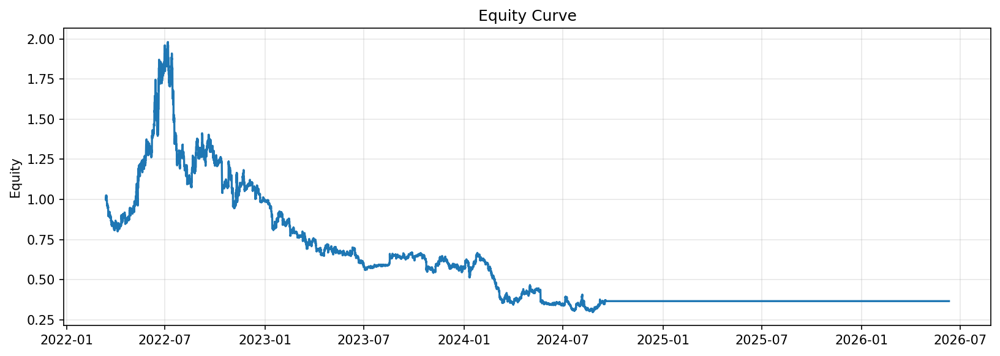

### Drawdown Curve
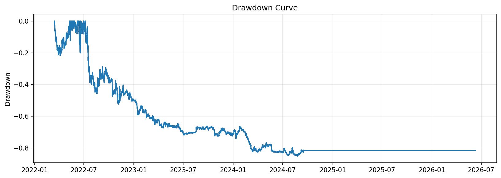

### Cumulative Returns
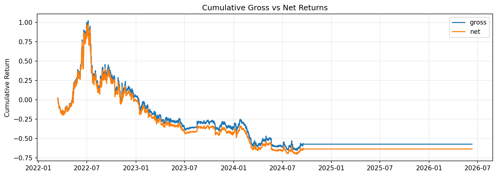

### Monthly Returns
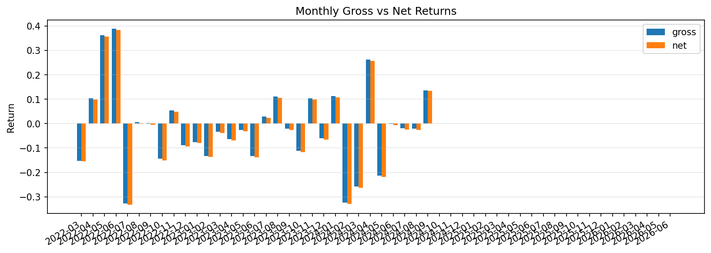

### Rolling Pnl
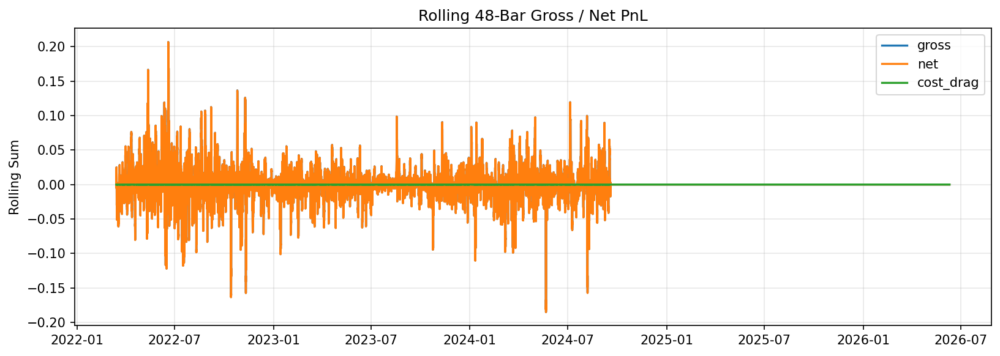

### Cumulative Cost Drag
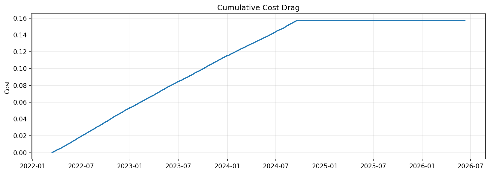

### Positions Turnover
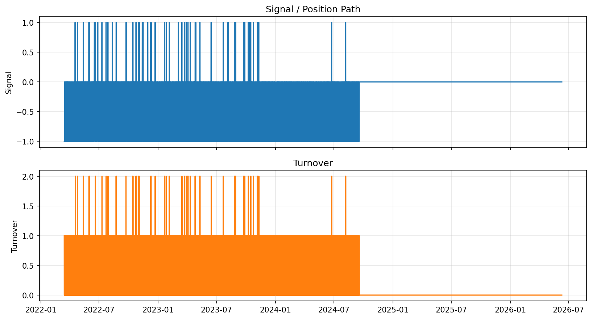

### Rolling Behavior
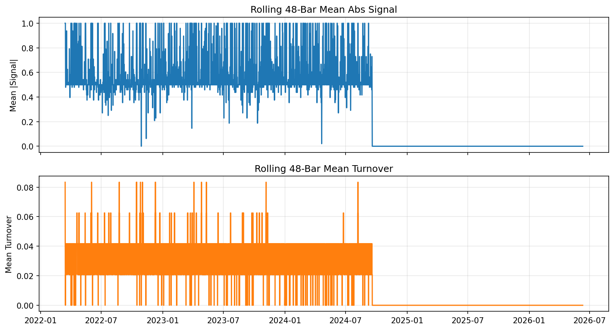

### Signal Distribution
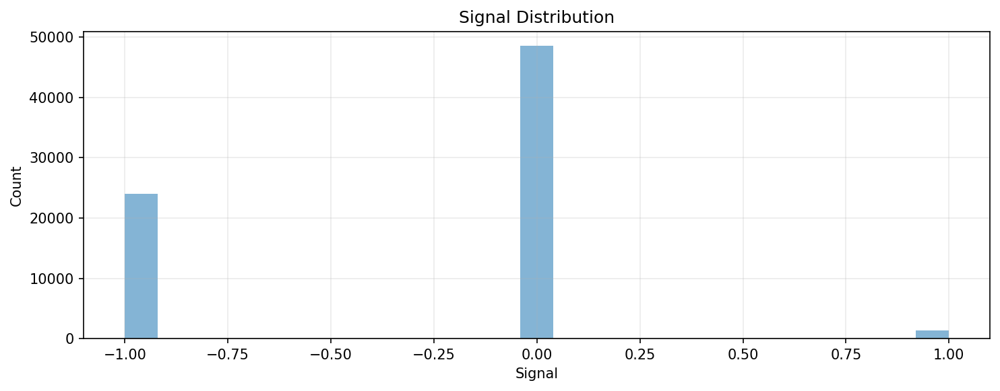

### Fold Net Pnl
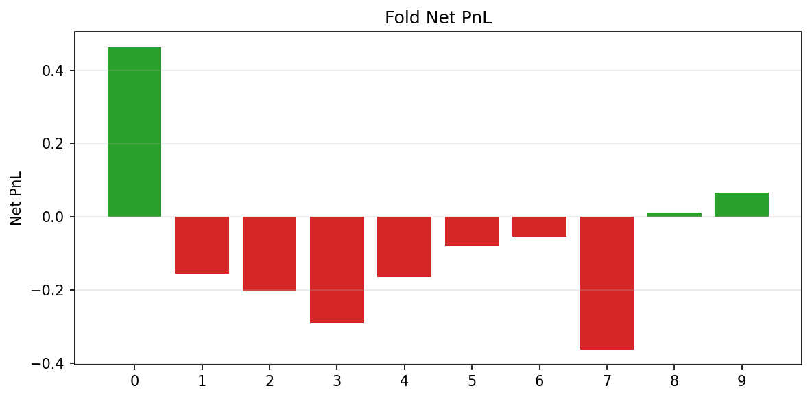

### Feature Importance Chart
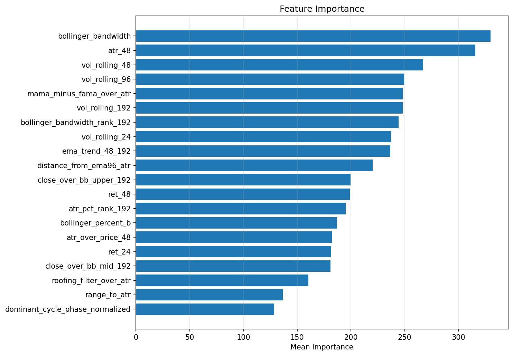

### Label Distribution Chart
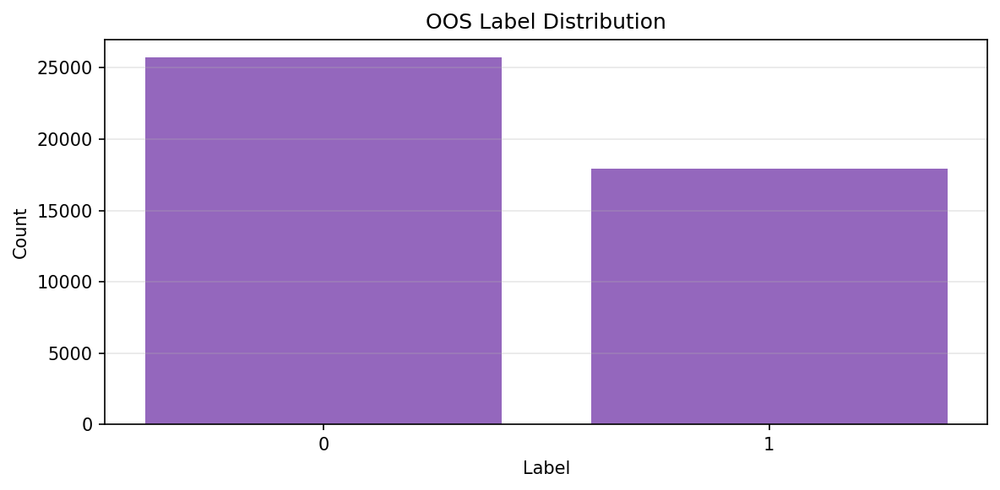

### Prediction Coverage By Fold


## Fold Breakdown
| Fold | Rows | Gross PnL | Net PnL | Cost | Sharpe | Avg Turnover | Mean Reward | Mean Abs Signal | Signal Turnover | Flat Rate |
| --- | --- | --- | --- | --- | --- | --- | --- | --- | --- | --- |
| 0 |  | 0.480089 | 0.463889 | 0.016200 | 6.780823 | 0.036986 |  |  |  |  |
| 1 |  | -0.138955 | -0.155955 | 0.017000 | -0.780507 | 0.038813 |  |  |  |  |
| 2 |  | -0.185675 | -0.203175 | 0.017500 | -1.106529 | 0.039954 |  |  |  |  |
| 3 |  | -0.273366 | -0.289066 | 0.015700 | -1.793881 | 0.035845 |  |  |  |  |
| 4 |  | -0.148467 | -0.164267 | 0.015800 | -1.368254 | 0.036073 |  |  |  |  |
| 5 |  | -0.064006 | -0.079306 | 0.015300 | -1.038604 | 0.034932 |  |  |  |  |
| 6 |  | -0.037431 | -0.053331 | 0.015900 | -0.698583 | 0.036301 |  |  |  |  |
| 7 |  | -0.349103 | -0.363603 | 0.014500 | -1.701528 | 0.033105 |  |  |  |  |
| 8 |  | 0.026281 | 0.011981 | 0.014300 | -0.146374 | 0.032648 |  |  |  |  |
| 9 |  | 0.082226 | 0.066726 | 0.015500 | 0.306424 | 0.035388 |  |  |  |  |


## Model Fold Diagnostics
| Fold | Train Raw | Train Used | Train Missing Features | Train Not Labeled | Train Without Fit | Test Rows | Pred Rows | Test Missing Features | Test Not Candidates | Test Without Prediction | Train Feature Missing | Test Feature Missing | Eval Rows |
| --- | --- | --- | --- | --- | --- | --- | --- | --- | --- | --- | --- | --- | --- |
| 0 | 35016 | 34617 | 382 | 17 | 399 | 4380 | 4380 | 0 | 0 | 0 | 382 | 0 | 4379 |
| 1 | 39396 | 38996 | 382 | 18 | 400 | 4380 | 4380 | 0 | 0 | 0 | 382 | 0 | 4379 |
| 2 | 43752 | 43351 | 382 | 19 | 401 | 4380 | 4380 | 0 | 0 | 0 | 382 | 0 | 4360 |
| 3 | 48108 | 47689 | 382 | 37 | 419 | 4380 | 4380 | 0 | 0 | 0 | 382 | 0 | 4349 |
| 4 | 52464 | 52014 | 382 | 68 | 450 | 4380 | 4380 | 0 | 0 | 0 | 382 | 0 | 4369 |
| 5 | 56820 | 56359 | 382 | 79 | 461 | 4380 | 4380 | 0 | 0 | 0 | 382 | 0 | 4332 |
| 6 | 61176 | 60667 | 382 | 127 | 509 | 4380 | 4380 | 0 | 0 | 0 | 382 | 0 | 4377 |
| 7 | 65532 | 65020 | 382 | 130 | 512 | 4380 | 4380 | 0 | 0 | 0 | 382 | 0 | 4374 |
| 8 | 69888 | 69370 | 382 | 136 | 518 | 4380 | 4380 | 0 | 0 | 0 | 382 | 0 | 4376 |
| 9 | 74244 | 73722 | 382 | 140 | 522 | 4380 | 4380 | 0 | 0 | 0 | 382 | 0 | 4358 |


## Monitoring
- Drifted feature count: `8` / `46`
| Asset | Feature | PSI |
| --- | --- | --- |
| ETHUSD | atr_48 | 1.195042 |
| ETHUSD | atr_over_price_48 | 0.665754 |
| ETHUSD | atr_pct | 0.665754 |
| ETHUSD | vol_rolling_192 | 0.612124 |
| ETHUSD | vol_rolling_96 | 0.551451 |
| ETHUSD | vol_rolling_48 | 0.474270 |
| ETHUSD | vol_rolling_24 | 0.406533 |
| ETHUSD | bollinger_bandwidth | 0.358901 |


## Drift By Family
| Family | Feature Count | Drifted Count | Drifted Ratio | Mean Abs PSI | Max Abs PSI |
| --- | --- | --- | --- | --- | --- |
| unclassified | 33 | 3 | 0.090909 | 0.109666 | 1.195042 |
| atr_adx_range | 1 | 1 | 1.000000 | 0.665754 | 0.665754 |
| volatility | 4 | 4 | 1.000000 | 0.511094 | 0.612124 |
| returns_lags | 8 | 0 | 0.0 | 0.118134 | 0.118186 |


## Feature Set
| Order | Feature |
| --- | --- |
| 1 | close_ret |
| 2 | lag_close_ret_1 |
| 3 | lag_close_ret_2 |
| 4 | lag_close_ret_4 |
| 5 | lag_close_ret_8 |
| 6 | lag_close_ret_16 |
| 7 | lag_close_ret_24 |
| 8 | lag_close_ret_48 |
| 9 | ret_1 |
| 10 | ret_4 |
| 11 | ret_8 |
| 12 | ret_16 |
| 13 | ret_24 |
| 14 | ret_48 |
| 15 | rolling_return_24 |
| 16 | rolling_return_48 |
| 17 | vol_rolling_24 |
| 18 | vol_rolling_48 |
| 19 | vol_rolling_96 |
| 20 | vol_rolling_192 |
| 21 | atr_48 |
| 22 | atr_over_price_48 |
| 23 | atr_pct |
| 24 | atr_pct_rank_192 |
| 25 | ema_trend_48_192 |
| 26 | close_over_bb_upper_192 |
| 27 | close_over_bb_mid_192 |
| 28 | bollinger_percent_b |
| 29 | bollinger_bandwidth |
| 30 | bollinger_bandwidth_rank_192 |
| 31 | ema_alignment_score |
| 32 | distance_from_ema24_atr |
| 33 | distance_from_ema96_atr |
| 34 | mama_minus_fama_over_atr |
| 35 | close_minus_decycler_over_atr |
| 36 | instantaneous_trendline_slope_over_atr |
| 37 | decycler_slope_over_atr |
| 38 | frama_slope_over_atr |
| 39 | supersmoother_slope_over_atr |
| 40 | roofing_filter_over_atr |
| 41 | dominant_cycle_phase_normalized |
| 42 | body_ratio |
| 43 | upper_wick_ratio |
| 44 | lower_wick_ratio |
| 45 | close_location |
| 46 | range_to_atr |

## Feature Steps
```yaml
- step: returns
  params:
    log: false
    col_name: close_ret
  outputs: {}
  enabled: true
  transforms:
    lag:
      enabled: true
      items:
      - source_col: close_ret
        lag: 1
        output_col: lag_close_ret_1
      - source_col: close_ret
        lag: 2
        output_col: lag_close_ret_2
      - source_col: close_ret
        lag: 4
        output_col: lag_close_ret_4
      - source_col: close_ret
        lag: 8
        output_col: lag_close_ret_8
      - source_col: close_ret
        lag: 16
        output_col: lag_close_ret_16
      - source_col: close_ret
        lag: 24
        output_col: lag_close_ret_24
      - source_col: close_ret
        lag: 48
        output_col: lag_close_ret_48
- step: volatility
  params:
    returns_col: close_ret
    rolling_windows:
    - 24
    - 48
    - 96
    - 192
    ewma_spans: []
    annualization_factor: null
  outputs: {}
  enabled: true
- step: trend
  params:
    price_col: close
    sma_windows: []
    ema_spans:
    - 24
    - 48
    - 96
    - 192
    ema_col_template: ema_{span}
    add_ratios: false
  outputs: {}
  enabled: true
  transforms:
    ratio:
      enabled: true
      items:
      - numerator_col: ema_24
        denominator_col: ema_96
        output_col: ema_trend_24_96
        subtract: 1.0
      - numerator_col: ema_48
        denominator_col: ema_192
        output_col: ema_trend_48_192
        subtract: 1.0
      - numerator_col: close
        denominator_col: ema_96
        output_col: close_over_ema_96
        subtract: 1.0
      - numerator_col: close
        denominator_col: ema_192
        output_col: close_over_ema_192
        subtract: 1.0
- step: atr
  params:
    high_col: high
    low_col: low
    close_col: close
    window: 48
    windows:
    - 48
    method: wilder
    add_over_price: false
    atr_col: atr_48
  outputs: {}
  enabled: true
  transforms:
    ratio:
      enabled: true
      items:
      - numerator_col: atr_48
        denominator_col: close
        output_col: atr_over_price_48
- step: hilbert_transform
  params:
    price_col: close
    window: 64
    amplitude_col: hilbert_amplitude
    phase_col: hilbert_phase
    instantaneous_frequency_col: hilbert_instantaneous_frequency
    add_derived: false
  outputs: {}
  enabled: true
- step: dominant_cycle_period
  params:
    price_col: close
    output_col: dominant_cycle_period
  outputs: {}
  enabled: true
- step: dominant_cycle_phase
  params:
    price_col: close
    output_col: dominant_cycle_phase
    unit: degrees
  outputs: {}
  enabled: true
- step: mama
  params:
    price_col: close
    fast_limit: 0.5
    slow_limit: 0.05
    output_col: mama
  outputs: {}
  enabled: true
- step: fama
  params:
    price_col: close
    fast_limit: 0.5
    slow_limit: 0.05
    output_col: fama
  outputs: {}
  enabled: true
- step: decycler
  params:
    price_col: close
    period: 60
    output_col: decycler
  outputs: {}
  enabled: true
- step: decycler_oscillator
  params:
    price_col: close
    fast_period: 30
    slow_period: 60
    output_col: decycler_oscillator_30_60
  outputs: {}
  enabled: true
- step: instantaneous_trendline
  params:
    price_col: close
    alpha: 0.07
    output_col: instantaneous_trendline
    add_trigger: false
  outputs: {}
  enabled: true
- step: frama
  params:
    price_col: close
    high_col: high
    low_col: low
    window: 16
    fast_period: 4
    slow_period: 300
    output_col: frama
    add_diagnostics: false
  outputs: {}
  enabled: true
- step: supersmoother
  params:
    price_col: close
    period: 10
    output_col: supersmoother
  outputs: {}
  enabled: true
- step: roofing_filter
  params:
    price_col: close
    high_pass_period: 48
    low_pass_period: 10
    output_col: roofing_filter
  outputs: {}
  enabled: true
- step: ehlers_ml_long_candidate
  params:
    amplitude_col: hilbert_amplitude
    cycle_period_col: dominant_cycle_period
    roofing_col: roofing_filter
    mama_col: mama
    fama_col: fama
    close_col: close
    decycler_col: decycler
    instantaneous_trendline_col: instantaneous_trendline
    frama_col: frama
    supersmoother_col: supersmoother
    dominant_cycle_phase_col: dominant_cycle_phase
    dominant_cycle_phase_unit: degrees
    atr_col: atr_48
    amplitude_lookback: 128
    amplitude_min_quantile: 0.5
    min_cycle_period: 8.0
    max_cycle_period: 60.0
    slope_bars: 1
    candidate_col: ehlers_ml_candidate
    side_col: ehlers_ml_side
  outputs: {}
  enabled: true
- step: macd
  params:
    price_col: close
    fast: 12
    slow: 26
    signal: 9
  outputs:
    macd_12_26: macd
    macd_signal_9: macd_signal
    macd_hist_12_26_9: macd_hist
  enabled: true
- step: rsi
  params:
    price_col: close
    windows:
    - 14
    method: wilder
  outputs:
    close_rsi_14: rsi_14
  enabled: true
- step: stochastic_rsi
  params:
    price_col: close
    rsi_period: 14
    stoch_period: 14
    k_period: 3
    d_period: 3
    oversold: 0.2
    overbought: 0.8
    prefix: stoch_rsi
  outputs:
    stoch_rsi_k: stoch_rsi_k
    stoch_rsi_d: stoch_rsi_d
  enabled: true
- step: bollinger
  params:
    price_col: close
    window: 192
    n_std: 2.0
  outputs:
    bb_ma_192: bollinger_mid_192
    bb_upper_192_2.0: bollinger_upper_192
    bb_lower_192_2.0: bollinger_lower_192
    bb_width_192_2.0: bollinger_bandwidth
    bb_percent_b_192_2.0: bollinger_percent_b
  enabled: true
  transforms:
    ratio:
      enabled: true
      items:
      - numerator_col: close
        denominator_col: bb_upper_192_2.0
        output_col: close_over_bb_upper_192
        subtract: 1.0
      - numerator_col: close
        denominator_col: bb_ma_192
        output_col: close_over_bb_mid_192
        subtract: 1.0
- step: indicator_pullback
  params:
    asset_vocab:
    - ETHUSD
    open_col: open
    high_col: high
    low_col: low
    close_col: close
    ema_fast_period: 24
    ema_mid_period: 96
    ema_slow_period: 192
    atr_period: 48
    atr_pct_rank_window: 192
    macd_hist_col: macd_hist
    rsi_period: 14
    stoch_k_col: stoch_rsi_k
    stoch_d_col: stoch_rsi_d
    bollinger_bandwidth_col: bollinger_bandwidth
    bollinger_percent_b_col: bollinger_percent_b
    bb_bandwidth_rank_window: 192
    realized_vol_windows:
    - 24
    - 48
    - 96
    - 192
    return_windows:
    - 1
    - 4
    - 8
    - 16
    - 24
    - 48
    rolling_return_windows:
    - 24
    - 48
  outputs: {}
  enabled: true
```

## Config Snapshot
```yaml
data:
  source: dukascopy_csv
  interval: 30m
  start: null
  end: null
  alignment: inner
  symbol: ETHUSD
  symbols: null
  api_key: null
  api_key_env: null
  pit:
    timestamp_alignment:
      source_timezone: UTC
      output_timezone: UTC
      normalize_daily: false
      duplicate_policy: last
    corporate_actions:
      policy: none
      adj_close_col: adj_close
    universe_snapshot:
      inactive_policy: raise
  storage:
    mode: cached_only
    dataset_id: ethusd_30m_lightgbm_h24_structured_tail_alpha_v3_7_ehlers_trend_hybrid
    save_raw: false
    save_processed: false
    load_path: /workspace/data/raw/dukascopy_30m_clean/ethusd_30m.csv
    raw_dir: /workspace/data/raw
    processed_dir: /workspace/data/processed
    load_paths: null
model:
  kind: lightgbm_clf
  params:
    n_estimators: 500
    learning_rate: 0.04
    max_depth: 5
    num_leaves: 15
    min_child_samples: 250
    subsample: 0.9
    colsample_bytree: 0.75
    reg_alpha: 0.02
    reg_lambda: 1.8
    random_state: 7
    n_jobs: 1
    verbosity: -1
  outputs:
    pred_prob_col: pred_prob
    pred_is_oos_col: pred_is_oos
  preprocessing:
    scaler: none
  calibration:
    method: none
    fraction: 0.2
    min_rows: 500
  feature_cols:
  - close_ret
  - lag_close_ret_1
  - lag_close_ret_2
  - lag_close_ret_4
  - lag_close_ret_8
  - lag_close_ret_16
  - lag_close_ret_24
  - lag_close_ret_48
  - ret_1
  - ret_4
  - ret_8
  - ret_16
  - ret_24
  - ret_48
  - rolling_return_24
  - rolling_return_48
  - vol_rolling_24
  - vol_rolling_48
  - vol_rolling_96
  - vol_rolling_192
  - atr_48
  - atr_over_price_48
  - atr_pct
  - atr_pct_rank_192
  - ema_trend_48_192
  - close_over_bb_upper_192
  - close_over_bb_mid_192
  - bollinger_percent_b
  - bollinger_bandwidth
  - bollinger_bandwidth_rank_192
  - ema_alignment_score
  - distance_from_ema24_atr
  - distance_from_ema96_atr
  - mama_minus_fama_over_atr
  - close_minus_decycler_over_atr
  - instantaneous_trendline_slope_over_atr
  - decycler_slope_over_atr
  - frama_slope_over_atr
  - supersmoother_slope_over_atr
  - roofing_filter_over_atr
  - dominant_cycle_phase_normalized
  - body_ratio
  - upper_wick_ratio
  - lower_wick_ratio
  - close_location
  - range_to_atr
  target:
    kind: triple_barrier
    price_col: close
    open_col: open
    high_col: high
    low_col: low
    returns_col: close_ret
    volatility_col: null
    vol_window: 48
    max_holding: 24
    upper_mult: 1.4
    lower_mult: 1.0
    min_vol: 1.0e-06
    neutral_label: drop
    tie_break: closest_to_open
    entry_price_mode: next_open
    label_mode: binary
    add_r_multiple: false
    label_col: tb_label_h24
    event_ret_col: tb_event_ret_h24
    fwd_col: tb_event_ret_h24
    hit_step_col: tb_hit_step_h24
    hit_type_col: tb_hit_type_h24
    upper_barrier_col: tb_upper_h24
    lower_barrier_col: tb_lower_h24
  split:
    method: purged
    train_size: 35040
    test_size: 4380
    step_size: 4380
    expanding: true
    max_folds: 10
    purge_bars: 24
    embargo_bars: 24
  runtime: {}
  env: {}
  use_features: true
  pred_prob_col: pred_prob
  pred_raw_prob_col: pred_prob_raw
  pred_ret_col: pred_ret
  pred_is_oos_col: pred_is_oos
  returns_input_col: null
  signal_col: null
  action_col: null
signals:
  kind: probability_threshold
  params:
    prob_col: pred_prob
    signal_col: signal_tb_probability
    upper: 0.56
    lower: 0.44
    mode: long_short
  outputs: {}
risk:
  cost_per_turnover: 0.0001
  slippage_per_turnover: 0.0
  target_vol: null
  max_leverage: 1.0
  dd_guard:
    enabled: false
    max_drawdown: 0.2
    cooloff_bars: 20
    rearm_drawdown: 0.2
  portfolio_guard: {}
  sizing: {}
  drawdown_sizing: {}
  vol_col: null
backtest:
  engine: vectorized
  returns_col: close_ret
  signal_col: signal_tb_probability
  periods_per_year: 17520
  returns_type: simple
  missing_return_policy: raise_if_exposed
  min_holding_bars: 24
  subset: test
  stop_mode: fixed_return
  vol_col: null
  open_col: open
  high_col: high
  low_col: low
  close_col: close
  take_profit_r: null
  stop_loss_r: null
  volatility_col: null
  entry_price_mode: null
  profit_barrier_r: null
  stop_barrier_r: null
  vertical_barrier_bars: null
  tie_break: null
  event_time_remap_policy: null
  max_cost_r: null
  risk_per_trade: null
  max_holding_bars: null
  asset_params: {}
  dynamic_exits: {}
  partial_exits: {}
  allow_short: true
portfolio:
  enabled: false
  construction: signal_weights
  gross_target: 1.0
  long_short: true
  expected_return_col: null
  covariance_window: 60
  covariance_rebalance_step: 1
  risk_aversion: 5.0
  trade_aversion: 0.0
  selection:
    enabled: false
    top_k: 1
    min_expected_net_return: 0.0
    rank_by_abs: true
    weighting: score
    rebalance_every_n_bars: 1
  constraints:
    enforce_target_net_exposure: true
  asset_groups: {}
runtime:
  seed: 7
  repro_mode: strict
  deterministic: true
  threads: 1
  seed_torch: false
```

## Artifact Inventory
- `report_markdown`: `report.md`
- `config`: `config_used.yaml`
- `summary`: `summary.json`
- `run_metadata`: `run_metadata.json`
- `equity_curve`: `equity_curve.csv`
- `returns`: `returns.csv`
- `gross_returns`: `gross_returns.csv`
- `costs`: `costs.csv`
- `turnover`: `turnover.csv`
- `positions`: `positions.csv`
- `monitoring`: `monitoring_report.json`
- `trade_events`: `report_assets/trade_events.csv`
- `trades_enriched`: `report_assets/trades_enriched.csv`
- `trade_path_summary`: `report_assets/trade_path_summary.json`
- `trade_paths`: `report_assets/trade_paths.parquet`
- `trade_path_diagnostics`: `report_assets/trade_path_diagnostics.json`
- `probability_trade_quality`: `report_assets/probability_trade_quality.csv`
- `counterfactual_exit_summary`: `report_assets/counterfactual_exit_summary.csv`
- `counterfactual_exit_trades`: `report_assets/counterfactual_exit_trades.csv`
- `feature_importance`: `feature_importance.csv`
- `label_distribution`: `label_distribution.csv`
- `prediction_diagnostics`: `prediction_diagnostics.json`
- `missing_value_diagnostics`: `missing_value_diagnostics.json`
- `fold_model_summary`: `fold_model_summary.csv`
- `stage_tails`: `stage_tails.json`
- `diagnostics_fold_backtest_diagnostics`: `artifacts/diagnostics/fold_backtest_diagnostics.csv`
- `diagnostics_forecast_alpha_diagnostics_summary`: `artifacts/diagnostics/forecast_alpha_diagnostics_summary.json`
- `diagnostics_forecast_baselines`: `artifacts/diagnostics/forecast_baselines.csv`
- `diagnostics_lab_feature_diagnostics_ETHUSD`: `artifacts/diagnostics/lab_feature_diagnostics_ETHUSD.json`
- `diagnostics_regime_performance`: `artifacts/diagnostics/regime_performance.csv`
- `equity_curve_chart`: `report_assets/equity_curve.png`
- `drawdown_curve`: `report_assets/drawdown_curve.png`
- `cumulative_returns`: `report_assets/cumulative_returns.png`
- `monthly_returns`: `report_assets/monthly_returns.png`
- `rolling_pnl`: `report_assets/rolling_pnl.png`
- `cumulative_cost_drag`: `report_assets/cumulative_cost_drag.png`
- `positions_turnover`: `report_assets/positions_turnover.png`
- `rolling_behavior`: `report_assets/rolling_behavior.png`
- `signal_distribution`: `report_assets/signal_distribution.png`
- `fold_net_pnl`: `report_assets/fold_net_pnl.png`
- `feature_importance_chart`: `report_assets/feature_importance.png`
- `label_distribution_chart`: `report_assets/label_distribution.png`
- `prediction_coverage_by_fold`: `report_assets/prediction_coverage_by_fold.png`
